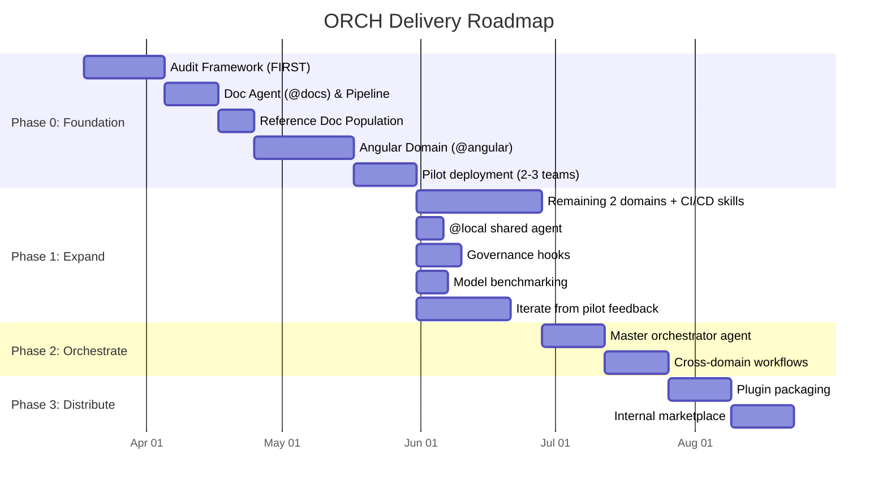

# ORCH (Orchestra) — Delivery Plan

**Version:** 2.0
**Date:** 2026-03-23
**Status:** Draft

---

## Delivery Overview

---

## Phase 0 — Foundation

**Goal:** Build audit framework, doc pipeline, and first domain customization set (Angular with role-based sub-agents). Prove value with pilot teams.

### Stage 0.0 — Audit Framework (FIRST)

The audit framework is built before anything else. Every subsequent stage is automatically observable.

| # | Task | Deliverable | Dependencies | Est. |
|---|------|-------------|-------------|------|
| 0.0.1 | Define audit record JSON schema | `.orch/audit/` schema documentation | None | 0.5d |
| 0.0.2 | Create boundaries config | `.orch/audit/config/boundaries.yaml` — declared tools + scope per agent | None | 0.5d |
| 0.0.3 | Create adherence rules config | `.orch/audit/config/adherence-rules.yaml` — programmatic instruction checks | None | 0.5d |
| 0.0.4 | Build session lifecycle hooks | `.github/hooks/audit-lifecycle.json` + `scripts/audit/log-session-start.sh`, `log-session-end.sh`, `log-error.sh` | 0.0.1 | 1d |
| 0.0.5 | Build prompt capture hook | `.github/hooks/audit-prompts.json` + `scripts/audit/log-prompt.sh` | 0.0.1 | 0.5d |
| 0.0.6 | Build tool boundary check hook | `.github/hooks/audit-tools.json` + `scripts/audit/check-tool-boundary.sh` — blocks unauthorized tool calls | 0.0.2 | 1d |
| 0.0.7 | Build file scope check hook | `.github/hooks/audit-scope.json` + `scripts/audit/check-file-scope.sh` — warns/blocks out-of-scope file edits | 0.0.2 | 1d |
| 0.0.8 | Build token estimation utility | `scripts/audit/estimate-tokens.py` — tokenize captured text for input/output estimates | None | 1d |
| 0.0.9 | Build adherence check script | `scripts/audit/check-adherence.sh` — post-session grep of generated code against rules | 0.0.3 | 1d |
| 0.0.10 | Build metrics aggregation script | `scripts/audit/aggregate-metrics.sh` — daily/weekly rollups | 0.0.1 | 0.5d |
| 0.0.11 | Build `/audit-usage` skill | `.github/skills/audit-usage/SKILL.md` — usage report generation | 0.0.4 | 0.5d |
| 0.0.12 | Build `/audit-tokens` skill | `.github/skills/audit-tokens/SKILL.md` — token consumption report | 0.0.8 | 0.5d |
| 0.0.13 | Build `/audit-compliance` skill | `.github/skills/audit-compliance/SKILL.md` — violations + adherence report | 0.0.6, 0.0.9 | 0.5d |
| 0.0.14 | Build `/audit-drift` skill | `.github/skills/audit-drift/SKILL.md` — behavioral drift over time | 0.0.9, 0.0.10 | 0.5d |
| 0.0.15 | Build `/audit-benchmark` skill | `.github/skills/audit-benchmark/SKILL.md` — two modes: `--compare models` (same task across Claude Sonnet 4, GPT-4.1, o4-mini) and `--compare approaches` (ORCH agents vs raw prompts). Supports cross-product (approaches x models). Output: side-by-side metrics report with tokens, turns, adherence, time, recommendation | 0.0.8 | 1d |
| 0.0.16 | Build context health check script | `scripts/audit/check-context-health.sh` — token tracking + adherence monitoring within session | 0.0.8, 0.0.9 | 1d |
| 0.0.17 | Build session status tracking | `scripts/audit/update-session-status.sh` — work progress tracking, bounded task detection | 0.0.16 | 1d |
| 0.0.18 | Build OS notification script | `scripts/audit/notify.sh` — macOS/Linux native notifications for critical alerts only | 0.0.17 | 0.5d |
| 0.0.19 | Build VS Code status bar extension | `orch-status-extension/` — polls session-status.json, shows glanceable status + interrupt-only toasts | 0.0.17 | 2d |
| 0.0.20 | Update all agent instructions with self-warn rules | Add context health monitoring section to every agent .md | 0.0.16 | 0.5d |
| 0.0.21 | Test notification system end-to-end | Verify: status bar updates, toast fires only on 3 triggers, OS notification on critical only | 0.0.16–0.0.20 | 1d |
| 0.0.22 | Test audit framework end-to-end | Run a dummy agent session, verify full audit trail captured | 0.0.4–0.0.21 | 1d |
| 0.0.23 | Create @audit agent | `.github/agents/audit.agent.md` + skills: /audit-usage, /audit-tokens, /audit-compliance, /audit-drift, /audit-benchmark | Stage 0.0 audit framework | 1d |
| 0.0.24 | Build `@orch-preflight` sub-agent | `.github/agents/orch-preflight.agent.md` — pre-flight checks: validate config, verify boundaries, confirm references exist, check tool availability before any agent session starts | 0.0.2, 0.0.6, 0.0.7 | 1.5d |
| 0.0.25 | Design and implement `.orch/config.yaml` | `.orch/config.yaml` — global workflow config: default model, token budgets, audit level, agent routing rules, pre-flight toggles, telemetry settings | 0.0.1, 0.0.2 | 1d |
| 0.0.26 | Create `.github/copilot-instructions.md` | `.github/copilot-instructions.md` — global rules file: naming conventions, forbidden patterns, security rules, code style enforcement across all agents | None | 0.5d |

**Stage total: ~18 days** (13 scripts + 5 skills + preflight sub-agent + config + global rules)

### Stage 0.1 — Documentation Pipeline (Doc Agent)

> **Scope note:** `@docs` is the **reference supply chain** only. It fetches, converts, tracks, and refreshes external/internal documentation into `.orch/references/`. Skills like `/angular-explain`, `/angular-docs-*`, and `/angular-compatibility` are now domain-owned. `/audit-context` is under `@audit`.

| # | Task | Deliverable | Dependencies | Est. |
|---|------|-------------|-------------|------|
| 0.1.0 | Register docs in boundaries.yaml | Add docs agent to audit boundaries config with declared tools (codebase, terminal, fetch, edit) and scope (.orch/references/**, .orch/references/staging/**, .orch/registry.yaml) | Stage 0.0 | 0.25d |
| 0.1.1 | Create docs agent | `.github/agents/docs.agent.md` — reference supply chain coordinator | 0.1.0 | 0.5d |
| 0.1.2 | Create doc-conversion instructions | `.github/instructions/doc-conversion.instructions.md` with token budget rules, format selection matrix, mermaid conversion triggers (note: absorbed into @docs agent internals post-build) | None | 1d |
| 0.1.3 | Create .orch/registry.yaml schema | `.orch/registry.yaml` with schema documentation and starter entries | None | 0.5d |
| 0.1.4 | Build `/docs-fetch` skill | `.github/skills/docs-fetch/SKILL.md` — fetch external URL or local file, convert to token-efficient markdown, register in docs-registry | 0.1.2, 0.1.3 | 1.5d |
| 0.1.5 | Build `/docs-status` skill | `.github/skills/docs-status/SKILL.md` — show registry status: staleness, coverage, token budgets per reference | 0.1.3 | 1d |
| 0.1.6 | Build `/docs-refresh` skill | `.github/skills/docs-refresh/SKILL.md` — re-fetch stale sources, reconvert, update registry timestamps | 0.1.4 | 1d |
| 0.1.7 | Build `/docs-drift` skill | `.github/skills/docs-drift/SKILL.md` — compare reference docs against live sources, flag outdated content | 0.1.4, 0.1.5 | 1.5d |
| 0.1.8 | Create staging + references folder structure | `.orch/references/staging/`, `.orch/references/` with versioned subdirectories | None | 0.5d |
| 0.1.9 | Test doc pipeline end-to-end | fetch → status → refresh → drift cycle verified | 0.1.4–0.1.8 | 1.5d |
| 0.1.10 | Verify audit trail for doc pipeline | All doc sessions produce complete audit records | 0.1.9, Stage 0.0 | 0.5d |
| 0.1.11 | Create @doc-convert-worker sub-agent | `.github/agents/doc-convert-worker.agent.md` — internal doc conversion worker | 0.1.4 | 0.5d |
| 0.1.12 | Add sub-agent delegation to @docs agent | Update docs.agent.md with agents field + delegation routing for /docs-fetch conversion | 0.1.11 | 0.5d |

**Stage total: ~10.75 days**

### Stage 0.2 — Reference Doc Population

| # | Task | Deliverable | Dependencies | Est. |
|---|------|-------------|-------------|------|
| 0.2.1 | Register Angular core docs (v17, v18, v19) | 3 registry entries | 0.1.4 | 0.25d |
| 0.2.2 | Convert Angular core docs | `.orch/references/angular/v17/core.md`, v18, v19 | 0.2.1 | 1d |
| 0.2.3 | Register Angular migration guides | Registry entries for standalone, signals, control flow guides | 0.1.4 | 0.25d |
| 0.2.4 | Convert Angular migration guides | `.orch/references/angular/v*/migration-*.md` | 0.2.3 | 1d |
| 0.2.5 | Register PrimeNG docs (v16, v17) | 2 registry entries | 0.1.4 | 0.25d |
| 0.2.6 | Convert PrimeNG docs | `.orch/references/primeng/v16/*.md`, v17 | 0.2.5 | 1d |
| 0.2.7 | Register AG Grid docs | Registry entry | 0.1.4 | 0.25d |
| 0.2.8 | Convert AG Grid Angular guide | `.orch/references/ag-grid/v*/angular-guide.md` | 0.2.7 | 0.5d |
| 0.2.9 | Register Interop.io docs | Registry entry | 0.1.4 | 0.25d |
| 0.2.10 | Convert Interop.io Angular guide | `.orch/references/interop/angular-integration.md` | 0.2.9 | 0.5d |
| 0.2.11 | Collect internal UI lib docs | Export from Storybook/source, place in .orch/references/staging/ | Manual | 0.5d |
| 0.2.12 | Convert internal UI lib docs | `.orch/references/internal/ui-components.md` (note: internal-component-lib.instructions.md becomes this reference doc) | 0.2.11 | 0.5d |
| 0.2.13 | Review all converted docs for quality | Ensure token budgets met, no hallucinated content | 0.2.2–0.2.12 | 1d |

**Stage total: ~7.25 days**

### Stage 0.3 — Frontend Angular Domain

> **Architecture:** Angular follows the role-based sub-agent pattern. `@angular` is a lightweight coordinator with triage logic that delegates to three role-based sub-agents: `@angular-planner` (analysis & planning), `@angular-engineer` (code generation & migration), and `@angular-verifier` (testing & review). Each sub-agent owns granular, domain-specific skills.

| # | Task | Deliverable | Dependencies | Est. |
|---|------|-------------|-------------|------|
| **Coordinator** | | | | |
| 0.3.0 | Register angular in boundaries.yaml | Add angular coordinator + sub-agents to audit boundaries config with declared tools and scope (src/**/*.ts, src/**/*.html, src/**/*.scss) | Stage 0.0 | 0.5d |
| 0.3.1 | Create `@angular` coordinator agent | `.github/agents/angular.agent.md` — triage logic, routes to planner/engineer/verifier based on intent | 0.3.0 | 1d |
| **Planner sub-agent** | | | | |
| 0.3.2 | Create `@angular-planner` sub-agent | `.github/agents/angular-planner.agent.md` — analysis, scanning, planning, compatibility checks | 0.3.1 | 1d |
| 0.3.3 | Build `/angular-scan-deps` skill | Dependency analysis: outdated packages, version conflicts, security advisories | 0.3.2, Stage 0.2 | 0.5d |
| 0.3.4 | Build `/angular-scan-arch` skill | Architecture analysis: module structure, lazy loading, dependency graph | 0.3.2 | 0.5d |
| 0.3.5 | Build `/angular-scan-quality` skill | Code quality scan: complexity, duplication, anti-patterns | 0.3.2 | 0.5d |
| 0.3.6 | Build `/angular-scan-tests` skill | Test coverage analysis: missing tests, weak assertions, flaky test detection | 0.3.2 | 0.5d |
| 0.3.7 | Build `/angular-scan-deploy` skill | Deployment readiness: build config, bundle size, environment configs | 0.3.2 | 0.5d |
| 0.3.8 | Build `/angular-scan-git` skill | Git history analysis: churn hotspots, contributor patterns, recent changes | 0.3.2 | 0.5d |
| 0.3.9 | Build `/angular-scan-docs` skill | Documentation coverage: TSDoc completeness, README freshness, inline comments | 0.3.2 | 0.5d |
| 0.3.10 | Build `/angular-scan-features` skill | Feature inventory: routes, components, services, guards, interceptors | 0.3.2 | 0.5d |
| 0.3.11 | Build `/angular-explain` skill | Explain codebase patterns, architecture decisions, Angular concepts in context | 0.3.2 | 0.5d |
| 0.3.12 | Build `/angular-compatibility` skill | Version matrix + compatibility checks (Angular/PrimeNG/AG Grid/RxJS/TS) | 0.3.2, Stage 0.2 | 1d |
| **Engineer sub-agent** | | | | |
| 0.3.13 | Create `@angular-engineer` sub-agent | `.github/agents/angular-engineer.agent.md` — code generation, migration, refactoring, doc generation | 0.3.1 | 1d |
| 0.3.14 | Build `/angular-generate-component` skill | Scaffold Angular component with template, styles, tests, story | 0.3.13 | 1d |
| 0.3.15 | Build `/angular-generate-service` skill | Scaffold Angular service with injection, tests | 0.3.13 | 0.5d |
| 0.3.16 | Build `/angular-generate-route` skill | Scaffold route with guard, resolver, lazy loading | 0.3.13 | 0.5d |
| 0.3.17 | Build `/angular-migrate-standalone` skill | Migrate NgModule-based components to standalone | 0.3.13, Stage 0.2 | 1d |
| 0.3.18 | Build `/angular-migrate-signals` skill | Migrate Observable/BehaviorSubject patterns to Angular signals | 0.3.13, Stage 0.2 | 1d |
| 0.3.19 | Build `/angular-migrate-control-flow` skill | Migrate *ngIf/*ngFor to @if/@for control flow syntax | 0.3.13, Stage 0.2 | 0.5d |
| 0.3.20 | Build `/angular-migrate-jest` skill | Migrate Karma/Jasmine tests to Jest | 0.3.13 | 1d |
| 0.3.21 | Build `/angular-migrate-playwright` skill | Migrate Protractor/Cypress e2e tests to Playwright | 0.3.13 | 1d |
| 0.3.22 | Build `/angular-migrate-version` skill | Major version upgrade: Angular N → N+1 with breaking change resolution | 0.3.13, Stage 0.2 | 1.5d |
| 0.3.23 | Build `/angular-refactor` skill | Pattern-based refactoring: extract component, extract service, simplify RxJS chains | 0.3.13 | 1d |
| 0.3.24 | Build `/angular-docs-generate` skill | Generate TSDoc for undocumented code (replaces /code-comment-generate for Angular) | 0.3.13 | 0.5d |
| 0.3.25 | Build `/angular-docs-repair` skill | Fix JSDoc → TSDoc, repair broken doc references | 0.3.13 | 0.5d |
| 0.3.26 | Build ts-morph semantic adapter | `scripts/semantic/adapters/typescript/` — generate-summary.ts, analyze-migrations.ts, transform.ts | 0.3.17 | 2d |
| 0.3.27 | Integrate ts-morph into engineer skills | Wire migrate skills to use transform.ts for standalone, signals, control flow | 0.3.26 | 1d |
| **Verifier sub-agent** | | | | |
| 0.3.28 | Create `@angular-verifier` sub-agent | `.github/agents/angular-verifier.agent.md` — testing, review, validation (replaces /orch-validate for Angular domain) | 0.3.1 | 1d |
| 0.3.29 | Build `/angular-test-unit` skill | Run/generate unit tests (Jest), analyze results, suggest fixes | 0.3.28 | 1d |
| 0.3.30 | Build `/angular-test-e2e` skill | Run/generate e2e tests (Playwright), analyze results | 0.3.28 | 1d |
| 0.3.31 | Build `/angular-test-lint` skill | Run linting (ESLint + Angular-specific rules), auto-fix, report | 0.3.28 | 0.5d |
| 0.3.32 | Build `/angular-review` skill | Code review against Angular best practices, anti-patterns, a11y | 0.3.28 | 1d |
| 0.3.33 | Build `/angular-docs-audit` skill | Audit documentation coverage and quality | 0.3.28 | 0.5d |
| **Integration** | | | | |
| 0.3.34 | Build `/present-deck` shared skill | `.github/skills/present-deck/SKILL.md` — generate Mermaid/Markdown presentation decks from scan/audit data (shared skill under @orch, replaces @showcase) | Stage 0.0 | 1.5d |
| 0.3.35 | Build `/present-dashboard` shared skill | `.github/skills/present-dashboard/SKILL.md` — generate status dashboards from audit/scan data (shared skill under @orch) | Stage 0.0 | 1d |
| 0.3.36 | Build internal library skills (/hds, /elevate) | `.github/skills/hds/SKILL.md` + `.github/skills/elevate/SKILL.md` — internal component lib and platform integration | 0.3.14 | 2.5d |
| 0.3.37 | Test all skills against sample Angular project | Verify each skill produces correct output through coordinator → sub-agent → skill chain | 0.3.3–0.3.36 | 3d |

**Stage total: ~22 days**

### Stage 0.4 — Pilot Deployment

| # | Task | Deliverable | Dependencies | Est. |
|---|------|-------------|-------------|------|
| 0.4.1 | Identify 2-3 pilot teams (Angular projects) | Team list, repo list, current Angular versions | None | 1d |
| 0.4.2 | Scan pilot repos | Architecture docs + pattern inventories per repo (via @angular-planner scan skills) | 0.3.38, 0.4.1 | 2d |
| 0.4.3 | Run drift detection on pilot repos | Drift reports per repo | 0.1.9, 0.4.2 | 1d |
| 0.4.4 | Deploy ORCH to pilot repos | Copy agents, skills, instructions, references, `.orch/config.yaml` into each repo's .github/ | 0.3.38 | 1d |
| 0.4.5 | Pilot team onboarding sessions | Walk teams through available agents, skills, slash commands, role-based sub-agents | 0.4.4 | 1d |
| 0.4.6 | Collect feedback (2-week sprint) | Feedback log — what worked, what didn't, what's missing | 0.4.5 | 10d |
| 0.4.7 | Measure pilot metrics via audit data | Pattern adherence (from audit adherence scores), review turnaround, token consumption, developer satisfaction | 0.4.6 | 2d |
| 0.4.8 | Generate first audit reports | Run `/audit-usage`, `/audit-tokens`, `/audit-compliance` on pilot data | 0.4.7 | 0.5d |

**Stage total: ~18.5 days (includes 10-day feedback period)**

**Phase 0 total: ~11 weeks**

---

## Phase 1 — Expand

**Goal:** Build remaining 2 domains (Spring Boot, FastAPI — each following the coordinator + planner + engineer + verifier pattern), add domain-specific CI/CD skills, build @local shared agent, add governance, iterate on feedback.

### Stage 1.1 — Pilot Feedback Iteration

| # | Task | Deliverable | Dependencies | Est. |
|---|------|-------------|-------------|------|
| 1.1.1 | Analyze pilot feedback | Prioritized list of improvements | Phase 0 complete | 1d |
| 1.1.2 | Update Angular planner/engineer/verifier instructions | Revised instructions based on real usage | 1.1.1 | 1d |
| 1.1.3 | Update/add Angular skills per feedback | New or modified skills | 1.1.1 | 2d |
| 1.1.4 | Fix doc quality issues | Updated reference docs | 1.1.1 | 1d |
| 1.1.5 | Update registry and refresh stale docs | Current registry status | 1.1.4 | 0.5d |

**Stage total: ~5.5 days**

### Stage 1.2 — Backend Java Spring Boot Domain

> **Architecture:** Follows the same role-based pattern — `@springboot` coordinator with `@springboot-planner`, `@springboot-engineer`, `@springboot-verifier` sub-agents and granular domain skills.

| # | Task | Deliverable | Dependencies | Est. |
|---|------|-------------|-------------|------|
| 1.2.1 | Register + convert Spring Boot reference docs | `.orch/references/spring-boot/` | Doc pipeline | 2d |
| 1.2.2 | Create `@springboot` coordinator agent | `.github/agents/springboot.agent.md` — triage + routing | None | 0.5d |
| 1.2.3 | Create `@springboot-planner` sub-agent | `.github/agents/springboot-planner.agent.md` + planner skills: /springboot-scan-deps, /springboot-scan-arch, /springboot-scan-quality, /springboot-scan-tests, /springboot-explain, /springboot-compatibility | 1.2.1 | 3d |
| 1.2.4 | Create `@springboot-engineer` sub-agent | `.github/agents/springboot-engineer.agent.md` + engineer skills: /springboot-generate-endpoint, /springboot-generate-service, /springboot-migrate-version, /springboot-migrate-security, /springboot-refactor, /springboot-docs-generate | 1.2.3 | 4d |
| 1.2.5 | Create `@springboot-verifier` sub-agent | `.github/agents/springboot-verifier.agent.md` + verifier skills: /springboot-test-unit, /springboot-test-integration, /springboot-test-lint, /springboot-review, /springboot-docs-audit | 1.2.4 | 3d |
| 1.2.6 | Test against sample Spring Boot project | Verify full coordinator → sub-agent → skill chain | 1.2.5 | 1.5d |

**Stage total: ~14 days**

### Stage 1.3 — Backend Python FastAPI Domain

> **Architecture:** Same role-based pattern — `@fastapi` coordinator with `@fastapi-planner`, `@fastapi-engineer`, `@fastapi-verifier` sub-agents.

| # | Task | Deliverable | Dependencies | Est. |
|---|------|-------------|-------------|------|
| 1.3.1 | Register + convert FastAPI reference docs | `.orch/references/fastapi/` | Doc pipeline | 1.5d |
| 1.3.2 | Create `@fastapi` coordinator agent | `.github/agents/fastapi.agent.md` — triage + routing | None | 0.5d |
| 1.3.3 | Create `@fastapi-planner` sub-agent | `.github/agents/fastapi-planner.agent.md` + planner skills: /fastapi-scan-deps, /fastapi-scan-arch, /fastapi-scan-quality, /fastapi-scan-tests, /fastapi-explain, /fastapi-compatibility | 1.3.1 | 3d |
| 1.3.4 | Create `@fastapi-engineer` sub-agent | `.github/agents/fastapi-engineer.agent.md` + engineer skills: /fastapi-generate-route, /fastapi-generate-service, /fastapi-migrate-version, /fastapi-refactor, /fastapi-docs-generate | 1.3.3 | 3d |
| 1.3.5 | Create `@fastapi-verifier` sub-agent | `.github/agents/fastapi-verifier.agent.md` + verifier skills: /fastapi-test-unit, /fastapi-test-integration, /fastapi-test-lint, /fastapi-review, /fastapi-docs-audit | 1.3.4 | 2.5d |
| 1.3.6 | Test against sample FastAPI project | Verify full coordinator → sub-agent → skill chain | 1.3.5 | 1d |

**Stage total: ~11.5 days**

### Stage 1.4 — Domain-Specific CI/CD Skills

> **Architecture change:** CI/CD is no longer a separate domain. CI/CD skills are built as part of each domain agent because CI/CD processes are inherently stack-specific. This stage adds CI/CD skills to existing domain agents.

| # | Task | Deliverable | Dependencies | Est. |
|---|------|-------------|-------------|------|
| 1.4.1 | Register + convert CI/CD reference docs per domain | `.orch/references/angular/ci-best-practices.md`, `.orch/references/spring-boot/deployment-guide.md`, `.orch/references/fastapi/ci-cd-guide.md` | Doc pipeline | 1.5d |
| 1.4.2 | Build `/angular-ci-pipeline` skill | Generate/update Angular CI pipeline (GitHub Actions): build, test, lint, bundle analysis | Stage 0.3 (Angular domain) | 1d |
| 1.4.3 | Build `/angular-ci-optimize` skill | Optimize Angular CI: caching, parallelization, incremental builds | 1.4.2 | 0.5d |
| 1.4.4 | Build `/angular-cd-deploy` skill | Angular deployment: environment promotion, CDN upload, artifact management | 1.4.2 | 1d |
| 1.4.5 | Build `/angular-cd-rollback` skill | Angular rollback procedures and verification | 1.4.4 | 0.5d |
| 1.4.6 | Build `/springboot-ci-pipeline` skill | Spring Boot CI pipeline: Maven/Gradle build, test, JaCoCo, artifact publish | Stage 1.2 (Spring Boot domain) | 1d |
| 1.4.7 | Build `/springboot-ci-optimize` skill | Optimize Spring Boot CI: caching, test parallelization | 1.4.6 | 0.5d |
| 1.4.8 | Build `/springboot-cd-deploy` skill | Spring Boot deployment: JAR/container deploy, environment promotion | 1.4.6 | 1d |
| 1.4.9 | Build `/springboot-cd-rollback` skill | Spring Boot rollback procedures | 1.4.8 | 0.5d |
| 1.4.10 | Build `/fastapi-ci-pipeline` skill | FastAPI CI pipeline: pytest, mypy, container build | Stage 1.3 (FastAPI domain) | 1d |
| 1.4.11 | Build `/fastapi-ci-optimize` skill | Optimize FastAPI CI: caching, parallelization | 1.4.10 | 0.5d |
| 1.4.12 | Build `/fastapi-cd-deploy` skill | FastAPI deployment: container deploy, uvicorn config, environment promotion | 1.4.10 | 1d |
| 1.4.13 | Build `/fastapi-cd-rollback` skill | FastAPI rollback procedures | 1.4.12 | 0.5d |
| 1.4.14 | Test CI/CD skills against sample projects | Verify each domain's CI/CD skills produce correct pipelines and configs | 1.4.5, 1.4.9, 1.4.13 | 1.5d |

**Stage total: ~12 days**

### Stage 1.5 — @local Shared Agent

> **Architecture:** @local is a shared agent under @orch (alongside @docs and @audit). It handles local environment setup — a concern shared across all domains regardless of stack.

| # | Task | Deliverable | Dependencies | Est. |
|---|------|-------------|-------------|------|
| 1.5.1 | Register @local in boundaries.yaml | Add @local agent to audit boundaries config with declared tools (codebase, terminal) and scope | Stage 0.0 | 0.25d |
| 1.5.2 | Create `@local` agent | `.github/agents/local.agent.md` — environment setup coordinator | 1.5.1 | 0.5d |
| 1.5.3 | Build `/local-setup-env` skill | Configure shell, language runtimes (Node.js, Java, Python), environment variables | 1.5.2 | 1d |
| 1.5.4 | Build `/local-setup-docker` skill | Set up Docker, docker-compose, localstack for local dev and testing | 1.5.2 | 1d |
| 1.5.5 | Build `/local-setup-deps` skill | Install and verify project dependencies with version alignment checks | 1.5.2 | 1d |
| 1.5.6 | Build `/local-diagnose` skill | Diagnose environment issues: port conflicts, version mismatches, missing tools | 1.5.2 | 1d |
| 1.5.7 | Test @local against sample projects | Verify all skills work across Angular, Spring Boot, FastAPI project types | 1.5.3–1.5.6 | 1d |

**Stage total: ~5.75 days**

### Stage 1.6 — Model Benchmarking

| # | Task | Deliverable | Dependencies | Est. |
|---|------|-------------|-------------|------|
| 1.6.1 | Create benchmark test suites per domain | `skills/audit-benchmark/test-suites/angular-benchmark.md`, springboot, fastapi — 5 representative tasks per domain (generate, migrate, test, review, explain) | All 3 domains + CI/CD skills complete | 1.5d |
| 1.6.2 | Run model comparison for Angular | `--compare models` report: Claude Sonnet 4 vs GPT-4.1 vs o4-mini across all Angular skills — quality, speed, adherence, token cost | 1.6.1 | 1d |
| 1.6.3 | Run approach comparison for Angular | `--compare approaches` report: ORCH agents vs raw prompts for same 5 tasks — tokens, turns, adherence, time, build/test pass rate | 1.6.1 | 1d |
| 1.6.4 | Run cross-product benchmark | `--compare approaches --compare models` for Angular — ORCH+Claude vs ORCH+GPT vs raw+Claude vs raw+GPT | 1.6.2, 1.6.3 | 1d |
| 1.6.5 | Run benchmarks for all domains | Model + approach reports per domain | 1.6.4 | 2d |
| 1.6.6 | Update agent model recommendations | Pin optimal model per agent per skill based on benchmark data | 1.6.5 | 0.5d |
| 1.6.7 | Create benchmark guide | `docs/benchmark-guide.md` — which model for which task, ORCH vs raw comparison results, trade-offs, ROI analysis | 1.6.6 | 0.5d |

**Stage total: ~7.5 days**

### Stage 1.7 — Governance Hooks

| # | Task | Deliverable | Dependencies | Est. |
|---|------|-------------|-------------|------|
| 1.7.1 | Build secrets scanner hook | `.github/hooks/secrets-scanner.json` + `scripts/scan-secrets.sh` | None | 1.5d |
| 1.7.2 | Build tool-use gate hook (dangerous commands) | `.github/hooks/tool-use-gate.json` + `scripts/gate-tool.sh` — blocks rm -rf, git push --force, etc. | None | 1.5d |
| 1.7.3 | Test hooks in isolation | Each hook fires on correct events, blocks when expected | 1.7.1–1.7.2 | 1d |
| 1.7.4 | Deploy hooks to pilot repos | Hooks active in pilot repos | 1.7.3 | 0.5d |

**Stage total: ~4.5 days**

Note: Prompt auditing is already handled by the audit framework (Stage 0.0). Governance hooks here add secrets scanning and dangerous command blocking on top of the existing audit infrastructure.

### Stage 1.8 — Org-Wide Rollout

| # | Task | Deliverable | Dependencies | Est. |
|---|------|-------------|-------------|------|
| 1.8.1 | Create deployment guide | docs/deployment-guide.md — includes audit setup instructions, `.orch/config.yaml` setup, pre-flight checks | All domains complete | 1d |
| 1.8.2 | Create onboarding materials | Quick-start guide per domain + audit dashboard walkthrough + role-based agent explanation | 1.8.1 | 1d |
| 1.8.3 | Roll out to remaining Angular teams | ORCH + audit deployed to all Angular repos (incl. CI/CD skills) | 1.8.2 | 2d |
| 1.8.4 | Roll out to Java/Python teams | ORCH + audit deployed to all backend repos (incl. CI/CD skills) | 1.8.2 | 2d |
| 1.8.5 | Collect org-wide metrics via audit reports | `/audit-usage` + `/audit-tokens` across all repos | 1.8.3–1.8.4 | 2d |

**Stage total: ~8 days**

**Phase 1 total: ~9 weeks**

---

## Phase 2 — Orchestrate

**Goal:** Enable cross-domain workflows via a master orchestrator agent, event-driven relay execution, and safe-by-default automation.

### Stage 2.1 — Orchestrator Agent

| # | Task | Deliverable | Dependencies | Est. |
|---|------|-------------|-------------|------|
| 2.1.1 | Design handoff protocol between agents | Documented handoff patterns (coordinator → sub-agent → skill chain) | Phase 1 complete | 1d |
| 2.1.2 | Create orchestrator agent | `.github/agents/orchestrator.agent.md` with handoffs to all domain coordinators | 2.1.1 | 1d |
| 2.1.3 | Define triage rules | When to route to which domain coordinator | 2.1.1 | 1d |
| 2.1.4 | Test single-domain delegation | Orchestrator correctly routes to domain coordinators, which delegate to sub-agents | 2.1.2, 2.1.3 | 1d |
| 2.1.5 | Test cross-domain delegation | Orchestrator chains frontend → backend → CI for end-to-end tasks | 2.1.4 | 2d |

**Stage total: ~6 days**

### Stage 2.2 — Event-Driven Relay System (DELIVERED)

| # | Task | Deliverable | Status |
|---|------|-------------|--------|
| 2.2.0 | Build file-based event store | `event-store.js` — append-only event store in `.orch/events/` | Delivered |
| 2.2.1 | Build event publisher | `publish.js` — coordinator publishes phase events with metadata | Delivered |
| 2.2.2 | Build relay process | `relay.js` — terminal-resident process, dispatches script phases automatically, AI phases via `code chat` | Delivered |
| 2.2.3 | Build event monitor | `monitor.js` — watches `.orch/events/` for new events | Delivered |
| 2.2.4 | Build prompt builder | `prompt-builder.js` — constructs AI phase prompts with context injection | Delivered |
| 2.2.5 | Integrate `code chat --mode agent` | Relay dispatches AI phases via VS Code 1.112+ `code chat` CLI | Delivered |
| 2.2.6 | Safe-by-default approval flow | Relay pauses before AI phases; user sends `approve`, `approve-all`, or `skip` | Delivered |
| 2.2.7 | `--auto` flag for full autonomy | Bypass approval pauses for CI/unattended execution | Delivered |
| 2.2.8 | `orch-approve` skill | `/orch-approve` skill for in-chat approval commands | Delivered |

### Stage 2.3 — Version-Aware Stack Resolution (DELIVERED)

| # | Task | Deliverable | Status |
|---|------|-------------|--------|
| 2.3.1 | Build check-stack.js hook | SHA-256 fingerprint-based stack detection on session start (<5 ms) | Delivered |
| 2.3.2 | Build resolver.yaml | Feature-to-version-gate mapping for Angular 17-21 | Delivered |
| 2.3.3 | Build resolve-references.js | Version-filtered reference doc loading | Delivered |
| 2.3.4 | Stack profile caching | `.orch/cache/stack.yaml` with checksum-based invalidation | Delivered |

### Stage 2.4 — Report Templates + Trend Tracking (DELIVERED)

| # | Task | Deliverable | Status |
|---|------|-------------|--------|
| 2.4.1 | Build 4 report templates | `.orch/templates/` — migration, recap, audit, feature | Delivered |
| 2.4.2 | Build trend snapshot system | `.orch/trends/` — captures metrics per run for trend arrows | Delivered |

### Stage 2.5 — VS Code Settings + Boundary Enforcement (DELIVERED)

| # | Task | Deliverable | Status |
|---|------|-------------|--------|
| 2.5.1 | Ship .vscode/settings.json | Autopilot mode, terminal auto-approve, edit auto-accept | Delivered |
| 2.5.2 | Comprehensive blocked_commands | Hard enforcement via VS Code settings.json | Delivered |
| 2.5.3 | Two-layer boundary system | Hard (settings.json) + soft (boundaries.yaml) enforcement | Delivered |

### Stage 2.6 — Isolated Dependencies (DELIVERED)

| # | Task | Deliverable | Status |
|---|------|-------------|--------|
| 2.6.1 | Create .orch/package.json | Isolated dependency manifest (ts-morph, json-server) | Delivered |
| 2.6.2 | Isolated node_modules | `.orch/node_modules/` separate from project deps | Delivered |

### Stage 2.7 — Cross-Domain Workflows

| # | Task | Deliverable | Dependencies | Est. |
|---|------|-------------|-------------|------|
| 2.7.1 | Build end-to-end feature workflow | Orchestrator scaffolds frontend + backend + tests + CI for a new feature | 2.1.5 | 3d |
| 2.7.2 | Build cross-stack migration workflow | Orchestrator coordinates Angular upgrade + backend API changes + domain CI/CD skill updates | 2.1.5 | 3d |
| 2.7.3 | Build full-stack PR review workflow | Orchestrator delegates PR review to domain verifiers based on changed files | 2.1.5 | 2d |
| 2.7.4 | Test with pilot teams | Validate cross-domain workflows on real projects | 2.7.1–2.7.3 | 5d |

**Stage total: ~13 days**

**Phase 2 total: ~4 weeks** (relay system, stack resolution, report templates, VS Code settings, and boundary enforcement delivered)

---

## Phase 3 — Distribute

**Goal:** Package ORCH as installable plugins and stand up internal marketplace.

### Stage 3.1 — Plugin Packaging

| # | Task | Deliverable | Dependencies | Est. |
|---|------|-------------|-------------|------|
| 3.1.1 | Define plugin structure per domain | PLUGIN.md schema, versioning strategy | Phase 2 complete | 1d |
| 3.1.2 | Package frontend-ts-angular as plugin | `plugins/frontend-ts-angular/` with coordinator + 3 sub-agents + all skills (incl. CI/CD) | 3.1.1 | 1d |
| 3.1.3 | Package backend-java-springboot as plugin | `plugins/backend-java-springboot/` with coordinator + 3 sub-agents + all skills (incl. CI/CD) | 3.1.1 | 1d |
| 3.1.4 | Package backend-python-fastapi as plugin | `plugins/backend-python-fastapi/` with coordinator + 3 sub-agents + all skills (incl. CI/CD) | 3.1.1 | 1d |
| 3.1.5 | Package docs as plugin | `plugins/docs/` | 3.1.1 | 0.5d |
| 3.1.6 | Package local as plugin | `plugins/local/` with @local agent + all skills | 3.1.1 | 0.5d |
| 3.1.7 | Package governance hooks as plugin | `plugins/governance/` | 3.1.1 | 0.5d |
| 3.1.8 | Test plugin installation flow | Verify `copilot plugin install` works for each | 3.1.2–3.1.7 | 2d |

**Stage total: ~7.5 days**

### Stage 3.2 — Internal Marketplace

| # | Task | Deliverable | Dependencies | Est. |
|---|------|-------------|-------------|------|
| 3.2.1 | Create marketplace repository structure | `yourorg/orch-marketplace/` with catalog | 3.1.9 | 1d |
| 3.2.2 | Publish all plugins to marketplace | All plugins available via `copilot plugin install <name>@orch` | 3.2.1 | 1d |
| 3.2.3 | Create CONTRIBUTING.md | Guidelines for submitting new plugins | 3.2.1 | 0.5d |
| 3.2.4 | Define review process | PR-based approval workflow, tiered trust levels | 3.2.1 | 1d |
| 3.2.5 | Create marketplace README | Discovery guide for consumers | 3.2.2 | 0.5d |
| 3.2.6 | Onboard first external contributors | Teams outside core ORCH team submit domain plugins | 3.2.3, 3.2.4 | 2d |

**Stage total: ~6 days**

**Phase 3 total: ~3 weeks**

---

## Summary

| Phase | Duration | Key Deliverable |
|-------|----------|----------------|
| **Phase 0: Foundation** | ~11 weeks | Audit framework + pre-flight checks + config.yaml + doc pipeline (reference supply chain) + Angular domain (coordinator + planner + engineer + verifier) + shared presentation skills + pilot validation |
| **Phase 1: Expand** | ~9 weeks | All 3 domains (each with coordinator + planner + engineer + verifier + domain-specific CI/CD skills) + @local shared agent + governance + model benchmarking + org rollout |
| **Phase 2: Orchestrate** | ~4 weeks | Master orchestrator + event-driven relay system (relay.js, publish.js, event-store.js, monitor.js, prompt-builder.js) + `code chat --mode agent` integration + safe-by-default auto mode (approve/approve-all/skip) + version-aware stack resolution (check-stack.js, resolver.yaml) + 4 report templates + trend tracking + .vscode/settings.json (autopilot, blocked_commands) + isolated .orch/package.json + cross-domain workflows. **Current: 61 skills, 44 scripts, 92 examples, 5 shared libs.** |
| **Phase 3: Distribute** | ~3 weeks | Plugin packaging + internal marketplace |
| **Total** | ~27 weeks | Full ORCH platform with role-based agents, granular skills, domain-specific CI/CD, @local env setup, pre-flight checks, per-run telemetry, event-driven relay, and complete audit observability |

---

## Instruction Files Reference

| File | Status | Notes |
|------|--------|-------|
| `auto-mode.instructions.md` | **Keep** | Active — controls autonomous operation behavior |
| `workflows.instructions.md` | **Removed** | Absorbed into agent handoff chain — coordinator → sub-agent routing replaces static workflow definitions |
| `angular-typescript.instructions.md` | **Absorbed** | Content absorbed into Angular skill references — planner/engineer/verifier each reference relevant sections |
| `internal-component-lib.instructions.md` | **Reference doc** | Becomes `.orch/references/internal/ui-components.md` via doc pipeline |
| `doc-conversion.instructions.md` | **Absorbed** | Content absorbed into `@docs` agent internals |

---

## Dependencies & Prerequisites

| Dependency | Required by | Owner |
|-----------|-------------|-------|
| VS Code with Copilot Chat enabled | All phases | IT/Developer Platform |
| Access to GitHub Copilot agent features | All phases | IT/Developer Platform |
| Access to pilot team repos | Phase 0, Stage 0.4 | ORCH team + team leads |
| Internal UI component library docs (Storybook export or source) | Phase 0, Stage 0.2 | UI library team |
| Internal deployment platform documentation | Phase 1, Stage 1.4 (domain CI/CD skills) | Platform engineering team |
| Plugin infrastructure (`copilot plugin` CLI) | Phase 3 | GitHub / Developer Platform |

---

## Exit Criteria Per Phase

### Phase 0 Exit Criteria
- [ ] **Audit framework captures complete records** for every agent session (identity, prompts, tools, files, tokens, boundaries, adherence)
- [ ] **Tool boundary enforcement** blocks unauthorized tool calls and logs violations
- [ ] **File scope enforcement** detects out-of-scope file edits
- [ ] **Token estimation** produces per-session input/output/total estimates
- [ ] **Adherence checking** scores generated code against instruction rules
- [ ] **Audit report skills** produce usage, token, compliance, and drift reports
- [ ] **Pre-flight checks operational** — `@orch-preflight` validates config, boundaries, references, tool availability before sessions
- [ ] **`.orch/config.yaml`** controlling workflow behavior: model selection, token budgets, audit level, agent routing
- [ ] **`.orch/runs/`** capturing per-run telemetry with structured audit records
- [ ] **`.github/copilot-instructions.md`** global rules enforced across all agents
- [ ] Doc pipeline converts external URLs and local files to token-efficient markdown (reference supply chain: fetch → status → refresh → drift)
- [ ] Doc pipeline sessions produce complete audit trails
- [ ] Registry tracks all sources with status and staleness
- [ ] **Role-based agents working with handoffs** — Angular coordinator delegates to planner/engineer/verifier sub-agents
- [ ] **Granular skills functional** — all Angular planner (10), engineer (12), and verifier (5) skills tested
- [ ] **Shared presentation skills** (/present-deck, /present-dashboard) working under @orch
- [ ] At least 2 pilot teams actively using ORCH
- [ ] Pilot feedback collected and analyzed, informed by audit data
- [ ] **Status bar extension** shows glanceable progress for bounded tasks and quality indicator
- [ ] **Notifications** fire only for: needs input, something broke, quality degraded — nothing else
- [ ] **Context rot** detected and surfaced as "quality declining" before user notices degradation
- [ ] **Configuration cascade** works: global rules in `copilot-instructions.md`, domain rules in skills, runtime settings in `.orch/config.yaml`

### Phase 1 Exit Criteria
- [ ] All 3 domain customization sets are functional and tested, each with coordinator + planner + engineer + verifier + domain-specific CI/CD skills
- [ ] @local shared agent operational with all 4 skills (/local-setup-env, /local-setup-docker, /local-setup-deps, /local-diagnose)
- [ ] All domain agents and @local registered in boundaries.yaml with declared tools and scope
- [ ] Governance hooks (secrets scanner, tool-use gate) active in all deployed repos
- [ ] Model benchmarks completed for all domains via `/audit-benchmark` with recommendations documented
- [ ] Org-wide rollout to all target teams complete
- [ ] Adoption metrics collected via audit reports (adherence scores, token consumption, violation rates)

### Phase 2 Exit Criteria
- [ ] Orchestrator correctly routes to domain coordinators, which delegate to role-based sub-agents
- [ ] At least 2 cross-domain workflows validated with pilot teams
- [ ] No regression in individual domain agent quality

### Phase 3 Exit Criteria
- [ ] All 3 domains packaged as installable plugins (including coordinator + sub-agents + skills incl. CI/CD per domain)
- [ ] @local agent packaged as shared plugin
- [ ] Internal marketplace operational with `copilot plugin install` working
- [ ] CONTRIBUTING.md and review process in place
- [ ] At least 1 external team has contributed a plugin
