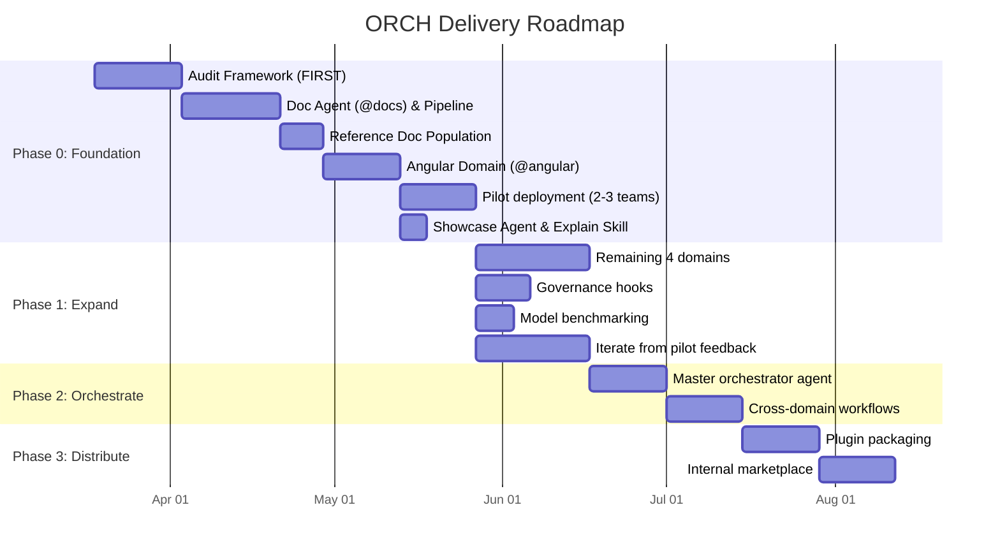

# ORCH (Orchestra) — Delivery Plan

**Version:** 1.0
**Date:** 2026-03-18
**Status:** Draft

---

## Delivery Overview

---

## Phase 0 — Foundation

**Goal:** Build audit framework, doc pipeline, and first domain customization set. Prove value with pilot teams.

### Stage 0.0 — Audit Framework (FIRST)

The audit framework is built before anything else. Every subsequent stage is automatically observable.

| # | Task | Deliverable | Dependencies | Est. |
|---|------|-------------|-------------|------|
| 0.0.1 | Define audit record JSON schema | `.orch/audit/` schema documentation | None | 0.5d |
| 0.0.2 | Create boundaries config | `.orch/audit/config/boundaries.yaml` — declared tools + scope per agent | None | 0.5d |
| 0.0.3 | Create adherence rules config | `.orch/audit/config/adherence-rules.yaml` — programmatic instruction checks | None | 0.5d |
| 0.0.4 | Build session lifecycle hooks | `.github/hooks/audit-lifecycle.json` + `scripts/audit/log-session-start.sh`, `log-session-end.sh`, `log-error.sh` | 0.0.1 | 1d |
| 0.0.5 | Build prompt capture hook | `.github/hooks/audit-prompts.json` + `scripts/audit/log-prompt.sh` | 0.0.1 | 0.5d |
| 0.0.6 | Build tool boundary check hook | `.github/hooks/audit-tools.json` + `scripts/audit/check-tool-boundary.sh` — blocks unauthorized tool calls | 0.0.2 | 1d |
| 0.0.7 | Build file scope check hook | `.github/hooks/audit-scope.json` + `scripts/audit/check-file-scope.sh` — warns/blocks out-of-scope file edits | 0.0.2 | 1d |
| 0.0.8 | Build token estimation utility | `scripts/audit/estimate-tokens.py` — tokenize captured text for input/output estimates | None | 1d |
| 0.0.9 | Build adherence check script | `scripts/audit/check-adherence.sh` — post-session grep of generated code against rules | 0.0.3 | 1d |
| 0.0.10 | Build metrics aggregation script | `scripts/audit/aggregate-metrics.sh` — daily/weekly rollups | 0.0.1 | 0.5d |
| 0.0.11 | Build `/orch-audit-usage` skill | `.github/skills/orch-audit-usage/SKILL.md` — usage report generation | 0.0.4 | 0.5d |
| 0.0.12 | Build `/orch-audit-tokens` skill | `.github/skills/orch-audit-tokens/SKILL.md` — token consumption report | 0.0.8 | 0.5d |
| 0.0.13 | Build `/orch-audit-compliance` skill | `.github/skills/orch-audit-compliance/SKILL.md` — violations + adherence report | 0.0.6, 0.0.9 | 0.5d |
| 0.0.14 | Build `/orch-audit-drift` skill | `.github/skills/orch-audit-drift/SKILL.md` — behavioral drift over time | 0.0.9, 0.0.10 | 0.5d |
| 0.0.15 | Build `/orch-validate` skill | `.github/skills/orch-validate/SKILL.md` — post-operation validation | 0.0.9 | 0.5d |
| 0.0.16 | Build context health check script | `scripts/audit/check-context-health.sh` — token tracking + adherence monitoring within session | 0.0.8, 0.0.9 | 1d |
| 0.0.17 | Build session status tracking | `scripts/audit/update-session-status.sh` — work progress tracking, bounded task detection | 0.0.16 | 1d |
| 0.0.18 | Build OS notification script | `scripts/audit/notify.sh` — macOS/Linux native notifications for critical alerts only | 0.0.17 | 0.5d |
| 0.0.19 | Build VS Code status bar extension | `orch-status-extension/` — polls session-status.json, shows glanceable status + interrupt-only toasts | 0.0.17 | 2d |
| 0.0.20 | Update all agent instructions with self-warn rules | Add context health monitoring section to every agent .md | 0.0.16 | 0.5d |
| 0.0.21 | Test notification system end-to-end | Verify: status bar updates, toast fires only on 3 triggers, OS notification on critical only | 0.0.16–0.0.20 | 1d |
| 0.0.22 | Test audit framework end-to-end | Run a dummy agent session, verify full audit trail captured | 0.0.4–0.0.21 | 1d |
| 0.0.23 | Create @audit agent | `.github/agents/audit.agent.md` + skills: /report, /benchmark, /context | Stage 0.0 audit framework | 1d |

**Stage total: ~16 days**

### Stage 0.1 — Documentation Pipeline (Doc Agent)

| # | Task | Deliverable | Dependencies | Est. |
|---|------|-------------|-------------|------|
| 0.1.0 | Register docs in boundaries.yaml | Add docs agent to audit boundaries config with declared tools (codebase, terminal, fetch, edit) and scope (.github/references/**, docs/staging/**, docs-registry.yaml) | Stage 0.0 | 0.25d |
| 0.1.1 | Create docs agent | `.github/agents/docs.agent.md` | 0.1.0 | 0.5d |
| 0.1.2 | Create doc-conversion instructions | `.github/instructions/doc-conversion.instructions.md` with token budget rules, format selection matrix, mermaid conversion triggers | None | 1d |
| 0.1.3 | Create docs-registry.yaml schema | `docs-registry.yaml` with schema documentation and starter entries | None | 0.5d |
| 0.1.4 | Build /packs skill | `.github/skills/packs/SKILL.md` — unified registry lifecycle (register + convert + refresh + status) | 0.1.2, 0.1.3 | 2d |
| 0.1.5 | Build /proof skill | `.github/skills/proof/SKILL.md` — codebase scan + compare snapshots + inline doc coverage | 0.1.2 | 2d |
| 0.1.6 | Build /drift skill | `.github/skills/drift/SKILL.md` — docs vs code comparison with git enrichment | 0.1.4, 0.1.5 | 1d |
| 0.1.7 | Build /code-comment skill | `.github/skills/code-comment/SKILL.md` — audit + generate + repair code docs (TSDoc, Javadoc, PyDoc) | 0.1.2 | 2d |
| 0.1.8 | Build /version-matrix skill | `.github/skills/version-matrix/SKILL.md` + known-compatibility.yaml — version matrix | 0.1.3 | 1d |
| 0.1.9 | Create staging + references folder structure | `docs/staging/`, `.github/references/` with versioned subdirectories | None | 0.5d |
| 0.1.10 | Test doc pipeline end-to-end | packs → proof → drift cycle verified, including source-embedded extraction | 0.1.4–0.1.9 | 1.5d |
| 0.1.11 | Verify audit trail for doc pipeline | All doc sessions produce complete audit records | 0.1.10, Stage 0.0 | 0.5d |
| 0.1.12 | Create scan-worker sub-agent | `.github/agents/scan-worker.agent.md` — internal codebase scanning worker | 0.1.5 | 0.5d |
| 0.1.13 | Create doc-convert-worker sub-agent | `.github/agents/doc-convert-worker.agent.md` — internal doc conversion worker | 0.1.4 | 0.5d |
| 0.1.14 | Add sub-agent delegation to @docs agent | Update docs.agent.md with agents field + delegation routing for /proof and /packs convert | 0.1.13 | 0.5d |

**Stage total: ~14 days**

### Stage 0.2 — Reference Doc Population

| # | Task | Deliverable | Dependencies | Est. |
|---|------|-------------|-------------|------|
| 0.2.1 | Register Angular core docs (v17, v18, v19) | 3 registry entries | 0.1.4 | 0.25d |
| 0.2.2 | Convert Angular core docs | `.github/references/angular/v17/core.md`, v18, v19 | 0.2.1, 0.1.5 | 1d |
| 0.2.3 | Register Angular migration guides | Registry entries for standalone, signals, control flow guides | 0.1.4 | 0.25d |
| 0.2.4 | Convert Angular migration guides | `.github/references/angular/v*/migration-*.md` | 0.2.3, 0.1.5 | 1d |
| 0.2.5 | Register PrimeNG docs (v16, v17) | 2 registry entries | 0.1.4 | 0.25d |
| 0.2.6 | Convert PrimeNG docs | `.github/references/primeng/v16/*.md`, v17 | 0.2.5 | 1d |
| 0.2.7 | Register AG Grid docs | Registry entry | 0.1.4 | 0.25d |
| 0.2.8 | Convert AG Grid Angular guide | `.github/references/ag-grid/v*/angular-guide.md` | 0.2.7 | 0.5d |
| 0.2.9 | Register Interop.io docs | Registry entry | 0.1.4 | 0.25d |
| 0.2.10 | Convert Interop.io Angular guide | `.github/references/interop/angular-integration.md` | 0.2.9 | 0.5d |
| 0.2.11 | Collect internal UI lib docs | Export from Storybook/source, place in docs/staging/ | Manual | 0.5d |
| 0.2.12 | Convert internal UI lib docs | `.github/references/internal/ui-components.md` | 0.2.11 | 0.5d |
| 0.2.13 | Review all converted docs for quality | Ensure token budgets met, no hallucinated content | 0.2.2–0.2.12 | 1d |

**Stage total: ~7.25 days**

### Stage 0.3 — Frontend Angular Domain

| # | Task | Deliverable | Dependencies | Est. |
|---|------|-------------|-------------|------|
| 0.3.0 | Register angular in boundaries.yaml | Add angular agent to audit boundaries config with declared tools (codebase, terminal, edit) and scope (src/**/*.ts, src/**/*.html, src/**/*.scss) | Stage 0.0 | 0.25d |
| 0.3.1 | Create angular agent | `.github/agents/angular.agent.md` with persona, tools, model, guardrails | 0.3.0 | 0.5d |
| 0.3.2 | Create angular-typescript instructions | `.github/instructions/angular-typescript.instructions.md` — component patterns, RxJS, state management, TS strictness, testing, a11y | Stage 0.2 | 2d |
| 0.3.2a | Run /code-comment-audit on pilot Angular project | Documentation coverage report — identify gaps before building skills that depend on doc extraction | 0.1.14, 0.3.2 | 0.5d |
| 0.3.2b | Run /code-comment-generate on critical undocumented services | Add TSDoc to top-priority undocumented files identified by audit | 0.3.2a | 1d |
| 0.3.2c | Run /code-comment-repair to fix JSDoc → TSDoc in pilot project | Migrate any JSDoc {type} syntax to proper TSDoc format | 0.3.2b | 0.5d |
| 0.3.3 | Build /generate skill (Angular domain) | `.github/skills/generate/SKILL.md` + `templates/angular/` + `examples/angular/` + `references/angular.md` | 0.3.2 | 2d |
| 0.3.4 | Build /migrate skill (Angular domain) | `.github/skills/migrate/SKILL.md` + `references/angular/` (8 migration guides) + `examples/angular/` (before/after) + `scripts/angular/` | 0.3.2 | 3d |
| 0.3.4a | Build ts-morph semantic adapter | `scripts/semantic/adapters/typescript/` — generate-summary.ts, analyze-migrations.ts, transform.ts | 0.3.4 | 2d |
| 0.3.4b | Integrate semantic analysis into /proof skill | Add --semantic flag that runs ts-morph generate-summary.ts | 0.3.4a | 0.5d |
| 0.3.4c | Integrate ts-morph transforms into /migrate skill | Wire migrate-worker to use transform.ts for standalone, inject, signals | 0.3.4a | 1d |
| 0.3.5 | Build /test skill (Angular domain) | `.github/skills/test/SKILL.md` + `templates/angular/` + `references/angular/` (jest, playwright, cypress, ng-mocks) + `examples/angular/` | 0.3.2 | 2d |
| 0.3.6 | Build /review skill (Angular domain) | `.github/skills/review/SKILL.md` + `references/angular/anti-patterns.md` + `schemas/review-format.yaml` | 0.3.2 | 1d |
| 0.3.7 | Build /refactor skill | `.github/skills/refactor/SKILL.md` + `references/angular.md` + `examples/angular/` (before/after) | 0.3.2 | 1d |
| 0.3.8 | Build /hds skill | `.github/skills/hds/SKILL.md` + `references/` (tokens, theming, components) + `examples/` + `assets/token-map.json` | 0.3.3 | 1.5d |
| 0.3.9 | Build /elevate skill | `.github/skills/elevate/SKILL.md` + `references/` (auth, logging, config, prefs, components) + `examples/` + `schemas/config-schema.json` | 0.3.3 | 1.5d |
| 0.3.10 | Build override system | `.github/skill-overrides/` structure, overrides.yaml schema, override resolution in agent instructions | 0.3.3 | 1d |
| 0.3.11 | Test all skills against sample Angular project | Verify each skill produces correct output with @angular agent | 0.3.3–0.3.10 | 2d |
| 0.3.12 | Create migrate-worker sub-agent | `.github/agents/migrate-worker.agent.md` — internal migration phase worker | 0.3.4 | 0.5d |
| 0.3.13 | Add sub-agent delegation to @angular agent | Update angular.agent.md with agents field + delegation routing for /migrate | 0.3.12 | 0.5d |

**Stage total: ~15 days**

### Stage 0.4 — Pilot Deployment

| # | Task | Deliverable | Dependencies | Est. |
|---|------|-------------|-------------|------|
| 0.4.1 | Identify 2-3 pilot teams (Angular projects) | Team list, repo list, current Angular versions | None | 1d |
| 0.4.2 | Scan pilot repos | Architecture docs + pattern inventories per repo | 0.1.8, 0.4.1 | 2d |
| 0.4.3 | Run drift detection on pilot repos | Drift reports per repo | 0.1.10, 0.4.2 | 1d |
| 0.4.4 | Deploy ORCH to pilot repos | Copy agents, skills, instructions, references into each repo's .github/ | 0.3.11 | 1d |
| 0.4.5 | Pilot team onboarding sessions | Walk teams through available agents, skills, slash commands | 0.4.4 | 1d |
| 0.4.6 | Collect feedback (2-week sprint) | Feedback log — what worked, what didn't, what's missing | 0.4.5 | 10d |
| 0.4.7 | Measure pilot metrics via audit data | Pattern adherence (from audit adherence scores), review turnaround, token consumption, developer satisfaction | 0.4.6 | 2d |
| 0.4.8 | Generate first audit reports | Run `/orch-audit-usage`, `/orch-audit-tokens`, `/orch-audit-compliance` on pilot data | 0.4.7 | 0.5d |

**Stage total: ~18.5 days (includes 10-day feedback period)**

### Stage 0.5 — Showcase Agent & Explain Skill

| # | Task | Deliverable | Dependencies | Est. |
|---|------|-------------|-------------|------|
| 0.5.1 | Create @showcase agent | `marketplace/.github/agents/showcase.agent.md` | Stage 0.3 | 0.5d |
| 0.5.2 | Build /present skill | `marketplace/.github/skills/present/` with templates + assets | 0.5.1 | 2d |
| 0.5.3 | Build /dashboard skill | `marketplace/.github/skills/dashboard/` | 0.5.1 | 1d |
| 0.5.4 | Build /explain skill | `marketplace/.github/skills/explain/` | Stage 0.1 | 1d |

**Stage total: ~4.5 days**

**Phase 0 total: ~10 weeks**

---

## Phase 1 — Expand

**Goal:** Build remaining domains, add governance, iterate on feedback.

### Stage 1.1 — Pilot Feedback Iteration

| # | Task | Deliverable | Dependencies | Est. |
|---|------|-------------|-------------|------|
| 1.1.1 | Analyze pilot feedback | Prioritized list of improvements | Phase 0 complete | 1d |
| 1.1.2 | Update angular-typescript instructions | Revised instructions based on real usage | 1.1.1 | 1d |
| 1.1.3 | Update/add Angular skills per feedback | New or modified skills | 1.1.1 | 2d |
| 1.1.4 | Fix doc quality issues | Updated reference docs | 1.1.1 | 1d |
| 1.1.5 | Update registry and refresh stale docs | Current registry status | 1.1.4 | 0.5d |

**Stage total: ~5.5 days**

### Stage 1.2 — Backend Java Spring Boot Domain

| # | Task | Deliverable | Dependencies | Est. |
|---|------|-------------|-------------|------|
| 1.2.1 | Register + convert Spring Boot reference docs | `.github/references/spring-boot/` | Doc pipeline | 2d |
| 1.2.2 | Create backend-springboot agent | `.github/agents/backend-springboot.agent.md` | None | 0.5d |
| 1.2.3 | Create java-springboot instructions | `.github/instructions/java-springboot.instructions.md` | 1.2.1 | 2d |
| 1.2.4 | Build /spring-rest-endpoint skill | `.github/skills/spring-rest-endpoint/SKILL.md` + `templates/` | 1.2.3 | 1d |
| 1.2.5 | Build Spring Boot test generation skill | `.github/skills/spring-test/SKILL.md` | 1.2.3 | 1d |
| 1.2.6 | Build Spring Boot PR review skill | `.github/skills/spring-pr-review/SKILL.md` | 1.2.3 | 1d |
| 1.2.7 | Build Spring Boot migration skills | Version upgrade, security migration skills | 1.2.1 | 2d |
| 1.2.8 | Test against sample Spring Boot project | Verify output quality | 1.2.4–1.2.7 | 1d |

**Stage total: ~10.5 days**

### Stage 1.3 — Backend Python FastAPI Domain

| # | Task | Deliverable | Dependencies | Est. |
|---|------|-------------|-------------|------|
| 1.3.1 | Register + convert FastAPI reference docs | `.github/references/fastapi/` | Doc pipeline | 1.5d |
| 1.3.2 | Create backend-fastapi agent | `.github/agents/backend-fastapi.agent.md` | None | 0.5d |
| 1.3.3 | Create python-fastapi instructions | `.github/instructions/python-fastapi.instructions.md` | 1.3.1 | 2d |
| 1.3.4 | Build FastAPI route scaffolding skill | `.github/skills/fastapi-route/SKILL.md` + `templates/` | 1.3.3 | 1d |
| 1.3.5 | Build FastAPI test generation skill | `.github/skills/fastapi-test/SKILL.md` | 1.3.3 | 1d |
| 1.3.6 | Build FastAPI PR review skill | `.github/skills/fastapi-pr-review/SKILL.md` | 1.3.3 | 1d |
| 1.3.7 | Test against sample FastAPI project | Verify output quality | 1.3.4–1.3.6 | 1d |

**Stage total: ~8 days**

### Stage 1.4 — Operations CI (Glue) Domain

| # | Task | Deliverable | Dependencies | Est. |
|---|------|-------------|-------------|------|
| 1.4.1 | Register + convert GitHub Actions reference docs | `.github/references/github-actions/` | Doc pipeline | 1d |
| 1.4.2 | Create ops-ci agent | `.github/agents/ops-ci.agent.md` | None | 0.5d |
| 1.4.3 | Create ci-github-actions instructions | `.github/instructions/ci-github-actions.instructions.md` | 1.4.1 | 1.5d |
| 1.4.4 | Build /ci-pipeline skill | `.github/skills/ci-pipeline/SKILL.md` | 1.4.3 | 1d |
| 1.4.5 | Build CI optimization skill | `.github/skills/ci-optimize/SKILL.md` | 1.4.3 | 1d |
| 1.4.6 | Test against sample workflows | Verify output quality | 1.4.4–1.4.5 | 0.5d |

**Stage total: ~5.5 days**

### Stage 1.5 — Operations CD (DPS) Domain

| # | Task | Deliverable | Dependencies | Est. |
|---|------|-------------|-------------|------|
| 1.5.1 | Register + convert internal deployment platform docs | `.github/references/deployment/` | Doc pipeline | 1.5d |
| 1.5.2 | Create ops-cd agent | `.github/agents/ops-cd.agent.md` | None | 0.5d |
| 1.5.3 | Create cd-deployment instructions | `.github/instructions/cd-deployment.instructions.md` | 1.5.1 | 1.5d |
| 1.5.4 | Build /cd-deploy skill | `.github/skills/cd-deploy/SKILL.md` | 1.5.3 | 1d |
| 1.5.5 | Build rollback planning skill | `.github/skills/cd-rollback/SKILL.md` | 1.5.3 | 1d |
| 1.5.6 | Test against sample deployment configs | Verify output quality | 1.5.4–1.5.5 | 0.5d |

**Stage total: ~6 days**

### Stage 1.6 — Model Benchmarking

| # | Task | Deliverable | Dependencies | Est. |
|---|------|-------------|-------------|------|
| 1.6.1 | Create benchmark test suites per domain | `skills/orch-benchmark-models/test-suites/angular-benchmark.md`, springboot, fastapi | All domains complete | 1.5d |
| 1.6.2 | Build `/orch-benchmark-models` skill | `.github/skills/orch-benchmark-models/SKILL.md` — runs test suite across models, generates comparison report | 1.6.1 | 1d |
| 1.6.3 | Run initial benchmarks for Angular domain | Benchmark report: Claude Sonnet 4 vs GPT-4.1 vs o4-mini across all Angular skills | 1.6.2 | 1d |
| 1.6.4 | Run benchmarks for all domains | Benchmark reports per domain | 1.6.3 | 2d |
| 1.6.5 | Update agent model recommendations | Pin optimal model per agent based on benchmark data | 1.6.4 | 0.5d |
| 1.6.6 | Create model guide for consumers | `docs/model-guide.md` — which model for which task, trade-offs | 1.6.5 | 0.5d |

**Stage total: ~6.5 days**

### Stage 1.7 — Governance Hooks

| # | Task | Deliverable | Dependencies | Est. |
|---|------|-------------|-------------|------|
| 1.7.1 | Build secrets scanner hook | `.github/hooks/secrets-scanner.json` + `scripts/scan-secrets.sh` | None | 1.5d |
| 1.7.2 | Build tool-use gate hook (dangerous commands) | `.github/hooks/tool-use-gate.json` + `scripts/gate-tool.sh` — blocks rm -rf, git push --force, etc. | None | 1.5d |
| 1.7.3 | Test hooks in isolation | Each hook fires on correct events, blocks when expected | 1.7.1–1.7.2 | 1d |
| 1.7.4 | Deploy hooks to pilot repos | Hooks active in pilot repos | 1.7.3 | 0.5d |

**Stage total: ~4.5 days**

Note: Prompt auditing is already handled by the audit framework (Stage 0.0). Governance hooks here add secrets scanning and dangerous command blocking on top of the existing audit infrastructure.

### Stage 1.8 — Org-Wide Rollout

| # | Task | Deliverable | Dependencies | Est. |
|---|------|-------------|-------------|------|
| 1.8.1 | Create deployment guide | docs/deployment-guide.md — includes audit setup instructions | All domains complete | 1d |
| 1.8.2 | Create onboarding materials | Quick-start guide per domain + audit dashboard walkthrough | 1.8.1 | 1d |
| 1.8.3 | Roll out to remaining Angular teams | ORCH + audit deployed to all Angular repos | 1.8.2 | 2d |
| 1.8.4 | Roll out to Java/Python teams | ORCH + audit deployed to all backend repos | 1.8.2 | 2d |
| 1.8.5 | Roll out to Ops teams | ORCH + audit deployed to all CI/CD repos | 1.8.2 | 1d |
| 1.8.6 | Collect org-wide metrics via audit reports | `/orch-audit-usage` + `/orch-audit-tokens` across all repos | 1.8.3–1.8.5 | 2d |

**Stage total: ~9 days**

**Phase 1 total: ~8 weeks**

---

## Phase 2 — Orchestrate

**Goal:** Enable cross-domain workflows via a master orchestrator agent.

### Stage 2.1 — Orchestrator Agent

| # | Task | Deliverable | Dependencies | Est. |
|---|------|-------------|-------------|------|
| 2.1.1 | Design handoff protocol between agents | Documented handoff patterns | Phase 1 complete | 1d |
| 2.1.2 | Create orchestrator agent | `.github/agents/orchestrator.agent.md` with handoffs to all domain agents | 2.1.1 | 1d |
| 2.1.3 | Define triage rules | When to route to which domain agent | 2.1.1 | 1d |
| 2.1.4 | Test single-domain delegation | Orchestrator correctly routes to individual agents | 2.1.2, 2.1.3 | 1d |
| 2.1.5 | Test cross-domain delegation | Orchestrator chains frontend → backend → CI for end-to-end tasks | 2.1.4 | 2d |

**Stage total: ~6 days**

### Stage 2.2 — Cross-Domain Workflows

| # | Task | Deliverable | Dependencies | Est. |
|---|------|-------------|-------------|------|
| 2.2.1 | Build end-to-end feature workflow | Orchestrator scaffolds frontend + backend + tests + CI for a new feature | 2.1.5 | 3d |
| 2.2.2 | Build cross-stack migration workflow | Orchestrator coordinates Angular upgrade + backend API changes + CI updates | 2.1.5 | 3d |
| 2.2.3 | Build full-stack PR review workflow | Orchestrator delegates PR review to domain agents based on changed files | 2.1.5 | 2d |
| 2.2.4 | Test with pilot teams | Validate cross-domain workflows on real projects | 2.2.1–2.2.3 | 5d |

**Stage total: ~13 days**

**Phase 2 total: ~4 weeks**

---

## Phase 3 — Distribute

**Goal:** Package ORCH as installable plugins and stand up internal marketplace.

### Stage 3.1 — Plugin Packaging

| # | Task | Deliverable | Dependencies | Est. |
|---|------|-------------|-------------|------|
| 3.1.1 | Define plugin structure per domain | PLUGIN.md schema, versioning strategy | Phase 2 complete | 1d |
| 3.1.2 | Package frontend-ts-angular as plugin | `plugins/frontend-ts-angular/` with all artifacts | 3.1.1 | 1d |
| 3.1.3 | Package backend-java-springboot as plugin | `plugins/backend-java-springboot/` | 3.1.1 | 1d |
| 3.1.4 | Package backend-python-fastapi as plugin | `plugins/backend-python-fastapi/` | 3.1.1 | 1d |
| 3.1.5 | Package operations-ci-glue as plugin | `plugins/operations-ci-glue/` | 3.1.1 | 0.5d |
| 3.1.6 | Package operations-cd-dps as plugin | `plugins/operations-cd-dps/` | 3.1.1 | 0.5d |
| 3.1.7 | Package docs as plugin | `plugins/docs/` | 3.1.1 | 0.5d |
| 3.1.8 | Package governance hooks as plugin | `plugins/governance/` | 3.1.1 | 0.5d |
| 3.1.9 | Test plugin installation flow | Verify `copilot plugin install` works for each | 3.1.2–3.1.8 | 2d |

**Stage total: ~8 days**

### Stage 3.2 — Internal Marketplace

| # | Task | Deliverable | Dependencies | Est. |
|---|------|-------------|-------------|------|
| 3.2.1 | Create marketplace repository structure | `yourorg/orch-marketplace/` with catalog | 3.1.9 | 1d |
| 3.2.2 | Publish all plugins to marketplace | All plugins available via `copilot plugin install <name>@orch` | 3.2.1 | 1d |
| 3.2.3 | Create CONTRIBUTING.md | Guidelines for submitting new plugins | 3.2.1 | 0.5d |
| 3.2.4 | Define review process | PR-based approval workflow, tiered trust levels | 3.2.1 | 1d |
| 3.2.5 | Create marketplace README | Discovery guide for consumers | 3.2.2 | 0.5d |
| 3.2.6 | Onboard first external contributors | Teams outside core ORCH team submit domain plugins | 3.2.3, 3.2.4 | 2d |

**Stage total: ~6 days**

**Phase 3 total: ~3 weeks**

---

## Summary

| Phase | Duration | Key Deliverable |
|-------|----------|----------------|
| **Phase 0: Foundation** | ~10 weeks | Audit framework + doc pipeline (incl. source-embedded extraction) + Angular domain + pilot validation |
| **Phase 1: Expand** | ~8 weeks | All 5 domains + governance + model benchmarking + org rollout |
| **Phase 2: Orchestrate** | ~4 weeks | Master orchestrator + cross-domain workflows |
| **Phase 3: Distribute** | ~3 weeks | Plugin packaging + internal marketplace |
| **Total** | ~25 weeks | Full ORCH platform with complete audit observability |

---

## Dependencies & Prerequisites

| Dependency | Required by | Owner |
|-----------|-------------|-------|
| VS Code with Copilot Chat enabled | All phases | IT/Developer Platform |
| Access to GitHub Copilot agent features | All phases | IT/Developer Platform |
| Access to pilot team repos | Phase 0, Stage 0.4 | ORCH team + team leads |
| Internal UI component library docs (Storybook export or source) | Phase 0, Stage 0.2 | UI library team |
| Internal deployment platform documentation | Phase 1, Stage 1.5 | Platform engineering team |
| Plugin infrastructure (`copilot plugin` CLI) | Phase 3 | GitHub / Developer Platform |

---

## Exit Criteria Per Phase

### Phase 0 Exit Criteria
- [ ] **Audit framework captures complete records** for every agent session (identity, prompts, tools, files, tokens, boundaries, adherence)
- [ ] **Tool boundary enforcement** blocks unauthorized tool calls and logs violations
- [ ] **File scope enforcement** detects out-of-scope file edits
- [ ] **Token estimation** produces per-session input/output/total estimates
- [ ] **Adherence checking** scores generated code against instruction rules
- [ ] **Audit report skills** produce usage, token, compliance, and drift reports
- [ ] Doc pipeline converts external URLs and local files to token-efficient markdown
- [ ] Doc pipeline sessions produce complete audit trails
- [ ] Registry tracks all sources with status and staleness
- [ ] Doc-scan produces architecture docs with git enrichment for a real repo
- [ ] Doc-drift identifies mismatches between docs and code
- [ ] Frontend Angular agent, skills, and instructions are functional
- [ ] At least 2 pilot teams actively using ORCH
- [ ] Pilot feedback collected and analyzed, informed by audit data
- [ ] **Status bar extension** shows glanceable progress for bounded tasks and quality indicator
- [ ] **Notifications** fire only for: needs input, something broke, quality degraded — nothing else
- [ ] **Context rot** detected and surfaced as "quality declining" before user notices degradation
- [ ] **Override system** works: team can create temporary override with 90-day expiry
- [ ] **Skills are domain-agnostic**: same /generate skill works with @angular agent using Angular references

### Phase 1 Exit Criteria
- [ ] All 5 domain customization sets are functional and tested
- [ ] All domain agents registered in boundaries.yaml with declared tools and scope
- [ ] Governance hooks (secrets scanner, tool-use gate) active in all deployed repos
- [ ] Model benchmarks completed for all domains with recommendations documented
- [ ] Org-wide rollout to all target teams complete
- [ ] Adoption metrics collected via audit reports (adherence scores, token consumption, violation rates)

### Phase 2 Exit Criteria
- [ ] Orchestrator correctly routes to domain agents
- [ ] At least 2 cross-domain workflows validated with pilot teams
- [ ] No regression in individual domain agent quality

### Phase 3 Exit Criteria
- [ ] All domains packaged as installable plugins
- [ ] Internal marketplace operational with `copilot plugin install` working
- [ ] CONTRIBUTING.md and review process in place
- [ ] At least 1 external team has contributed a plugin
