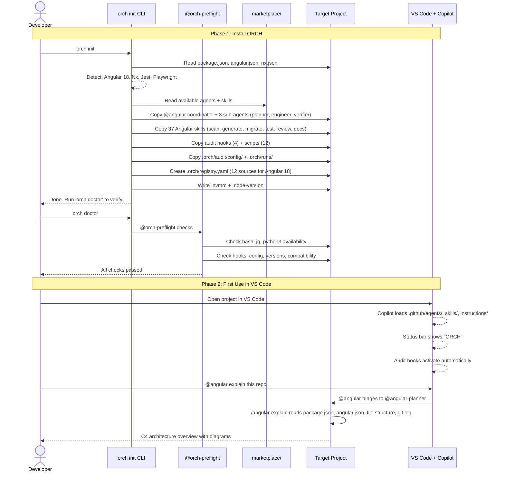
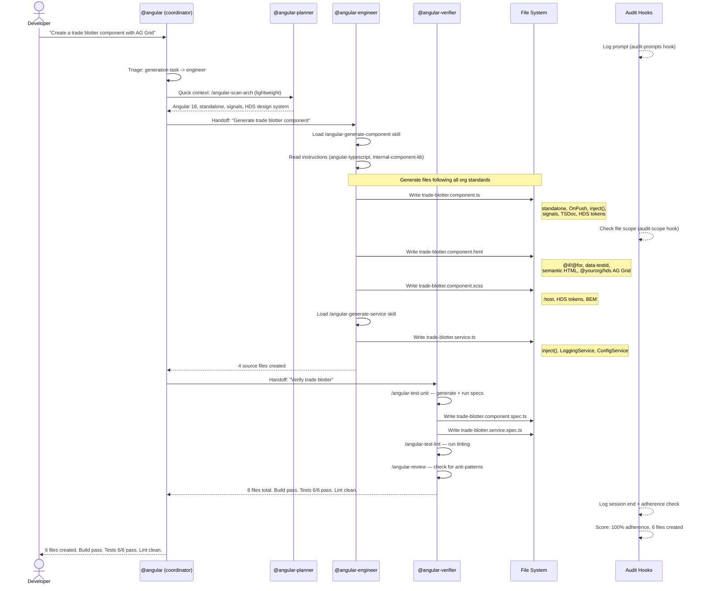
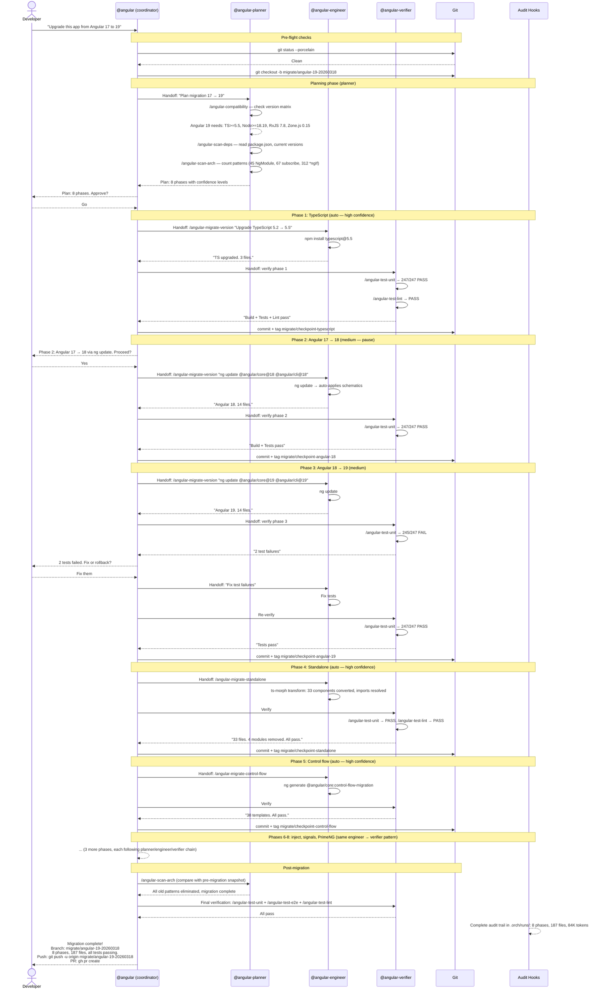
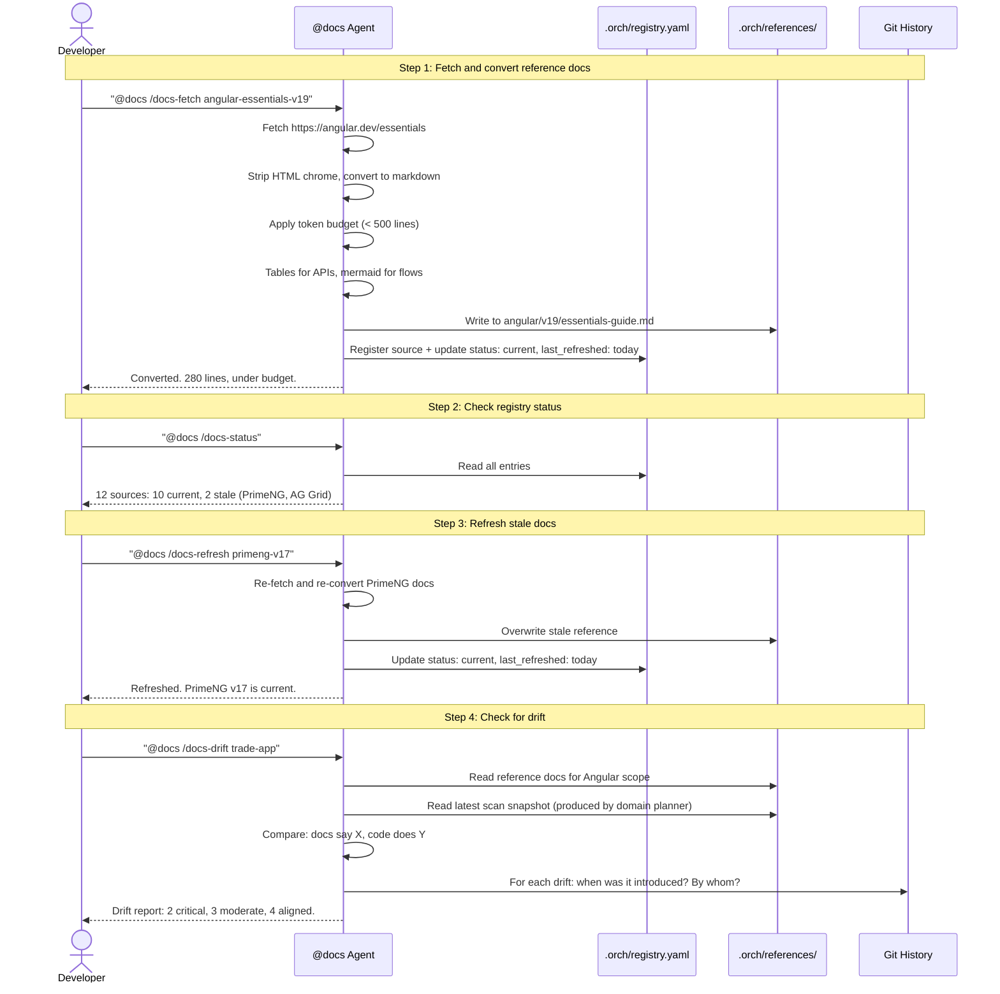
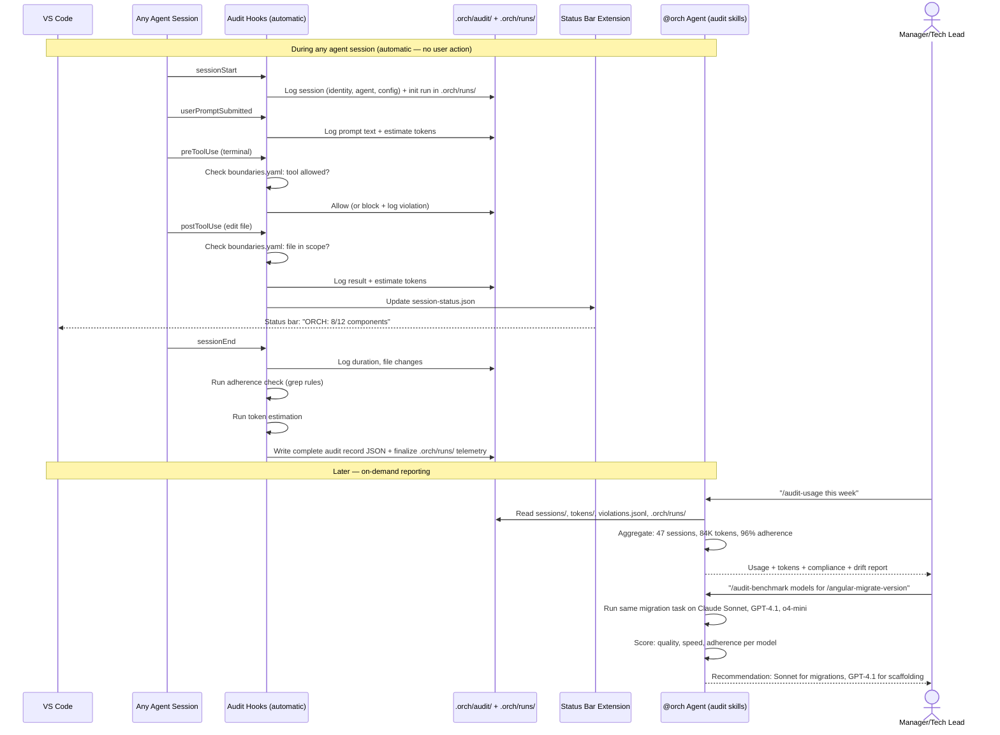
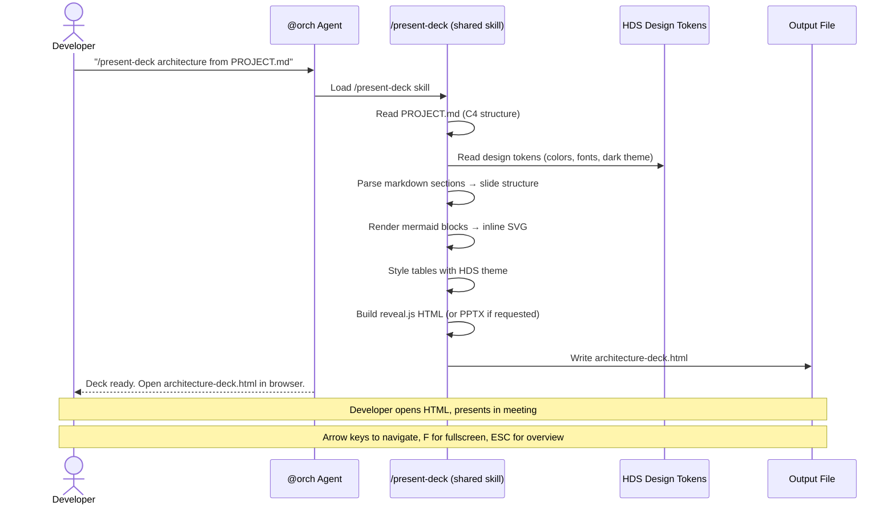

# ORCH (Orchestra) — Product Requirements Document

**Version:** 1.0
**Date:** 2026-03-18
**Status:** Draft
**Owner:** Enterprise Platform Team

---

## 1. Vision

ORCH (Orchestra) is an enterprise-grade, curated collection of GitHub Copilot customizations — agents, skills, instructions, and hooks — that standardizes AI-assisted development across the organization.

The goal: Copilot stops suggesting generic code and starts suggesting **your team's code** — with the right patterns, the right error handling, the right conventions, every time.

---

## 2. Problem Statement

### 2.1 Current State

- Teams independently configure Copilot (or don't configure it at all), leading to inconsistent AI-generated code
- Coding standards exist in wikis and Confluence pages nobody reads — Copilot has no access to them
- Onboarding is slow because Copilot can't teach new developers internal patterns
- No governance over what Copilot agents can access or do in an enterprise environment
- Documentation is scattered across HTML, PDF, YAML, Confluence, Storybook — none of it is in a format Copilot can efficiently consume
- During upgrades and migrations, teams lack visibility into their codebase architecture, pattern usage, and doc-code drift

### 2.2 Desired State

- Every developer gets AI suggestions that follow organizational standards automatically
- Reference documentation is curated, token-efficient, versioned, and always accessible to Copilot
- Migration and upgrade efforts are informed by accurate architecture scans and drift analysis
- Customizations are packaged, versioned, and distributable across teams
- **Every agent operation is fully auditable** — what was invoked, what tools were used, what files were touched, how many tokens were consumed, whether the agent stayed within its declared boundaries, and whether its output adhered to instructions

---

## 3. Scope

### 3.1 In Scope

| Area | Description |
|------|-------------|
| **Audit Framework** | Foundation layer: session tracking, token estimation, tool boundary enforcement, file scope checks, instruction adherence scoring, behavioral drift detection, compliance reporting. Pre-flight checks via @orch-preflight. Per-run telemetry in `.orch/runs/`. |
| **Doc Agent** | @docs agent narrowed to **reference supply chain** — converting, curating, refreshing, and drift-checking reference documentation. Codebase scanning and explanation moved to domain planners. |
| **3 Domain Customization Sets** | Agents, skills, and instructions for: @angular, @springboot, @fastapi. Each domain uses a **role-based sub-agent pattern**: coordinator (triage + loop), planner (scan + explain + plan), engineer (generate + migrate + refactor), verifier (test + review + audit). Skills are **granular and domain-prefixed** (e.g., `/angular-scan-deps`, `/angular-migrate-signals`). **CI/CD skills are domain-specific** — each domain agent includes its own CI/CD skills (e.g., `/angular-ci-pipeline`, `/angular-cd-deploy`) rather than separate @ci/@cd agents, because CI/CD processes are inherently stack-specific. |
| **@local Shared Agent** | Local environment setup agent shared across all domains. Skills: `/local-setup-env`, `/local-setup-docker`, `/local-setup-deps`, `/local-diagnose`. Handles dependency installation, Docker configuration, localstack setup, and environment diagnostics. |
| **Configuration Cascade** | Three-level rule system: `.github/copilot-instructions.md` (global safety + behavior) → domain skills (domain-specific rules in SKILL.md) → `.orch/config.yaml` (runtime settings: retries, auto mode, models). Global safety rules are non-overridable. Domain rules adapt per skill. |
| **Documentation Registry** | A YAML-based registry tracking all doc sources, versions, scan snapshots, and drift status |
| **Validation & Benchmarking** | Automated output validation (deterministic + heuristic checks) and model quality benchmarking across skills |
| **Governance Hooks** | Lifecycle hooks for secrets scanning, prompt auditing, and tool-use gating |
| **Master Orchestrator** | @orch agent that triages requests and delegates to domain-specific agents via handoffs. Owns shared presentation skills (`/present-deck`, `/present-dashboard`). |
| **Pre-flight Agent** | @orch-preflight for environment and configuration validation before agent sessions |
| **Per-run Telemetry** | `.orch/runs/` directory captures per-run telemetry: timing, tokens, tool calls, outcomes |
| **Internal Marketplace** | Plugin packaging and distribution for cross-team consumption |

### 3.2 Out of Scope

| Area | Reason |
|------|--------|
| MCP server development | Adds infrastructure complexity; bundled reference docs + fetch cover the need |
| Custom web UI for browsing | VS Code extensions and CLI already provide discovery |
| Auto-refresh of external docs | Controlled refresh prevents silent changes to reference material |
| General-purpose documentation system | ORCH is specifically for feeding Copilot, not replacing Confluence/wikis |

---

## 4. Users & Personas

| Persona | Role | How they use ORCH |
|---------|------|-------------------|
| **Application Developer** | Writes frontend/backend code daily | Benefits from always-on instructions + invokes skills for scaffolding and migration |
| **Tech Lead** | Owns coding standards for a team | Authors and maintains instructions + reviews agent behavior |
| **Platform Engineer** | Manages CI/CD and infrastructure | Uses domain-specific CI/CD skills (e.g., `/angular-ci-pipeline`) + @local agent for environment setup |
| **Migration Lead** | Plans and executes version upgrades | Uses proof, drift, and migration skills to plan and track progress |
| **ORCH Maintainer** | Curates the marketplace | Manages the registry, reviews plugin submissions, maintains doc freshness |

---

## 5. Capabilities

### 5.0 Audit Framework (Foundation)

Audit is the foundation layer — it is built first and everything else runs through it. No agent executes, no skill invokes, no tool fires without audit capturing a complete record.

**What audit captures for every operation:**

| Category | Data captured |
|----------|--------------|
| **Identity** | Session ID, timestamp, user, machine, repo, branch, agent/skill invoked |
| **Prompts** | Full text of every user prompt, system context loaded, references read |
| **Tool usage** | Every tool call: name, parameters, result, duration, whether it was in the agent's declared tool list |
| **File changes** | Files read, modified, created, deleted — including whether any were outside the agent's declared scope |
| **Token estimation** | Input tokens (prompts + context + references), output tokens (generated code + responses), total per session |
| **Boundary enforcement** | Tool boundary violations (agent used undeclared tool), file scope violations (agent touched files outside its `applyTo` pattern) |
| **Instruction adherence** | Post-session check of generated code against instruction rules (e.g., "uses OnPush?", "no manual subscribe?") |
| **Validation results** | Deterministic checks (build, test, lint pass/fail) + heuristic checks (pattern adherence %, hallucination scan) |

**Audit capabilities:**

| Capability | Description |
|------------|-------------|
| **Session tracking** | Complete lifecycle capture: start, prompts, tool calls, file changes, end |
| **Token estimation** | Estimated input/output/total tokens per session, per agent, per model |
| **Tool boundary enforcement** | `preToolUse` hook checks every tool call against agent's declared tools; blocks unauthorized |
| **File scope enforcement** | `postToolUse` hook checks file edits against agent's declared `applyTo` patterns |
| **Instruction adherence scoring** | Post-session scan of generated code against programmatic rule checks |
| **Behavioral drift tracking** | Adherence scores over time; detects regression in agent quality |
| **Model benchmarking** | Run same tasks across models, compare quality/speed/adherence scores; recommend best model per skill. Invoked via `/audit-benchmark`. |
| **Compliance reporting** | `/audit-usage`, `/audit-tokens`, `/audit-compliance`, `/audit-drift`, `/audit-benchmark` |
| **Pre-flight checks** | @orch-preflight agent validates environment, dependencies, and configuration before agent sessions. Replaces the former `/orch-validate` skill — validation is now the domain verifier's responsibility during execution; pre-flight handles readiness checks. |
| **Context rot detection** | Track token accumulation and adherence score within a session; detect quality degradation; surface as "quality declining" (not raw token metrics) via status bar and agent self-warn |
| **Session status tracking** | Track work progress for bounded tasks (migration from scan, doc conversion from registry); provide % complete when denominator is known |
| **Notification system** | Three channels: status bar (glanceable, silent), agent in-chat (primary), VS Code toast (interrupt-only for decisions/errors/quality). OS notification only for critical security alerts |
| **Sub-agent delegation** | Domain coordinators (@angular, @springboot, etc.) delegate to role-based sub-agents: @{domain}-planner (scan, explain, plan), @{domain}-engineer (generate, migrate, refactor), @{domain}-verifier (test, review, audit). Only results flow back. Reduces context rot by 80%+ for scanning and migration workflows. |
| **Semantic analysis** | Type-aware codebase analysis via language-specific adapters (ts-morph for TypeScript, adapter pattern for Java/Python). Generates lossless semantic summaries for agent context and executes precise, formatting-preserving transforms for migrations. |

**Audit storage:** JSON log files per session in `.orch/audit/`, append-only violation log, daily/weekly metrics rollups. Per-run telemetry (timing, tokens, tool calls, outcomes) in `.orch/runs/`. Designed for export to enterprise observability stacks (Splunk, ELK, Datadog).

### 5.1 Documentation Pipeline (Doc Agent — Reference Supply Chain)

The @docs agent is **narrowed to reference supply chain** — ensuring all other agents and skills have clean, token-efficient reference material. It operates within the audit framework — every conversion and drift check is tracked.

Capabilities that moved out of @docs:
- **Codebase scanning** → domain planners (e.g., `/angular-scan-arch`, `/angular-scan-deps`)
- **Explain** → domain planners (e.g., `/angular-explain`)
- **Code documentation** → domain agents (e.g., `/angular-docs-audit`, `/angular-docs-generate`, `/angular-docs-repair`)
- **Version/compatibility matrix** → domain planners (e.g., `/angular-compatibility`)

**@docs skills:**

| Skill | Description |
|-------|-------------|
| `/docs-fetch` | Transform source content (HTML, YAML, JSON, PDF, Confluence export) and source-embedded docs (JSDoc, TSDoc, Compodoc, PyDoc, Javadoc) into concise, token-efficient markdown. For source-embedded formats, runs the appropriate generator tool (typedoc, compodoc, sphinx, javadoc) to extract API surfaces before converting. Also registers new documentation sources to the central registry. |
| `/docs-status` | Dashboard showing all sources, versions, staleness, and drift |
| `/docs-refresh` | Re-fetch and re-convert sources when they become stale |
| `/docs-drift` | Compare reference docs against code scans to surface mismatches between documentation and actual codebase state |

### 5.2 Domain Customization Sets

Each domain provides three layers:

| Layer | Behavior | Copilot integration |
|-------|----------|-------------------|
| **Instructions** | Always active for matching files. Passive coding standards. | Auto-applied based on file glob patterns |
| **Skills** | Invoked on demand via /slash-commands. Task-focused. | User or agent triggers explicitly |
| **Agents** | Selected per session. Persona with tool access. | User selects via @mention |

### 5.2.1 Code Documentation Skills (domain-owned)

Code documentation skills are **no longer cross-domain shared skills**. They are owned by each domain's role-based agents, using domain-prefixed names. This ensures documentation follows domain-specific conventions and formats.

**Example (Angular domain):**

| Skill | Owner | Description |
|-------|-------|-------------|
| `/angular-docs-audit` | @angular-verifier | Scan Angular/TypeScript source for missing, incomplete, stale, or wrong-format doc comments. Produces coverage report with prioritized fix list. Detects TSDoc format and flags misuse (e.g., JSDoc `{type}` syntax in TypeScript). |
| `/angular-docs-generate` | @angular-engineer | Add meaningful TSDoc comments to undocumented public APIs. Reads function bodies to understand purpose — not just template `@param name - description`. |
| `/angular-docs-repair` | @angular-engineer | Fix stale docs (signature mismatch), incomplete docs (missing @param/@returns/@throws), and wrong-format docs (JSDoc to TSDoc migration in TypeScript files). |

Other domains follow the same pattern: `/springboot-docs-audit`, `/fastapi-docs-generate`, etc.

**Frontend doc format decision:**

| Codebase | Write docs in | Extract with | Rationale |
|----------|-------------|-------------|-----------|
| Angular/TypeScript | TSDoc | Compodoc | TSDoc trusts TS for types, only documents intent. Compodoc reads TSDoc + Angular decorators. Never JSDoc in .ts files. |
| Plain TypeScript | TSDoc | TypeDoc | Same reasoning — TS provides types. |
| Plain JavaScript | JSDoc | JSDoc | Types needed since no TS — JSDoc is correct here. |
| Java/Spring Boot | Javadoc | Javadoc | Standard Java documentation. |
| Python/FastAPI | Google-style docstrings | Sphinx | Most readable Python docstring format. |

### 5.3 Validation & Benchmarking

| Capability | Description |
|------------|-------------|
| **Deterministic validation** | Post-operation checks: build passes, tests pass, lint passes, output files exist, token budget met |
| **Heuristic validation** | Hallucination detection (terms in output not in source), information loss (key sections missing), format compliance |
| **Model benchmarking** | Run identical tasks across available models (Claude Sonnet 4, GPT-4.1, o4-mini, etc.), score by quality/speed/adherence, produce comparison reports and per-skill model recommendations |
| **Shadow testing** | Run same prompts with and without ORCH instructions, score both against standards checklist, measure ORCH improvement |

### 5.4 Governance

| Capability | Description |
|------------|-------------|
| **Secrets Scanning** | Hook that blocks commits containing credentials or sensitive data |
| **Prompt Auditing** | Hook that logs all prompts for compliance review |
| **Tool-Use Gating** | Hook that approves/denies specific tool executions |

### 5.5 Distribution

| Capability | Description |
|------------|-------------|
| **Plugin Packaging** | Bundle domain customizations into installable plugins |
| **Internal Marketplace** | Repository-based marketplace for discovery and installation |
| **Version Management** | Track and distribute versioned customizations per target platform |

### 5.6 Presentation (Shared Skills under @orch)

The @showcase agent has been **removed**. Presentation capabilities are now **shared skills under @orch**, available to any agent or user via the orchestrator.

| Skill | Description |
|-------|-------------|
| `/present-deck` | Generate slide decks from ORCH data — audit summaries, migration progress, drift reports — formatted for stakeholder forums and architecture reviews. Converts markdown to reveal.js HTML or PPTX. Supports mermaid diagrams, HDS design tokens, and dark/light themes. |
| `/present-dashboard` | Build metrics dashboards from ORCH audit data — token consumption, adherence scores, adoption trends — for team leads and management visibility. Reads from `.orch/audit/` and `.orch/runs/` telemetry. |
| `/present-report` | Generate HTML reports from ORCH session data — migration summaries, recap reports, audit compliance — with diagrams, progress bars, and recommendations. |

---

## 6. Domain Details

### 6.1 frontend-ts-angular

**Instructions (always-on):**
- Component patterns (OnPush, standalone, smart/dumb separation)
- RxJS conventions (async pipe, teardown, operator preferences)
- State management patterns (NgRx/signals)
- TypeScript strictness (no `any`, strict null checks)
- Testing standards (what to test, TestBed patterns, mocking)
- Styling conventions (BEM/org standard, CSS variables)
- Accessibility (ARIA, semantic HTML, keyboard navigation)
- Internal component library usage patterns

**Agent structure (role-based pattern):**

| Agent | Role | Responsibility |
|-------|------|----------------|
| **@angular** | Coordinator + triage + loop owner | Receives user requests, triages to the appropriate sub-agent, manages the planner-engineer-verifier loop, handles handoffs and escalations |
| **@angular-planner** | Scan + explain + plan | Understands the codebase: scans architecture, dependencies, patterns, test coverage, deployment, git history, docs, and features. Answers questions and builds migration/upgrade plans. |
| **@angular-engineer** | Generate + migrate + refactor | Executes changes: scaffolds components/services/routes, runs migrations, refactors code, generates and repairs documentation. |
| **@angular-verifier** | Test + review + audit | Validates work: runs unit/e2e tests, lints, reviews code for anti-patterns, audits documentation coverage. |

**Skills by sub-agent:**

*@angular-planner:*
| Skill | Description |
|-------|-------------|
| `/angular-scan-deps` | Scan and report on project dependencies, versions, and compatibility |
| `/angular-scan-arch` | Produce architecture documentation (C4 model, dependency graphs) |
| `/angular-scan-quality` | Analyze code quality metrics, complexity, and technical debt |
| `/angular-scan-tests` | Report test coverage, test health, and testing gaps |
| `/angular-scan-deploy` | Analyze build and deployment configuration |
| `/angular-scan-git` | Analyze git history — churn, hotspots, authors, commit patterns |
| `/angular-scan-docs` | Inventory inline documentation coverage and quality |
| `/angular-scan-features` | Catalog application features and their implementation status |
| `/angular-explain` | Answer developer questions about the codebase, architecture, and ORCH capabilities |
| `/angular-compatibility` | Check version compatibility matrix for Angular, TypeScript, RxJS, third-party libs |

*@angular-engineer:*
| Skill | Description |
|-------|-------------|
| `/angular-generate-component` | Scaffold component with org boilerplate (standalone, OnPush, signals, TSDoc, HDS tokens) |
| `/angular-generate-service` | Scaffold injectable service with inject(), logging, config |
| `/angular-generate-route` | Scaffold lazy-loaded route with guards and resolvers |
| `/angular-migrate-standalone` | NgModules to standalone components |
| `/angular-migrate-signals` | Observables/inputs to signals |
| `/angular-migrate-control-flow` | *ngIf/*ngFor to @if/@for |
| `/angular-migrate-jest` | Karma to Jest/Vitest |
| `/angular-migrate-playwright` | Protractor/Cypress to Playwright |
| `/angular-migrate-version` | Full Angular version upgrade (multi-phase) |
| `/angular-refactor` | General modernization and pattern updates |
| `/angular-docs-generate` | Add meaningful TSDoc comments to undocumented public APIs |
| `/angular-docs-repair` | Fix stale, incomplete, or wrong-format doc comments |

*@angular-verifier:*
| Skill | Description |
|-------|-------------|
| `/angular-test-unit` | Generate and run unit tests per org conventions |
| `/angular-test-e2e` | Generate and run end-to-end tests |
| `/angular-test-lint` | Run linting and report violations |
| `/angular-review` | Review code for Angular anti-patterns and org standard violations |
| `/angular-docs-audit` | Audit source code documentation coverage and quality |

**Reference docs needed:**
- Angular core docs (versioned: v17, v18, v19)
- PrimeNG component docs
- AG Grid Angular integration docs
- Interop.io (io.Connect) Angular guide
- Internal UI component library docs

### 6.2 backend-java-springboot

**Instructions:** REST API design, DI patterns, JPA conventions, security configuration, exception handling
**Agent structure:** Same role-based pattern as Angular — @springboot (coordinator), @springboot-planner, @springboot-engineer, @springboot-verifier. Skills follow the `springboot-{action}` naming convention (e.g., `/springboot-scan-deps`, `/springboot-generate-endpoint`, `/springboot-migrate-version`, `/springboot-test-unit`, `/springboot-docs-audit`).
**Reference docs:** Spring Boot (versioned), Spring Security, internal service templates

### 6.3 backend-python-fastapi

**Instructions:** Async patterns, Pydantic models, dependency injection, API documentation standards
**Agent structure:** Same role-based pattern — @fastapi (coordinator), @fastapi-planner, @fastapi-engineer, @fastapi-verifier. Skills follow the `fastapi-{action}` naming convention (e.g., `/fastapi-scan-deps`, `/fastapi-generate-route`, `/fastapi-migrate-version`, `/fastapi-test-unit`, `/fastapi-docs-audit`).
**Reference docs:** FastAPI docs, Pydantic v2, internal service templates

### 6.4 CI/CD — Domain-Specific Skills (Not Separate Agents)

**Decision:** CI/CD is not a separate domain. How you build, test, and deploy an Angular app differs fundamentally from Spring Boot or FastAPI. Therefore, CI/CD capabilities are delivered as **skills within each domain agent**, not as standalone @ci or @cd agents.

**CI/CD skills per domain:**

| Domain | CI Skills | CD Skills |
|--------|-----------|-----------|
| @angular | `/angular-ci-pipeline`, `/angular-ci-optimize` | `/angular-cd-deploy`, `/angular-cd-rollback` |
| @springboot | `/springboot-ci-pipeline`, `/springboot-ci-optimize` | `/springboot-cd-deploy`, `/springboot-cd-rollback` |
| @fastapi | `/fastapi-ci-pipeline`, `/fastapi-ci-optimize` | `/fastapi-cd-deploy`, `/fastapi-cd-rollback` |

**Rationale:** An Angular CI pipeline uses `ng build`, `ng test`, bundle analysis, and Lighthouse. A Spring Boot pipeline uses `mvn package`, integration tests, and JAR artifact management. A FastAPI pipeline uses `pytest`, `uvicorn`, and container builds. Attempting to generalize these into a single @ci agent produces a lowest-common-denominator experience. Domain-specific CI/CD skills encode the exact tools, configurations, and best practices for each stack.

**Reference docs:** CI/CD reference material is stored per domain (e.g., `.orch/references/angular/ci-best-practices.md`, `.orch/references/spring-boot/deployment-guide.md`).

### 6.5 @local — Local Environment Setup (Shared Agent)

**Purpose:** Local environment setup is a shared concern — every developer needs it regardless of stack. The @local agent handles setting up development environments, installing dependencies, configuring Docker and localstack, and diagnosing common environment issues.

**Agent structure:** @local is a single shared agent under @orch (like @docs and @audit). No sub-agents — the scope is narrow enough to not require role-based splitting.

**Skills:**

| Skill | Description |
|-------|-------------|
| `/local-setup-env` | Configure local development environment: shell, Node.js, Java, Python versions, environment variables |
| `/local-setup-docker` | Set up Docker, docker-compose, localstack for local development and testing |
| `/local-setup-deps` | Install and verify project dependencies (npm, maven, pip) with version alignment checks |
| `/local-diagnose` | Diagnose common environment issues: port conflicts, version mismatches, missing tools, permission problems |

**Reference docs:** Internal environment setup guides, Docker templates, localstack configuration

---

## 7. Token Efficiency Strategy

All reference material must be optimized for LLM token consumption. This is not optional — it directly impacts Copilot output quality.

### 7.1 Output Format Rules

| Content type | Output format | Rationale |
|-------------|---------------|-----------|
| Conceptual docs, guides, standards | Markdown (prose + tables) | Most token-efficient for conveying information |
| API references, component props | Markdown tables | Compact, structured |
| Code patterns, examples | Native code (.ts, .java, .py) | Code the agent should mimic stays as code |
| Workflows, pipelines, sequences | Mermaid (inside markdown) | More token-efficient than prose for 3+ step flows |
| Architecture, service interactions | Mermaid diagrams | Precise, unambiguous |
| Config examples | Native format (.yaml, .json) if small; markdown table if large | Balance fidelity vs tokens |
| Source-embedded docs (JSDoc, TSDoc, Compodoc, PyDoc, Javadoc) | Run generator tool → extract → markdown tables | Two-step pipeline; generator handles inheritance, generics, cross-file refs |

### 7.2 Token Budget

- Maximum 500 lines per reference doc
- Prioritize API surface and usage examples over theory/explanation
- Table format for props/parameters
- Strip navigation, headers/footers, SEO content, duplicate content
- Keep code examples, type signatures, gotchas/warnings

### 7.3 Text-to-Diagram Conversion

Convert prose to mermaid when ALL conditions are met:
1. Text describes interactions between 2+ named entities
2. There are 3+ steps/interactions
3. Mermaid version uses fewer tokens than prose
4. Prose requires mentally tracking state across multiple steps

Diagram type selection:
- Request/response between services → sequenceDiagram
- Linear or branching steps → flowchart
- State transitions → stateDiagram
- System dependencies (no flow) → graph TD

---

## 8. Versioning Model

### 8.1 Three Versioning Dimensions

```
┌─────────────────────────────────┐
│       .orch/registry.yaml        │
└────────────────┬────────────────┘
                 │
    ┌────────────┼────────────────┐
    │            │                │
┌───▼──────┐ ┌──▼──────────┐ ┌──▼──────────┐
│ Library  │ │ App Scans   │ │ ORCH        │
│ Docs     │ │             │ │ Artifacts   │
├──────────┤ ├─────────────┤ ├─────────────┤
│ Versioned│ │ Versioned   │ │ Versioned   │
│ by lib   │ │ by scan     │ │ by target   │
│ release  │ │ snapshot    │ │ platform    │
│          │ │             │ │             │
│ angular/ │ │ trade-app/  │ │ angular-v17+│
│  v17/    │ │  2026-03/   │ │  .agent.md  │
│  v19/    │ │  2026-04/   │ │  skills/    │
│ primeng/ │ │  2026-05/   │ │ angular-v16 │
│  v16/    │ │ portfolio/  │ │  (legacy)   │
│  v17/    │ │  2026-03/   │ │             │
└──────────┘ └─────────────┘ └─────────────┘
```

- **Library docs**: versioned by library release (angular/v17, angular/v19)
- **App scans**: versioned by snapshot date + git commit (pre-migration, mid-migration, post-migration)
- **ORCH artifacts**: versioned by target platform version (angular-v17+, angular-v14-v16)

### 8.2 Snapshot Tracking

Each app scan produces a timestamped snapshot stored in the registry:

```yaml
snapshots:
  - tag: "pre-migration-2026-03"
    date: 2026-03-18
    commit: abc1234
    output: .orch/references/scans/trade-app/2026-03-18-pre-migration/
    summary: "156 NgModule components, 67 manual subscribes, Angular 16.2"
```

Scan comparison is handled by domain planner scan skills (e.g., `/angular-scan-arch` can compare against a previous snapshot to track migration velocity and remaining work).

---

## 9. Drift Detection

### 9.1 Two Types of Drift

| Type | Description | Signal |
|------|-------------|--------|
| **Doc is stale** | Code changed, docs weren't updated | Consistent pattern in code differs from docs across many files |
| **Code is wrong** | Doc describes intended design, code deviated | Doc describes clear standard, only a few files deviate |

### 9.2 Drift Classification

- **Doc likely stale**: 80%+ of codebase does X, doc says Y → suggest updating doc
- **Code likely wrong**: 5% of files deviate from documented standard → suggest fixing code
- **Ambiguous**: roughly 50/50 split or critical area (auth, security) → flag for human decision, never auto-resolve

### 9.3 Git-Enriched Drift Analysis

Drift reports include git context:
- When the deviation was introduced (commit date)
- Who introduced it (author)
- Why (commit message, related PR/issue)
- Whether it was intentional (hotfix vs gradual drift)

---

## 10. Success Metrics

| Metric | Baseline | Target | How to measure |
|--------|----------|--------|---------------|
| Code review turnaround | Manual measurement | 30% reduction | PR metrics |
| Pattern adherence in AI-generated code | Unmeasured | 90%+ follows org standards | Audit adherence scores |
| Onboarding time to first PR | Team-dependent | 40% reduction | Track per new hire |
| Migration effort estimation accuracy | Ad-hoc guessing | Within 20% of actual | Compare scan estimates vs actuals |
| Doc freshness | Unknown staleness | All sources refreshed within 30 days | Registry status dashboard |
| Drift detection | Discovered during migration | Discovered before migration | Drift reports |
| Audit coverage | No tracking | 100% of agent sessions have complete audit records | `/audit-usage` |
| Tool boundary violations | Undetected | 0 unblocked unauthorized tool calls | `/audit-compliance` |
| Token visibility | No data | Token estimates per session, agent, model, and skill | `/audit-tokens` |
| Behavioral drift | Undetected | Adherence score regression detected within 1 week | `/audit-drift` |
| Model optimization | Guesswork | Best model identified per skill category with benchmark data | `/audit-benchmark` |
| Notification noise | N/A | <3 toast notifications per day per developer | Count notification triggers from session status |
| Context rot detection | Undetected | Quality decline surfaced before user notices | Compare rot detection timestamp vs first bad output |

---

## 11. Constraints

| Constraint | Impact |
|-----------|--------|
| Enterprise environment | All customizations must be reviewable, auditable, and hosted internally |
| No MCP servers (Phase 0-1) | Doc agent uses local files + URL fetch, not live integrations |
| Token limits | Reference docs must be aggressively curated — quality over quantity |
| Multiple Angular versions across teams | Instructions and skills must support version-specific guidance |
| Diverse tech stack | Each domain operates independently; cross-domain orchestration is Phase 2 |

---

## 12. End-to-End Workflows

### 12.1 ORCH Setup — From Zero to Running

How a team goes from nothing to a fully configured ORCH setup.



### 12.2 Creating a New Feature — Role-Based Agent Flow



### 12.3 Migration — Full Angular Version Upgrade (Role-Based Agent Chain)



### 12.4 Documentation Pipeline — Narrowed @docs Scope

@docs is focused on the **reference supply chain**. Codebase scanning is handled by domain planners.



### 12.5 Audit — Automatic Capture + On-Demand Reporting



### 12.6 Presentation — Shared Skill under @orch



---

## 13. Risks

| Risk | Likelihood | Impact | Mitigation |
|------|-----------|--------|-----------|
| Customizations go stale | High | Medium | Registry tracks freshness; `/docs-status` surfaces staleness |
| Teams don't adopt | Medium | High | Start with pilot teams; demonstrate measurable value before org rollout |
| Instructions conflict across domains | Medium | Medium | One domain = one focus; clear `applyTo` scoping |
| Token budget exceeded | Medium | Medium | Strict 500-line limit per reference doc; curate aggressively |
| External doc sites change structure | Medium | Low | `/docs-refresh` re-converts; snapshot previous version |
| Migration skills produce incorrect transformations | Low | High | Always run build + tests after migration; human review required |
| **Windows incompatibility** | **High** | **High** | **All 15 audit/migration `.sh` scripts and 1 `.py` script are bash/python-only. They will not execute on Windows (cmd.exe or PowerShell). Audit hooks silently fail — no data captured. Mitigation: keep bash scripts as primary runtime. `orch doctor` checks for bash, jq, and python3 availability with platform-specific install guidance (Homebrew on macOS, winget + Git Bash on Windows). CLI TypeScript code is cross-platform. ts-morph adapters are cross-platform.** |
| Windows notification gap | Medium | Low | `notify.sh` has macOS (`osascript`) and Linux (`notify-send`) paths but no Windows path. Add PowerShell `BurntToast` or `[System.Windows.Forms.MessageBox]` support. `orch doctor` surfaces this gap on Windows and provides install guidance. |
| `jq` dependency on non-dev machines | Medium | Medium | All `.sh` scripts depend on `jq` for JSON parsing. Not installed by default on any OS. `orch doctor` checks for `jq` and provides platform-specific install instructions (brew install jq, winget install jqlang.jq). |
