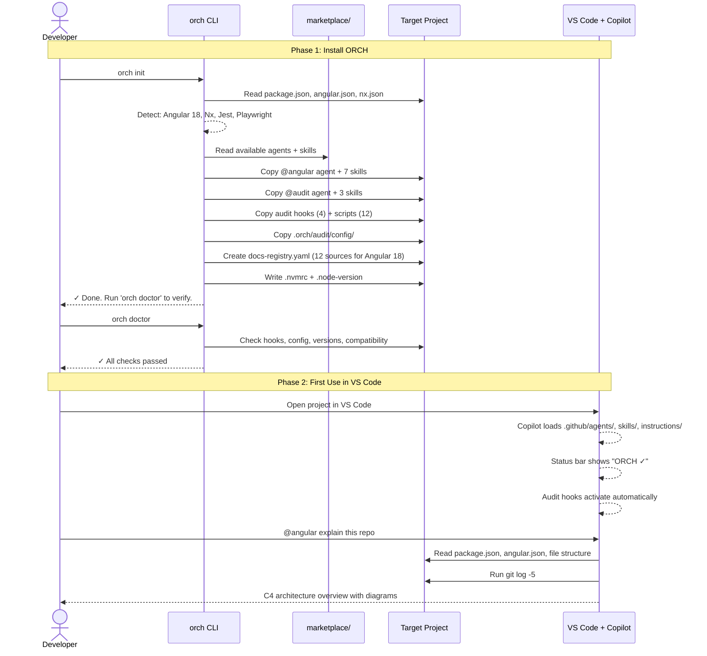
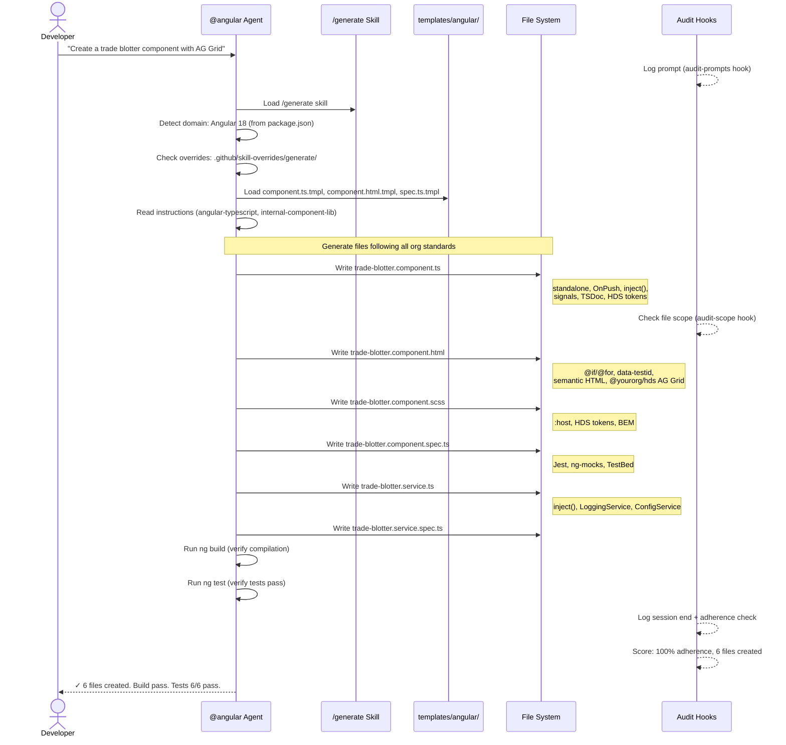
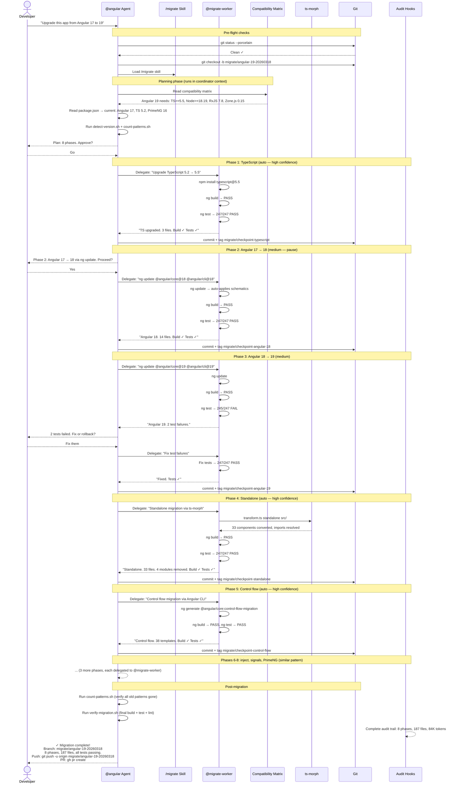
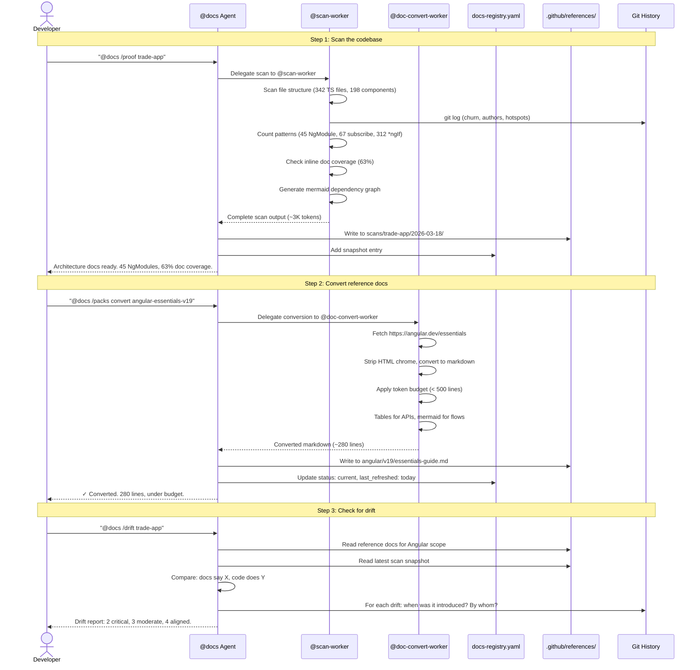
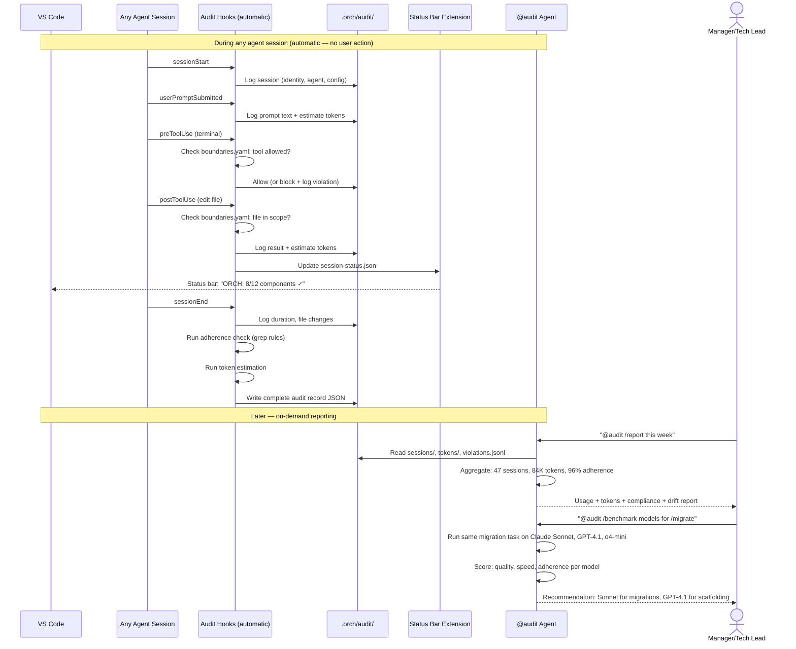
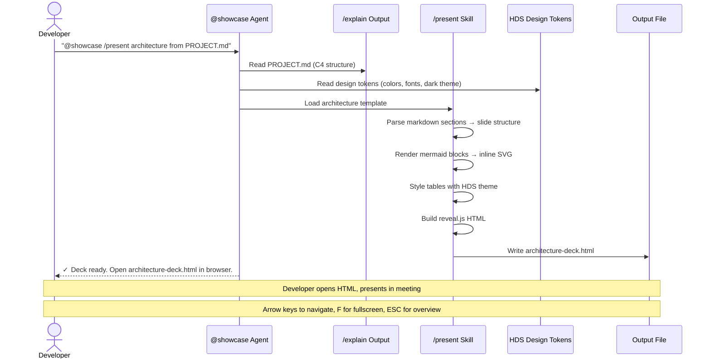

# ORCH (Orchestra) — Product Requirements Document

**Version:** 1.0
**Date:** 2026-03-18
**Status:** Draft
**Owner:** Enterprise Platform Team

---

## 1. Vision

ORCH (Orchestra) is an enterprise-grade, curated collection of GitHub Copilot customizations — agents, skills, instructions, and hooks — that standardizes AI-assisted development across the organization.

The goal: Copilot stops suggesting generic code and starts suggesting **your team's code** — with the right patterns, the right error handling, the right conventions, every time.

---

## 2. Problem Statement

### 2.1 Current State

- Teams independently configure Copilot (or don't configure it at all), leading to inconsistent AI-generated code
- Coding standards exist in wikis and Confluence pages nobody reads — Copilot has no access to them
- Onboarding is slow because Copilot can't teach new developers internal patterns
- No governance over what Copilot agents can access or do in an enterprise environment
- Documentation is scattered across HTML, PDF, YAML, Confluence, Storybook — none of it is in a format Copilot can efficiently consume
- During upgrades and migrations, teams lack visibility into their codebase architecture, pattern usage, and doc-code drift

### 2.2 Desired State

- Every developer gets AI suggestions that follow organizational standards automatically
- Reference documentation is curated, token-efficient, versioned, and always accessible to Copilot
- Migration and upgrade efforts are informed by accurate architecture scans and drift analysis
- Customizations are packaged, versioned, and distributable across teams
- **Every agent operation is fully auditable** — what was invoked, what tools were used, what files were touched, how many tokens were consumed, whether the agent stayed within its declared boundaries, and whether its output adhered to instructions

---

## 3. Scope

### 3.1 In Scope

| Area | Description |
|------|-------------|
| **Audit Framework** | Foundation layer: session tracking, token estimation, tool boundary enforcement, file scope checks, instruction adherence scoring, behavioral drift detection, compliance reporting |
| **Doc Agent** | An agent + skills for converting, curating, scanning, and managing reference documentation — fully integrated with audit |
| **5 Domain Customization Sets** | Agents, skills, and instructions for: @angular, @springboot, @fastapi, @ci, @cd. Skills are generic actions (/generate, /migrate, /test, /review, /refactor) that work across all domains. |
| **Skill Override System** | Temporary team overrides with 90-day expiry and mandatory path-to-central tracking. Escape hatch for domain teams, not a permanent customization layer. |
| **Documentation Registry** | A YAML-based registry tracking all doc sources, versions, scan snapshots, and drift status |
| **Validation & Benchmarking** | Automated output validation (deterministic + heuristic checks) and model quality benchmarking across skills |
| **Governance Hooks** | Lifecycle hooks for secrets scanning, prompt auditing, and tool-use gating |
| **Master Orchestrator** | An agent that triages requests and delegates to domain-specific agents via handoffs |
| **Showcase Agent** | @showcase agent with /present (slide decks) and /dashboard (metrics dashboard) skills for presenting ORCH data in forums |
| **Internal Marketplace** | Plugin packaging and distribution for cross-team consumption |

### 3.2 Out of Scope

| Area | Reason |
|------|--------|
| MCP server development | Adds infrastructure complexity; bundled reference docs + fetch cover the need |
| Custom web UI for browsing | VS Code extensions and CLI already provide discovery |
| Auto-refresh of external docs | Controlled refresh prevents silent changes to reference material |
| General-purpose documentation system | ORCH is specifically for feeding Copilot, not replacing Confluence/wikis |

---

## 4. Users & Personas

| Persona | Role | How they use ORCH |
|---------|------|-------------------|
| **Application Developer** | Writes frontend/backend code daily | Benefits from always-on instructions + invokes skills for scaffolding and migration |
| **Tech Lead** | Owns coding standards for a team | Authors and maintains instructions + reviews agent behavior |
| **Platform Engineer** | Manages CI/CD and infrastructure | Uses operations agents + contributes pipeline skills |
| **Migration Lead** | Plans and executes version upgrades | Uses proof, drift, and migration skills to plan and track progress |
| **ORCH Maintainer** | Curates the marketplace | Manages the registry, reviews plugin submissions, maintains doc freshness |

---

## 5. Capabilities

### 5.0 Audit Framework (Foundation)

Audit is the foundation layer — it is built first and everything else runs through it. No agent executes, no skill invokes, no tool fires without audit capturing a complete record.

**What audit captures for every operation:**

| Category | Data captured |
|----------|--------------|
| **Identity** | Session ID, timestamp, user, machine, repo, branch, agent/skill invoked |
| **Prompts** | Full text of every user prompt, system context loaded, references read |
| **Tool usage** | Every tool call: name, parameters, result, duration, whether it was in the agent's declared tool list |
| **File changes** | Files read, modified, created, deleted — including whether any were outside the agent's declared scope |
| **Token estimation** | Input tokens (prompts + context + references), output tokens (generated code + responses), total per session |
| **Boundary enforcement** | Tool boundary violations (agent used undeclared tool), file scope violations (agent touched files outside its `applyTo` pattern) |
| **Instruction adherence** | Post-session check of generated code against instruction rules (e.g., "uses OnPush?", "no manual subscribe?") |
| **Validation results** | Deterministic checks (build, test, lint pass/fail) + heuristic checks (pattern adherence %, hallucination scan) |

**Audit capabilities:**

| Capability | Description |
|------------|-------------|
| **Session tracking** | Complete lifecycle capture: start, prompts, tool calls, file changes, end |
| **Token estimation** | Estimated input/output/total tokens per session, per agent, per model |
| **Tool boundary enforcement** | `preToolUse` hook checks every tool call against agent's declared tools; blocks unauthorized |
| **File scope enforcement** | `postToolUse` hook checks file edits against agent's declared `applyTo` patterns |
| **Instruction adherence scoring** | Post-session scan of generated code against programmatic rule checks |
| **Behavioral drift tracking** | Adherence scores over time; detects regression in agent quality |
| **Model benchmarking** | Run same tasks across models, compare quality/speed/adherence scores; recommend best model per skill |
| **Compliance reporting** | `/orch-audit-usage`, `/orch-audit-tokens`, `/orch-audit-compliance`, `/orch-audit-drift` |
| **Context rot detection** | Track token accumulation and adherence score within a session; detect quality degradation; surface as "quality declining" (not raw token metrics) via status bar and agent self-warn |
| **Session status tracking** | Track work progress for bounded tasks (migration from scan, doc conversion from registry); provide % complete when denominator is known |
| **Notification system** | Three channels: status bar (glanceable, silent), agent in-chat (primary), VS Code toast (interrupt-only for decisions/errors/quality). OS notification only for critical security alerts |
| **Sub-agent delegation** | Coordinators (@docs, @angular) delegate heavy work to internal worker sub-agents (@scan-worker, @migrate-worker, @doc-convert-worker) for context isolation. Only results flow back. Reduces context rot by 80%+ for scanning and migration workflows. |
| **Semantic analysis** | Type-aware codebase analysis via language-specific adapters (ts-morph for TypeScript, adapter pattern for Java/Python). Generates lossless semantic summaries for agent context and executes precise, formatting-preserving transforms for migrations. |

**Audit storage:** JSON log files per session in `.orch/audit/`, append-only violation log, daily/weekly metrics rollups. Designed for export to enterprise observability stacks (Splunk, ELK, Datadog).

### 5.1 Documentation Pipeline (Doc Agent)

The doc agent ensures all other agents and skills have clean, token-efficient reference material. It operates within the audit framework — every conversion, scan, and drift check is tracked.

| Capability | Description |
|------------|-------------|
| **Convert** | Transform source content (HTML, YAML, JSON, PDF, Confluence export) and source-embedded docs (JSDoc, TSDoc, Compodoc, PyDoc, Javadoc) into concise, token-efficient markdown. For source-embedded formats, runs the appropriate generator tool (typedoc, compodoc, sphinx, javadoc) to extract API surfaces before converting. |
| **Register** | Add new documentation sources to the central registry |
| **Refresh** | Re-fetch and re-convert sources when they become stale |
| **Status** | Dashboard showing all sources, versions, staleness, and drift |
| **Scan** | Deep-scan a codebase to produce architecture documentation, enriched with git history. Includes inline documentation coverage inventory — detects which doc format (JSDoc/TSDoc/Compodoc/PyDoc/Javadoc) is present, coverage percentage, and quality assessment |
| **Scan Diff** | Compare two scan snapshots to track migration progress |
| **Drift Detection** | Compare reference docs against code scans to surface mismatches |
| **Explain** | Answer developer questions about ORCH architecture, agent capabilities, skill usage, and customization options using curated internal knowledge |

### 5.2 Domain Customization Sets

Each domain provides three layers:

| Layer | Behavior | Copilot integration |
|-------|----------|-------------------|
| **Instructions** | Always active for matching files. Passive coding standards. | Auto-applied based on file glob patterns |
| **Skills** | Invoked on demand via /slash-commands. Task-focused. | User or agent triggers explicitly |
| **Agents** | Selected per session. Persona with tool access. | User selects via @mention |

### 5.2.1 Code Documentation Skills (cross-domain)

All domain agents share three code documentation skills that ensure source code is properly documented — enabling the doc extraction pipeline to function.

| Capability | Description |
|------------|-------------|
| **Code Comment Audit** (`/code-comment-audit`) | Scan source code for missing, incomplete, stale, or wrong-format doc comments. Produces coverage report with prioritized fix list. Detects JSDoc/TSDoc/Compodoc/Javadoc/PyDoc format and flags misuse (e.g., JSDoc `{type}` syntax in TypeScript). |
| **Code Comment Generate** (`/code-comment-generate`) | Add meaningful doc comments to undocumented public APIs. Reads function bodies to understand purpose — not just template `@param name - description`. Generates TSDoc for Angular/TS, Javadoc for Java, Google-style docstrings for Python. |
| **Code Comment Repair** (`/code-comment-repair`) | Fix stale docs (signature mismatch), incomplete docs (missing @param/@returns/@throws), and wrong-format docs (JSDoc → TSDoc migration in TypeScript files). |

**Frontend doc format decision:**

| Codebase | Write docs in | Extract with | Rationale |
|----------|-------------|-------------|-----------|
| Angular/TypeScript | TSDoc | Compodoc | TSDoc trusts TS for types, only documents intent. Compodoc reads TSDoc + Angular decorators. Never JSDoc in .ts files. |
| Plain TypeScript | TSDoc | TypeDoc | Same reasoning — TS provides types. |
| Plain JavaScript | JSDoc | JSDoc | Types needed since no TS — JSDoc is correct here. |
| Java/Spring Boot | Javadoc | Javadoc | Standard Java documentation. |
| Python/FastAPI | Google-style docstrings | Sphinx | Most readable Python docstring format. |

### 5.3 Validation & Benchmarking

| Capability | Description |
|------------|-------------|
| **Deterministic validation** | Post-operation checks: build passes, tests pass, lint passes, output files exist, token budget met |
| **Heuristic validation** | Hallucination detection (terms in output not in source), information loss (key sections missing), format compliance |
| **Model benchmarking** | Run identical tasks across available models (Claude Sonnet 4, GPT-4.1, o4-mini, etc.), score by quality/speed/adherence, produce comparison reports and per-skill model recommendations |
| **Shadow testing** | Run same prompts with and without ORCH instructions, score both against standards checklist, measure ORCH improvement |

### 5.4 Governance

| Capability | Description |
|------------|-------------|
| **Secrets Scanning** | Hook that blocks commits containing credentials or sensitive data |
| **Prompt Auditing** | Hook that logs all prompts for compliance review |
| **Tool-Use Gating** | Hook that approves/denies specific tool executions |

### 5.5 Distribution

| Capability | Description |
|------------|-------------|
| **Plugin Packaging** | Bundle domain customizations into installable plugins |
| **Internal Marketplace** | Repository-based marketplace for discovery and installation |
| **Version Management** | Track and distribute versioned customizations per target platform |

### 5.6 Showcase

| Capability | Description |
|------------|-------------|
| **Present** (`/present`) | Generate slide decks from ORCH data — audit summaries, migration progress, drift reports — formatted for stakeholder forums and architecture reviews |
| **Dashboard** (`/dashboard`) | Build metrics dashboards from ORCH audit data — token consumption, adherence scores, adoption trends — for team leads and management visibility |

---

## 6. Domain Details

### 6.1 frontend-ts-angular

**Instructions (always-on):**
- Component patterns (OnPush, standalone, smart/dumb separation)
- RxJS conventions (async pipe, teardown, operator preferences)
- State management patterns (NgRx/signals)
- TypeScript strictness (no `any`, strict null checks)
- Testing standards (what to test, TestBed patterns, mocking)
- Styling conventions (BEM/org standard, CSS variables)
- Accessibility (ARIA, semantic HTML, keyboard navigation)
- Internal component library usage patterns

**Skills (on-demand):**
- `/angular-component` — scaffold component with org boilerplate
- `/angular-service` — scaffold injectable service
- `/angular-test` — generate unit tests per org conventions
- `/angular-pr-review` — review PR for Angular anti-patterns
- `/angular-migrate-standalone` — NgModules to standalone
- `/angular-migrate-signals` — observables/inputs to signals
- `/angular-migrate-control-flow` — *ngIf/*ngFor to @if/@for
- `/angular-migrate-jest` — Karma to Jest/Vitest
- `/angular-migrate-rxjs` — deprecated operator replacement
- `/angular-refactor` — general modernization

**Agent (@angular):**
- Deep Angular + TypeScript + RxJS expertise
- Knows internal component library and design system
- Access to codebase + terminal tools (ng CLI, lint, test)
- Pinned model for consistency

**Reference docs needed:**
- Angular core docs (versioned: v17, v18, v19)
- PrimeNG component docs
- AG Grid Angular integration docs
- Interop.io (io.Connect) Angular guide
- Internal UI component library docs

### 6.2 backend-java-springboot

**Instructions:** REST API design, DI patterns, JPA conventions, security configuration, exception handling
**Skills:** Endpoint scaffolding, test generation, PR review, migration helpers
**Agent:** Spring Boot expert with Maven/Gradle + terminal access
**Reference docs:** Spring Boot (versioned), Spring Security, internal service templates

### 6.3 backend-python-fastapi

**Instructions:** Async patterns, Pydantic models, dependency injection, API documentation standards
**Skills:** Route scaffolding, test generation, PR review, migration helpers
**Agent:** FastAPI expert with pip/poetry + terminal access
**Reference docs:** FastAPI docs, Pydantic v2, internal service templates

### 6.4 operations-ci-glue

**Instructions:** GitHub Actions best practices, workflow structure, secret management, artifact handling
**Skills:** Pipeline scaffolding, workflow debugging, optimization
**Agent:** CI expert with GitHub Actions + terminal access
**Reference docs:** GitHub Actions docs, internal CI templates

### 6.5 operations-cd-dps

**Instructions:** Deployment strategies, environment promotion, rollback procedures, observability
**Skills:** Deployment config scaffolding, rollback planning, health check setup
**Agent:** CD expert with deployment tooling access
**Reference docs:** Internal deployment platform docs, infrastructure patterns

---

## 7. Token Efficiency Strategy

All reference material must be optimized for LLM token consumption. This is not optional — it directly impacts Copilot output quality.

### 7.1 Output Format Rules

| Content type | Output format | Rationale |
|-------------|---------------|-----------|
| Conceptual docs, guides, standards | Markdown (prose + tables) | Most token-efficient for conveying information |
| API references, component props | Markdown tables | Compact, structured |
| Code patterns, examples | Native code (.ts, .java, .py) | Code the agent should mimic stays as code |
| Workflows, pipelines, sequences | Mermaid (inside markdown) | More token-efficient than prose for 3+ step flows |
| Architecture, service interactions | Mermaid diagrams | Precise, unambiguous |
| Config examples | Native format (.yaml, .json) if small; markdown table if large | Balance fidelity vs tokens |
| Source-embedded docs (JSDoc, TSDoc, Compodoc, PyDoc, Javadoc) | Run generator tool → extract → markdown tables | Two-step pipeline; generator handles inheritance, generics, cross-file refs |

### 7.2 Token Budget

- Maximum 500 lines per reference doc
- Prioritize API surface and usage examples over theory/explanation
- Table format for props/parameters
- Strip navigation, headers/footers, SEO content, duplicate content
- Keep code examples, type signatures, gotchas/warnings

### 7.3 Text-to-Diagram Conversion

Convert prose to mermaid when ALL conditions are met:
1. Text describes interactions between 2+ named entities
2. There are 3+ steps/interactions
3. Mermaid version uses fewer tokens than prose
4. Prose requires mentally tracking state across multiple steps

Diagram type selection:
- Request/response between services → sequenceDiagram
- Linear or branching steps → flowchart
- State transitions → stateDiagram
- System dependencies (no flow) → graph TD

---

## 8. Versioning Model

### 8.1 Three Versioning Dimensions

```
┌─────────────────────────────────┐
│       docs-registry.yaml        │
└────────────────┬────────────────┘
                 │
    ┌────────────┼────────────────┐
    │            │                │
┌───▼──────┐ ┌──▼──────────┐ ┌──▼──────────┐
│ Library  │ │ App Scans   │ │ ORCH        │
│ Docs     │ │             │ │ Artifacts   │
├──────────┤ ├─────────────┤ ├─────────────┤
│ Versioned│ │ Versioned   │ │ Versioned   │
│ by lib   │ │ by scan     │ │ by target   │
│ release  │ │ snapshot    │ │ platform    │
│          │ │             │ │             │
│ angular/ │ │ trade-app/  │ │ angular-v17+│
│  v17/    │ │  2026-03/   │ │  .agent.md  │
│  v19/    │ │  2026-04/   │ │  skills/    │
│ primeng/ │ │  2026-05/   │ │ angular-v16 │
│  v16/    │ │ portfolio/  │ │  (legacy)   │
│  v17/    │ │  2026-03/   │ │             │
└──────────┘ └─────────────┘ └─────────────┘
```

- **Library docs**: versioned by library release (angular/v17, angular/v19)
- **App scans**: versioned by snapshot date + git commit (pre-migration, mid-migration, post-migration)
- **ORCH artifacts**: versioned by target platform version (angular-v17+, angular-v14-v16)

### 8.2 Snapshot Tracking

Each app scan produces a timestamped snapshot stored in the registry:

```yaml
snapshots:
  - tag: "pre-migration-2026-03"
    date: 2026-03-18
    commit: abc1234
    output: .github/references/scans/trade-app/2026-03-18-pre-migration/
    summary: "156 NgModule components, 67 manual subscribes, Angular 16.2"
```

`/doc-scan-diff` compares any two snapshots to track migration velocity and remaining work.

---

## 9. Drift Detection

### 9.1 Two Types of Drift

| Type | Description | Signal |
|------|-------------|--------|
| **Doc is stale** | Code changed, docs weren't updated | Consistent pattern in code differs from docs across many files |
| **Code is wrong** | Doc describes intended design, code deviated | Doc describes clear standard, only a few files deviate |

### 9.2 Drift Classification

- **Doc likely stale**: 80%+ of codebase does X, doc says Y → suggest updating doc
- **Code likely wrong**: 5% of files deviate from documented standard → suggest fixing code
- **Ambiguous**: roughly 50/50 split or critical area (auth, security) → flag for human decision, never auto-resolve

### 9.3 Git-Enriched Drift Analysis

Drift reports include git context:
- When the deviation was introduced (commit date)
- Who introduced it (author)
- Why (commit message, related PR/issue)
- Whether it was intentional (hotfix vs gradual drift)

---

## 10. Success Metrics

| Metric | Baseline | Target | How to measure |
|--------|----------|--------|---------------|
| Code review turnaround | Manual measurement | 30% reduction | PR metrics |
| Pattern adherence in AI-generated code | Unmeasured | 90%+ follows org standards | Audit adherence scores |
| Onboarding time to first PR | Team-dependent | 40% reduction | Track per new hire |
| Migration effort estimation accuracy | Ad-hoc guessing | Within 20% of actual | Compare scan estimates vs actuals |
| Doc freshness | Unknown staleness | All sources refreshed within 30 days | Registry status dashboard |
| Drift detection | Discovered during migration | Discovered before migration | Drift reports |
| Audit coverage | No tracking | 100% of agent sessions have complete audit records | `/orch-audit-usage` |
| Tool boundary violations | Undetected | 0 unblocked unauthorized tool calls | `/orch-audit-compliance` |
| Token visibility | No data | Token estimates per session, agent, model, and skill | `/orch-audit-tokens` |
| Behavioral drift | Undetected | Adherence score regression detected within 1 week | `/orch-audit-drift` |
| Model optimization | Guesswork | Best model identified per skill category with benchmark data | `/orch-benchmark-models` |
| Notification noise | N/A | <3 toast notifications per day per developer | Count notification triggers from session status |
| Context rot detection | Undetected | Quality decline surfaced before user notices | Compare rot detection timestamp vs first bad output |

---

## 11. Constraints

| Constraint | Impact |
|-----------|--------|
| Enterprise environment | All customizations must be reviewable, auditable, and hosted internally |
| No MCP servers (Phase 0-1) | Doc agent uses local files + URL fetch, not live integrations |
| Token limits | Reference docs must be aggressively curated — quality over quantity |
| Multiple Angular versions across teams | Instructions and skills must support version-specific guidance |
| Diverse tech stack | Each domain operates independently; cross-domain orchestration is Phase 2 |

---

## 12. End-to-End Workflows

### 12.1 ORCH Setup — From Zero to Running

How a team goes from nothing to a fully configured ORCH setup.



### 12.2 Creating a New Feature — `/generate` Workflow



### 12.3 Migration — Full Angular Version Upgrade



### 12.4 Documentation Pipeline — Scan → Convert → Drift



### 12.5 Audit — Automatic Capture + On-Demand Reporting



### 12.6 Showcase — Presenting ORCH Data



---

## 13. Risks

| Risk | Likelihood | Impact | Mitigation |
|------|-----------|--------|-----------|
| Customizations go stale | High | Medium | Registry tracks freshness; `/packs` surfaces staleness |
| Teams don't adopt | Medium | High | Start with pilot teams; demonstrate measurable value before org rollout |
| Instructions conflict across domains | Medium | Medium | One domain = one focus; clear `applyTo` scoping |
| Token budget exceeded | Medium | Medium | Strict 500-line limit per reference doc; curate aggressively |
| External doc sites change structure | Medium | Low | `/packs refresh` re-converts; snapshot previous version |
| Migration skills produce incorrect transformations | Low | High | Always run build + tests after migration; human review required |
| **Windows incompatibility** | **High** | **High** | **All 15 audit/migration `.sh` scripts and 1 `.py` script are bash/python-only. They will not execute on Windows (cmd.exe or PowerShell). Audit hooks silently fail — no data captured. Mitigation: rewrite all 16 scripts as Node.js (`.js`) to eliminate bash/python/jq/grep dependencies. CLI TypeScript code is cross-platform. ts-morph adapters are cross-platform. Only the runtime hook scripts need rewriting. Tracked for future sprint.** |
| Windows notification gap | Medium | Low | `notify.sh` has macOS (`osascript`) and Linux (`notify-send`) paths but no Windows path. Add PowerShell `BurntToast` or `[System.Windows.Forms.MessageBox]` support when scripts are rewritten to Node.js. |
| `jq` dependency on non-dev machines | Medium | Medium | All `.sh` scripts depend on `jq` for JSON parsing. Not installed by default on any OS. Eliminated when scripts are rewritten to Node.js (native `JSON.parse`). |
