# ORCH (Orchestra) — Technical Design Document

**Version:** 1.0
**Date:** 2026-03-18
**Status:** Draft

---

## 1. System Context (C4 Level 1)

ORCH operates within the GitHub Copilot ecosystem, providing customizations that shape how Copilot interacts with developers across the organization.

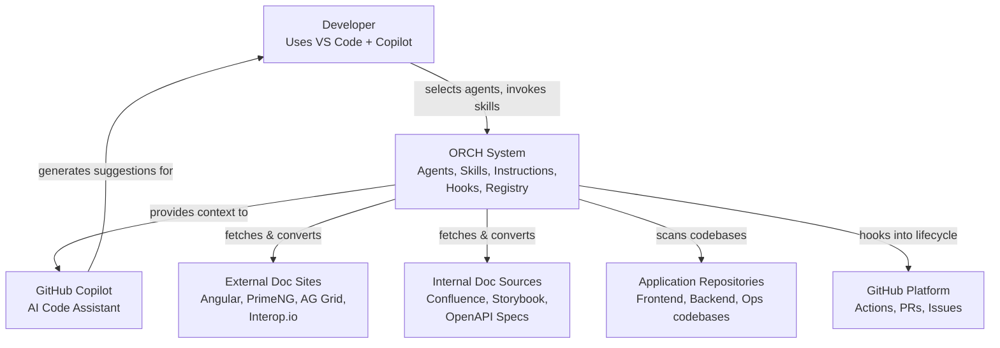

### System boundaries

- **Inside ORCH**: audit framework, agents, skills, instructions, hooks, registry, reference docs
- **Outside ORCH**: Copilot runtime, GitHub platform, external doc sites, application codebases
- **Integration points**: Copilot reads `.github/` files; hooks execute on Copilot lifecycle events; docs agent fetches URLs and reads local files
- **Audit boundary**: Every Copilot lifecycle event is captured. All agent operations produce audit records in `.orch/audit/`

---

## 2. Container Diagram (C4 Level 2)

ORCH is not a running service — it's a collection of configuration files. The "containers" are logical groupings of artifacts.

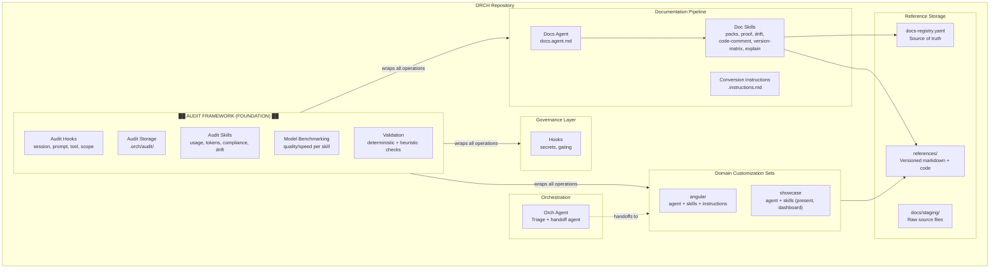

---

## 3. Component Diagram (C4 Level 3)

### 3.1 Documentation Pipeline — Components

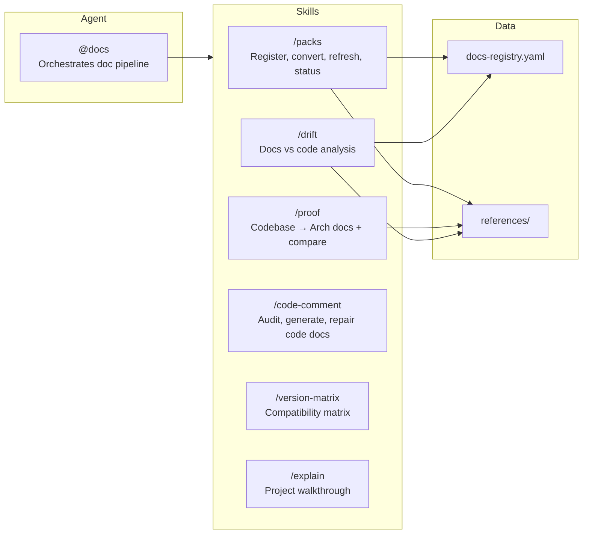

### 3.2 Domain Customization Set — Components (angular example)

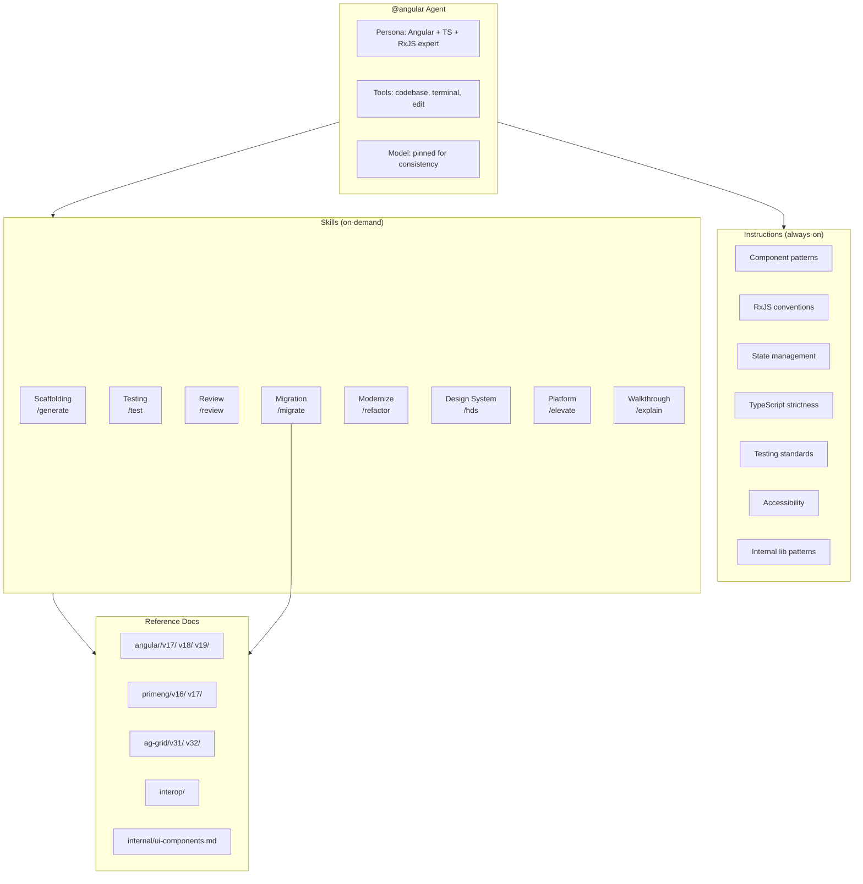

### 3.3 Audit Framework — Components

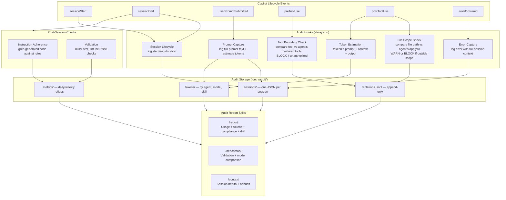

### 3.4 Governance — Components

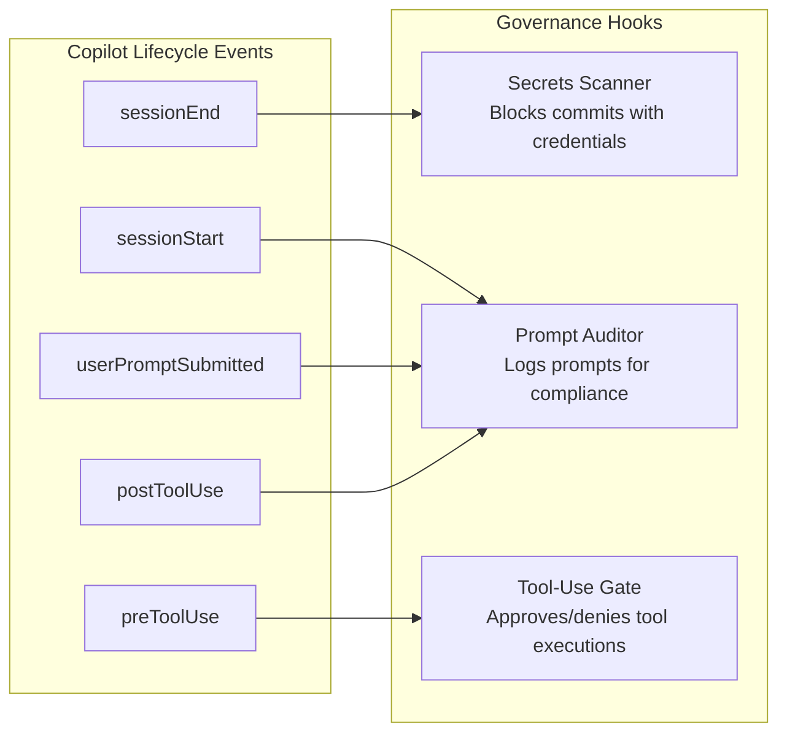

---

## 4. Code Diagram (C4 Level 4)

### 4.1 File Structure

```
vscode-ghcp-agents/
├── marketplace/
│   ├── .github/
│   │   ├── agents/
│   │   │   ├── angular.agent.md            # Angular domain agent
│   │   │   ├── audit.agent.md              # Audit & observability agent
│   │   │   ├── doc-convert-worker.agent.md # Internal doc conversion worker (sub-agent)
│   │   │   ├── docs.agent.md               # Documentation pipeline agent
│   │   │   ├── migrate-worker.agent.md     # Internal migration worker (sub-agent)
│   │   │   ├── orch.agent.md               # Master orchestrator
│   │   │   ├── scan-worker.agent.md        # Internal scanning worker (sub-agent)
│   │   │   └── showcase.agent.md           # Presentations & dashboards agent
│   │   │
│   │   ├── hooks/
│   │   │   ├── audit-lifecycle.json        # sessionStart, sessionEnd, errorOccurred
│   │   │   ├── audit-prompts.json          # userPromptSubmitted
│   │   │   ├── audit-tools.json            # preToolUse — tool boundary enforcement
│   │   │   └── audit-scope.json            # postToolUse — file scope + token estimation
│   │   │
│   │   ├── instructions/
│   │   │   ├── angular-typescript.instructions.md
│   │   │   ├── doc-conversion.instructions.md
│   │   │   └── internal-component-lib.instructions.md
│   │   │
│   │   ├── skill-overrides/
│   │   │   └── README.md
│   │   │
│   │   └── skills/
│   │       ├── benchmark/                  # @audit: model comparison
│   │       │   └── SKILL.md
│   │       ├── code-comment/               # @docs: audit, generate, repair code docs
│   │       │   └── SKILL.md
│   │       ├── context/                    # @audit: session health + handoff
│   │       │   └── SKILL.md
│   │       ├── dashboard/                  # @showcase: metrics dashboard
│   │       │   └── SKILL.md
│   │       ├── drift/                      # @docs: doc-code mismatch
│   │       │   └── SKILL.md
│   │       ├── elevate/                    # @angular: platform services
│   │       │   └── SKILL.md
│   │       ├── explain/                    # @docs + @angular: project walkthrough
│   │       │   ├── SKILL.md
│   │       │   └── references/
│   │       ├── generate/                   # @angular: scaffold components/services
│   │       │   └── SKILL.md
│   │       ├── hds/                        # @angular: design system
│   │       │   └── SKILL.md
│   │       ├── migrate/                    # @angular: upgrade migrations
│   │       │   ├── SKILL.md
│   │       │   └── scripts/angular/
│   │       ├── packs/                      # @docs: register, convert, refresh, status
│   │       │   └── SKILL.md
│   │       ├── present/                    # @showcase: slide decks
│   │       │   ├── SKILL.md
│   │       │   ├── assets/
│   │       │   └── templates/
│   │       ├── proof/                      # @docs: codebase scan + compare
│   │       │   └── SKILL.md
│   │       ├── refactor/                   # @angular: modernize code
│   │       │   └── SKILL.md
│   │       ├── report/                     # @audit: usage + tokens + compliance + drift
│   │       │   └── SKILL.md
│   │       ├── review/                     # @angular: PR review
│   │       │   ├── SKILL.md
│   │       │   └── schemas/
│   │       ├── test/                       # @angular: Jest/Playwright tests
│   │       │   └── SKILL.md
│   │       └── version-matrix/             # @docs: compatibility matrix
│   │           └── SKILL.md
│   │
│   ├── .orch/
│   │   └── audit/
│   │       └── config/
│   │           ├── boundaries.yaml         # Declared tool + scope rules per agent
│   │           └── adherence-rules.yaml    # Instruction rules for programmatic checks
│   │
│   ├── scripts/
│   │   ├── audit/
│   │   │   ├── log-session-start.sh        # sessionStart hook script
│   │   │   ├── log-session-end.sh          # sessionEnd hook script
│   │   │   ├── log-prompt.sh               # userPromptSubmitted hook script
│   │   │   ├── check-tool-boundary.sh      # preToolUse hook script
│   │   │   ├── check-file-scope.sh         # postToolUse hook script
│   │   │   ├── check-adherence.sh          # Post-session instruction adherence check
│   │   │   ├── check-context-health.sh     # Context health monitoring
│   │   │   ├── log-tool-result.sh          # postToolUse logging script
│   │   │   ├── log-error.sh                # errorOccurred hook script
│   │   │   ├── estimate-tokens.py          # Token estimation utility
│   │   │   ├── aggregate-metrics.sh        # Daily/weekly rollup script
│   │   │   ├── update-session-status.sh    # Session state updates
│   │   │   └── notify.sh                   # Notification utility
│   │   └── semantic/
│   │       ├── README.md
│   │       └── adapters/
│   │           ├── registry.yaml
│   │           └── typescript/
│   │               ├── generate-summary.ts
│   │               ├── analyze-migrations.ts
│   │               └── transform.ts
│   │
│   ├── docs-registry.yaml                  # Central registry for all doc sources
│   │
│   └── orch-status-extension/              # VS Code status bar extension
│       ├── package.json
│       └── extension.js
│
├── samples/
│   ├── angular-app/                        # Sample Angular app for testing
│   └── nx-angular-app/                     # Sample Nx Angular workspace for testing
│
├── cli/                                    # CLI tooling
│
├── docs/
│   ├── prd.md                              # Product requirements
│   ├── tech.md                             # This document
│   └── delivery.md                         # Delivery plan
│
└── README.md
```

### 4.2 Registry Schema

```yaml
# docs-registry.yaml
version: 1
sources:
  - id: string                    # unique identifier (kebab-case)
    name: string                  # human-readable name
    type: url | local | scan      # source type
    origin: string                # URL or local file path or repo URL
    format: html | openapi | pdf | confluence | storybook | codebase | jsdoc | tsdoc | compodoc | pydoc | javadoc
    output: string                # path to generated markdown
    scope: string                 # which domain consumes this
    version: string               # library version (for external docs)
    last_refreshed: date | null   # when last converted
    status: current | stale | draft | error
    # For scan type only:
    snapshots:
      - tag: string               # human-readable label
        date: date
        commit: string            # git SHA
        output: string            # path to snapshot output
        summary: string           # one-line summary of findings
    drift_check: date | null      # when drift was last checked
    drift_status: string | null   # summary of drift findings
```

### 4.3 Audit Record Schema

Each session produces a complete audit record:

```json
{
  "session_id": "abc-123",
  "identity": {
    "user": "jane.doe",
    "machine": "dev-laptop-042",
    "repo": "github.com/yourorg/trade-app",
    "branch": "feature/migrate-standalone"
  },
  "timing": {
    "started": "2026-03-18T10:15:00Z",
    "ended": "2026-03-18T10:23:45Z",
    "duration_sec": 525
  },
  "agent": {
    "name": "angular",
    "configured_model": "claude-sonnet-4",
    "declared_tools": ["codebase", "terminal", "edit"],
    "declared_scope": ["**/*.ts", "**/*.html", "**/*.scss"]
  },
  "prompts": [
    {
      "text": "migrate TradeModule components to standalone",
      "timestamp": "2026-03-18T10:15:12Z",
      "estimated_tokens": 12
    }
  ],
  "tools_used": [
    {
      "tool": "codebase",
      "action": "search",
      "timestamp": "2026-03-18T10:15:15Z",
      "allowed": true,
      "duration_ms": 450
    },
    {
      "tool": "edit",
      "file": "src/app/trade/trade.component.ts",
      "timestamp": "2026-03-18T10:16:02Z",
      "allowed": true,
      "in_scope": true,
      "lines_changed": 23
    },
    {
      "tool": "fetch",
      "url": "https://angular.dev/...",
      "timestamp": "2026-03-18T10:17:30Z",
      "allowed": false,
      "blocked": true,
      "violation_id": "v-001"
    }
  ],
  "files": {
    "read": ["src/app/trade/trade.component.ts", "src/app/trade/trade.module.ts"],
    "modified": ["src/app/trade/trade.component.ts"],
    "created": [],
    "deleted": ["src/app/trade/trade.module.ts"],
    "outside_scope": []
  },
  "tokens": {
    "input_estimated": 14200,
    "output_estimated": 6800,
    "total_estimated": 21000,
    "breakdown": {
      "prompts": 850,
      "instructions_context": 2800,
      "references_loaded": 4200,
      "codebase_reads": 6350,
      "generated_output": 6800
    }
  },
  "boundaries": {
    "tool_violations": [{"tool": "fetch", "blocked": true}],
    "scope_violations": [],
    "tools_used_but_not_declared": ["fetch"]
  },
  "adherence": {
    "rules_checked": 6,
    "rules_passed": 5,
    "rules_failed": [{"rule": "no_manual_subscribe", "files": ["trade.component.ts:45"]}],
    "score": 83
  },
  "validation": {
    "build": "pass",
    "test": "pass",
    "lint": "pass",
    "overall_score": 92
  }
}
```

### 4.4 Boundaries Configuration

```yaml
# .orch/audit/config/boundaries.yaml
agents:
  angular:
    allowed_tools:
      - codebase
      - terminal
      - edit
    allowed_scope:
      - "src/**/*.ts"
      - "src/**/*.html"
      - "src/**/*.scss"
      - "src/**/*.spec.ts"
    blocked_commands:
      - "rm -rf"
      - "git push --force"

  docs:
    allowed_tools:
      - codebase
      - terminal
      - fetch
      - edit
    allowed_scope:
      - ".github/references/**"
      - "docs/staging/**"
      - "docs-registry.yaml"
    blocked_commands: []
```

### 4.5 Adherence Rules

```yaml
# .orch/audit/config/adherence-rules.yaml
angular:
  - id: onpush_change_detection
    description: "All components must use OnPush change detection"
    check: "grep -L 'changeDetection.*OnPush' {modified_components}"
    severity: high

  - id: no_manual_subscribe
    description: "No manual .subscribe() calls"
    check: "grep -n '\\.subscribe(' {modified_ts_files}"
    severity: medium

  - id: standalone_components
    description: "All components must be standalone"
    check: "grep -L 'standalone.*true' {modified_components}"
    severity: high

  - id: no_any_type
    description: "No 'any' type annotations"
    check: "grep -n ': any' {modified_ts_files}"
    severity: medium
```

---

## 5. Key Design Decisions

### 5.0 Audit as Foundation Layer

**Decision:** Audit is built first and wraps every operation. No agent, skill, or hook executes without audit capturing a complete record.

**Rationale:** In an enterprise environment, unobserved AI agents are an unacceptable risk. Audit provides: compliance evidence, behavioral drift detection, token cost visibility, boundary enforcement, and data-driven model optimization. Building audit first means every subsequent component is automatically observable.

**Implementation:** Lifecycle hooks capture events → scripts process and log → `.orch/audit/` stores records → report skills surface insights.

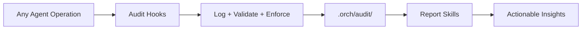

### 5.1 Markdown as Primary Output Format

**Decision:** All reference material consumed by Copilot agents is stored as markdown (with native code files for patterns to mimic).

**Rationale:** Markdown is the most token-efficient text format for LLMs. The same API endpoint description uses ~40 tokens in markdown vs ~120 tokens in OpenAPI YAML. With limited context windows, token efficiency directly impacts suggestion quality.

**Format decision matrix:**

| Content type | Format | Rationale |
|-------------|--------|-----------|
| Information for agent to understand | Markdown | Token-efficient |
| Code for agent to mimic | Native (.ts, .java, .py) | Preserves exact patterns |
| Flows with 3+ interactions | Mermaid in markdown | Fewer tokens than prose, unambiguous |
| Config examples (small) | Native (.yaml, .json) | Fidelity matters |
| Config examples (large) | Markdown table | Token savings |
| Source-embedded docs (JSDoc, TSDoc, Compodoc, PyDoc, Javadoc) | Run generator tool → Markdown tables | Two-step: extract then convert |

### 5.2 YAML Registry over Database

**Decision:** Use a single `docs-registry.yaml` file as the source of truth.

**Rationale:** No infrastructure needed. Version-controlled alongside the artifacts. Human-readable and editable. Supports comments. Sufficient for the expected scale (dozens to low hundreds of sources).

### 5.3 Git History as Architecture Data Source

**Decision:** `/proof` enriches code analysis with git log data (commit frequency, authors, churn, pattern adoption timelines).

**Rationale:** Git history reveals intent (commit messages), ownership (authors), risk (churn), and momentum (adoption timelines) that static code analysis cannot. This data is critical for migration planning and drift explanation.

**Data extracted:**

| Git metric | Command pattern | Use |
|-----------|----------------|-----|
| Last modified per file | `git log -1 --format="%ai"` | Identify dead zones |
| Commit frequency (6mo) | `git log --since="6 months" --oneline` | Identify hotspots |
| Contributors per area | `git shortlog -sn` | Ownership map |
| Churn (adds + deletes) | `git log --numstat` | Risk assessment |
| Pattern adoption timeline | `git log --all --oneline -- *standalone*` | Migration velocity |

### 5.4 Source-Embedded Doc Extraction via Generator Tools

**Decision:** For source-embedded documentation (JSDoc, TSDoc, Compodoc, PyDoc, Javadoc), always run the language-specific generator tool via terminal to produce intermediate output, then convert that output to markdown. Never parse source comments manually.

**Rationale:** Generator tools handle edge cases that manual parsing cannot: inheritance resolution, interface merging, overload detection, generic type expansion, cross-file references, and decorator metadata extraction. The tools already exist and are well-tested. The agent has terminal access, so it can run them directly.

**Two-step pipeline:**

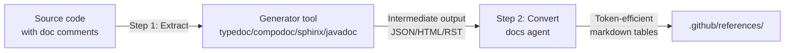

**Tool mapping:**

| Format | Generator tool | Install | Intermediate format |
|--------|---------------|---------|-------------------|
| JSDoc | `jsdoc -X` | `npm install -g jsdoc` | JSON AST |
| TSDoc | `typedoc --json` | `npm install -g typedoc` | JSON |
| Compodoc | `compodoc --exportFormat json` | `npm install -g @compodoc/compodoc` | JSON |
| PyDoc | `sphinx-apidoc` | `pip install sphinx` | RST |
| Javadoc | `javadoc -d` | JDK (pre-installed) | HTML |

**Boundary implications:** The docs agent requires read access to source files (`src/**`, `app/**`, `lib/**`) for extraction. This is read-only — the agent never modifies source code. Write access remains restricted to `.github/references/`, `docs/staging/`, and `docs-registry.yaml`.

### 5.5 No MCP Servers

**Decision:** ORCH does not depend on MCP servers in any phase.


**Rationale:** MCP servers add infrastructure complexity (hosting, auth, availability). The docs agent's fetch + convert pipeline covers external docs. Local file conversion covers internal docs. If MCP is ever needed, it would be a separate initiative.

### 5.6 Controlled Refresh over Auto-Refresh

**Decision:** External docs are only refreshed when a human runs `/packs refresh`. No automated background refresh.

**Rationale:** External doc sites can change structure or content unexpectedly. Controlled refresh ensures a human reviews the updated reference material before it influences Copilot's suggestions. Especially important in enterprise/regulated environments.

### 5.7 Drift Detection Classification

**Decision:** The docs agent classifies drift but never auto-resolves ambiguous cases.

**Rationale:**

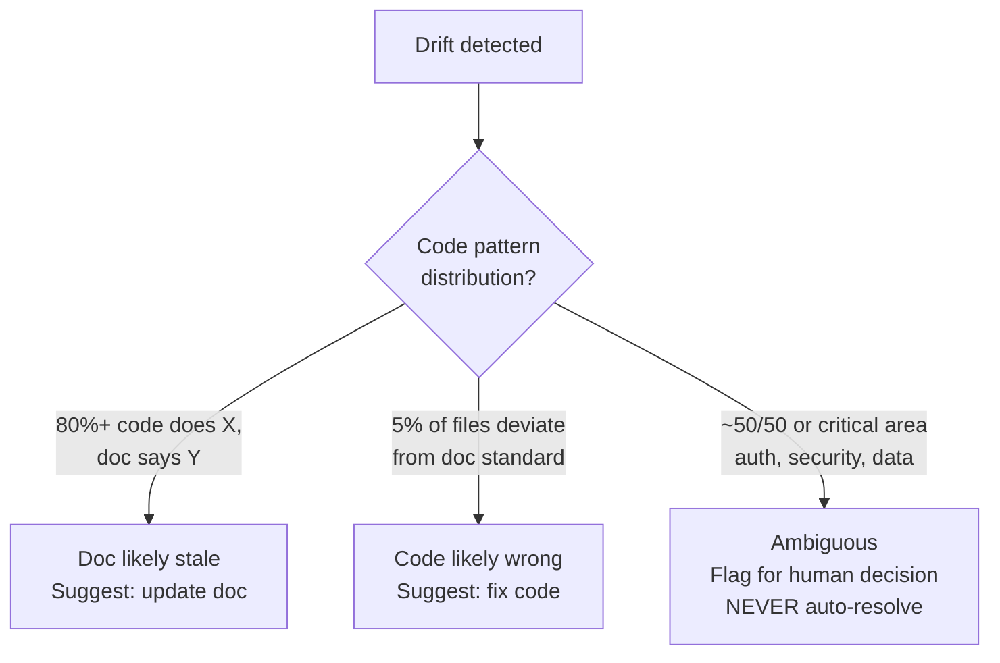

In enterprise environments, auto-resolving drift in areas like auth or data handling is unacceptable risk.

### 5.8 Text-to-Mermaid Conversion Rules

**Decision:** The docs agent converts prose to mermaid diagrams when specific conditions are met.

**Conversion decision flow:**

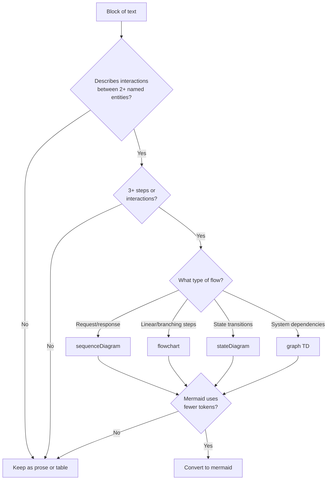

### 5.9 Semantic Analysis via Language Adapters

**Decision:** Use language-specific LST tools (ts-morph for TypeScript, planned: JavaParser for Java, libcst for Python) for codebase analysis and migration transforms. The agent reads semantic summaries; precise transforms are executed by adapter scripts.

**Rationale:** LLMs cannot hold a full LST (millions of nodes) in context. But an LST-derived semantic summary (~2-4K tokens) gives the agent precise type-aware knowledge for planning. And LST-aware transform scripts execute migrations with full type resolution and formatting preservation — dramatically reducing errors compared to agent-based file editing.

**Adapter pattern:** All language adapters implement 4 operations: generate-summary, analyze-imports, analyze-migrations, transform. New languages are added by creating a new adapter directory with these scripts. The /proof and /migrate skills auto-detect the language and use the right adapter via adapters/registry.yaml.

---

## 6. Data Flow

### 6.0 Audit Flow (wraps all other flows)

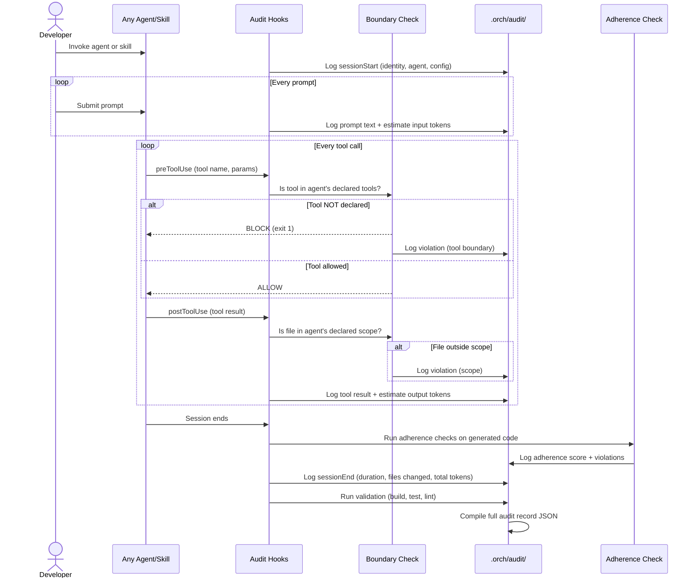

### 6.1 Documentation Conversion Flow

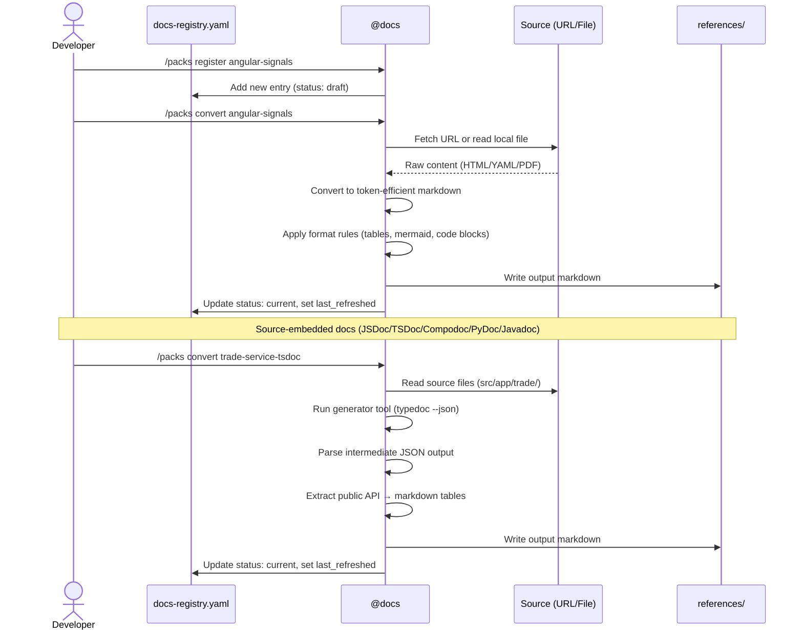

### 6.2 Codebase Scan Flow

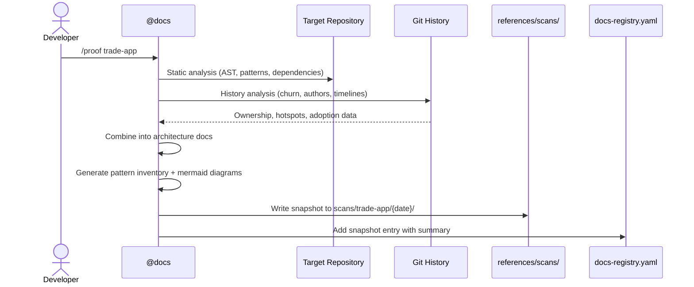

### 6.3 Drift Detection Flow

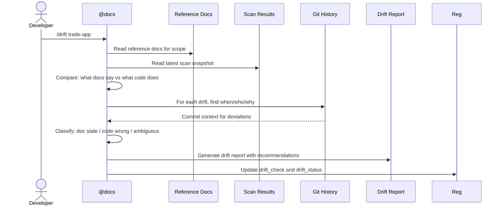

### 6.4 Migration Workflow (end-to-end)

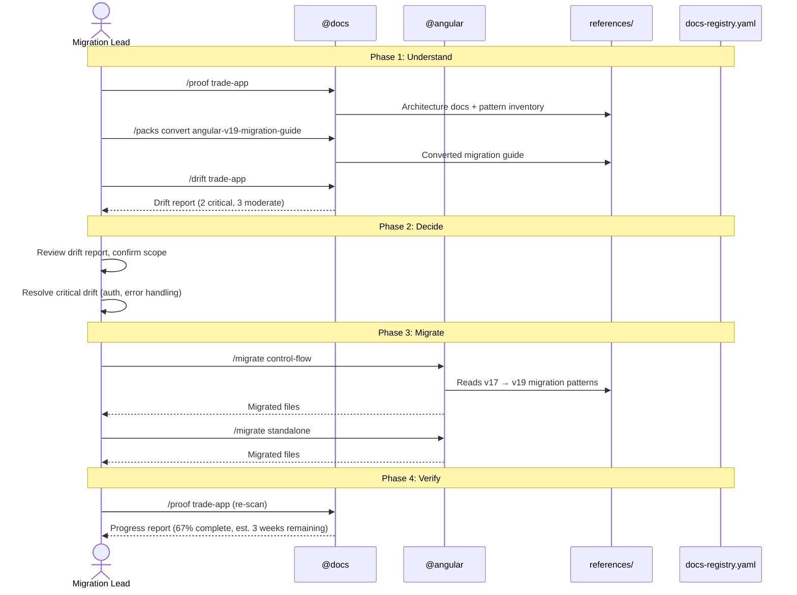

---

## 7. Agent Specifications

### 7.1 Docs Agent

```yaml
# .github/agents/docs.agent.md frontmatter
name: "docs"
description: "Manages all ORCH reference documentation. Handles URLs, local files,
  and source-embedded docs (JSDoc, TSDoc, Compodoc, PyDoc, Javadoc).
  All operations tracked by the ORCH audit framework."
model: claude-sonnet-4
tools:
  - codebase             # read project + source files for doc extraction
  - terminal             # run git commands, doc generator tools (typedoc, compodoc, sphinx, javadoc)
  - fetch                # fetch external URLs
  - edit                 # write converted docs
agents:
  - scan-worker          # delegates /proof scanning to isolated sub-agent
  - doc-convert-worker   # delegates heavy doc conversion to isolated sub-agent
```

Skills: /packs, /proof, /drift, /code-comment, /version-matrix, /explain

### 7.2 Angular Agent

```yaml
# .github/agents/angular.agent.md frontmatter
name: "angular"
description: "Angular, TypeScript, and RxJS expert for enterprise applications.
  Supports Angular v17-v19. Knows @yourorg internal libraries (elevate, elevate-common, hds).
  All operations tracked by the ORCH audit framework."
model: claude-sonnet-4
tools:
  - codebase
  - terminal             # ng CLI, npm, lint, test
  - edit
agents:
  - migrate-worker       # delegates /migrate heavy lifting to isolated sub-agent
```

Skills: /generate, /migrate, /test, /review, /refactor, /hds, /elevate, /explain

### 7.3 Audit Agent

```yaml
# .github/agents/audit.agent.md frontmatter
name: "audit"
description: "ORCH audit and observability agent. Generates usage, token, compliance,
  drift, and benchmark reports. Monitors context health and manages session handoffs."
model: claude-sonnet-4
tools:
  - codebase             # read audit logs and config
  - terminal             # run aggregation and benchmark scripts
```

Skills: /report, /benchmark, /context

### 7.4 Showcase Agent

```yaml
# .github/agents/showcase.agent.md frontmatter
name: "showcase"
description: "Creates polished, org-branded presentations and dashboards from ORCH data.
  Produces HTML slide decks (reveal.js), PPTX, or live dashboards — all styled with
  HDS design tokens."
model: claude-sonnet-4
tools:
  - codebase
  - terminal
  - edit
```

Skills: /present, /dashboard

### 7.5 Orchestrator Agent

```yaml
# .github/agents/orch.agent.md frontmatter
name: "orch"
description: "ORCH master orchestrator. Routes requests to the right domain agent,
  coordinates cross-domain workflows, and synthesizes results."
model: claude-sonnet-4
tools:
  - codebase
agents:
  - angular
  - docs
```

### 7.6 Worker Sub-Agents

Worker sub-agents are internal agents that handle isolated, resource-intensive subtasks. They are not invoked directly by users — parent agents delegate to them.

| Worker | Parent | Purpose |
|--------|--------|---------|
| `scan-worker` | @docs | Isolated codebase scanning for /proof |
| `migrate-worker` | @angular | Isolated migration transforms for /migrate |
| `doc-convert-worker` | @docs | Isolated heavy doc conversion for /packs |

---

## 8. Skill Specifications

### 8.1 Skill Template

All skills follow this structure:

```markdown
# SKILL.md
---
name: skill-name-kebab-case
description: "10-1024 chars. Clear trigger keywords for agent discovery."
---

## Context
What this skill does and when to use it.

## Inputs
What the user provides.

## Steps
1. Imperative instructions the agent follows.
2. Reference specific files: @references/path/to/doc.md
3. Clear output format expectations.

## Output
What the agent produces.

## Validation
How to verify the output is correct.
```

### 8.2 @docs Skills

| Skill | Inputs | Outputs | Validates |
|-------|--------|---------|-----------|
| `/packs` | Subcommands: register, convert, refresh, status. Source id, --scope, --stale | Registry entries, converted markdown in references/, status dashboard. For source-embedded formats (jsdoc, tsdoc, compodoc, pydoc, javadoc): runs generator tool, extracts public API, converts to markdown tables | Entry doesn't duplicate; output under token budget; generator tool exits 0; registry is parseable |
| `/proof` | repo path or URL | Architecture docs + pattern inventory + inline doc coverage inventory in references/scans/. Supports snapshot comparison | Git data is accessible; doc coverage counts match file counts |
| `/drift` | app scan id | Drift report with classifications (doc stale / code wrong / ambiguous) | Reference docs exist for scope |
| `/code-comment` | path, optional --format, --severity, --dry-run | Code doc coverage audit, generated doc comments, repaired doc comments | File counts match filesystem; project compiles; linter passes |
| `/version-matrix` | library or framework name | Compatibility matrix across versions | Versions are valid and current |
| `/explain` | project path or component | Project walkthrough documentation | Output covers structure, patterns, dependencies |

### 8.3 @angular Skills

| Skill | Inputs | Outputs | Validates |
|-------|--------|---------|-----------|
| `/generate` | component/service name, type | Scaffolded .ts, .html, .scss, .spec.ts files | Follows OnPush, standalone patterns; Injectable with proper error handling |
| `/migrate` | file or folder scope, migration type (standalone, signals, control-flow, jest, rxjs) | Migrated files using semantic adapters | Build passes after migration |
| `/test` | file to test | .spec.ts file | TestBed setup, org mocking patterns |
| `/review` | PR diff or file | Structured review comments | Checks anti-patterns list |
| `/refactor` | file or folder | Modernized code | Build passes, tests pass |
| `/hds` | component or pattern query | Design system guidance and code using HDS tokens | Matches current HDS version |
| `/elevate` | service or integration query | Platform service integration patterns | Uses @yourorg/elevate APIs correctly |
| `/explain` | project path or component | Project walkthrough documentation | Output covers structure, patterns, dependencies |

### 8.4 @audit Skills

| Skill | Inputs | Outputs | Purpose |
|-------|--------|---------|---------|
| `/report` | date range, --agent filter | Usage + tokens + compliance + drift combined report | Full audit picture |
| `/benchmark` | session ID or skill name + models | Validation report or model comparison matrix | Quality gate + model optimization |
| `/context` | none | Session health check or compact handoff prompt | Context monitoring + session management |

### 8.5 @showcase Skills

| Skill | Inputs | Outputs | Purpose |
|-------|--------|---------|---------|
| `/present` | topic, --template (intro, architecture, migration, status, custom) | HTML slide deck (reveal.js) or PPTX styled with HDS design tokens | Sprint reviews, architecture reviews, management updates |
| `/dashboard` | metric type or data source | Live metrics dashboard | Ongoing monitoring and reporting |

---

## 9. Instruction Specifications

### 9.1 Instruction Template

```markdown
# .github/instructions/domain-area.instructions.md
---
description: "Clear description of what standards this enforces"
applyTo: "glob pattern for matching files"
---

## Section Name

### Rule
Concrete, specific guidance with examples.

### Do
- Specific pattern to follow (with code example)

### Don't
- Specific anti-pattern to avoid (with code example)
```

### 9.2 Key Instructions

| File | applyTo | Purpose |
|------|---------|---------|
| `doc-conversion.instructions.md` | `**/*.md` (in references/) | Token efficiency rules, format selection, mermaid conversion triggers |
| `angular-typescript.instructions.md` | `**/*.ts, **/*.html, **/*.scss` | Angular component patterns, RxJS, state management, TypeScript strictness |
| `internal-component-lib.instructions.md` | `**/*.ts, **/*.html` | Internal UI library usage patterns |

---

## 10. Hook Specifications

### 10.1 Hook Configuration Template

```json
{
  "version": 1,
  "hooks": {
    "eventName": [
      {
        "type": "command",
        "bash": "./scripts/hook-script.sh",
        "cwd": ".",
        "timeoutSec": 30,
        "env": {}
      }
    ]
  }
}
```

### 10.2 Audit Hooks (Foundation — always active)

| Hook | Events | Script | Action | Exit behavior |
|------|--------|--------|--------|--------------|
| Audit Lifecycle | sessionStart, sessionEnd, errorOccurred | `scripts/audit/log-session-start.sh`, `log-session-end.sh`, `log-error.sh` | Log session identity, timing, file changes, run post-session adherence checks | Always passes (logging only) |
| Audit Prompts | userPromptSubmitted | `scripts/audit/log-prompt.sh` | Log full prompt text, estimate input tokens | Always passes (logging only) |
| Audit Tools | preToolUse | `scripts/audit/check-tool-boundary.sh` | Compare tool against agent's declared tools in boundaries.yaml | **Non-zero blocks unauthorized tools** |
| Audit Scope | postToolUse | `scripts/audit/check-file-scope.sh`, `log-tool-result.sh` | Check file paths against agent's declared scope, log result, estimate tokens | Configurable: warn or block |

### 10.3 Governance Hooks

Note: The current implementation uses the 4 audit hooks listed above. Secrets scanning and tool-use gating are handled within the audit hook framework (specifically `audit-tools.json` for tool boundary enforcement and `audit-scope.json` for file scope checks).

---

## 11. Cross-Cutting Concerns

### 11.1 Security & Audit

- No credentials stored in any ORCH file
- Hooks enforce secrets scanning before commits
- Agent tool access is explicitly declared, enforced at runtime, and audited
- Every tool call, file edit, and prompt is logged
- Boundary violations are blocked and recorded
- Reference docs are reviewed before use (controlled refresh)
- Audit records are immutable (append-only violation log)
- `.orch/audit/` can be shipped to enterprise observability stack (Splunk, ELK, Datadog)

### 11.2 Maintainability

- Registry tracks staleness — nothing silently goes out of date
- One domain per customization set — clear ownership
- Skills are self-contained — no hidden dependencies between skills

### 11.3 Scalability

- File-based architecture scales with git
- New domains added by creating new agent + skills + instructions
- Registry supports unlimited sources
- Plugin packaging enables cross-org distribution in Phase 3

### 11.4 Testing

- Migration skills: always run build + tests after transformation
- Instructions: spot-check Copilot suggestions against expected patterns
- Hooks: test scripts locally before deployment
- Drift detection: compare against known-good baseline
