# ORCH (Orchestra) — Technical Design Document

**Version:** 2.0
**Date:** 2026-03-23
**Status:** Draft

---

## 1. System Context (C4 Level 1)

ORCH operates within the GitHub Copilot ecosystem, providing customizations that shape how Copilot interacts with developers across the organization.

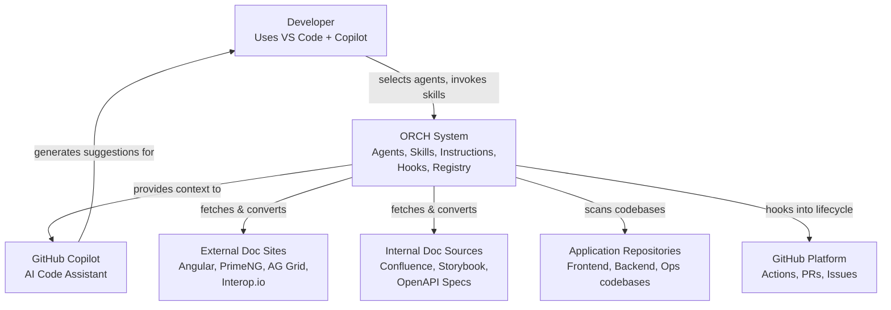

### System boundaries

- **Inside ORCH**: audit framework, agents, skills, instructions, hooks, registry, reference docs
- **Outside ORCH**: Copilot runtime, GitHub platform, external doc sites, application codebases
- **Integration points**: Copilot reads `.github/` files; hooks execute on Copilot lifecycle events; docs agent fetches URLs and reads local files
- **Audit boundary**: Every Copilot lifecycle event is captured. All agent operations produce audit records in `.orch/audit/`

---

## 2. Container Diagram (C4 Level 2)

ORCH is not a running service — it's a collection of configuration files. The "containers" are logical groupings of artifacts.

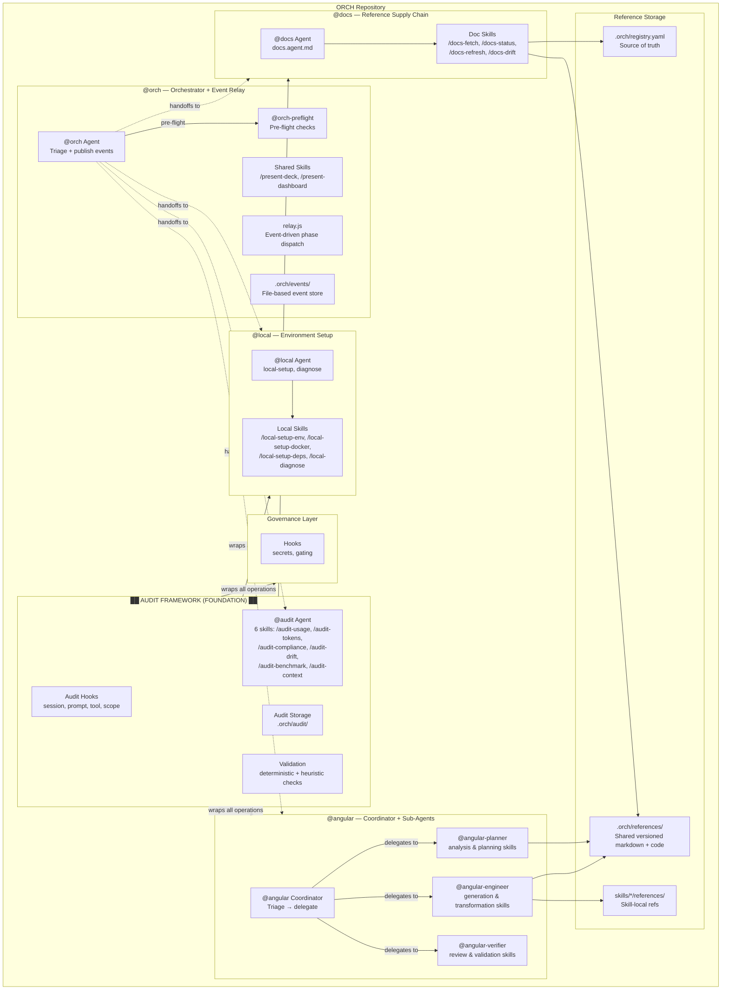

---

## 3. Component Diagram (C4 Level 3)

### 3.1 Documentation Pipeline — Components

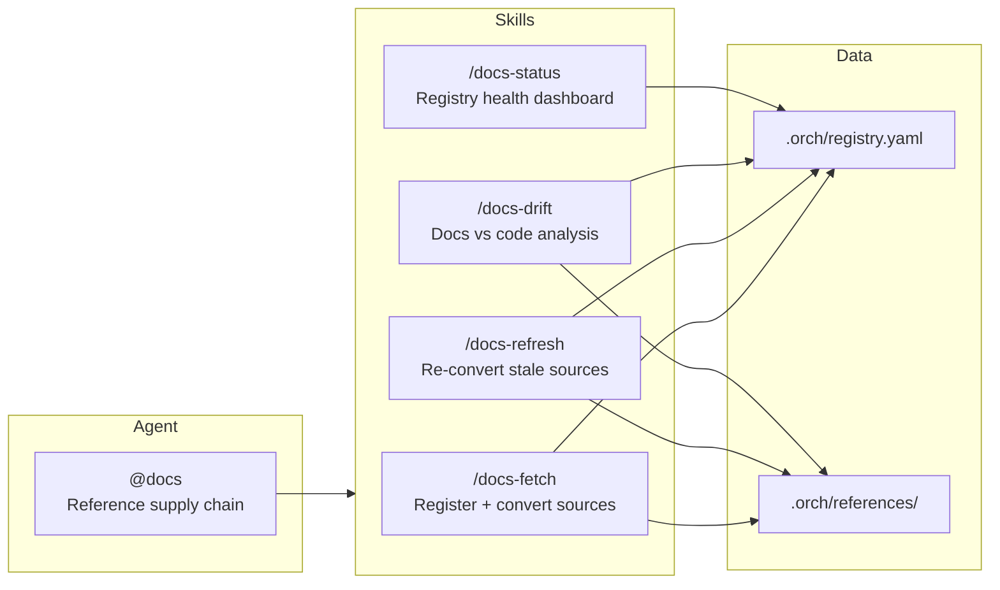

### 3.2 Domain Agent — Components (@angular)

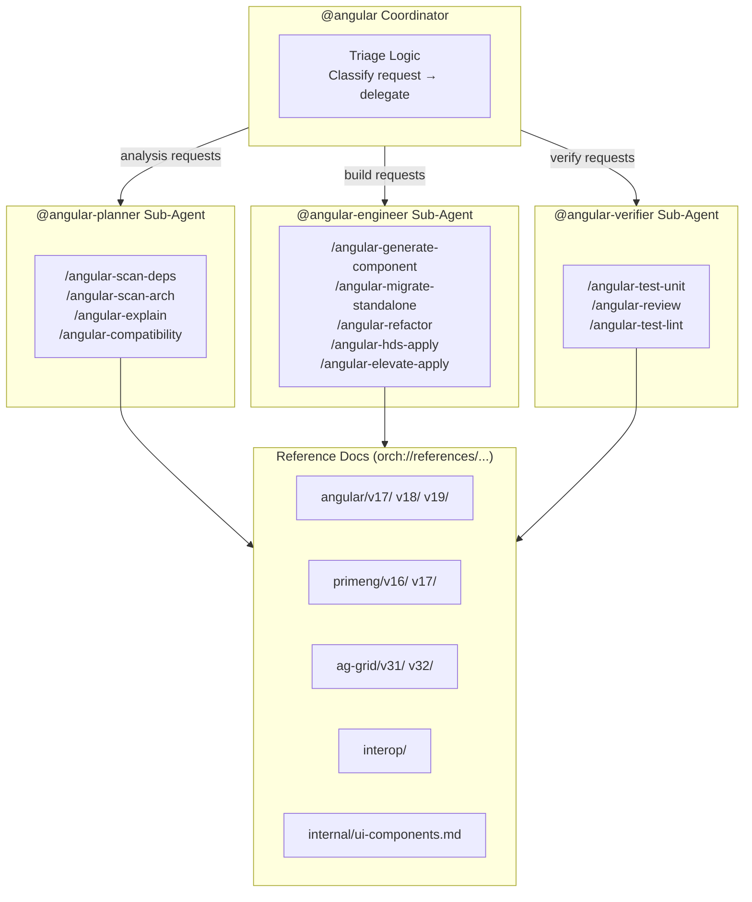

### 3.3 Audit Framework — Components

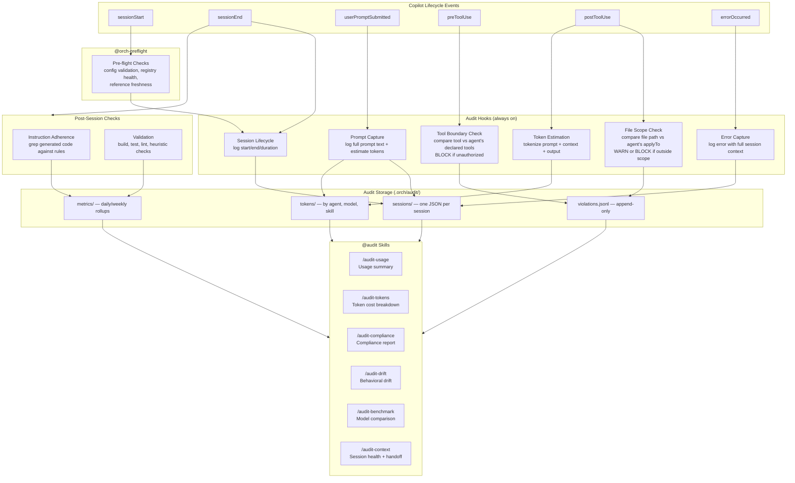

### 3.4 Governance — Components

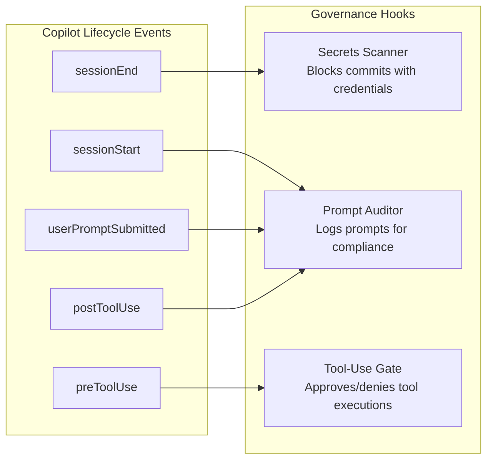

---

## 4. Code Diagram (C4 Level 4)

### 4.1 File Structure

```
vscode-ghcp-agents/
├── marketplace/
│   ├── .github/
│   │   ├── agents/                              (all agent .md files)
│   │   │   ├── angular.agent.md                 # Angular coordinator
│   │   │   ├── angular-planner.agent.md         # Angular planner sub-agent
│   │   │   ├── angular-engineer.agent.md        # Angular engineer sub-agent
│   │   │   ├── angular-verifier.agent.md        # Angular verifier sub-agent
│   │   │   ├── audit.agent.md                   # Audit & observability agent
│   │   │   ├── doc-convert-worker.agent.md      # Internal doc conversion worker (sub-agent)
│   │   │   ├── docs.agent.md                    # Reference supply chain agent
│   │   │   ├── local.agent.md                   # Local environment setup agent
│   │   │   ├── migrate-worker.agent.md          # Internal migration worker (sub-agent under @angular-engineer)
│   │   │   ├── orch.agent.md                    # Master orchestrator
│   │   │   └── orch-preflight.agent.md          # Pre-flight checks sub-agent
│   │   │
│   │   ├── skills/                              (61 skill directories with SKILL.md + local refs)
│   │   │   ├── angular-compatibility/           # @angular-planner: version compatibility
│   │   │   │   └── SKILL.md
│   │   │   ├── angular-docs-api/                # @angular-engineer: API docs
│   │   │   │   └── SKILL.md
│   │   │   ├── angular-docs-audit/              # @angular-verifier: doc coverage scan
│   │   │   │   └── SKILL.md
│   │   │   ├── angular-explain/                 # @angular-planner: architecture walkthrough
│   │   │   │   └── SKILL.md
│   │   │   ├── angular-generate-component/      # @angular-engineer: scaffold components
│   │   │   │   └── SKILL.md
│   │   │   ├── angular-hds-apply/               # @angular-engineer: design system apply
│   │   │   │   └── SKILL.md
│   │   │   ├── angular-migrate-standalone/      # @angular-engineer: NgModule removal
│   │   │   │   └── SKILL.md
│   │   │   ├── angular-migrate-signals/         # @angular-engineer: signals migration
│   │   │   │   └── SKILL.md
│   │   │   ├── angular-refactor/                # @angular-engineer: modernize code
│   │   │   │   └── SKILL.md
│   │   │   ├── angular-review/                  # @angular-verifier: PR review
│   │   │   │   ├── SKILL.md
│   │   │   │   └── references/
│   │   │   ├── angular-scan-deps/               # @angular-planner: dependency analysis
│   │   │   │   └── SKILL.md
│   │   │   ├── angular-test-unit/               # @angular-verifier: Jest tests
│   │   │   │   └── SKILL.md
│   │   │   ├── ...                              # (41 angular + 20 shared skills total)
│   │   │   ├── audit-benchmark/                 # @audit: model comparison
│   │   │   │   └── SKILL.md
│   │   │   ├── audit-compliance/                # @audit: compliance report
│   │   │   │   └── SKILL.md
│   │   │   ├── audit-context/                   # @audit: session health + handoff
│   │   │   │   └── SKILL.md
│   │   │   ├── audit-drift/                     # @audit: behavioral drift
│   │   │   │   └── SKILL.md
│   │   │   ├── audit-tokens/                    # @audit: token cost breakdown
│   │   │   │   └── SKILL.md
│   │   │   ├── audit-usage/                     # @audit: usage summary
│   │   │   │   └── SKILL.md
│   │   │   ├── docs-drift/                      # @docs: doc-code mismatch
│   │   │   │   └── SKILL.md
│   │   │   ├── docs-fetch/                      # @docs: register + convert sources
│   │   │   │   └── SKILL.md
│   │   │   ├── docs-refresh/                    # @docs: re-convert stale sources
│   │   │   │   └── SKILL.md
│   │   │   ├── docs-status/                     # @docs: registry health dashboard
│   │   │   │   └── SKILL.md
│   │   │   ├── local-setup-env/                 # @local: environment setup
│   │   │   │   └── SKILL.md
│   │   │   ├── local-setup-docker/              # @local: Docker + localstack
│   │   │   │   └── SKILL.md
│   │   │   ├── local-setup-deps/                # @local: dependency installation
│   │   │   │   └── SKILL.md
│   │   │   ├── local-diagnose/                  # @local: environment diagnostics
│   │   │   │   └── SKILL.md
│   │   │   ├── present-dashboard/               # @orch shared: metrics dashboard
│   │   │   │   └── SKILL.md
│   │   │   └── present-deck/                    # @orch shared: slide decks
│   │   │       ├── SKILL.md
│   │   │       ├── assets/
│   │   │       └── templates/
│   │   │
│   │   ├── instructions/                        (auto-mode.instructions.md only)
│   │   │   └── auto-mode.instructions.md        # Bridges config.yaml → agent behavior
│   │   │
│   │   ├── hooks/                               (audit hook JSON configs)
│   │   │   ├── audit-lifecycle.json             # sessionStart, sessionEnd, errorOccurred
│   │   │   ├── audit-prompts.json               # userPromptSubmitted
│   │   │   ├── audit-tools.json                 # preToolUse — tool boundary enforcement
│   │   │   └── audit-scope.json                 # postToolUse — file scope + token estimation
│   │   │
│   │   └── copilot-instructions.md              # Global rules: safety, audit, confirmation, models, limits
│   │
│   ├── .orch/
│   │   ├── config/                              (governance config)
│   │   │   ├── boundaries.yaml                  # Declared tool + scope rules per agent
│   │   │   └── adherence-rules.yaml             # Instruction rules for programmatic checks
│   │   ├── references/                          (shared reference docs)
│   │   │   ├── angular/
│   │   │   ├── primeng/
│   │   │   ├── ag-grid/
│   │   │   ├── interop/
│   │   │   └── internal/
│   │   ├── scripts/                             (audit + semantic scripts)
│   │   │   ├── audit/
│   │   │   │   ├── log-session-start.sh
│   │   │   │   ├── log-session-end.sh
│   │   │   │   ├── log-prompt.sh
│   │   │   │   ├── check-tool-boundary.sh
│   │   │   │   ├── check-file-scope.sh
│   │   │   │   ├── check-adherence.sh
│   │   │   │   ├── check-context-health.sh
│   │   │   │   ├── log-tool-result.sh
│   │   │   │   ├── log-error.sh
│   │   │   │   ├── estimate-tokens.py
│   │   │   │   ├── aggregate-metrics.sh
│   │   │   │   ├── update-session-status.sh
│   │   │   │   └── notify.sh
│   │   │   ├── relay/
│   │   │   │   ├── relay.js                     # Terminal relay process
│   │   │   │   ├── publish.js                   # Event publisher
│   │   │   │   ├── event-store.js               # File-based event store
│   │   │   │   ├── monitor.js                   # Event file watcher
│   │   │   │   └── prompt-builder.js            # AI phase prompt constructor
│   │   │   ├── hooks/
│   │   │   │   ├── check-stack.js               # Version-aware stack detection
│   │   │   │   └── resolve-references.js        # Version-filtered reference loading
│   │   │   └── semantic/
│   │   │       ├── README.md
│   │   │       └── adapters/
│   │   │           ├── registry.yaml
│   │   │           └── typescript/
│   │   │               ├── generate-summary.ts
│   │   │               ├── analyze-migrations.ts
│   │   │               └── transform.ts
│   │   ├── runs/                                (audit run output)
│   │   ├── audit/                               (audit record storage)
│   │   ├── events/                              (file-based event store for relay)
│   │   ├── templates/                           (report templates)
│   │   │   ├── migration.hbs
│   │   │   ├── recap.hbs
│   │   │   ├── audit.hbs
│   │   │   └── feature.hbs
│   │   ├── trends/                              (trend snapshots for reports)
│   │   ├── cache/                               (stack detection cache)
│   │   │   └── stack.yaml
│   │   ├── package.json                         # Isolated ORCH deps (ts-morph, json-server)
│   │   ├── node_modules/                        # Isolated from project deps
│   │   ├── config.yaml                          # ORCH runtime config
│   │   └── registry.yaml                        # Central registry for all doc sources
│   │
│   ├── doc-packs/                               (angular.yaml template)
│   │   └── angular.yaml
│   │
│   ├── .vscode/
│   │   └── settings.json                        # Autopilot, terminal auto-approve, edit auto-accept, blocked_commands
│   │
│   └── orch-status-extension/                   # VS Code status bar extension
│       ├── package.json
│       └── extension.js
│
├── cli/                                         # CLI tooling
│
├── docs/
│   ├── prd.md                                   # Product requirements
│   ├── tech.md                                  # This document
│   └── delivery.md                              # Delivery plan
│
└── README.md
```

### 4.2 Registry Schema

```yaml
# .orch/registry.yaml
version: 1
sources:
  - id: string                    # unique identifier (kebab-case)
    name: string                  # human-readable name
    type: url | openapi | pdf | confluence | storybook | codebase | source-embedded
    origin: string                # URL or local file path or repo URL
    output: string                # path to generated markdown
    scope: string                 # which domain consumes this
    version: string               # library version (for external docs)
    managed_by: pack:<name> | user  # who manages this entry
    last_refreshed: date | null   # when last converted
    status: current | stale | draft | error
    # For codebase type only:
    snapshots:
      - tag: string               # human-readable label
        date: date
        commit: string            # git SHA
        output: string            # path to snapshot output
        summary: string           # one-line summary of findings
    drift_check: date | null      # when drift was last checked
    drift_status: string | null   # summary of drift findings
```

### 4.3 Audit Record Schema

Each session produces a complete audit record:

```json
{
  "session_id": "abc-123",
  "identity": {
    "user": "jane.doe",
    "machine": "dev-laptop-042",
    "repo": "github.com/yourorg/trade-app",
    "branch": "feature/migrate-standalone"
  },
  "timing": {
    "started": "2026-03-18T10:15:00Z",
    "ended": "2026-03-18T10:23:45Z",
    "duration_sec": 525
  },
  "agent": {
    "name": "angular",
    "configured_model": "claude-sonnet-4",
    "declared_tools": ["codebase", "terminal", "edit"],
    "declared_scope": ["**/*.ts", "**/*.html", "**/*.scss"]
  },
  "prompts": [
    {
      "text": "migrate TradeModule components to standalone",
      "timestamp": "2026-03-18T10:15:12Z",
      "estimated_tokens": 12
    }
  ],
  "tools_used": [
    {
      "tool": "codebase",
      "action": "search",
      "timestamp": "2026-03-18T10:15:15Z",
      "allowed": true,
      "duration_ms": 450
    },
    {
      "tool": "edit",
      "file": "src/app/trade/trade.component.ts",
      "timestamp": "2026-03-18T10:16:02Z",
      "allowed": true,
      "in_scope": true,
      "lines_changed": 23
    },
    {
      "tool": "fetch",
      "url": "https://angular.dev/...",
      "timestamp": "2026-03-18T10:17:30Z",
      "allowed": false,
      "blocked": true,
      "violation_id": "v-001"
    }
  ],
  "files": {
    "read": ["src/app/trade/trade.component.ts", "src/app/trade/trade.module.ts"],
    "modified": ["src/app/trade/trade.component.ts"],
    "created": [],
    "deleted": ["src/app/trade/trade.module.ts"],
    "outside_scope": []
  },
  "tokens": {
    "input_estimated": 14200,
    "output_estimated": 6800,
    "total_estimated": 21000,
    "breakdown": {
      "prompts": 850,
      "instructions_context": 2800,
      "references_loaded": 4200,
      "codebase_reads": 6350,
      "generated_output": 6800
    }
  },
  "boundaries": {
    "tool_violations": [{"tool": "fetch", "blocked": true}],
    "scope_violations": [],
    "tools_used_but_not_declared": ["fetch"]
  },
  "adherence": {
    "rules_checked": 6,
    "rules_passed": 5,
    "rules_failed": [{"rule": "no_manual_subscribe", "files": ["trade.component.ts:45"]}],
    "score": 83
  },
  "validation": {
    "build": "pass",
    "test": "pass",
    "lint": "pass",
    "overall_score": 92
  }
}
```

### 4.4 Boundaries Configuration

```yaml
# .orch/config/boundaries.yaml
agents:
  angular:
    allowed_tools:
      - codebase
      - terminal
      - edit
    allowed_scope:
      - "src/**/*.ts"
      - "src/**/*.html"
      - "src/**/*.scss"
      - "src/**/*.spec.ts"
    blocked_commands:
      - "rm -rf"
      - "git push --force"

  docs:
    allowed_tools:
      - codebase
      - terminal
      - fetch
      - edit
    allowed_scope:
      - ".orch/references/**"
      - ".orch/registry.yaml"
    blocked_commands: []

  local:
    allowed_tools:
      - codebase
      - terminal
    allowed_scope:
      - ".orch/config.yaml"
      - "docker-compose*.yml"
      - "Dockerfile*"
      - ".env*"
      - "package.json"
      - "pom.xml"
      - "requirements*.txt"
      - "pyproject.toml"
    blocked_commands:
      - "rm -rf"
      - "git push --force"
```

### 4.5 Adherence Rules

```yaml
# .orch/config/adherence-rules.yaml
angular:
  - id: onpush_change_detection
    description: "All components must use OnPush change detection"
    check: "grep -L 'changeDetection.*OnPush' {modified_components}"
    severity: high

  - id: no_manual_subscribe
    description: "No manual .subscribe() calls"
    check: "grep -n '\\.subscribe(' {modified_ts_files}"
    severity: medium

  - id: standalone_components
    description: "All components must be standalone"
    check: "grep -L 'standalone.*true' {modified_components}"
    severity: high

  - id: no_any_type
    description: "No 'any' type annotations"
    check: "grep -n ': any' {modified_ts_files}"
    severity: medium
```

---

## 5. Key Design Decisions

### 5.0 Audit as Foundation Layer

**Decision:** Audit is built first and wraps every operation. No agent, skill, or hook executes without audit capturing a complete record.

**Rationale:** In an enterprise environment, unobserved AI agents are an unacceptable risk. Audit provides: compliance evidence, behavioral drift detection, token cost visibility, boundary enforcement, and data-driven model optimization. Building audit first means every subsequent component is automatically observable.

**Implementation:** Lifecycle hooks capture events -> scripts process and log -> `.orch/audit/` stores records -> audit skills surface insights.

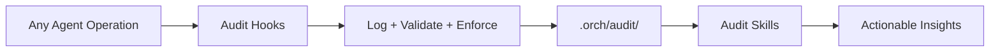

### 5.1 Markdown as Primary Output Format

**Decision:** All reference material consumed by Copilot agents is stored as markdown (with native code files for patterns to mimic).

**Rationale:** Markdown is the most token-efficient text format for LLMs. The same API endpoint description uses ~40 tokens in markdown vs ~120 tokens in OpenAPI YAML. With limited context windows, token efficiency directly impacts suggestion quality.

**Format decision matrix:**

| Content type | Format | Rationale |
|-------------|--------|-----------|
| Information for agent to understand | Markdown | Token-efficient |
| Code for agent to mimic | Native (.ts, .java, .py) | Preserves exact patterns |
| Flows with 3+ interactions | Mermaid in markdown | Fewer tokens than prose, unambiguous |
| Config examples (small) | Native (.yaml, .json) | Fidelity matters |
| Config examples (large) | Markdown table | Token savings |
| Source-embedded docs (JSDoc, TSDoc, Compodoc, PyDoc, Javadoc) | Run generator tool -> Markdown tables | Two-step: extract then convert |

### 5.2 YAML Registry over Database

**Decision:** Use a single `.orch/registry.yaml` file as the source of truth.

**Rationale:** No infrastructure needed. Version-controlled alongside the artifacts. Human-readable and editable. Supports comments. Sufficient for the expected scale (dozens to low hundreds of sources).

### 5.3 Git History as Architecture Data Source

**Decision:** `/docs-drift` and analysis skills enrich code analysis with git log data (commit frequency, authors, churn, pattern adoption timelines).

**Rationale:** Git history reveals intent (commit messages), ownership (authors), risk (churn), and momentum (adoption timelines) that static code analysis cannot. This data is critical for migration planning and drift explanation.

**Data extracted:**

| Git metric | Command pattern | Use |
|-----------|----------------|-----|
| Last modified per file | `git log -1 --format="%ai"` | Identify dead zones |
| Commit frequency (6mo) | `git log --since="6 months" --oneline` | Identify hotspots |
| Contributors per area | `git shortlog -sn` | Ownership map |
| Churn (adds + deletes) | `git log --numstat` | Risk assessment |
| Pattern adoption timeline | `git log --all --oneline -- *standalone*` | Migration velocity |

### 5.4 Source-Embedded Doc Extraction via Generator Tools

**Decision:** For source-embedded documentation (JSDoc, TSDoc, Compodoc, PyDoc, Javadoc), always run the language-specific generator tool via terminal to produce intermediate output, then convert that output to markdown. Never parse source comments manually.

**Rationale:** Generator tools handle edge cases that manual parsing cannot: inheritance resolution, interface merging, overload detection, generic type expansion, cross-file references, and decorator metadata extraction. The tools already exist and are well-tested. The agent has terminal access, so it can run them directly.

**Two-step pipeline:**

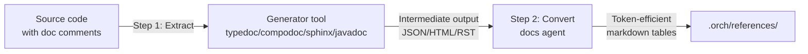

**Tool mapping:**

| Format | Generator tool | Install | Intermediate format |
|--------|---------------|---------|-------------------|
| JSDoc | `jsdoc -X` | `npm install -g jsdoc` | JSON AST |
| TSDoc | `typedoc --json` | `npm install -g typedoc` | JSON |
| Compodoc | `compodoc --exportFormat json` | `npm install -g @compodoc/compodoc` | JSON |
| PyDoc | `sphinx-apidoc` | `pip install sphinx` | RST |
| Javadoc | `javadoc -d` | JDK (pre-installed) | HTML |

**Boundary implications:** The docs agent requires read access to source files (`src/**`, `app/**`, `lib/**`) for extraction. This is read-only — the agent never modifies source code. Write access remains restricted to `.orch/references/` and `.orch/registry.yaml`.

### 5.5 No MCP Servers

**Decision:** ORCH does not depend on MCP servers in any phase.


**Rationale:** MCP servers add infrastructure complexity (hosting, auth, availability). The docs agent's fetch + convert pipeline covers external docs. Local file conversion covers internal docs. If MCP is ever needed, it would be a separate initiative.

### 5.6 Controlled Refresh over Auto-Refresh

**Decision:** External docs are only refreshed when a human runs `/docs-refresh`. No automated background refresh.

**Rationale:** External doc sites can change structure or content unexpectedly. Controlled refresh ensures a human reviews the updated reference material before it influences Copilot's suggestions. Especially important in enterprise/regulated environments.

### 5.7 Drift Detection Classification

**Decision:** The docs agent classifies drift but never auto-resolves ambiguous cases.

**Rationale:**

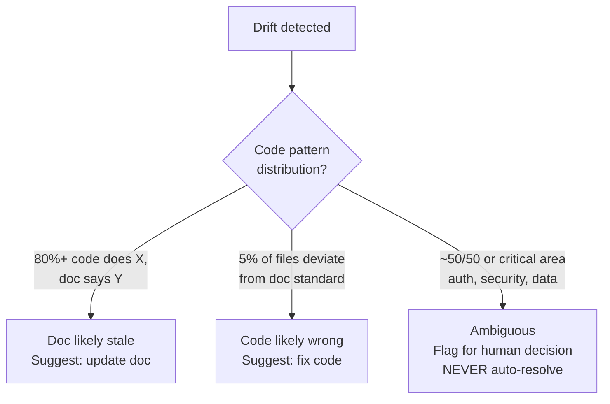

In enterprise environments, auto-resolving drift in areas like auth or data handling is unacceptable risk.

### 5.8 Text-to-Mermaid Conversion Rules

**Decision:** The docs agent converts prose to mermaid diagrams when specific conditions are met.

**Conversion decision flow:**

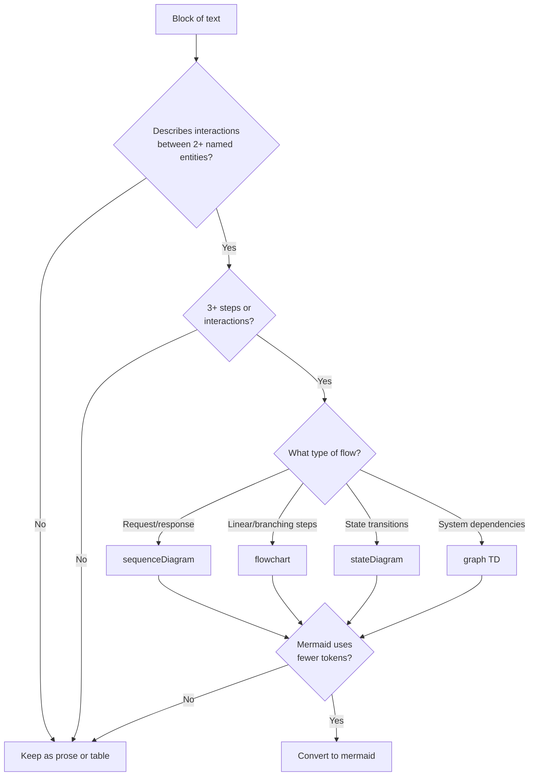

### 5.9 Semantic Analysis via Language Adapters

**Decision:** Use language-specific LST tools (ts-morph for TypeScript, planned: JavaParser for Java, libcst for Python) for codebase analysis and migration transforms. The agent reads semantic summaries; precise transforms are executed by adapter scripts.

**Rationale:** LLMs cannot hold a full LST (millions of nodes) in context. But an LST-derived semantic summary (~2-4K tokens) gives the agent precise type-aware knowledge for planning. And LST-aware transform scripts execute migrations with full type resolution and formatting preservation — dramatically reducing errors compared to agent-based file editing.

**Adapter pattern:** All language adapters implement 4 operations: generate-summary, analyze-imports, analyze-migrations, transform. New languages are added by creating a new adapter directory with these scripts. The /angular-analyze and /angular-migrate skills auto-detect the language and use the right adapter via adapters/registry.yaml.

### 5.10 Role-Based Sub-Agents for Domain Agents

**Decision:** Domain agents (e.g., @angular) use a coordinator pattern with role-based sub-agents: planner, engineer, verifier.

**Rationale:** Each role has a distinct persona, toolset, and context window budget. A planner needs broad codebase read access but no edit tools. An engineer needs edit + terminal but only for scoped files. A verifier needs read + terminal (test/lint) but no edit. Splitting roles prevents context pollution (migration plan tokens don't crowd out code generation tokens) and enables precise boundary enforcement per role.

```mermaid
flowchart LR
    R[User Request] --> C[@angular Coordinator]
    C -->|"What needs doing?"| P[@angular-planner]
    C -->|"Build it"| E[@angular-engineer]
    C -->|"Verify it"| V[@angular-verifier]
```

### 5.11 Domain-Specific Granular Skills

**Decision:** Skills are prefixed with their domain name and are granular (e.g., `/angular-generate`, `/angular-migrate`, `/audit-usage`), not generic (e.g., `/generate`, `/report`).

**Rationale:** Domain-prefixed skills eliminate ambiguity when multiple agents could handle a request. They make triage trivial: the skill name itself declares which agent owns it. They also enable fine-grained audit tracking — token costs and compliance scores are attributable to a specific domain + action combination.

### 5.12 Hybrid Reference Model

**Decision:** Reference docs live in two locations: shared `.orch/references/` for cross-agent consumption, and `skills/*/references/` for skill-local context.

**Rationale:** Some references (e.g., Angular v19 migration guide) are consumed by multiple skills across planner, engineer, and verifier. These live in `.orch/references/` and are addressed via `orch://references/angular/v19/...`. Other references (e.g., review checklist schemas) are only relevant to a single skill. These live alongside the SKILL.md to keep the skill self-contained. Skills declare their dependencies via a `references:` field in SKILL.md.

### 5.13 Pre-Flight Checks via @orch-preflight

**Decision:** Before routing a request to any domain agent, @orch invokes @orch-preflight to validate system readiness.

**Rationale:** Pre-flight catches configuration errors, stale references, missing registry entries, and boundary misconfigurations before they cause mid-session failures. This is cheaper (in tokens and developer time) than failing halfway through a migration. Pre-flight runs as a sub-agent so its checks are themselves audited.

```mermaid
flowchart LR
    U[User Request] --> O[@orch]
    O --> PF[@orch-preflight]
    PF -->|pass| D[Route to domain agent]
    PF -->|fail| E[Report issues to user]
```

### 5.14 Three-Level Rule Cascade

**Decision:** Rules apply in a 3-level cascade: global -> domain -> skill. More specific rules override less specific ones.

**Rationale:** Global rules (safety, audit, confirmation prompts) apply everywhere. Domain rules (Angular patterns, TypeScript strictness) apply to all skills within that domain. Skill rules (migration-specific constraints) apply only during that skill's execution. This avoids duplication while allowing targeted overrides.

| Level | Source | Example |
|-------|--------|---------|
| Global | `.github/copilot-instructions.md` | "Always confirm before deleting files" |
| Domain | Agent `.md` persona section | "Use OnPush change detection" |
| Skill | SKILL.md steps section | "For signal migration, preserve existing tests" |

### 5.15 Presentation as Shared Skills, Not Dedicated Agent

**Decision:** Presentation capabilities (/present-deck, /present-dashboard) are shared skills owned by @orch, not a dedicated @showcase agent.

**Rationale:** A dedicated agent for 2 skills is over-engineered. Presentation skills need cross-domain data access (audit metrics, migration progress, doc coverage) which @orch already has via its handoff relationships. Shared skills avoid the overhead of another agent persona, tool declaration, and boundary configuration. If presentation grows to 5+ skills, re-evaluate.

### 5.16 Event-Driven Relay Architecture

**Decision:** Workflows execute via a file-based event system with a terminal relay process, not synchronous agent chains.

**Rationale:** Copilot Chat sessions are stateless and have limited context windows. Running a 10-phase migration inside a single agent session causes context rot. The event-driven relay decouples phases: the coordinator publishes events describing each phase, the relay process dispatches them one at a time, and each phase runs in a fresh context.

**Key components:**

| Component | File | Purpose |
|-----------|------|---------|
| **Event Store** | `event-store.js` | Append-only file-based store in `.orch/events/`. Publishes, reads, and acknowledges events. |
| **Publisher** | `publish.js` | The coordinator uses this to emit phase events with metadata (agent, skill, arguments, phase number). |
| **Relay** | `relay.js` | Terminal-resident process that monitors the event store. Dispatches script phases automatically. Dispatches AI phases via `code chat --mode agent` (VS Code 1.112+). Pauses before AI phases for approval in safe mode. |
| **Monitor** | `monitor.js` | Watches `.orch/events/` for new events, triggers relay actions. |
| **Prompt Builder** | `prompt-builder.js` | Constructs the prompt for each AI phase, injecting phase context, prior results, and relevant references. |

**Execution flow:**

How the event-driven workflow execution maps to traditional event-driven concepts — using only the filesystem. No databases, no Kafka, no APIs.

```
USER: "@angular recap this project --auto"
         │
         ▼
┌─ PLAN ────────────────────────────────────────────────┐
│ Hook: workflow-trigger.sh intercepts the message       │
│ Runs: publish.js reads angular-project-recap.yaml      │
│ Creates: 11 event files (the plan)                     │
│ Location: .orch/workflow-state/events/run-xxx/         │
│   001.event.json  { status: "ready" }                  │
│   002.event.json  { status: "ready" }                  │
│   ...                                                  │
│   010.event.json  { status: "queued", depends_on:[...]}│
│   manifest.json   { status: "running" }                │
└──────────────────┬────────────────────────────────────┘
                   │
                   ▼
┌─ OUTBOUND STORE ──────────────────────────────────────┐
│ = The event files on disk                              │
│ Each .event.json IS a queue entry                      │
│ Status field is the queue position:                    │
│   "ready"    = in the queue, waiting for pickup        │
│   "queued"   = not yet eligible (deps not met)         │
│   "running"  = picked up by relay                      │
│   "complete" = done                                    │
│                                                        │
│ Also: active-run.json = pointer to current run         │
└──────────────────┬────────────────────────────────────┘
                   │
                   ▼
┌─ RELAY (polls every 5s) ──────────────────────────────┐
│ = relay.js (background terminal process)               │
│                                                        │
│ Every 5 seconds:                                       │
│   1. Read all .event.json files                        │
│   2. Check .complete.json markers (AI done?)           │
│   3. Resolve deps: queued → ready (when deps met)      │
│   4. Dispatch ready events:                            │
│      - Script: spawn child process                     │
│      - AI: code chat --mode agent                      │
│   5. Handle failures: retry / rollback / skip          │
│   6. Check: all done? → trigger report                 │
└──────────────────┬────────────────────────────────────┘
                   │
                   ▼
┌─ QUEUE (the "ready" events) ──────────────────────────┐
│ = Events with status "ready" in .event.json            │
│ The relay picks them up on each poll cycle              │
│                                                        │
│ Script events:  relay spawns node process directly     │
│ AI events:      relay runs code chat --mode agent      │
│                                                        │
│ Concurrency: 4 scripts parallel, 1 AI at a time       │
└──────────────────┬────────────────────────────────────┘
                   │
                   ▼
┌─ CONSUMERS (skills/scripts) ──────────────────────────┐
│ Script: node scan-deps.js → writes .output.json        │
│ AI:     code chat @angular → writes .complete.json     │
│                                                        │
│ Each consumer:                                         │
│   1. Reads its event context                           │
│   2. Does the work                                     │
│   3. Writes result (.output.json or .complete.json)    │
│   4. Dies (no persistent state)                        │
└──────────────────┬────────────────────────────────────┘
                   │
                   ▼
┌─ STATUS UPDATE ───────────────────────────────────────┐
│ Relay detects .output.json or .complete.json           │
│ Updates .event.json: status "running" → "complete"     │
│ Resolves dependents: queued → ready                    │
│ Writes legacy .orch/workflow-state/{name}.yaml         │
│                                                        │
│ When ALL events terminal:                              │
│   → monitor.js collects all phase outputs              │
│   → recap-report-builder.js generates HTML report      │
│   → Git tag applied                                    │
│   → active-run.json cleared                            │
│   → Relay exits                                        │
└───────────────────────────────────────────────────────┘
```

**Concept Mapping** 

| Event-driven concept | Our implementation | File/Location |
|---------------------|-------------------|---------------|
| **Plan** | publish.js creates event files from workflow YAML | `.event.json` files in run directory |
| **Outbound store** | The events directory on disk | `.orch/workflow-state/events/run-xxx/` |
| **Relay** | relay.js polls every 5s | Background terminal process |
| **Queue** | Events with `status: "ready"` | `.event.json` status field |
| **Consumer** | Scripts (node) or AI (code chat) | Child processes / Copilot Chat sessions |
| **Status update** | Relay reads .output.json/.complete.json, updates .event.json | File writes |
| **Monitor** | monitor.js checks if all events are terminal | Part of relay poll loop |
| **Report** | Dedicated builder reads all outputs | `.orch/reports/*.html` |

** Event Lifecycle ** 

```
created → queued → ready → running → complete
                                   → failed → retrying → ready (retry)
                                             → dead (max retries)
                → skipped (dependency failed + on-failure: continue)
```

**Files Per Event** 

Each phase produces a set of files in the run directory:

| File | Written by | Purpose |
|------|-----------|---------|
| `{id}.event.json` | publish.js (created), relay.js (updated) | Event state, identity, dependencies, result |
| `{id}.prompt.md` | prompt-builder.js | AI phase instructions (lazy loading, focused context) |
| `{id}.output.json` | relay.js (captures script stdout) | Script phase output data |
| `{id}.complete.json` | AI agent (writes when done) | AI phase completion marker + collected data |
| `manifest.json` | publish.js (created), monitor.js (updated) | Workflow-level metadata, final status |
| `collected-all.json` | monitor.js | Aggregated data from all phases (for report) |
| `active-run.json` | publish.js (created), monitor.js (cleared) | Pointer to the active run (at workflow-state/ level) |

**How Each Actor Works** 

**Publisher (publish.js)** 

Reads a workflow YAML → creates one `.event.json` per phase → sets dependencies → marks initial phases as "ready" → writes manifest + active-run pointer.

```bash
node .orch/scripts/relay/publish.js .orch/workflows/angular-project-recap.yaml '{"to":"21"}'
```

Can also be invoked by compose-plan.js for dynamic (non-YAML) plans.

**Relay (relay.js)** 

Runs as a background process. Polls every 5 seconds. Dispatches ready events. Detects completion. Advances the workflow.

```bash
node .orch/scripts/relay/relay.js         # safe mode (pauses for AI phases)
node .orch/scripts/relay/relay.js --auto  # auto mode (dispatches everything)
```

**Safe mode (default):** Script phases auto-dispatch. AI phases pause with `status: "awaiting-approval"`. User approves via `@angular approve` or `@angular approve-all`.

**Auto mode:** Everything dispatches automatically. AI phases sent to Copilot Chat via `code chat --mode agent --reuse-window`.

**Script Consumer** 

The relay spawns the script as a child process:
```
relay → spawn('node', ['scan-deps.js', projectRoot])
     → captures stdout as JSON
     → writes to {id}.output.json
     → updates event status to "complete"
```

Script has zero awareness of the event system. It reads the project, outputs JSON. The relay wraps it.

**AI Consumer** 

The relay triggers Copilot Chat:
```
relay → code chat --mode agent --reuse-window --add-file {id}.prompt.md "@angular ..."
     → AI reads prompt, executes skill, writes files
     → AI writes {id}.complete.json (completion protocol in the prompt)
     → relay detects marker on next poll, updates event status
```

The AI's only contract: write a `.complete.json` file when done.

**Monitor (monitor.js)** 

Called by the relay when all events reach a terminal state (complete, dead, skipped):
1. Reads all `.output.json` and `.complete.json` files
2. Aggregates into `collected-all.json`
3. Routes to the appropriate report builder (recap, migrate, create, docs, local)
4. Writes HTML report to `.orch/reports/`
5. Applies git tag
6. Clears `active-run.json`

**Hook-Based Trigger** 

The workflow is triggered BEFORE the LLM processes the user's message, via a `userPromptSubmitted` hook:

```
User types: "@angular recap this project --auto"
  ↓
Hook: workflow-trigger.sh
  → Reads prompt from stdin JSON
  → Matches "recap" against trigger patterns
  → Runs publish.js (creates events)
  → Starts relay.js in background
  → Outputs additionalContext: "workflow running, don't redo analysis"
  ↓
LLM sees: original message + "ORCH WORKFLOW TRIGGERED"
LLM responds: "Workflow published. Relay running."
  ↓
Relay handles everything from here.
```

This removes the LLM from the trigger decision. The hook is deterministic (regex match), not probabilistic (LLM instruction following).

**Failure Handling** 

Each event's `on_failure` field determines what happens when it fails after max retries:

| Strategy | Behavior |
|----------|----------|
| `stop` | Halt all remaining events. Workflow fails. |
| `pause` | Mark as `awaiting-approval`. User decides. |
| `rollback-to-checkpoint` | Git reset to previous checkpoint tag, then pause. |
| `continue` | Skip this event. Dependents still proceed. |
| `report-as-partial` | Skip and mark report as partial. |

**Parallel Execution** 

Events with empty `depends_on: []` start as "ready" simultaneously. The relay dispatches up to 4 script events in parallel. AI events are sequential (1 at a time — Copilot Chat is single-threaded).

Example: recap workflow has 9 scan phases with `depends_on: []`. All 9 become "ready" at publish time. The relay runs 4 scripts at a time, completing all 9 in ~3 batches instead of 9 sequential runs.

**Safe by Default** 

```
Default (safe mode):
  Script phases → auto (relay runs them)
  AI phases    → pause (user reviews prompt, types @angular approve)

With --auto flag:
  Script phases → auto
  AI phases    → auto (relay sends to Copilot Chat via code chat)

Mid-workflow upgrade:
  @angular approve-all → switches to auto for remaining phases
```

**Report Generation** 

When the workflow completes, the monitor routes to a dedicated report builder based on workflow type:

| Workflow | Builder | Output |
|----------|---------|--------|
| `angular-project-recap` | `recap-report-builder.js` | Styled HTML with 13 sections, Mermaid diagrams, KPIs |
| `angular-migration` | `migrate-report-builder.js` | Before/after comparison, phase timeline, compatibility |
| `angular-new-feature` | `create-report-builder.js` | Files created, architecture impact, test coverage |
| docs audit | `docs-report-builder.js` | Registry status, staleness, drift |
| local setup | `local-report-builder.js` | Platform, runtimes, Docker, ports |

Each builder reads phase `.output.json` files and generates a self-contained HTML report with inlined CSS (HDS oklch tokens), Mermaid CDN for diagrams, and print-friendly styles.

**Directory Layout** 

```
.orch/
  workflow-state/
    active-run.json                         # pointer to current run
    events/
      run-2026-03-26T18-56-52Z/            # one directory per run
        manifest.json                       # workflow metadata
        001.event.json                      # phase 1 state
        001.output.json                     # phase 1 script output
        002.event.json                      # phase 2 state
        002.prompt.md                       # phase 2 AI prompt
        002.complete.json                   # phase 2 AI completion
        ...
        collected-all.json                  # aggregated (written by monitor)
  reports/
    angular-project-recap-report.html       # generated report
  scripts/
    relay/
      publish.js                            # YAML → events (publisher)
      relay.js                              # poll loop (dispatcher)
      event-store.js                        # atomic read/write
      monitor.js                            # completion + report trigger
      prompt-builder.js                     # AI prompt assembly
      recap-report-builder.js               # HTML report generator
      migrate-report-builder.js
      create-report-builder.js
      docs-report-builder.js
      local-report-builder.js
      compose-plan.js                       # dynamic plan composer
    hooks/
      workflow-trigger.sh                   # userPromptSubmitted hook
    detect-domains.js                       # project stack detection
    detect-elevate.js                       # elevate lib detection
  hooks/
    check-stack.js                          # version-aware stack detection
    resolve-references.js                   # reference doc resolution
    track-trends.js                         # report trend tracking
```

### 5.17 Version-Aware Stack Resolution

**Decision:** Auto-detect the project's tech stack on session start and cache the result. Use version gates in `resolver.yaml` to filter features and reference docs by detected version.

**Rationale:** Loading Angular 19 signal docs for a v17 project wastes ~50% of reference tokens. Version-aware filtering ensures agents only see relevant patterns and documentation.

**Components:**

| Component | File | Purpose |
|-----------|------|---------|
| **Stack Hook** | `check-stack.js` | Runs on `sessionStart`. Computes SHA-256 fingerprint over `package.json`, `angular.json`, `nx.json`, `tsconfig.json`. Cascade: cache -> detect -> pin -> default. Completes in <5 ms. |
| **Resolver** | `.orch/references/angular/resolver.yaml` | Maps features to version gates. Each entry declares `available` (>=N) and `recommended` (>=M) versions. |
| **Reference Resolver** | `resolve-references.js` | Reads stack profile + resolver.yaml, returns filtered list of reference doc paths for the detected version. |
| **Stack Profile** | `.orch/cache/stack.yaml` | Cached detection result: Angular version, TypeScript version, installed libraries, workspace type. |

### 5.18 Report Template System

**Decision:** Report generation uses templates stored in `.orch/templates/`, with trend snapshot support for tracking metrics over time.

**Rationale:** Standardized templates ensure consistent report structure across workflows. Trend snapshots enable comparing metrics across runs (e.g., migration progress, quality scores, coverage improvements).

**Templates (4):**

| Template | Purpose |
|----------|---------|
| `migration.hbs` | Migration workflow report: phase timelines, before/after metrics, risk items, rollback points |
| `recap.hbs` | Project recap report: architecture, dependencies, quality, tests, coverage |
| `audit.hbs` | Audit summary: token consumption, compliance scores, boundary violations |
| `feature.hbs` | Feature creation report: C4 diagrams, code highlights, test coverage, HDS compliance |

**Trend tracking:** Each report run captures a trend snapshot in `.orch/trends/`. Subsequent reports include trend arrows (up/down/flat) comparing current metrics to the previous snapshot.

### 5.19 Comprehensive Boundary Enforcement

**Decision:** Two-layer boundary system: hard enforcement via VS Code settings and soft enforcement via ORCH boundaries.yaml.

**Rationale:** Hard enforcement (`blocked_commands` in `.vscode/settings.json`) is enforced by VS Code itself and cannot be bypassed by the agent. Soft enforcement (`boundaries.yaml`) is enforced by ORCH audit hooks and produces warnings/violations in the audit log. The two layers provide defense in depth.

| Layer | File | Enforcement | Examples |
|-------|------|-------------|----------|
| Hard | `.vscode/settings.json` | VS Code blocks command execution | `rm -rf`, `git push --force`, `DROP TABLE` |
| Soft | `.orch/config/boundaries.yaml` | ORCH audit hooks log violations | Tool boundary (agent used undeclared tool), file scope (agent touched out-of-scope files) |

### 5.20 Isolated ORCH Dependencies

**Decision:** ORCH runtime dependencies (ts-morph, json-server) are installed in `.orch/node_modules/` via `.orch/package.json`, isolated from the project's `node_modules/`.

**Rationale:** ORCH tools should not pollute the project's dependency tree or create version conflicts. The isolated `node_modules` ensures ORCH can use whatever tool versions it needs without affecting the project's `package.json` or lockfile.

---

## 6. Data Flow

### 6.0 Audit Flow (wraps all other flows)

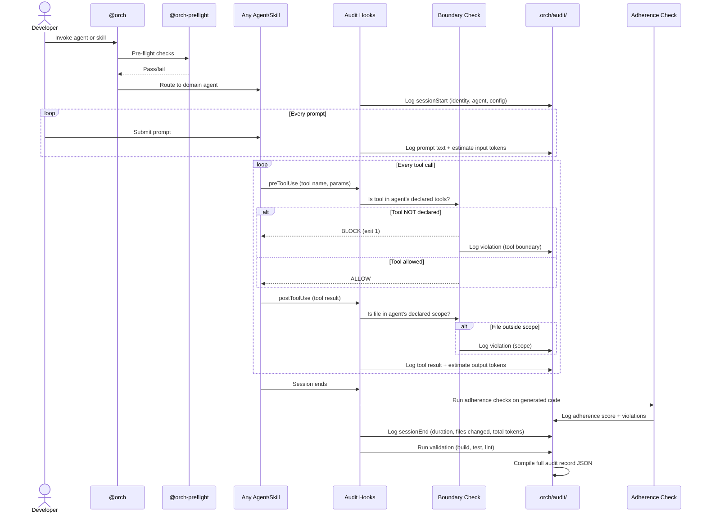

### 6.1 Documentation Conversion Flow

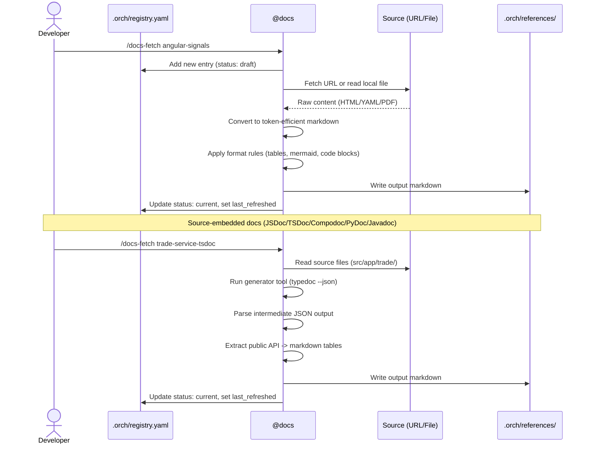

### 6.2 Codebase Analysis Flow

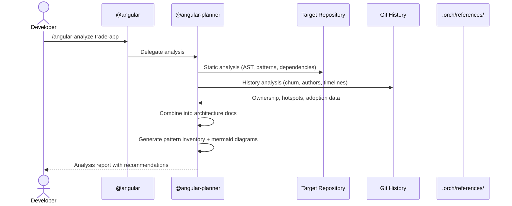

### 6.3 Drift Detection Flow

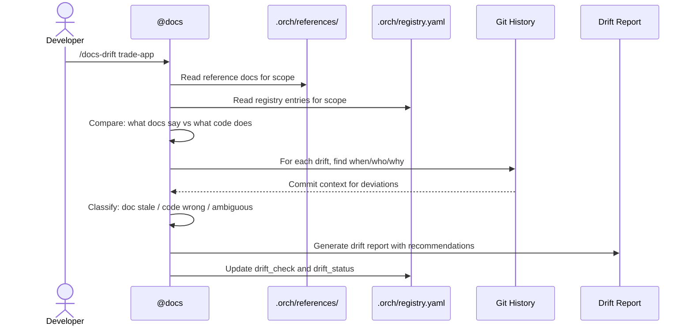

### 6.4 Migration Workflow (end-to-end)

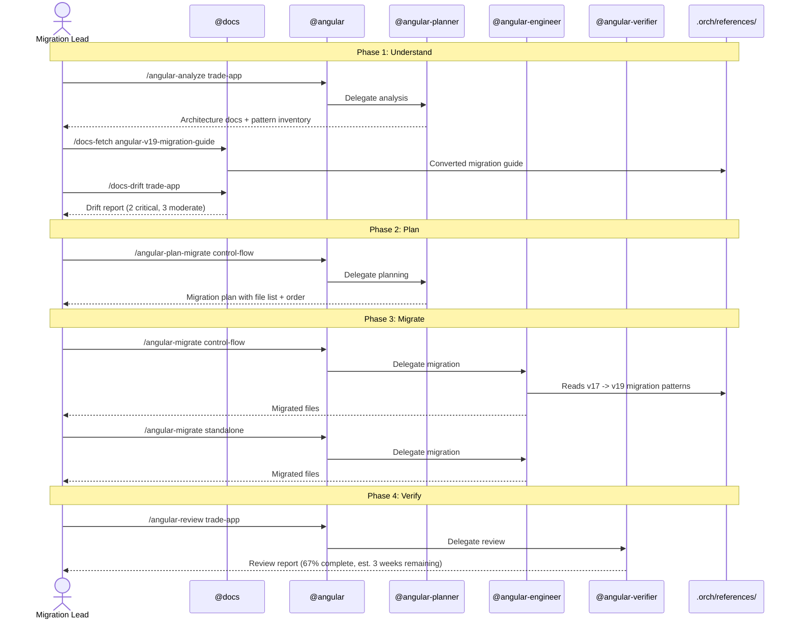

---

## 7. Agent Specifications

### 7.1 Docs Agent

```yaml
# .github/agents/docs.agent.md frontmatter
name: "docs"
description: "ORCH reference supply chain agent. Fetches, converts, and maintains
  reference documentation. Narrowed scope: doc lifecycle only.
  All operations tracked by the ORCH audit framework."
model: claude-sonnet-4
tools:
  - codebase             # read project + source files for doc extraction
  - terminal             # run git commands, doc generator tools (typedoc, compodoc, sphinx, javadoc)
  - fetch                # fetch external URLs
  - edit                 # write converted docs
agents:
  - doc-convert-worker   # delegates heavy doc conversion to isolated sub-agent
```

Skills: /docs-fetch, /docs-status, /docs-refresh, /docs-drift

### 7.2 Angular Agent (Coordinator + 3 Sub-Agents)

**Coordinator:**

```yaml
# .github/agents/angular.agent.md frontmatter
name: "angular"
description: "Angular domain coordinator. Triages requests and delegates to the
  appropriate sub-agent: planner (analysis), engineer (generation/transformation),
  or verifier (review/validation). All operations tracked by the ORCH audit framework."
model: claude-sonnet-4
tools:
  - codebase             # read for triage decisions
agents:
  - angular-planner
  - angular-engineer
  - angular-verifier
```

**Sub-Agent: @angular-planner**

```yaml
# .github/agents/angular-planner.agent.md frontmatter
name: "angular-planner"
description: "Analysis and planning sub-agent. Reads codebases, git history,
  and reference docs to produce analysis reports and migration plans."
model: claude-sonnet-4
tools:
  - codebase             # broad read access
  - terminal             # git log, static analysis
```

Skills: /angular-analyze, /angular-plan-migrate, /angular-plan-refactor

**Sub-Agent: @angular-engineer**

```yaml
# .github/agents/angular-engineer.agent.md frontmatter
name: "angular-engineer"
description: "Generation and transformation sub-agent. Scaffolds components,
  executes migrations, and applies refactors using semantic adapters."
model: claude-sonnet-4
tools:
  - codebase
  - terminal             # ng CLI, npm, lint, test
  - edit
agents:
  - migrate-worker       # delegates heavy migration transforms
```

Skills: /angular-generate, /angular-migrate, /angular-refactor, /angular-hds, /angular-elevate

**Sub-Agent: @angular-verifier**

```yaml
# .github/agents/angular-verifier.agent.md frontmatter
name: "angular-verifier"
description: "Review and validation sub-agent. Runs tests, lints, and performs
  structured code reviews against org standards."
model: claude-sonnet-4
tools:
  - codebase             # read for review
  - terminal             # run tests, lint, build
```

Skills: /angular-test, /angular-review, /angular-lint-check

### 7.3 Audit Agent

```yaml
# .github/agents/audit.agent.md frontmatter
name: "audit"
description: "ORCH audit and observability agent. Provides 6 granular audit skills
  covering usage, tokens, compliance, drift, benchmarking, and context health."
model: claude-sonnet-4
tools:
  - codebase             # read audit logs and config
  - terminal             # run aggregation and benchmark scripts
```

Skills: /audit-usage, /audit-tokens, /audit-compliance, /audit-drift, /audit-benchmark, /audit-context

### 7.4 Orchestrator Agent

```yaml
# .github/agents/orch.agent.md frontmatter
name: "orch"
description: "ORCH master orchestrator. Runs pre-flight checks via @orch-preflight,
  routes requests to the right domain agent, coordinates cross-domain workflows,
  synthesizes results, and owns shared presentation skills."
model: claude-sonnet-4
tools:
  - codebase
agents:
  - orch-preflight
  - angular
  - docs
  - audit
```

Shared skills: /present-deck, /present-dashboard

**Sub-Agent: @orch-preflight**

```yaml
# .github/agents/orch-preflight.agent.md frontmatter
name: "orch-preflight"
description: "Pre-flight validation sub-agent. Checks config integrity, registry health,
  reference freshness, and boundary configuration before routing to domain agents."
model: claude-sonnet-4
tools:
  - codebase             # read config and registry files
```

### 7.5 Workers

Worker sub-agents are internal agents that handle isolated, resource-intensive subtasks. They are not invoked directly by users — parent agents delegate to them.

| Worker | Parent | Purpose |
|--------|--------|---------|
| `doc-convert-worker` | @docs | Isolated heavy doc conversion for /docs-fetch |
| `migrate-worker` | @angular-engineer | Isolated migration transforms for /angular-migrate |

---

## 8. Skill Specifications

### 8.1 Skill Template

All skills follow this structure:

```markdown
# SKILL.md
---
name: skill-name-kebab-case
description: "10-1024 chars. Clear trigger keywords for agent discovery."
references:
  - orch://references/angular/v19/migration-guide.md
  - orch://references/internal/ui-components.md
---

## Context
What this skill does and when to use it.

## Inputs
What the user provides.

## Steps
1. Imperative instructions the agent follows.
2. Reference specific files: @references/path/to/doc.md
3. Clear output format expectations.

## Output
What the agent produces.

## Validation
How to verify the output is correct.
```

### 8.2 @docs Skills

| Skill | Inputs | Outputs | Validates |
|-------|--------|---------|-----------|
| `/docs-fetch` | Source id or URL, --scope, --type | Registry entry + converted markdown in .orch/references/. For source-embedded formats: runs generator tool, extracts public API, converts to markdown tables | Entry doesn't duplicate; output under token budget; generator tool exits 0; registry is parseable |
| `/docs-status` | Optional --scope, --stale filter | Registry health dashboard: source count, staleness, coverage gaps | Registry is parseable; dates are valid |
| `/docs-refresh` | Source id or --stale flag | Re-converted markdown from original source | Source is reachable; output under token budget; diff from previous version |
| `/docs-drift` | App or scope identifier | Drift report with classifications (doc stale / code wrong / ambiguous) | Reference docs exist for scope; git data is accessible |

### 8.3 @angular Skills (by sub-agent)

**@angular-planner skills:**

| Skill | Inputs | Outputs | Validates |
|-------|--------|---------|-----------|
| `/angular-analyze` | Project path or component | Architecture docs, pattern inventory, dependency graph, inline doc coverage | Git data accessible; file counts match filesystem |
| `/angular-plan-migrate` | Migration type (standalone, signals, control-flow, jest, rxjs), scope | Migration plan: file list, order, risk assessment, estimated effort | References exist for migration type; scope resolves to files |
| `/angular-plan-refactor` | File or folder scope, refactor goal | Refactor plan: changes needed, impact analysis, risk areas | Scope resolves to files; goal is actionable |

**@angular-engineer skills:**

| Skill | Inputs | Outputs | Validates |
|-------|--------|---------|-----------|
| `/angular-generate` | Component/service name, type | Scaffolded .ts, .html, .scss, .spec.ts files | Follows OnPush, standalone patterns; Injectable with proper error handling |
| `/angular-migrate` | File or folder scope, migration type | Migrated files using semantic adapters | Build passes after migration |
| `/angular-refactor` | File or folder | Modernized code | Build passes, tests pass |
| `/angular-hds` | Component or pattern query | Design system guidance and code using HDS tokens | Matches current HDS version |
| `/angular-elevate` | Service or integration query | Platform service integration patterns | Uses @yourorg/elevate APIs correctly |

**@angular-verifier skills:**

| Skill | Inputs | Outputs | Validates |
|-------|--------|---------|-----------|
| `/angular-test` | File to test | .spec.ts file | TestBed setup, org mocking patterns |
| `/angular-review` | PR diff or file | Structured review comments | Checks anti-patterns list |
| `/angular-lint-check` | File or folder scope | Lint validation report | ng lint passes; custom rules checked |

### 8.4 @audit Skills

| Skill | Inputs | Outputs | Purpose |
|-------|--------|---------|---------|
| `/audit-usage` | Date range, --agent filter | Usage summary: sessions, prompts, tools invoked per agent | Track adoption and usage patterns |
| `/audit-tokens` | Date range, --agent filter, --model filter | Token cost breakdown by agent, model, skill | Cost visibility and optimization |
| `/audit-compliance` | Date range, --agent filter | Compliance report: boundary violations, scope violations, adherence scores | Compliance evidence for auditors |
| `/audit-drift` | Date range, --agent filter | Behavioral drift analysis: changing patterns, emerging violations | Detect gradual model/config degradation |
| `/audit-benchmark` | Session ID or skill name + models | Validation report or model comparison matrix | Quality gate + model optimization |
| `/audit-context` | None | Session health check or compact handoff prompt | Context monitoring + session management |

### 8.5 @orch Shared Skills

| Skill | Inputs | Outputs | Purpose |
|-------|--------|---------|---------|
| `/present-deck` | Topic, --template (intro, architecture, migration, status, custom) | HTML slide deck (reveal.js) or PPTX styled with HDS design tokens | Sprint reviews, architecture reviews, management updates |
| `/present-dashboard` | Metric type or data source | Live metrics dashboard | Ongoing monitoring and reporting |

---

## 9. Instruction Specifications

### 9.1 Instruction Template

```markdown
# .github/instructions/domain-area.instructions.md
---
description: "Clear description of what standards this enforces"
applyTo: "glob pattern for matching files"
---

## Section Name

### Rule
Concrete, specific guidance with examples.

### Do
- Specific pattern to follow (with code example)

### Don't
- Specific anti-pattern to avoid (with code example)
```

### 9.2 Key Instructions

Only 2 instruction files remain. Domain-specific coding standards are absorbed into skill SKILL.md files. Internal library patterns become reference docs in `.orch/references/`.

| File | Scope | Purpose |
|------|-------|---------|
| `.github/copilot-instructions.md` | Global (all agents) | Safety rules, audit requirements, confirmation prompts, model pinning, token limits |
| `.github/instructions/auto-mode.instructions.md` | Bridges config.yaml | Translates `.orch/config.yaml` settings into agent behavioral constraints (auto-approve thresholds, batch sizes, retry policies) |

**What was absorbed:**

| Former file | Absorbed into |
|-------------|---------------|
| `angular-typescript.instructions.md` | @angular sub-agent SKILL.md files (patterns live alongside the skills that enforce them) |
| `internal-component-lib.instructions.md` | `.orch/references/internal/ui-components.md` (becomes a reference doc) |
| `doc-conversion.instructions.md` | @docs SKILL.md files (/docs-fetch, /docs-refresh contain conversion rules) |

---

## 10. Hook Specifications

### 10.1 Hook Configuration Template

```json
{
  "version": 1,
  "hooks": {
    "eventName": [
      {
        "type": "command",
        "bash": "./.orch/scripts/hook-script.sh",
        "cwd": ".",
        "timeoutSec": 30,
        "env": {}
      }
    ]
  }
}
```

### 10.2 Audit Hooks (Foundation — always active)

| Hook | Events | Script | Action | Exit behavior |
|------|--------|--------|--------|--------------|
| Audit Lifecycle | sessionStart, sessionEnd, errorOccurred | `.orch/scripts/audit/log-session-start.sh`, `log-session-end.sh`, `log-error.sh` | Log session identity, timing, file changes, run post-session adherence checks | Always passes (logging only) |
| Audit Prompts | userPromptSubmitted | `.orch/scripts/audit/log-prompt.sh` | Log full prompt text, estimate input tokens | Always passes (logging only) |
| Audit Tools | preToolUse | `.orch/scripts/audit/check-tool-boundary.sh` | Compare tool against agent's declared tools in boundaries.yaml | **Non-zero blocks unauthorized tools** |
| Audit Scope | postToolUse | `.orch/scripts/audit/check-file-scope.sh`, `log-tool-result.sh` | Check file paths against agent's declared scope, log result, estimate tokens | Configurable: warn or block |

### 10.3 Governance Hooks

Note: The current implementation uses the 4 audit hooks listed above. Secrets scanning and tool-use gating are handled within the audit hook framework (specifically `audit-tools.json` for tool boundary enforcement and `audit-scope.json` for file scope checks).

---

## 11. Workflow Engine

### 11.1 Overview

Workflows are declarative YAML files that define multi-phase pipelines. The domain coordinator reads the YAML and executes phases sequentially, collecting outputs for a final report.

```
.orch/workflows/
  angular-migration.yaml      # upgrade Angular versions
  angular-new-feature.yaml    # create new features
```

### 11.2 Phase Execution Loop

For each phase in a workflow:

1. **Pre-check** (if defined) — capture before state
2. **Execute** — invoke skill on the declared agent (planner/engineer/verifier)
3. **Post-check** (if defined) — capture after state, compute delta
4. **Checkpoint** (if true) — git commit
5. **Verify** (if true) — invoke verifier, handle failure per `on-failure`
6. **Update status** — write `.orch/workflow/<name>.yaml` state file (polled by VS Code extension)
7. **Collect** — store outputs in `.orch/runs/<run-id>/`

### 11.3 Workflow YAML Schema

```yaml
name: angular-migration
trigger: "upgrade|migrate angular"
report:
  title: "Angular {{from}} → {{to}} Upgrade"
  attribution: "@angular → @angular-planner → @angular-engineer → @angular-verifier"

phases:
  - name: Standalone migration
    id: standalone
    agent: engineer
    skill: /angular-migrate-standalone
    pre-check:
      skill: /angular-scan-arch
      args: --counts-only
      capture: before-patterns
    post-check:
      skill: /angular-scan-arch
      args: --counts-only
      capture: after-patterns
    checkpoint: true          # git commit after phase
    verify: true              # invoke verifier after phase
    approval: auto=safe       # none | auto=safe | auto=all
    collect: [files-changed, duration, pattern-delta]
    report-section: "Phase Details"
    on-failure: rollback-to-checkpoint

post-workflow:
  report:
    sections: ["Before vs After", "Phase Timeline", "Phase Details", "Verification", "Recommendations"]
  git:
    tag: "migrate/angular-{{to}}-{{date}}"
```

### 11.4 Failure Modes

| `on-failure` | Behavior |
|--------------|----------|
| `stop` | Abort workflow, report what completed |
| `pause` | Show failure to human, wait for decision |
| `rollback-to-checkpoint` | Git revert to last checkpoint, ask human |
| `continue` | Log failure, skip phase, continue |
| `report-as-partial` | Complete workflow, mark report as partial |

### 11.5 Report Stitching

After all phases complete, the coordinator:
1. Reads collected data from `.orch/runs/<run-id>/`
2. For each report section: pulls from phases with matching `report-section`
3. Auto-generates: Phase Timeline (from durations), Risk Items (from verifier findings), Git History (from checkpoints), Recommendations (from risks + verification)
4. Produces markdown report, optionally renders HTML via `/present-report`

### 11.6 Status Bar Integration

The coordinator writes `.orch/workflow/<name>.yaml` state file after every phase. The VS Code extension polls this every 3 seconds and displays:
- Status bar: `ORCH: Migration 4/10 ✓`
- Tooltip: all phases with ✅🔵⚪ icons
- Webview panel: clickable phase pills with details

---

## 12. Cross-Cutting Concerns

### 11.1 Security & Audit

- No credentials stored in any ORCH file
- Hooks enforce secrets scanning before commits
- Agent tool access is explicitly declared, enforced at runtime, and audited
- Every tool call, file edit, and prompt is logged
- Boundary violations are blocked and recorded
- Reference docs are reviewed before use (controlled refresh)
- Audit records are immutable (append-only violation log)
- `.orch/audit/` can be shipped to enterprise observability stack (Splunk, ELK, Datadog)
- Pre-flight checks validate system integrity before each session

### 11.2 Maintainability

- Registry tracks staleness — nothing silently goes out of date
- Role-based sub-agents have clear, non-overlapping responsibilities
- Skills are self-contained with declared reference dependencies
- 3-level rule cascade (global -> domain -> skill) eliminates duplication

### 11.3 Scalability

- File-based architecture scales with git
- New domains added by creating coordinator + sub-agents + skills
- Registry supports unlimited sources
- Hybrid reference model (shared + skill-local) keeps context windows lean
- Plugin packaging enables cross-org distribution in Phase 3

### 11.4 Testing

- Migration skills: always run build + tests after transformation
- Verifier sub-agent: structured review against anti-patterns list
- Hooks: test scripts locally before deployment
- Drift detection: compare against known-good baseline
- Pre-flight: validates config before any agent runs
