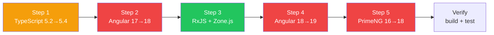

## Context

Generates and queries the Angular ecosystem compatibility matrix — which versions of Angular, TypeScript, Node, RxJS, Zone.js, PrimeNG, AG Grid, Nx, Jest, Playwright, and other libraries work together. Produces upgrade path plans with ordered steps and risk assessment. This is a read-only planner skill — it never modifies files.

## Inputs

- "Generate the compatibility matrix" — full matrix for Angular versions (LTS-2 to latest)
- "Can I use PrimeNG 18 with Angular 19?" — check a specific version combination
- "Check my package.json" — validate all installed versions against the matrix
- "Upgrade path from Angular 17 to 19" — ordered list of all required version changes

## Matrix Lookup Logic

The skill reads `references/angular/v19/compatibility-matrix.md` which contains structured version-range entries. Each entry maps an Angular major version to the acceptable semver ranges for every companion library.

**Concrete matrix excerpt (Angular 19):**

| Library      | Min Version | Max Version | Notes                              |
|--------------|-------------|-------------|------------------------------------|
| TypeScript   | 5.4.0       | 5.6.x       | 5.7+ not yet supported by compiler |
| Node.js      | 18.19.1     | 22.x        | 16.x dropped in v19                |
| RxJS         | 7.8.0       | 7.8.x       | RxJS 8 not yet compatible          |
| Zone.js      | 0.14.0      | 0.15.x      | 0.14.10+ recommended               |
| PrimeNG      | 18.0.0      | 18.x        | 17.x incompatible with v19 Ivy     |
| AG Grid      | 31.0.0      | 32.x        | 30.x works but unsupported         |
| Angular CDK  | 19.0.0      | 19.x        | Must match Angular major            |
| Nx           | 19.0.0      | 20.x        | 18.x partial support only          |
| Jest         | 29.5.0      | 29.x        | 30.x experimental                   |
| Playwright   | 1.40.0      | 1.x         | All 1.x compatible                  |

**Lookup algorithm:**
1. Parse the `@angular/core` version from `package.json` to determine the Angular major.
2. Select the matrix row set for that major version.
3. For each dependency in `package.json`, resolve the installed version via `node_modules/{pkg}/package.json` `version` field.
4. Compare the installed version against the matrix `[min, max]` range using semver comparison.
5. Classify: `compatible` (within range), `incompatible` (outside range), `unverified` (not in matrix).

## Steps

1. Read `references/angular/v19/compatibility-matrix.md` for known compatible version ranges.
2. Read `package.json` for current installed versions (if checking or planning an upgrade).
3. For **Generate**: build the full matrix table covering:
   - Core platform: Angular, TypeScript, Node.js, RxJS, Zone.js
   - UI libraries: PrimeNG, AG Grid, Angular Material, CDK
   - Build and test: Nx, Jest, Playwright, Webpack, esbuild
   - Internal/custom libraries (from `.orch/registry.yaml` if present)
4. For **Check**: cross-reference the requested version combination against the matrix and report compatible/incompatible/unverified.
5. For **Check package.json**: validate every dependency against the matrix for the current Angular version, flag mismatches.
6. For **Upgrade path**:
   - Determine all intermediate Angular versions (e.g., 17 to 18 to 19 if needed).
   - For each version step, list all dependent library version changes.
   - Order changes by dependency (TypeScript before Angular, Angular before UI libs).
   - Assess risk per step: high (breaking changes), medium (API changes), low (compatible).
   - Map each step to the corresponding `/migrate` sub-command.
7. Produce the output report.

## Output

### Generate
```markdown
## Angular Compatibility Matrix

### Core Platform
| Library | Angular 17 | Angular 18 | Angular 19 |

### UI Libraries
| Library | Angular 17 | Angular 18 | Angular 19 |

### Build & Test Tooling
| Library | Angular 17 | Angular 18 | Angular 19 |
```

### Check package.json — Concrete Example

Given a `package.json` with:
```json
{
  "@angular/core": "19.1.2",
  "typescript": "5.3.3",
  "rxjs": "7.8.1",
  "zone.js": "0.13.3",
  "primeng": "17.18.9"
}
```

The skill produces:
```markdown
## Compatibility Check — my-app

| Package     | Installed | Expected Range     | Status         |
|-------------|-----------|---------------------|----------------|
| TypeScript  | 5.3.3     | 5.4.0 – 5.6.x     | INCOMPATIBLE   |
| RxJS        | 7.8.1     | 7.8.0 – 7.8.x     | Compatible     |
| Zone.js     | 0.13.3    | 0.14.0 – 0.15.x   | INCOMPATIBLE   |
| PrimeNG     | 17.18.9   | 18.0.0 – 18.x     | INCOMPATIBLE   |

### Issues Found
| Package    | Issue                                    | Resolution                                    |
|------------|------------------------------------------|-----------------------------------------------|
| TypeScript | 5.3.3 below minimum 5.4.0 for Angular 19 | `npm install typescript@~5.6.0 --save-exact` |
| Zone.js    | 0.13.3 below minimum 0.14.0 for Angular 19 | `npm install zone.js@~0.14.10`              |
| PrimeNG    | 17.x incompatible with Angular 19 Ivy    | `npm install primeng@^18.0.0`                |
```

### Upgrade Path
```markdown
## Upgrade Path: Angular {from} → {to}

### Required Version Changes (ordered)
| Step | Library | Current | Target | Risk | Breaking Changes |

### Recommended Upgrade Order
1. {step} — risk: {level}

### Migration Skills to Run (ordered)
1. `/migrate upgrade typescript {from} -> {to}` — confidence: {level}

### Unverified Libraries
| Library | Current | Notes |
```

### Upgrade Path — Concrete Example (Angular 17 to 19)
```markdown
## Upgrade Path: Angular 17 → 19

### Required Version Changes (ordered)
| Step | Library    | Current | Target  | Risk   | Breaking Changes            |
|------|------------|---------|---------|--------|-----------------------------|
| 1    | TypeScript | 5.2.2   | 5.4.5  | Medium | New `using` keyword support  |
| 2    | Angular    | 17.3.0  | 18.2.0 | High   | Control flow syntax default  |
| 3    | RxJS       | 7.5.0   | 7.8.1  | Low    | None                         |
| 4    | Zone.js    | 0.13.0  | 0.14.4 | Medium | New async detection model    |
| 5    | Angular    | 18.2.0  | 19.1.0 | High   | Standalone default, signals  |
| 6    | PrimeNG    | 16.9.0  | 18.0.0 | High   | New component API surface    |

### Recommended Upgrade Order
1. TypeScript 5.2 → 5.4 — risk: medium
2. Angular 17 → 18 — risk: high
3. RxJS 7.5 → 7.8, Zone.js 0.13 → 0.14 — risk: low/medium (parallel)
4. Angular 18 → 19 — risk: high
5. PrimeNG 16 → 18 — risk: high (do after Angular 19 stable)

### Migration Skills to Run (ordered)
1. `/migrate upgrade typescript 5.2 -> 5.4` — confidence: high
2. `/migrate upgrade angular 17 -> 18` — confidence: high
3. `/migrate upgrade angular 18 -> 19` — confidence: high
4. `/migrate upgrade primeng 16 -> 18` — confidence: medium
```

### Upgrade Path Diagram (Mermaid)


## Validation

- All version ranges come from the referenced compatibility matrix, not hallucinated
- Upgrade path includes ALL dependent version changes, not just Angular core
- Upgrade order respects dependency chains (TypeScript before Angular, Angular before UI libs)
- package.json check covers all dependencies, not just Angular packages
- Semver comparison uses `[min, max]` inclusive range matching from the matrix
- Resolution commands include the exact target version and correct npm flags
- No files are modified during the scan
