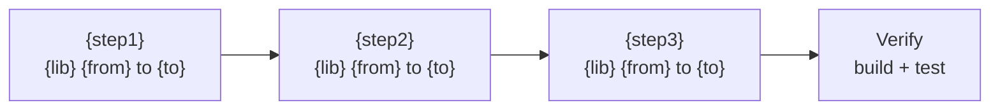

## Context

Generates and queries the Angular ecosystem compatibility matrix — which versions of Angular, TypeScript, Node, RxJS, Zone.js, PrimeNG, AG Grid, Nx, Jest, Playwright, and other libraries work together. Produces upgrade path plans with ordered steps and risk assessment. This is a read-only planner skill — it never modifies files.

## Inputs

- "Generate the compatibility matrix" — full matrix for Angular versions (LTS-2 to latest)
- "Can I use PrimeNG 18 with Angular 19?" — check a specific version combination
- "Check my package.json" — validate all installed versions against the matrix
- "Upgrade path from Angular 17 to 19" — ordered list of all required version changes

## Steps

1. Read `references/angular/v19/compatibility-matrix.md` for known compatible version ranges.
2. Read `package.json` for current installed versions (if checking or planning an upgrade).
3. For **Generate**: build the full matrix table covering:
   - Core platform: Angular, TypeScript, Node.js, RxJS, Zone.js
   - UI libraries: PrimeNG, AG Grid, Angular Material, CDK
   - Build and test: Nx, Jest, Playwright, Webpack, esbuild
   - Internal/custom libraries (from `.orch/registry.yaml` if present)
4. For **Check**: cross-reference the requested version combination against the matrix and report compatible/incompatible/unverified.
5. For **Check package.json**: validate every dependency against the matrix for the current Angular version, flag mismatches.
6. For **Upgrade path**:
   - Determine all intermediate Angular versions (e.g., 17 to 18 to 19 if needed).
   - For each version step, list all dependent library version changes.
   - Order changes by dependency (TypeScript before Angular, Angular before UI libs).
   - Assess risk per step: high (breaking changes), medium (API changes), low (compatible).
   - Map each step to the corresponding `/migrate` sub-command.
7. Produce the output report.

## Output

### Generate
```markdown
## Angular Compatibility Matrix

### Core Platform
| Library | Angular 17 | Angular 18 | Angular 19 |

### UI Libraries
| Library | Angular 17 | Angular 18 | Angular 19 |

### Build & Test Tooling
| Library | Angular 17 | Angular 18 | Angular 19 |
```

### Upgrade Path
```markdown
## Upgrade Path: Angular {from} → {to}

### Required Version Changes (ordered)
| Step | Library | Current | Target | Risk | Breaking Changes |

### Recommended Upgrade Order
1. {step} — risk: {level}

### Migration Skills to Run (ordered)
1. `/migrate upgrade typescript {from} -> {to}` — confidence: {level}

### Unverified Libraries
| Library | Current | Notes |
```

### Check package.json
```markdown
## Compatibility Check — {project_name}
| Package | Installed | Expected Range | Status |

### Issues Found
| Package | Issue | Resolution |

### Upgrade Path Diagram (Mermaid)
Produce a visual upgrade path showing sequential steps and dependencies:

Show dependency arrows between steps (e.g., TypeScript must upgrade before Angular). Color-code by risk: green=low, amber=medium, red=high.
```

## Validation

- All version ranges come from the referenced compatibility matrix, not hallucinated
- Upgrade path includes ALL dependent version changes, not just Angular core
- Upgrade order respects dependency chains (TypeScript before Angular, etc.)
- package.json check covers all dependencies, not just Angular packages
- No files are modified during the scan
