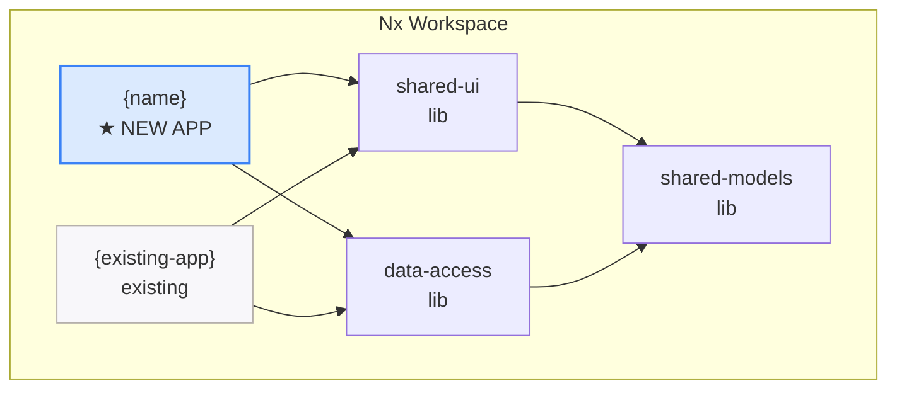

## Context

Creates a new Angular application within an existing Nx workspace or Angular CLI project. This is different from `/local-create-workspace` (which creates the entire workspace from scratch). Use this when you already have a workspace and want to add another app to it.

For Nx monorepos, this is common — you might have `portfolio-app` and want to add `trading-app` as a second application sharing the same libs.

## Inputs

- `@angular /angular-create-app trading-app` — create a new app in the current Nx workspace
- `@angular /angular-create-app trading-app --port 4201` — specify dev server port
- `@angular /angular-create-app trading-app --routing lazy` — with lazy-loaded route modules
- Options:
  - `--port 4200` (default: auto-detect next available)
  - `--routing lazy|eager|none` (default: lazy)
  - `--hds` — pre-configure HDS design system (import theme, set up tokens)
  - `--elevate auth,logging,config` — pre-configure elevate platform services
  - `--mock` — set up mock server for this app (runs `/local-mock-generate`)

## Steps

### Pre-checks

1. **Verify workspace exists:** Read `nx.json` or `angular.json`. If neither exists, suggest `/local-create-workspace` first.
2. **Verify app name is available:** Check that no existing project has the same name.
   ```bash
   # For Nx — list all projects and check for name collision
   npx nx show projects
   ```
3. **Detect workspace type:** Nx monorepo or Angular CLI.
   ```bash
   # Nx monorepo: nx.json exists at workspace root
   # Angular CLI: angular.json exists without nx.json
   ls nx.json angular.json 2>/dev/null
   ```

### For Nx monorepo

4. **Generate the app:**
   ```bash
   npx nx generate @nx/angular:application {name} \
     --directory=apps/{name} \
     --standalone \
     --routing \
     --style=scss \
     --prefix={name} \
     --port={port}
   ```

   This creates the following directory structure:
   ```
   apps/
     {name}/
       src/
         app/
           app.component.ts       # Root standalone component
           app.component.html
           app.component.scss
           app.component.spec.ts
           app.config.ts          # ApplicationConfig with providers
           app.routes.ts          # Route configuration
         environments/
           environment.ts
           environment.prod.ts
         index.html
         main.ts                  # Bootstrap with provideRouter, provideHttpClient
         styles.scss              # Global styles
       project.json               # Nx project configuration
       tsconfig.app.json
       tsconfig.spec.json
   ```

5. **Configure shared library imports:**
   - Add `shared-models`, `shared-ui`, `data-access` to the app's `tsconfig.app.json` paths
   - Import standalone shared components in the app's root

   **tsconfig.app.json paths setup:**
   ```json
   {
     "extends": "./tsconfig.json",
     "compilerOptions": {
       "outDir": "../../dist/out-tsc",
       "paths": {
         "@workspace/shared-models": ["../../libs/shared-models/src/index.ts"],
         "@workspace/shared-ui": ["../../libs/shared-ui/src/index.ts"],
         "@workspace/data-access": ["../../libs/data-access/src/index.ts"]
       }
     }
   }
   ```

6. **Set up routing structure** with lazy-loaded feature routes:

   **`app.routes.ts` — lazy-loaded routes:**
   ```typescript
   import { Routes } from '@angular/router';

   export const appRoutes: Routes = [
     {
       path: '',
       redirectTo: 'dashboard',
       pathMatch: 'full',
     },
     {
       path: 'dashboard',
       loadComponent: () =>
         import('./features/dashboard/dashboard.component').then(m => m.DashboardComponent),
       title: '{Name} — Dashboard',
     },
     {
       path: 'trades',
       loadChildren: () =>
         import('./features/trades/trades.routes').then(m => m.TRADE_ROUTES),
       title: '{Name} — Trades',
     },
     {
       path: 'portfolio',
       loadComponent: () =>
         import('./features/portfolio/portfolio.component').then(m => m.PortfolioComponent),
       title: '{Name} — Portfolio',
     },
     {
       path: '**',
       redirectTo: 'dashboard',
     },
   ];
   ```

   **Nested feature routes example (`trades.routes.ts`):**
   ```typescript
   import { Routes } from '@angular/router';

   export const TRADE_ROUTES: Routes = [
     {
       path: '',
       loadComponent: () =>
         import('./trade-list/trade-list.component').then(m => m.TradeListComponent),
     },
     {
       path: ':id',
       loadComponent: () =>
         import('./trade-detail/trade-detail.component').then(m => m.TradeDetailComponent),
     },
     {
       path: 'new',
       loadComponent: () =>
         import('./trade-form/trade-form.component').then(m => m.TradeFormComponent),
     },
   ];
   ```

7. **Add project tags for module boundaries:**

   **`project.json` — full example:**
   ```json
   {
     "name": "{name}",
     "$schema": "../../node_modules/nx/schemas/project-schema.json",
     "projectType": "application",
     "prefix": "{name}",
     "sourceRoot": "apps/{name}/src",
     "tags": ["scope:{name}", "type:app"],
     "targets": {
       "build": {
         "executor": "@angular-devkit/build-angular:application",
         "outputs": ["{options.outputPath}"],
         "options": {
           "outputPath": "dist/apps/{name}",
           "index": "apps/{name}/src/index.html",
           "browser": "apps/{name}/src/main.ts",
           "polyfills": ["zone.js"],
           "tsConfig": "apps/{name}/tsconfig.app.json",
           "inlineStyleLanguage": "scss",
           "assets": ["apps/{name}/src/favicon.ico", "apps/{name}/src/assets"],
           "styles": ["apps/{name}/src/styles.scss"],
           "scripts": []
         },
         "configurations": {
           "production": {
             "budgets": [
               { "type": "initial", "maximumWarning": "500kb", "maximumError": "1mb" },
               { "type": "anyComponentStyle", "maximumWarning": "4kb", "maximumError": "8kb" }
             ],
             "outputHashing": "all"
           },
           "development": {
             "optimization": false,
             "extractLicenses": false,
             "sourceMap": true
           }
         },
         "defaultConfiguration": "production"
       },
       "serve": {
         "executor": "@angular-devkit/build-angular:dev-server",
         "configurations": {
           "production": { "buildTarget": "{name}:build:production" },
           "development": { "buildTarget": "{name}:build:development" }
         },
         "defaultConfiguration": "development",
         "options": {
           "port": {port}
         }
       },
       "test": {
         "executor": "@nx/jest:jest",
         "outputs": ["{workspaceRoot}/coverage/apps/{name}"],
         "options": {
           "jestConfig": "apps/{name}/jest.config.ts"
         }
       },
       "lint": {
         "executor": "@nx/eslint:lint",
         "outputs": ["{options.outputFile}"]
       }
     }
   }
   ```

   **Update `.eslintrc.json` module boundary rules:**
   ```json
   {
     "rules": {
       "@nx/enforce-module-boundaries": [
         "error",
         {
           "depConstraints": [
             { "sourceTag": "scope:{name}", "onlyDependOnLibsWithTags": ["scope:{name}", "scope:shared"] },
             { "sourceTag": "type:app", "onlyDependOnLibsWithTags": ["type:lib", "type:util"] },
             { "sourceTag": "scope:shared", "onlyDependOnLibsWithTags": ["scope:shared"] }
           ]
         }
       ]
     }
   }
   ```

### For Angular CLI (adding a project)

4. **Generate the app:**
   ```bash
   npx ng generate application {name} \
     --routing \
     --style=scss \
     --standalone
   ```

### Both workspace types

8. **Configure HDS** (if `--hds` flag):
   - Import `@yourorg/hds/themes` in the app's `styles.scss`
   - Set up `:root` CSS custom properties
   - Add `[data-theme]` attribute for light/dark switching

   **`styles.scss` with HDS theme:**
   ```scss
   @use '@yourorg/hds/themes' as hds-theme;

   :root {
     @include hds-theme.tokens();
   }

   [data-theme='dark'] {
     @include hds-theme.dark-tokens();
   }

   // Reset and base styles
   *,
   *::before,
   *::after {
     box-sizing: border-box;
   }

   body {
     margin: 0;
     font-family: var(--hds-type-body-md);
     color: var(--hds-text-primary);
     background-color: var(--hds-surface-primary);
   }
   ```

### Elevate Platform Setup

If `--elevate` flag is provided (or by default for org projects):

1. Install core elevate libs:
   ```bash
   npm install @yourorg/elevate/{client-core,angular-adapter,authentication,authorization,configuration,logging,user-preferences}
   ```

2. Configure providers in `app.config.ts`:
   ```typescript
   import { provideElevateAuth } from '@yourorg/elevate/authentication';
   import { provideElevateLogging } from '@yourorg/elevate/logging';
   import { provideElevateConfig } from '@yourorg/elevate/configuration';
   // ... in providers array
   ```

3. Ask which optional libs are needed:
   - Grid (`@yourorg/elevate-components/common-grid`)
   - Chart (`@yourorg/elevate-components/common-chart`)
   - Search (`@yourorg/elevate-components/common-search`)
   - Chat (`@yourorg/elevate-components/common-chat`)
   - WebSocket (`@yourorg/elevate/websocket`)
   - Others (interop, notifications, analytics)

4. Install selected optional libs
5. Run detect-elevate.js to verify installation:
   ```bash
   node .orch/scripts/detect-elevate.js [project-root]
   ```

9. **Configure Elevate** (if `--elevate` flag):
   - Install required `@yourorg/elevate/*` packages
   - Configure providers in `app.config.ts`
   - Add `ElevateAuthGuard` to root routes

   **`app.config.ts` with elevate providers:**
   ```typescript
   import { ApplicationConfig, provideZoneChangeDetection } from '@angular/core';
   import { provideRouter, withComponentInputBinding } from '@angular/router';
   import { provideHttpClient, withInterceptorsFromDi } from '@angular/common/http';
   import { provideElevateAuth } from '@yourorg/elevate/auth';
   import { provideElevateLogging } from '@yourorg/elevate/logging';
   import { provideElevateConfig } from '@yourorg/elevate/config';
   import { appRoutes } from './app.routes';
   import { environment } from '../environments/environment';

   export const appConfig: ApplicationConfig = {
     providers: [
       provideZoneChangeDetection({ eventCoalescing: true }),
       provideRouter(appRoutes, withComponentInputBinding()),
       provideHttpClient(withInterceptorsFromDi()),

       // Elevate platform services
       provideElevateAuth({
         issuer: environment.auth.issuer,
         clientId: environment.auth.clientId,
         redirectUri: window.location.origin,
       }),
       provideElevateLogging({
         level: environment.production ? 'warn' : 'debug',
         enableConsole: !environment.production,
         enableRemote: environment.production,
       }),
       provideElevateConfig({
         sources: [
           { type: 'remote', url: `${environment.apiUrl}/config` },
           { type: 'environment', value: environment },
         ],
       }),
     ],
   };
   ```

   **`app.routes.ts` with auth guard:**
   ```typescript
   import { elevateAuthGuard } from '@yourorg/elevate/auth';

   export const appRoutes: Routes = [
     { path: '', redirectTo: 'dashboard', pathMatch: 'full' },
     {
       path: 'dashboard',
       canActivate: [elevateAuthGuard()],
       loadComponent: () => import('./features/dashboard/dashboard.component').then(m => m.DashboardComponent),
     },
     // ... other routes with guards
   ];
   ```

10. **Set up mock server** (if `--mock` flag):
    - Run `/local-mock-generate` to create mock data from the app's models
    - Configure `environment.ts` with mock server URL

    **`environment.ts` with mock server:**
    ```typescript
    export const environment = {
      production: false,
      apiUrl: 'http://localhost:3001/api',
      auth: {
        issuer: 'http://localhost:3001/auth',
        clientId: '{name}-dev',
      },
    };
    ```

11. **Run build:** `nx build {name}` or `ng build {name}`
12. **Run tests:** `nx test {name}` or `ng test {name}`
13. **Run lint:** `nx lint {name}` or `ng lint {name}`

    **Expected output:**
    ```
    > nx build {name}
      Successfully compiled 4 files with swc.
      Browser application bundle generation complete.
      Initial chunk files | Names   | Raw size
      main.js             | main    | 142.5 kB
      styles.css          | styles  |   8.2 kB

      Build at: 2025-01-15T10:30:00.000Z - Hash: abc123 - Time: 4521ms

    > nx test {name}
      PASS apps/{name}/src/app/app.component.spec.ts
      Tests: 3 passed, 3 total

    > nx lint {name}
      All files pass linting.
    ```

## Output

```markdown
## Application Created — {name}

| Aspect | Value |
|--------|-------|
| Workspace | {workspace-name} ({nx/angular-cli}) |
| App directory | apps/{name}/ |
| Dev server | http://localhost:{port} |
| Routing | {lazy/eager/none} |
| HDS | {configured/not configured} |
| Elevate | {auth,logging,config / not configured} |
| Mock server | {configured on :3001 / not configured} |

### Files Created
| File | Purpose |
|------|---------|
| apps/{name}/src/main.ts | Bootstrap with provideRouter, provideHttpClient |
| apps/{name}/src/app/app.component.ts | Root component (standalone) |
| apps/{name}/src/app/app.routes.ts | Lazy-loaded feature routes |
| apps/{name}/src/app/dashboard/dashboard.component.ts | Initial dashboard page |
| apps/{name}/project.json | Nx project config with build/serve/test/lint |

### Architecture Decisions
| Decision | Choice | Rationale |
|----------|--------|-----------|
| Standalone | Yes | Angular 19+ default. No NgModules. |
| Routing | Lazy-loaded | Better initial load. Feature isolation. |
| Shared libs | Connected | Reuses shared-models, shared-ui, data-access |
| Module boundaries | Enforced | App tagged with scope. Nx lint prevents boundary violations. |

### Diagrams

#### Where This App Fits (C4 Level 2)


### Next steps
1. `nx serve {name}` — start dev server on :{port}
2. `@angular /angular-generate-component` — create feature components
3. `@angular /angular-mock-wire` — generate services from mock data
4. `@angular /angular-hds-audit` — verify design system compliance
```

## Validation

- App compiles: `nx build {name}` / `ng build` passes
- Tests pass: `nx test {name}` passes
- Lint passes: `nx lint {name}` passes with boundary rules
- Routing works: dev server loads dashboard route
- Shared libs are importable from the new app
- If HDS: theme import present, tokens resolve
- If Elevate: auth guard active, logging configured
- If Mock: environment.ts points to mock server, services generated
- Module boundary tags set correctly (Nx)
- Port does not conflict with existing apps
