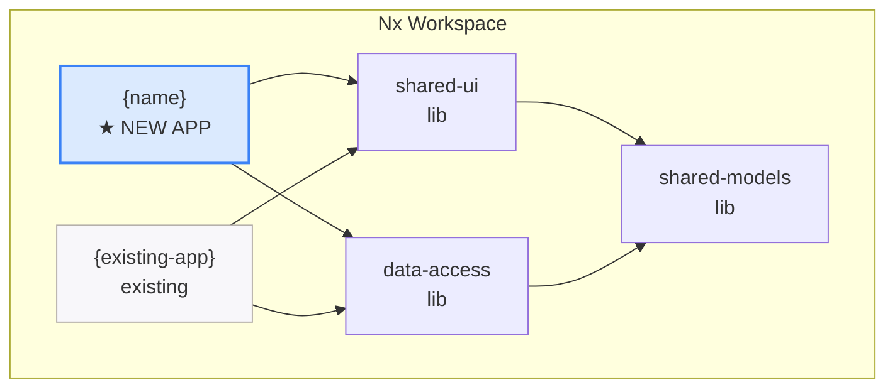

## Context

Creates a new Angular application within an existing Nx workspace or Angular CLI project. This is different from `/local-create-workspace` (which creates the entire workspace from scratch). Use this when you already have a workspace and want to add another app to it.

For Nx monorepos, this is common — you might have `portfolio-app` and want to add `trading-app` as a second application sharing the same libs.

## Inputs

- `@angular /angular-create-app trading-app` — create a new app in the current Nx workspace
- `@angular /angular-create-app trading-app --port 4201` — specify dev server port
- `@angular /angular-create-app trading-app --routing lazy` — with lazy-loaded route modules
- Options:
  - `--port 4200` (default: auto-detect next available)
  - `--routing lazy|eager|none` (default: lazy)
  - `--hds` — pre-configure HDS design system (import theme, set up tokens)
  - `--elevate auth,logging,config` — pre-configure elevate platform services
  - `--mock` — set up mock server for this app (runs `/local-mock-generate`)

## Steps

### Pre-checks

1. **Verify workspace exists:** Read `nx.json` or `angular.json`. If neither exists, suggest `/local-create-workspace` first.
2. **Verify app name is available:** Check that no existing project has the same name.
3. **Detect workspace type:** Nx monorepo or Angular CLI.

### For Nx monorepo

4. **Generate the app:**
   ```bash
   npx nx generate @nx/angular:application {name} \
     --directory=apps/{name} \
     --standalone \
     --routing \
     --style=scss \
     --prefix={name} \
     --port={port}
   ```
5. **Configure shared library imports:**
   - Add `shared-models`, `shared-ui`, `data-access` to the app's `tsconfig.app.json` paths
   - Import `SharedUIModule` or standalone shared components in the app's root
6. **Set up routing structure:**
   - Create `app.routes.ts` with lazy-loaded feature routes
   - Create initial route: `/{name}/dashboard` → DashboardComponent
7. **Add project tags for module boundaries:**
   - Set `tags: ["scope:{name}", "type:app"]` in `project.json`
   - Update `.eslintrc.json` depConstraints to include the new app scope

### For Angular CLI (adding a project)

4. **Generate the app:**
   ```bash
   npx ng generate application {name} \
     --routing \
     --style=scss \
     --standalone
   ```

### Both workspace types

8. **Configure HDS** (if `--hds` flag):
   - Import `@yourorg/hds/themes` in the app's `styles.scss`
   - Set up `:root` CSS custom properties
   - Add `[data-theme]` attribute for light/dark switching
9. **Configure Elevate** (if `--elevate` flag):
   - Install required `@yourorg/elevate/*` packages
   - Configure `provideElevateAuth()`, `provideElevateLogging()`, `provideElevateConfig()` in `app.config.ts`
   - Add `ElevateAuthGuard` to root routes
10. **Set up mock server** (if `--mock` flag):
    - Run `/local-mock-generate` to create mock data from the app's models
    - Configure `environment.ts` with mock server URL
11. **Run build:** `nx build {name}` or `ng build {name}`
12. **Run tests:** `nx test {name}` or `ng test {name}`
13. **Run lint:** `nx lint {name}` or `ng lint {name}`

## Output

```markdown
## Application Created — {name}

| Aspect | Value |
|--------|-------|
| Workspace | {workspace-name} ({nx/angular-cli}) |
| App directory | apps/{name}/ |
| Dev server | http://localhost:{port} |
| Routing | {lazy/eager/none} |
| HDS | {configured/not configured} |
| Elevate | {auth,logging,config / not configured} |
| Mock server | {configured on :3001 / not configured} |

### Files Created
| File | Purpose |
|------|---------|
| apps/{name}/src/main.ts | Bootstrap with provideRouter, provideHttpClient |
| apps/{name}/src/app/app.component.ts | Root component (standalone) |
| apps/{name}/src/app/app.routes.ts | Lazy-loaded feature routes |
| apps/{name}/src/app/dashboard/dashboard.component.ts | Initial dashboard page |
| apps/{name}/project.json | Nx project config with build/serve/test/lint |

### Architecture Decisions
| Decision | Choice | Rationale |
|----------|--------|-----------|
| Standalone | Yes | Angular 19+ default. No NgModules. |
| Routing | Lazy-loaded | Better initial load. Feature isolation. |
| Shared libs | Connected | Reuses shared-models, shared-ui, data-access |
| Module boundaries | Enforced | App tagged with scope. Nx lint prevents boundary violations. |

### Diagrams

#### Where This App Fits (C4 Level 2)


### Next steps
1. `nx serve {name}` — start dev server on :{port}
2. `@angular /angular-generate-component` — create feature components
3. `@angular /angular-mock-wire` — generate services from mock data
4. `@angular /angular-hds-audit` — verify design system compliance
```

## Validation

- App compiles: `nx build {name}` / `ng build` passes
- Tests pass: `nx test {name}` passes
- Lint passes: `nx lint {name}` passes with boundary rules
- Routing works: dev server loads dashboard route
- Shared libs are importable from the new app
- If HDS: theme import present, tokens resolve
- If Elevate: auth guard active, logging configured
- If Mock: environment.ts points to mock server, services generated
- Module boundary tags set correctly (Nx)
- Port does not conflict with existing apps
