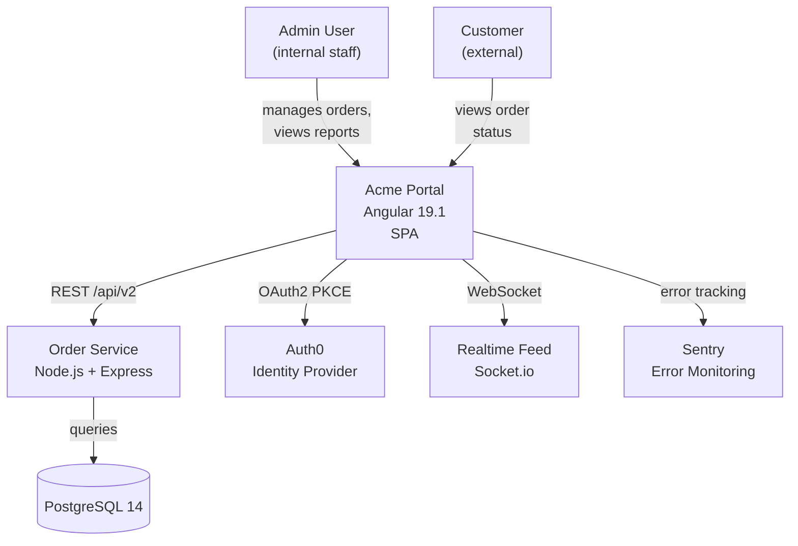
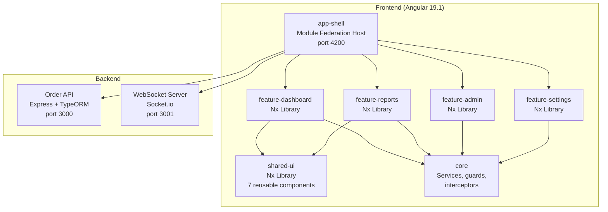
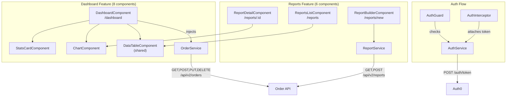

## Context

A new developer needs to understand an Angular project fast. This skill produces a comprehensive, always-current project walkthrough at C4 architecture depth. It reads project files, can invoke `angular-scan-*` skills for deeper analysis, and checks recent git history to understand how the project is evolving. Adapted for Angular-specific patterns: standalone components, signals, inject(), NgModules, and Angular-specific tooling.

## Inputs

- "Explain this Angular project" — interactive C4 walkthrough
- "Generate PROJECT.md" — produces a committable C4-structured project document
- "Explain the architecture" — focused on Level 2 (containers) and Level 3 (components)
- "What patterns does this project use?" — focused on Level 4 (code patterns)

## Steps

1. **Read project files** — open and extract key information from:
   - `package.json` — project name, version, Angular version (`@angular/core`), key dependencies (state management, UI library, HTTP, testing), scripts (start, build, test, lint, deploy).
   - `angular.json` or `nx.json` — project structure, build configurations, serve options, budgets.
   - `tsconfig.json` — strict mode, path aliases, target/module settings.
   - `README.md` — project description, setup instructions, architecture notes.

2. **Read Angular-specific config** — detect patterns and versions:
   - **Angular version**: read `@angular/core` version from `package.json`. Classify as: latest (v19), recent (v18), aging (v17), legacy (v16 or below).
   - **Standalone vs NgModule**: search for `standalone: true` in component decorators vs. `@NgModule` usage. Calculate the ratio.
   - **Signals adoption**: search for `signal(`, `computed(`, `effect(`, `input(`, `output(`, `model(` — count occurrences and identify which components use signals vs. traditional `@Input()`/`@Output()`.
   - **SSR config**: check for `@angular/ssr`, `@angular/platform-server`, or `server.ts` — detect server-side rendering setup.
   - **i18n**: check for `@angular/localize`, `transloco`, `ngx-translate` — detect internationalization approach.
   - **State management**: check for `@ngrx/store`, `@ngrx/signals`, `@ngxs/store`, `akita`, or plain service-based state.

3. **Read `references/angular/v19/architecture-patterns.md`** for current best-practice patterns to compare against. Note where the project aligns with or deviates from recommended patterns.

4. **Check for existing scan output** — if recent `angular-scan-arch` or `angular-scan-features` results exist in `.orch/references/scans/`, use them. Otherwise, invoke those scans. Note: This directory is created at runtime by scan skills. If no scan data exists, run `/angular-scan-arch` first or skip deep analysis.

5. **Read git history** — run:
   - `git log --oneline -5` — last 5 commits to understand current development focus.
   - `git shortlog -sn --since='3 months ago'` — recent contributors.
   - `git branch -a --sort=-committerdate | head -10` — active branches.
   - `git describe --tags --abbrev=0 2>/dev/null` — latest release tag.

6. **Determine explanation depth** based on the user's request:
   - **Overview** (default for "explain this project"): Levels 1-2 with brief Level 3. Suitable for a new team member's first day. Covers what the app does, how it is structured, and the key technologies.
   - **Detailed** (for "explain the architecture"): All 4 levels with full diagrams. Suitable for a developer about to contribute code. Covers module boundaries, service graphs, route maps, and data flows.
   - **Deep-dive** (for "what patterns does this project use?"): Focus on Level 4 with code examples. Suitable for an architect evaluating the codebase. Covers pattern adoption rates, migration status, technical debt, and comparison against best practices.

7. **Compose C4 output** at the appropriate depth:

   - **Level 1 — System Context**: infer from `HttpClient` base URLs, proxy configs, environment files, and auth service implementations.
     ```mermaid
     graph TD
         Admin["Admin User"] -->|manages| App["Acme Portal\nAngular 19"]
         Customer["Customer"] -->|views| App
         App -->|REST| API["Order API\nNode.js"]
         App -->|OAuth2| IDP["Auth0"]
         App -->|Events| WS["WebSocket Server"]
     ```

   - **Level 2 — Containers**: one box per Nx app/lib or major directory boundary. Show technology in each box.
     ```mermaid
     graph TD
         subgraph Frontend["Frontend (Angular 19)"]
             Shell["app-shell\nModule Federation Host"]
             DashLib["feature-dashboard\nNx Library"]
             ReportsLib["feature-reports\nNx Library"]
             SharedUI["shared-ui\nComponent Library"]
         end
         subgraph Backend
             API["Order API\nExpress + TypeORM"]
             AuthSvc["Auth Service\nPassport.js"]
         end
         Shell --> DashLib
         Shell --> ReportsLib
         DashLib --> SharedUI
         ReportsLib --> SharedUI
         Shell --> API
         Shell --> AuthSvc
     ```

   - **Level 3 — Components**: feature-level view with key components, services, and data flows. Show which components talk to which services and which services call which APIs.
     ```mermaid
     graph TD
         subgraph Dashboard["Dashboard Feature"]
             DC["DashboardComponent"] --> SC["StatsCardComponent"]
             DC --> CC["ChartComponent"]
             DC --> OS["OrderService"]
         end
         OS -->|GET /api/orders| API["Order API"]
         subgraph Reports["Reports Feature"]
             RL["ReportsListComponent"] --> DT["DataTableComponent"]
             RL --> RS["ReportService"]
         end
         RS -->|GET /api/reports| API
     ```

   - **Level 4 — Code Patterns**: show actual patterns found in the codebase with adoption rates.

8. **Cross-reference related code** — for each explained component/service, note:
   - Which other services it injects (dependency graph).
   - Which components use it (consumer list).
   - Which route(s) lead to it (route traceability).
   - Related test file (if exists) and coverage status.

   Example cross-reference block:
   ```
   OrderService (src/app/core/services/order.service.ts)
   ├── Injects: HttpClient, AuthService, CacheService
   ├── Used by: DashboardComponent, OrderDetailComponent, ReportService
   ├── Routes: /dashboard, /dashboard/:id
   ├── Tests: order.service.spec.ts (82% line coverage)
   └── Pattern: standalone injectable, providedIn: 'root', uses inject() function
   ```

9. **Add Angular-specific sections**:
   - **Pattern adoption table**: percentages for standalone, signals, inject(), OnPush, lazy loading.
   - **Migration readiness**: what would need to change to upgrade to the next Angular version or adopt newer patterns.
   - **Angular version status**: current version, latest available, EOL status.

10. **If generating PROJECT.md** — write the full document to `PROJECT.md` in the project root. Include a "Generated on" timestamp and a note that it should be regenerated periodically.

## Output

```markdown
## {Project Name} — Architecture Overview

### Level 1: System Context
What this system does, who uses it, and what external systems it depends on.



**In plain language**: Acme Portal is a web application that lets internal staff manage customer orders and generate reports. Customers can view their order status. The app authenticates via Auth0, fetches data from a Node.js REST API backed by PostgreSQL, receives real-time updates via WebSocket, and reports errors to Sentry.

### Level 2: Containers
The major deployable units and libraries in the system.



| Container | Type | Technology | Purpose |
|-----------|------|-----------|---------|
| `app-shell` | Application | Angular 19.1, Module Federation | Host application, routing, layout |
| `feature-dashboard` | Library | Angular standalone components | Order dashboard, charts, stats |
| `feature-reports` | Library | Angular standalone components | Report generation and export |
| `feature-admin` | Library | Angular standalone components | User management, role assignment |
| `feature-settings` | Library | Angular standalone components | User profile, preferences |
| `shared-ui` | Library | Angular Material, custom components | Reusable UI components (data table, chart, dialogs) |
| `core` | Library | Services, guards, interceptors | Authentication, HTTP, caching, error handling |

### Level 3: Components
Feature areas, key components, services, and data flows.



**Key Data Flow — Order Dashboard**:
1. User navigates to `/dashboard` (guarded by `AuthGuard`)
2. `DashboardComponent.ngOnInit()` calls `OrderService.getOrders()`
3. `OrderService` sends `GET /api/v2/orders` with auth token (added by `AuthInterceptor`)
4. Response is cached by `CacheService` (5-minute TTL)
5. `DashboardComponent` renders orders in `DataTableComponent` and stats in `StatsCardComponent`
6. `WebSocketService` subscribes to real-time order updates and pushes them to `OrderService` via a `BehaviorSubject`

### Level 4: Angular Patterns
| Pattern | Adoption | Count | Status | Notes |
|---------|----------|-------|--------|-------|
| Standalone components | 85% | 34/40 | Good | 6 legacy NgModule components remain in admin feature |
| `inject()` function | 70% | 28/40 | Migrating | Newer components use inject(), older use constructor DI |
| `OnPush` change detection | 75% | 30/40 | Good | 10 components still use Default strategy |
| Signals (`signal()`, `computed()`) | 30% | 12/40 | Early adoption | Dashboard feature adopted first, others pending |
| `input()` / `output()` signal functions | 15% | 6/40 | Early adoption | Only newest components |
| Lazy-loaded routes | 67% | 8/12 | Good | Auth routes are eager (intentional) |
| Typed reactive forms | 60% | 3/5 forms | Good | 2 forms still use untyped FormGroup |
| `provideHttpClient()` (functional) | Yes | — | Done | Fully migrated from HttpClientModule |
| Functional guards/resolvers | 50% | 3/6 | Migrating | 3 still use class-based guards |

### Tech Stack
| Library | Version | How It's Used | Where |
|---------|---------|---------------|-------|
| `@angular/core` | 19.1.0 | Framework | Everywhere |
| `@angular/material` | 19.0.0 | UI components (table, dialog, form fields, toolbar) | `shared-ui`, feature components |
| `@ngrx/signals` | 19.0.0 | Signal-based state management for dashboard feature | `feature-dashboard` |
| `rxjs` | 7.8.1 | Async data flows, HTTP, WebSocket | Services, components |
| `chart.js` + `ng2-charts` | 4.4.1 / 6.0.0 | Dashboard and report charts | `ChartComponent` |
| `@auth0/auth0-angular` | 2.2.0 | OAuth2 PKCE authentication | `core/services/auth.service.ts` |
| `socket.io-client` | 4.7.0 | Real-time order updates | `core/services/websocket.service.ts` |
| `@nrwl/nx` | 19.5.0 | Monorepo management, affected commands | Workspace root |
| `jest` | 29.7.0 | Unit and integration testing | All libraries |
| `@playwright/test` | 1.42.0 | End-to-end testing | `e2e/` directory |

### Recent Activity
**Last 5 commits:**
| Hash | Message | Author | Date |
|------|---------|--------|------|
| `a1b2c3d` | `feat(dashboard): add export-to-CSV button` | Alice Chen | 2 days ago |
| `e4f5g6h` | `fix(auth): handle token refresh race condition` | Bob Martinez | 3 days ago |
| `i7j8k9l` | `chore(deps): update Angular Material to 19.0.1` | Alice Chen | 5 days ago |
| `m0n1o2p` | `test(reports): add integration tests for report builder` | Carol Kim | 1 week ago |
| `q3r4s5t` | `refactor(core): migrate AuthGuard to functional guard` | Bob Martinez | 1 week ago |

**Active contributors (3 months):** Alice Chen (45%), Bob Martinez (37%), Carol Kim (10%), 2 others (8%)
**Active branches:** `main`, `develop`, `feature/PROJ-456-batch-export`, `feature/PROJ-489-dark-mode`, `bugfix/PROJ-501-filter-reset`
**Latest release:** `v2.4.1` (2026-03-18)

### Angular Health
| Metric | Value | Status | Notes |
|--------|-------|--------|-------|
| Angular version | 19.1.0 | Current | Latest stable is 19.1.x |
| TypeScript strict mode | Enabled | Good | `strict: true` in tsconfig |
| Standalone migration | 85% complete | Good | 6 components remaining |
| Signals migration | 30% complete | In progress | Dashboard feature done, others planned |
| `inject()` migration | 70% complete | In progress | Target: 100% by v2.6.0 |
| Zone.js removal readiness | Not ready | — | Signals adoption too low, zone.js still required |
| SSR / Hydration | Not configured | — | SPA-only deployment |
| Bundle size (initial) | 482 kB | Good | Under 500 kB budget |

### Cross-Reference Map (key services)
```
AuthService (src/app/core/services/auth.service.ts)
├── Injects: HttpClient, Router, TokenStorageService
├── Used by: AuthGuard, AuthInterceptor, HeaderComponent, LoginComponent
├── Routes: /login (direct), all guarded routes (indirect)
├── Tests: auth.service.spec.ts (78% line coverage)
└── Pattern: standalone, providedIn: 'root', uses inject()

OrderService (src/app/core/services/order.service.ts)
├── Injects: HttpClient, AuthService, CacheService
├── Used by: DashboardComponent, OrderDetailComponent, DashboardResolver
├── Routes: /dashboard, /dashboard/:id
├── Tests: order.service.spec.ts (82% line coverage)
└── Pattern: standalone, providedIn: 'root', uses inject()

ReportService (src/app/features/reports/services/report.service.ts)
├── Injects: HttpClient, AuthService
├── Used by: ReportsListComponent, ReportBuilderComponent, ReportExportComponent
├── Routes: /reports, /reports/new, /reports/:id, /reports/:id/export
├── Tests: report.service.spec.ts (45% line coverage) — NEEDS ATTENTION
└── Pattern: standalone, providedIn: 'root', constructor DI (not yet migrated to inject)
```
```

## Validation

- **C4 completeness**: all 4 C4 levels (System Context, Containers, Components, Code Patterns) must be present in the output. If the user requested a specific depth (overview, detailed, deep-dive), the output must match that depth while still including at minimum Levels 1 and 2.
- **Tech stack accuracy**: every library listed in the Tech Stack table must exist in `package.json` dependencies or devDependencies. The version must match `package.json`. The "How It's Used" column must describe actual usage, not generic descriptions — verify by searching for import statements of that library.
- **Mermaid syntax validity**: every Mermaid block must parse without error. Check: no unclosed subgraphs, no duplicate node IDs, all arrows use valid syntax, all labels are properly quoted if they contain special characters.
- **Git data accuracy**: the last 5 commits must match `git log --oneline -5` output. Contributor names and percentages must match `git shortlog -sn --since='3 months ago'`. The latest release tag must match `git describe --tags --abbrev=0`.
- **Pattern adoption accuracy**: percentages must be computed from actual code scanning, not estimated. Verify by spot-checking: count `standalone: true` occurrences vs. total component count. The adoption percentage must equal `(count_with_pattern / total_count) * 100`, rounded to nearest integer.
- **Cross-reference correctness**: for each service in the Cross-Reference Map, verify:
  - The "Injects" list matches the constructor parameters or `inject()` calls in the source file.
  - The "Used by" list includes only components/services that actually import and inject it.
  - The "Routes" list includes only routes whose components use this service (directly or via a resolver).
- **No unwarranted file modifications**: if the user did not request `--generate` or "Generate PROJECT.md", no files should be created or modified. If `PROJECT.md` generation was requested, only `PROJECT.md` at the project root should be created/modified.
- **Explanation depth match**: if the user asked for an "overview", the output should not include deep-dive code examples. If the user asked for a "deep-dive", the output should include concrete code snippets and pattern examples, not just high-level descriptions.
