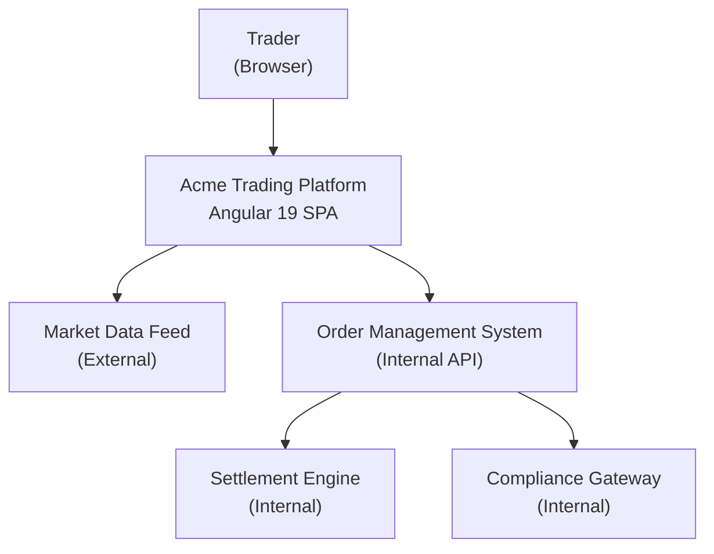
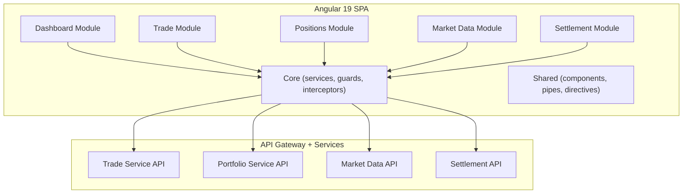

<!-- Example output from /angular-explain — see SKILL.md for usage -->
# Project Overview: Acme Trading Platform

**Generated:** 2026-03-25T14:30:00Z
**Root:** `apps/trading-platform/`
**Angular version:** 19.2.1

---

## C4 Level 1 — System Context

---

## C4 Level 2 — Container Diagram

---

## Technology Stack

| Layer          | Technology         | Version | Purpose                        |
|----------------|--------------------|---------|--------------------------------|
| Framework      | Angular            | 19.2.1  | SPA framework                  |
| Build          | Nx                 | 20.3.0  | Monorepo tooling               |
| UI Components  | PrimeNG            | 18.2.0  | Data tables, forms, dialogs    |
| Data Grid      | AG Grid            | 32.4.0  | Positions and holdings grids   |
| Design System  | HDS                | 3.1.0   | Tokens, typography, layout     |
| State          | Angular Signals    | built-in| Reactive state management      |
| HTTP           | HttpClient         | built-in| API communication              |
| Streaming      | RxJS + WebSocket   | 7.8.1   | Real-time price updates        |
| Testing        | Jest               | 29.7.0  | Unit tests                     |
| E2E            | Playwright         | 1.49.0  | End-to-end tests               |
| Linting        | ESLint             | 9.18.0  | Code quality                   |

---

## Pattern Adoption Metrics

| Pattern                    | Adoption | Files | Notes                           |
|----------------------------|----------|-------|---------------------------------|
| Standalone components      | 100%     | 48/48 | Fully migrated from NgModules   |
| Signal-based state         | 92%      | 44/48 | 4 components still use BehaviorSubject |
| `inject()` function        | 88%      | 42/48 | 6 services use constructor injection  |
| `@for` / `@if` control flow | 85%    | 41/48 | 7 templates still use *ngIf/*ngFor    |
| OnPush change detection    | 96%      | 46/48 | 2 components use Default strategy     |
| Typed reactive forms       | 100%     | 12/12 | All forms use typed FormGroup         |
| `input()` signal function  | 78%      | 25/32 | 7 components still use `@Input()`     |

---

## Angular Health Assessment

| Dimension       | Score | Grade | Detail                                                    |
|-----------------|-------|-------|-----------------------------------------------------------|
| Modernity       | 88/100| A-    | Strong signal and standalone adoption; minor legacy in control flow |
| Performance     | 92/100| A     | OnPush is near-universal; lazy loading on all feature routes |
| Testability     | 84/100| B+    | Good unit coverage; some services lack edge case tests    |
| Maintainability | 86/100| A-    | Consistent patterns; TSDoc coverage could improve (68.5%) |
| Security        | 90/100| A     | CSP headers configured; no raw innerHTML; JWT rotation    |
| Accessibility   | 78/100| B     | ARIA on tables and forms; missing live regions for streams |
| **Composite**   | **86/100** | **A-** | **Production-ready with targeted improvements needed** |

---

## Cross-Reference Map: Key Services

| Service                  | Consumers                              | Dependencies                     |
|--------------------------|----------------------------------------|----------------------------------|
| `TradeService`           | TradeFormComponent, TradeHistoryComponent | HttpClient, AuthInterceptor    |
| `PortfolioService`       | DashboardComponent, PositionsComponent | HttpClient, CacheInterceptor     |
| `MarketDataService`      | PriceDisplayComponent, WatchlistComponent | WebSocket, RxJS shareReplay   |
| `SettlementService`      | SettlementStatusComponent              | HolidayCalendarService           |
| `AuthService`            | AuthInterceptor, AuthGuard, HeaderComponent | HttpClient, TokenStorageService |
| `HolidayCalendarService` | SettlementService                      | HttpClient (fetches calendar)    |
| `NotificationService`    | All feature components                 | PrimeNG MessageService           |

---

## Observations

1. **Signal migration is nearly complete.** Four remaining `BehaviorSubject` instances are in the MarketData module where RxJS operators (e.g., `switchMap`, `retryWhen`) are used for WebSocket management. These are acceptable exceptions.
2. **Control flow migration** should be prioritized for the 7 remaining templates to reach 100% before Angular 20 deprecates structural directives.
3. **TSDoc coverage at 68.5%** is below the 75% target. The largest gaps are in the Settlements module services.
4. **Accessibility** needs attention on live price regions (`aria-live`) and keyboard navigation in the AG Grid positions table.
