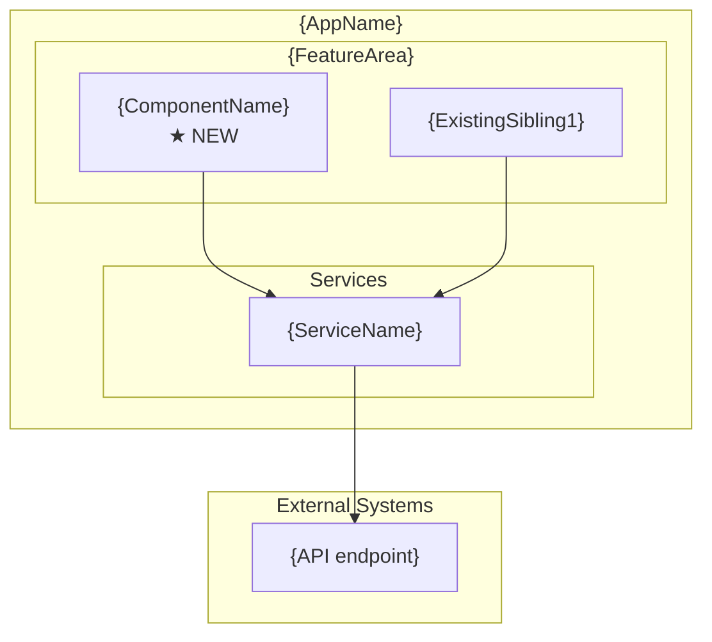
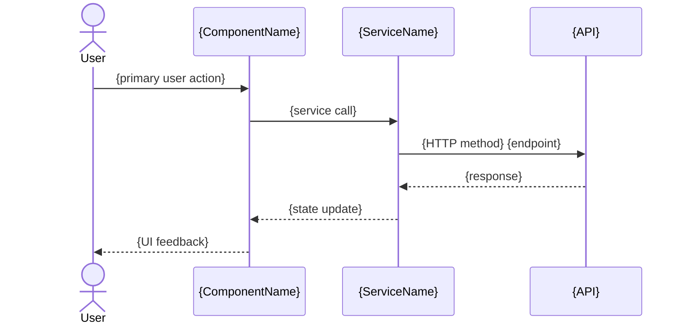

## Context

Generates a single Angular component following current v19 best practices: standalone (no NgModule), OnPush change detection, signal-based inputs/outputs, `inject()` for DI, HDS design tokens for theming, and data-testid attributes for test automation. Every public API gets TSDoc. A `.spec.ts` file is co-located with the component.

## Inputs

- **Component name** — PascalCase or kebab-case (e.g., `TradeConfirmation` or `trade-confirmation`).
- **Feature path** — Where to place the component (e.g., `src/app/features/trade`). Defaults to current working directory.
- **Inputs/Outputs** (optional) — Signal inputs and output emitters the component should declare.
- **Dependencies** (optional) — Services to inject (e.g., `TradeService`, `LoggingService`).
- **HDS tokens** (optional) — Specific design tokens to use in the SCSS (e.g., `--hds-color-surface`, `--hds-space-md`).

## Steps

1. **Detect project context.** Read `angular.json` or `project.json` to confirm Angular version, prefix, and style format (scss/css).
2. **Load reference.** Read [references/angular/v19/component-patterns.md](references/angular/v19/component-patterns.md) for current patterns and conventions.
3. **Determine component name and path.** Normalize to kebab-case for files, PascalCase for the class.
4. **Generate the component TypeScript file** (`.component.ts`):
   - `standalone: true` in `@Component` decorator.
   - `changeDetection: ChangeDetectionStrategy.OnPush`.
   - Signal inputs via `input()` / `input.required()`.
   - Output via `output()`.
   - Dependencies via `inject()` — not constructor injection.
   - TSDoc on the class and every public member.
5. **Generate the template file** (`.component.html`):
   - Use `@if` / `@for` / `@switch` control flow (not structural directives).
   - Add `data-testid` attributes on interactive and key elements.
6. **Generate the styles file** (`.component.scss`):
   - Use HDS design tokens (`var(--hds-*)`) for colors, spacing, typography.
   - `:host` block with `display: block`.
7. **Generate the test file** (`.component.spec.ts`):
   - Use `TestBed.configureTestingModule` with the standalone component.
   - Test default rendering, input binding, output emission.
   - Mock injected services.
8. **Run build verification.** Execute `ng build` (or `nx build`) to confirm the component compiles.
9. **Run tests.** Execute `ng test --include=**/component-name*` to confirm the spec passes.

## Output

```markdown
## Component Generated — {ComponentName}

### Files Created
| File | Path | Purpose |
|------|------|---------|
| Component | `src/app/features/{feature}/{name}.component.ts` | Standalone, OnPush, signals |
| Template | `src/app/features/{feature}/{name}.component.html` | @if/@for, data-testid |
| Styles | `src/app/features/{feature}/{name}.component.scss` | HDS tokens, :host block |
| Test | `src/app/features/{feature}/{name}.component.spec.ts` | TestBed, mocked services |

Build: {pass|fail}
Tests: {pass|fail} ({count} specs)

### Architecture Decisions
| Decision | Choice | Rationale |
|----------|--------|-----------|
| Component type | Standalone | Angular 19 default. No NgModule overhead. Tree-shakeable. |
| Change detection | OnPush | Reduces unnecessary checks. Works with signals and async pipe. |
| Dependency injection | inject() | Functional style. No constructor boilerplate. Easier to test. |
| State management | {signals or observable} | {rationale based on use case — signals for local state, observable for streams} |
| Template syntax | @if/@for | Angular 19 control flow. Better performance than *ngIf/*ngFor. |
| Styling | HDS tokens | Org design system. Theme-aware. No hardcoded values. |

### Diagrams

#### Where This Fits (C4 Level 3 — Component in Container)

Note: Show the NEW component's position relative to existing components and services.

#### Component Data Flow
```mermaid
graph TD
    subgraph Component["{ComponentName}"]
        C[Component\nOnPush + signals]
    end
    subgraph Services["Injected Services"]
        S1[{ServiceName}\ninject()]
    end
    subgraph External["External"]
        API[{API endpoint}]
    end
    C --> S1
    S1 --> API
```

#### User Interaction


### Recommended next steps
- Add the component to a route or parent template.
- Run `/angular-hds-audit` to verify design system compliance.
- Run `/angular-elevate-audit` if platform services were integrated.
- Run `/angular-docs-generate` if additional documentation is needed.
```

## Validation

- All four files are created and syntactically correct.
- `ng build` passes with no errors.
- Component test file runs and all specs pass.
- Component uses `standalone: true` and `ChangeDetectionStrategy.OnPush`.
- No constructor injection — all DI uses `inject()`.
- TSDoc is present on the class and all public members.
- HDS tokens are used in SCSS (no hardcoded colors or spacing).
- `data-testid` attributes are present on key template elements.
- Linter passes with no new warnings.
