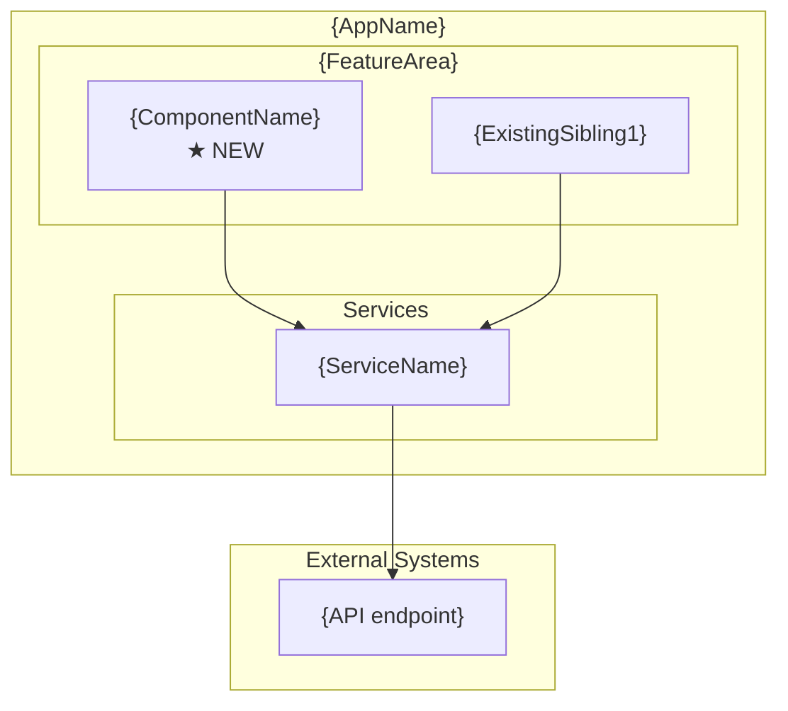
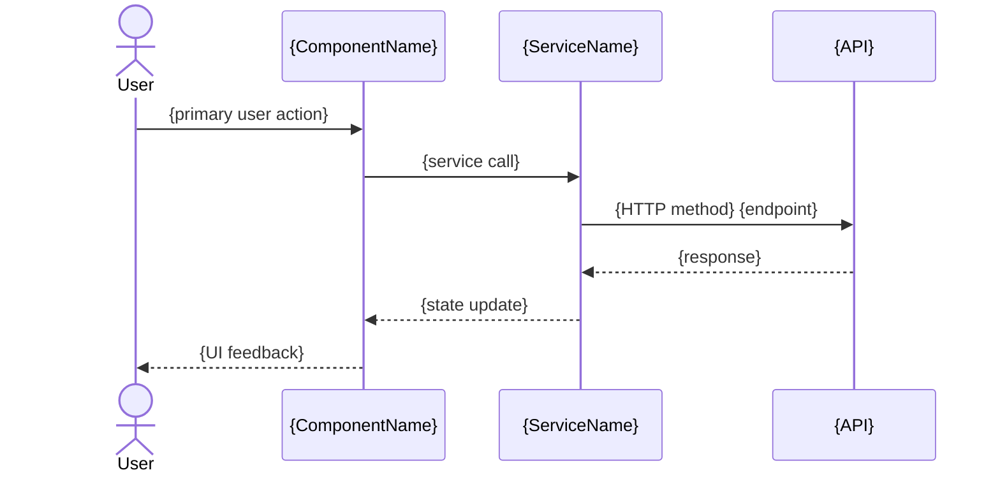

## Context

Generates a single Angular component following current v19 best practices: standalone (no NgModule), OnPush change detection, signal-based inputs/outputs, `inject()` for DI, HDS design tokens for theming, and data-testid attributes for test automation. Every public API gets TSDoc. A `.spec.ts` file is co-located with the component.

## Inputs

- **Component name** — PascalCase or kebab-case (e.g., `TradeConfirmation` or `trade-confirmation`).
- **Feature path** — Where to place the component (e.g., `src/app/features/trade`). Defaults to current working directory.
- **Inputs/Outputs** (optional) — Signal inputs and output emitters the component should declare.
- **Dependencies** (optional) — Services to inject (e.g., `TradeService`, `LoggingService`).
- **HDS tokens** (optional) — Specific design tokens to use in the SCSS (e.g., `--hds-color-surface`, `--hds-space-md`).

## Steps

1. **Detect project context.** Read `angular.json` or `project.json` to confirm Angular version, prefix, and style format (scss/css).
2. **Load reference.** Read [references/angular/v19/component-patterns.md](references/angular/v19/component-patterns.md) for current patterns and conventions.
3. **Determine component name and path.** Normalize to kebab-case for files, PascalCase for the class.

4. **Generate the component TypeScript file** (`.component.ts`):
   - `standalone: true` in `@Component` decorator.
   - `changeDetection: ChangeDetectionStrategy.OnPush`.
   - Signal inputs via `input()` / `input.required()`.
   - Output via `output()`.
   - Dependencies via `inject()` — not constructor injection.
   - TSDoc on the class and every public member.

   **Full example — `trade-confirmation.component.ts`:**
   ```typescript
   import {
     Component,
     ChangeDetectionStrategy,
     input,
     output,
     inject,
     computed,
   } from '@angular/core';
   import { CurrencyPipe, DatePipe } from '@angular/common';
   import { HdsButtonModule } from '@yourorg/hds/button';
   import { LoggingService } from '@yourorg/elevate/logging';

   /** Trade order to be confirmed. */
   export interface TradeOrder {
     symbol: string;
     type: 'buy' | 'sell';
     quantity: number;
     price: number;
     timestamp: Date;
   }

   /**
    * Displays a trade confirmation card with order details and confirm/cancel actions.
    *
    * @example
    * ```html
    * <app-trade-confirmation
    *   [order]="pendingOrder()"
    *   [showTimestamp]="true"
    *   (confirmed)="onConfirm($event)"
    *   (cancelled)="onCancel()">
    * </app-trade-confirmation>
    * ```
    */
   @Component({
     selector: 'app-trade-confirmation',
     standalone: true,
     imports: [CurrencyPipe, DatePipe, HdsButtonModule],
     templateUrl: './trade-confirmation.component.html',
     styleUrl: './trade-confirmation.component.scss',
     changeDetection: ChangeDetectionStrategy.OnPush,
   })
   export class TradeConfirmationComponent {
     /** The trade order to display for confirmation. */
     readonly order = input.required<TradeOrder>();

     /** Whether to show the order timestamp. Defaults to false. */
     readonly showTimestamp = input<boolean>(false);

     /** Emitted when the user confirms the trade order. */
     readonly confirmed = output<TradeOrder>();

     /** Emitted when the user cancels the trade order. */
     readonly cancelled = output<void>();

     private readonly logger = inject(LoggingService);

     /** Total cost computed from order price and quantity. */
     readonly totalCost = computed(() => this.order().price * this.order().quantity);

     /** Human-readable order summary. */
     readonly orderSummary = computed(() => {
       const o = this.order();
       return `${o.type.toUpperCase()} ${o.quantity} x ${o.symbol} @ $${o.price.toFixed(2)}`;
     });

     /** Handle confirm button click. */
     onConfirm(): void {
       this.logger.info('Trade confirmed', { context: 'TradeConfirmation', data: { symbol: this.order().symbol } });
       this.confirmed.emit(this.order());
     }

     /** Handle cancel button click. */
     onCancel(): void {
       this.logger.info('Trade cancelled', { context: 'TradeConfirmation', data: { symbol: this.order().symbol } });
       this.cancelled.emit();
     }
   }
   ```

5. **Generate the template file** (`.component.html`):
   - Use `@if` / `@for` / `@switch` control flow (not structural directives).
   - Add `data-testid` attributes on interactive and key elements.

   **Full example — `trade-confirmation.component.html`:**
   ```html
   <div class="trade-confirmation" data-testid="trade-confirmation">
     <div class="trade-confirmation__header">
       <h3 data-testid="order-summary">{{ orderSummary() }}</h3>
       @if (showTimestamp()) {
         <span class="trade-confirmation__timestamp" data-testid="order-timestamp">
           {{ order().timestamp | date:'medium' }}
         </span>
       }
     </div>

     <div class="trade-confirmation__details">
       <dl class="trade-confirmation__detail-list">
         <div class="trade-confirmation__detail-row">
           <dt>Symbol</dt>
           <dd data-testid="order-symbol">{{ order().symbol }}</dd>
         </div>
         <div class="trade-confirmation__detail-row">
           <dt>Type</dt>
           <dd data-testid="order-type">{{ order().type | titlecase }}</dd>
         </div>
         <div class="trade-confirmation__detail-row">
           <dt>Quantity</dt>
           <dd data-testid="order-quantity">{{ order().quantity }}</dd>
         </div>
         <div class="trade-confirmation__detail-row">
           <dt>Price</dt>
           <dd data-testid="order-price">{{ order().price | currency }}</dd>
         </div>
         <div class="trade-confirmation__detail-row trade-confirmation__detail-row--total">
           <dt>Total</dt>
           <dd data-testid="order-total">{{ totalCost() | currency }}</dd>
         </div>
       </dl>
     </div>

     <div class="trade-confirmation__actions">
       <hds-button
         variant="secondary"
         (click)="onCancel()"
         data-testid="cancel-btn">
         Cancel
       </hds-button>
       <hds-button
         variant="primary"
         (click)="onConfirm()"
         data-testid="confirm-btn">
         Confirm Trade
       </hds-button>
     </div>
   </div>
   ```

6. **Generate the styles file** (`.component.scss`):
   - Use HDS design tokens (`var(--hds-*)`) for colors, spacing, typography.
   - `:host` block with `display: block`.

   **Full example — `trade-confirmation.component.scss`:**
   ```scss
   :host {
     display: block;
   }

   .trade-confirmation {
     background-color: var(--hds-surface-primary);
     border: var(--hds-border-width-sm) solid var(--hds-border-default);
     border-radius: var(--hds-border-radius-md);
     padding: var(--hds-space-lg);
     max-width: 480px;
   }

   .trade-confirmation__header {
     display: flex;
     justify-content: space-between;
     align-items: baseline;
     margin-bottom: var(--hds-space-md);
     padding-bottom: var(--hds-space-sm);
     border-bottom: var(--hds-border-width-sm) solid var(--hds-border-subtle);

     h3 {
       font: var(--hds-type-heading-sm);
       color: var(--hds-text-primary);
       margin: 0;
     }
   }

   .trade-confirmation__timestamp {
     font: var(--hds-type-caption);
     color: var(--hds-text-tertiary);
   }

   .trade-confirmation__detail-list {
     display: grid;
     grid-template-columns: 1fr;
     gap: var(--hds-space-xs);
     margin: 0;
     padding: 0;
   }

   .trade-confirmation__detail-row {
     display: flex;
     justify-content: space-between;
     padding: var(--hds-space-xs) 0;

     dt {
       font: var(--hds-type-body-sm);
       color: var(--hds-text-secondary);
     }

     dd {
       font: var(--hds-type-body-sm);
       color: var(--hds-text-primary);
       margin: 0;
       font-weight: 500;
     }

     &--total {
       border-top: var(--hds-border-width-sm) solid var(--hds-border-subtle);
       padding-top: var(--hds-space-sm);
       margin-top: var(--hds-space-xs);

       dt, dd {
         font: var(--hds-type-body-lg);
         font-weight: 600;
       }
     }
   }

   .trade-confirmation__actions {
     display: flex;
     justify-content: flex-end;
     gap: var(--hds-space-sm);
     margin-top: var(--hds-space-lg);
   }
   ```

7. **Generate the test file** (`.component.spec.ts`):
   - Use `TestBed.configureTestingModule` with the standalone component.
   - Test default rendering, input binding, output emission.
   - Mock injected services.

   **Full example — `trade-confirmation.component.spec.ts`:**
   ```typescript
   import { ComponentFixture, TestBed } from '@angular/core/testing';
   import { TradeConfirmationComponent, TradeOrder } from './trade-confirmation.component';
   import { LoggingService } from '@yourorg/elevate/logging';

   describe('TradeConfirmationComponent', () => {
     let component: TradeConfirmationComponent;
     let fixture: ComponentFixture<TradeConfirmationComponent>;
     let loggerSpy: jest.Mocked<LoggingService>;

     const mockOrder: TradeOrder = {
       symbol: 'AAPL',
       type: 'buy',
       quantity: 100,
       price: 150.50,
       timestamp: new Date('2025-01-15T10:30:00'),
     };

     beforeEach(async () => {
       loggerSpy = { info: jest.fn(), error: jest.fn(), warn: jest.fn(), debug: jest.fn() } as any;

       await TestBed.configureTestingModule({
         imports: [TradeConfirmationComponent],
         providers: [
           { provide: LoggingService, useValue: loggerSpy },
         ],
       }).compileComponents();

       fixture = TestBed.createComponent(TradeConfirmationComponent);
       component = fixture.componentInstance;
       fixture.componentRef.setInput('order', mockOrder);
       fixture.detectChanges();
     });

     it('should create', () => {
       expect(component).toBeTruthy();
     });

     it('should display order summary', () => {
       const summary = fixture.nativeElement.querySelector('[data-testid="order-summary"]');
       expect(summary.textContent).toContain('BUY 100 x AAPL');
     });

     it('should compute total cost', () => {
       expect(component.totalCost()).toBe(15050);
     });

     it('should hide timestamp by default', () => {
       const timestamp = fixture.nativeElement.querySelector('[data-testid="order-timestamp"]');
       expect(timestamp).toBeNull();
     });

     it('should show timestamp when showTimestamp is true', () => {
       fixture.componentRef.setInput('showTimestamp', true);
       fixture.detectChanges();
       const timestamp = fixture.nativeElement.querySelector('[data-testid="order-timestamp"]');
       expect(timestamp).toBeTruthy();
     });

     it('should emit confirmed with order when confirm clicked', () => {
       const spy = jest.fn();
       component.confirmed.subscribe(spy);

       const btn = fixture.nativeElement.querySelector('[data-testid="confirm-btn"]');
       btn.click();

       expect(spy).toHaveBeenCalledWith(mockOrder);
       expect(loggerSpy.info).toHaveBeenCalledWith(
         'Trade confirmed',
         expect.objectContaining({ context: 'TradeConfirmation' }),
       );
     });

     it('should emit cancelled when cancel clicked', () => {
       const spy = jest.fn();
       component.cancelled.subscribe(spy);

       const btn = fixture.nativeElement.querySelector('[data-testid="cancel-btn"]');
       btn.click();

       expect(spy).toHaveBeenCalled();
     });

     it('should display all order details', () => {
       const symbol = fixture.nativeElement.querySelector('[data-testid="order-symbol"]');
       const type = fixture.nativeElement.querySelector('[data-testid="order-type"]');
       const quantity = fixture.nativeElement.querySelector('[data-testid="order-quantity"]');

       expect(symbol.textContent).toContain('AAPL');
       expect(type.textContent).toContain('Buy');
       expect(quantity.textContent).toContain('100');
     });
   });
   ```

8. **Run build verification.** Execute `ng build` (or `nx build`) to confirm the component compiles.
9. **Run tests.** Execute `ng test --include=**/component-name*` to confirm the spec passes.

## Output

```markdown
## Component Generated — {ComponentName}

### Files Created
| File | Path | Purpose |
|------|------|---------|
| Component | `src/app/features/{feature}/{name}.component.ts` | Standalone, OnPush, signals |
| Template | `src/app/features/{feature}/{name}.component.html` | @if/@for, data-testid |
| Styles | `src/app/features/{feature}/{name}.component.scss` | HDS tokens, :host block |
| Test | `src/app/features/{feature}/{name}.component.spec.ts` | TestBed, mocked services |

Build: {pass|fail}
Tests: {pass|fail} ({count} specs)

### Architecture Decisions
| Decision | Choice | Rationale |
|----------|--------|-----------|
| Component type | Standalone | Angular 19 default. No NgModule overhead. Tree-shakeable. |
| Change detection | OnPush | Reduces unnecessary checks. Works with signals and async pipe. |
| Dependency injection | inject() | Functional style. No constructor boilerplate. Easier to test. |
| State management | {signals or observable} | {rationale based on use case — signals for local state, observable for streams} |
| Template syntax | @if/@for | Angular 19 control flow. Better performance than *ngIf/*ngFor. |
| Styling | HDS tokens | Org design system. Theme-aware. No hardcoded values. |

### Diagrams

#### Where This Fits (C4 Level 3 — Component in Container)

Note: Show the NEW component's position relative to existing components and services.

#### Component Data Flow
```mermaid
graph TD
    subgraph Component["{ComponentName}"]
        C[Component\nOnPush + signals]
    end
    subgraph Services["Injected Services"]
        S1[{ServiceName}\ninject()]
    end
    subgraph External["External"]
        API[{API endpoint}]
    end
    C --> S1
    S1 --> API
```

#### User Interaction


### Recommended next steps
- Add the component to a route or parent template.
- Run `/angular-hds-audit` to verify design system compliance.
- Run `/angular-elevate-audit` if platform services were integrated.
- Run `/angular-docs-generate` if additional documentation is needed.
```

## Validation

- All four files are created and syntactically correct.
- `ng build` passes with no errors.
- Component test file runs and all specs pass.
- Component uses `standalone: true` and `ChangeDetectionStrategy.OnPush`.
- No constructor injection — all DI uses `inject()`.
- TSDoc is present on the class and all public members.
- HDS tokens are used in SCSS (no hardcoded colors or spacing).
- `data-testid` attributes are present on key template elements.
- Linter passes with no new warnings.
