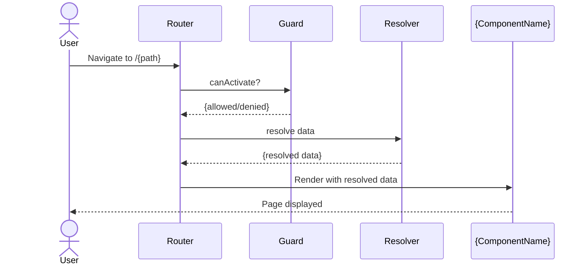

## Context

Generates Angular route configuration following v19 best practices: functional route guards, functional resolvers, lazy loading via `loadComponent` (standalone) or `loadChildren` (feature routes), typed route data, and title strategy integration. Updates the appropriate `routes.ts` or `app.routes.ts` file.

## Inputs

- **Route path** — The URL path (e.g., `trades/:id`, `portfolio`).
- **Component** — The component to render (existing or to be generated).
- **Guards** (optional) — Access control needs (e.g., "require auth", "confirm unsaved changes").
- **Resolver** (optional) — Data to pre-fetch (e.g., "load trade by ID from route param").
- **Children** (optional) — Nested child routes.
- **Title** (optional) — Page title for the route (used by TitleStrategy).

## Steps

1. **Detect project context.** Read `angular.json` or `project.json` to confirm Angular version and routing setup.
2. **Load reference.** Read [references/angular/v19/routing-guide.md](references/angular/v19/routing-guide.md) for current patterns and conventions.
3. **Locate the target routes file.** Find the nearest `routes.ts`, `app.routes.ts`, or `*.routes.ts` that should receive the new route.
4. **Generate route guard(s)** if requested (`.guard.ts`):
   - Use functional guards (`CanActivateFn`, `CanDeactivateFn`) — not class-based.
   - Inject auth/permission services via `inject()`.
   - TSDoc on the guard function.
   - Co-located `.guard.spec.ts` with tests.
5. **Generate resolver** if requested (`.resolver.ts`):
   - Use functional resolver (`ResolveFn<T>`) — not class-based.
   - Inject data services via `inject()`.
   - Handle errors gracefully (redirect on 404, log on failure).
   - TSDoc on the resolver function.
   - Co-located `.resolver.spec.ts` with tests.
6. **Update the routes file** with the new route configuration:
   - Lazy load via `loadComponent: () => import(...)`.
   - Attach guards, resolvers, title, and route data.
   - Maintain alphabetical or logical ordering of sibling routes.
7. **Generate the routed component** if it does not exist (delegate to `/angular-generate-component`).
8. **Run build verification.** Execute `ng build` (or `nx build`) to confirm routing compiles.
9. **Run tests.** Execute tests for new guard/resolver files.

## Output

```markdown
## Route Generated — {path}

### Files Created
| File | Path | Purpose |
|------|------|---------|
| Routes | `src/app/{feature}/{feature}.routes.ts` | Updated with lazy-loaded route |
| Guard | `src/app/{feature}/{name}.guard.ts` | Functional guard (canActivate) |
| Guard Test | `src/app/{feature}/{name}.guard.spec.ts` | Auth + role test cases |
| Resolver | `src/app/{feature}/{name}.resolver.ts` | Pre-fetch data before navigation |
| Resolver Test | `src/app/{feature}/{name}.resolver.spec.ts` | Success + error cases |

Route: `/{path}` → `{ComponentName}` (lazy loaded)
Guards: {list}
Resolvers: {list}
Build: {pass|fail}
Tests: {pass|fail}

### Architecture Decisions
| Decision | Choice | Rationale |
|----------|--------|-----------|
| Loading strategy | Lazy (loadComponent) | Reduces initial bundle. Component loaded on demand. |
| Guard style | Functional (canActivateFn) | Angular 19 standard. No class boilerplate. |
| Resolver style | Functional (ResolveFn) | Same — functional, typed, tree-shakeable. |
| Auth integration | ElevateAuthGuard | Org standard SSO guard. Not custom auth. |

### Diagrams

#### Route Navigation Flow


### Recommended next steps
- Add navigation links to the new route.
- Verify guard logic with e2e tests.
- Run `/angular-docs-generate` for TSDoc on guard and resolver.
```

## Validation

- Route is added to the correct routes file.
- Lazy loading is used (`loadComponent` or `loadChildren`).
- Guards are functional (not class-based).
- Resolvers are functional with proper typing (`ResolveFn<T>`).
- `ng build` passes with no errors.
- All new test files run and pass.
- No circular dependencies introduced.
- TSDoc is present on guards and resolvers.
- Linter passes with no new warnings.
