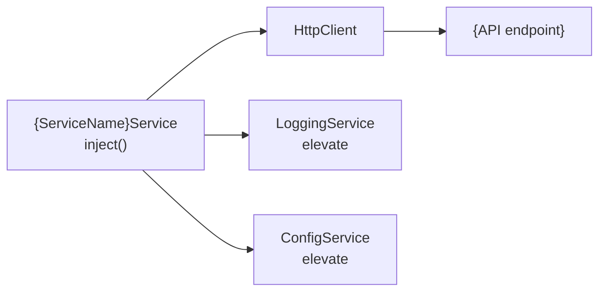

## Context

Generates an Angular service following v19 best practices: `providedIn: 'root'` for tree-shakable injection, `inject()` function instead of constructor injection, `@yourorg/elevate` LoggingService for structured logging, ConfigService for environment configuration, and typed error handling. A `.spec.ts` file is co-located with the service.

## Inputs

- **Service name** — PascalCase or kebab-case (e.g., `TradeExecution` or `trade-execution`).
- **Feature path** — Where to place the service (e.g., `src/app/features/trade`). Defaults to current working directory.
- **Methods** (optional) — Public methods the service should expose, with brief descriptions.
- **HTTP endpoints** (optional) — REST endpoints the service will call (e.g., `GET /api/trades`).
- **Dependencies** (optional) — Other services to inject (e.g., `HttpClient`, `ConfigService`).

## Steps

1. **Detect project context.** Read `angular.json` or `project.json` to confirm Angular version and project structure.
2. **Load reference.** Read [references/angular/v19/service-patterns.md](references/angular/v19/service-patterns.md) for current patterns and conventions.
3. **Determine service name and path.** Normalize to kebab-case for files, PascalCase for the class.
4. **Generate the service TypeScript file** (`.service.ts`):
   - `@Injectable({ providedIn: 'root' })`.
   - Dependencies via `inject()` — not constructor injection.
   - Inject `LoggingService` from `@yourorg/elevate` for structured logging.
   - Inject `ConfigService` for base URLs and environment-specific config.
   - HTTP methods return typed Observables or signals as appropriate.
   - Error handling with `catchError` and structured logging of failures.
   - TSDoc on the class and every public method.
5. **Generate the test file** (`.service.spec.ts`):
   - Use `TestBed.configureTestingModule`.
   - Mock `HttpClient` with `HttpClientTestingModule` / `provideHttpClientTesting()`.
   - Mock `LoggingService` and `ConfigService`.
   - Test success paths, error paths, and logging calls.
6. **Run build verification.** Execute `ng build` (or `nx build`) to confirm the service compiles.
7. **Run tests.** Execute `ng test --include=**/service-name*` to confirm the spec passes.

## Output

```markdown
## Service Generated — {ServiceName}Service

### Files Created
| File | Path | Purpose |
|------|------|---------|
| Service | `src/app/features/{feature}/{name}.service.ts` | inject(), LoggingService, ConfigService |
| Test | `src/app/features/{feature}/{name}.service.spec.ts` | Mocked HTTP, error cases |

Build: {pass|fail}
Tests: {pass|fail} ({count} specs)

### Architecture Decisions
| Decision | Choice | Rationale |
|----------|--------|-----------|
| DI pattern | inject() | Functional style. No constructor boilerplate. |
| Logging | LoggingService (elevate) | Org standard. Structured logs. No console.log. |
| Config | ConfigService (elevate) | Centralized config. No hardcoded URLs or environment.ts abuse. |
| Error handling | catchError + LoggingService | Every HTTP call wrapped. Errors logged with context. |
| Return type | {Observable or Signal} | {rationale: Observable for HTTP streams, Signal for cached state} |

### Diagrams

#### Service Dependency Graph


### Recommended next steps
- Inject the service into components that need it.
- Run `/angular-elevate-audit` to verify elevate integration.
- Run `/angular-docs-generate` if additional documentation is needed.
```

## Validation

- Both files are created and syntactically correct.
- `ng build` passes with no errors.
- Service test file runs and all specs pass.
- Service uses `providedIn: 'root'` and `inject()` for DI.
- No constructor injection.
- LoggingService is injected and used for error logging.
- ConfigService is injected for environment-aware configuration.
- TSDoc is present on the class and all public methods.
- Error handling is present on all HTTP calls.
- Linter passes with no new warnings.
