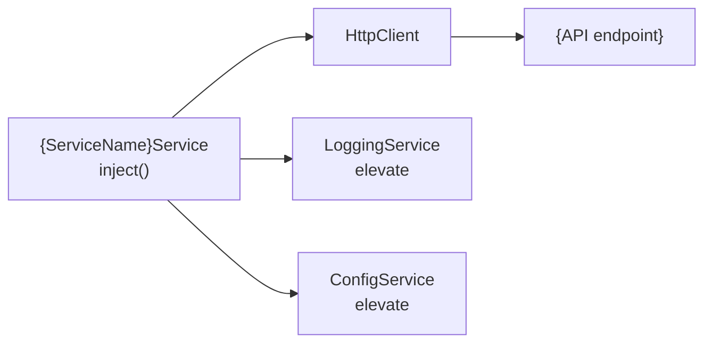

## Context

Generates an Angular service following v19 best practices: `providedIn: 'root'` for tree-shakable injection, `inject()` function instead of constructor injection, `@yourorg/elevate` LoggingService for structured logging, ConfigService for environment configuration, and typed error handling. A `.spec.ts` file is co-located with the service.

## Inputs

- **Service name** — PascalCase or kebab-case (e.g., `TradeExecution` or `trade-execution`).
- **Feature path** — Where to place the service (e.g., `src/app/features/trade`). Defaults to current working directory.
- **Methods** (optional) — Public methods the service should expose, with brief descriptions.
- **HTTP endpoints** (optional) — REST endpoints the service will call (e.g., `GET /api/trades`).
- **Dependencies** (optional) — Other services to inject (e.g., `HttpClient`, `ConfigService`).

## Steps

1. **Detect project context.** Read `angular.json` or `project.json` to confirm Angular version and project structure.
2. **Load reference.** Read [references/angular/v19/service-patterns.md](references/angular/v19/service-patterns.md) and [references/angular/v19/state-management-guide.md](references/angular/v19/state-management-guide.md) for current patterns and conventions.
3. **Determine service name and path.** Normalize to kebab-case for files, PascalCase for the class.
4. **Generate the service TypeScript file** (`.service.ts`):
   - `@Injectable({ providedIn: 'root' })`.
   - Dependencies via `inject()` — not constructor injection.
   - Inject `LoggingService` from `@yourorg/elevate` for structured logging.
   - Inject `ConfigService` for base URLs and environment-specific config.
   - HTTP methods return typed Observables or signals as appropriate.
   - Error handling with `catchError` and structured logging of failures.
   - TSDoc on the class and every public method.
5. **Generate the test file** (`.service.spec.ts`):
   - Use `TestBed.configureTestingModule`.
   - Mock `HttpClient` with `HttpClientTestingModule` / `provideHttpClientTesting()`.
   - Mock `LoggingService` and `ConfigService`.
   - Test success paths, error paths, and logging calls.
6. **Run build verification.** Execute `ng build` (or `nx build`) to confirm the service compiles.
7. **Run tests.** Execute `ng test --include=**/service-name*` to confirm the spec passes.

### Generated Service Code Example

Below is a concrete example of the generated `trade-execution.service.ts`:

```typescript
import { Injectable, inject } from '@angular/core';
import { HttpClient, HttpErrorResponse } from '@angular/common/http';
import { Observable, catchError, throwError } from 'rxjs';
import { LoggingService } from '@yourorg/elevate';
import { ConfigService } from '@yourorg/elevate';
import { Trade, CreateTradeDTO, TradeExecutionResult } from '../models/trade.model';

/** Handles trade execution operations against the order management API. */
@Injectable({ providedIn: 'root' })
export class TradeExecutionService {
  private readonly http = inject(HttpClient);
  private readonly log = inject(LoggingService);
  private readonly config = inject(ConfigService);

  private get baseUrl(): string {
    return this.config.get<string>('api.baseUrl');
  }

  /** Submit a new trade order for execution. */
  submitOrder(dto: CreateTradeDTO): Observable<TradeExecutionResult> {
    this.log.info('Submitting trade order', { symbol: dto.symbol, side: dto.side });
    return this.http
      .post<TradeExecutionResult>(`${this.baseUrl}/trades/execute`, dto)
      .pipe(catchError((err) => this.handleError('submitOrder', err)));
  }

  /** Retrieve all trades for the current user. */
  getTrades(): Observable<Trade[]> {
    return this.http
      .get<Trade[]>(`${this.baseUrl}/trades`)
      .pipe(catchError((err) => this.handleError('getTrades', err)));
  }

  /** Cancel a pending trade by ID. */
  cancelTrade(tradeId: string): Observable<void> {
    this.log.info('Cancelling trade', { tradeId });
    return this.http
      .delete<void>(`${this.baseUrl}/trades/${tradeId}`)
      .pipe(catchError((err) => this.handleError('cancelTrade', err)));
  }

  private handleError(operation: string, error: HttpErrorResponse): Observable<never> {
    this.log.error(`${operation} failed`, {
      status: error.status,
      message: error.message,
      url: error.url,
    });
    return throwError(() => error);
  }
}
```

### Generated Spec File Structure

The co-located `trade-execution.service.spec.ts`:

```typescript
import { TestBed } from '@angular/core/testing';
import { HttpTestingController, provideHttpClientTesting } from '@angular/common/http/testing';
import { provideHttpClient } from '@angular/common/http';
import { TradeExecutionService } from './trade-execution.service';
import { LoggingService, ConfigService } from '@yourorg/elevate';

describe('TradeExecutionService', () => {
  let service: TradeExecutionService;
  let httpMock: HttpTestingController;
  const mockLog = { info: jest.fn(), error: jest.fn(), warn: jest.fn() };
  const mockConfig = { get: jest.fn().mockReturnValue('https://api.example.com') };

  beforeEach(() => {
    TestBed.configureTestingModule({
      providers: [
        provideHttpClient(),
        provideHttpClientTesting(),
        { provide: LoggingService, useValue: mockLog },
        { provide: ConfigService, useValue: mockConfig },
      ],
    });
    service = TestBed.inject(TradeExecutionService);
    httpMock = TestBed.inject(HttpTestingController);
  });

  afterEach(() => httpMock.verify());

  describe('submitOrder', () => {
    it('should POST to /trades/execute and return result', () => {
      const dto = { symbol: 'AAPL', quantity: 100, side: 'buy', orderType: 'market' };
      const mockResult = { tradeId: 'T-001', status: 'filled' };

      service.submitOrder(dto as any).subscribe((result) => {
        expect(result).toEqual(mockResult);
      });

      const req = httpMock.expectOne('https://api.example.com/trades/execute');
      expect(req.request.method).toBe('POST');
      expect(req.request.body).toEqual(dto);
      req.flush(mockResult);
    });

    it('should log error on HTTP failure', () => {
      const dto = { symbol: 'AAPL', quantity: 100, side: 'buy', orderType: 'market' };

      service.submitOrder(dto as any).subscribe({ error: () => {} });

      const req = httpMock.expectOne('https://api.example.com/trades/execute');
      req.flush('Server error', { status: 500, statusText: 'Internal Server Error' });
      expect(mockLog.error).toHaveBeenCalledWith('submitOrder failed', expect.any(Object));
    });
  });

  describe('getTrades', () => {
    it('should GET /trades and return array', () => {
      const mockTrades = [{ id: 'T-001', symbol: 'AAPL' }];

      service.getTrades().subscribe((trades) => {
        expect(trades).toEqual(mockTrades);
      });

      const req = httpMock.expectOne('https://api.example.com/trades');
      expect(req.request.method).toBe('GET');
      req.flush(mockTrades);
    });
  });
});
```

## Output

```markdown
## Service Generated — {ServiceName}Service

### Files Created
| File | Path | Purpose |
|------|------|---------|
| Service | `src/app/features/{feature}/{name}.service.ts` | inject(), LoggingService, ConfigService |
| Test | `src/app/features/{feature}/{name}.service.spec.ts` | Mocked HTTP, error cases |

Build: {pass|fail}
Tests: {pass|fail} ({count} specs)

### Architecture Decisions
| Decision | Choice | Rationale |
|----------|--------|-----------|
| DI pattern | inject() | Functional style. No constructor boilerplate. |
| Logging | LoggingService (elevate) | Org standard. Structured logs. No console.log. |
| Config | ConfigService (elevate) | Centralized config. No hardcoded URLs or environment.ts abuse. |
| Error handling | catchError + LoggingService | Every HTTP call wrapped. Errors logged with context. |
| Return type | {Observable or Signal} | {rationale: Observable for HTTP streams, Signal for cached state} |

### Diagrams

#### Service Dependency Graph


### Recommended next steps
- Inject the service into components that need it.
- Run `/angular-elevate-audit` to verify elevate integration.
- Run `/angular-docs-generate` if additional documentation is needed.
```

## Validation

- Both files are created and syntactically correct.
- `ng build` passes with no errors.
- Service test file runs and all specs pass.
- Service uses `providedIn: 'root'` and `inject()` for DI.
- No constructor injection.
- LoggingService is injected and used for error logging.
- ConfigService is injected for environment-aware configuration.
- TSDoc is present on the class and all public methods.
- Error handling is present on all HTTP calls.
- Linter passes with no new warnings.
