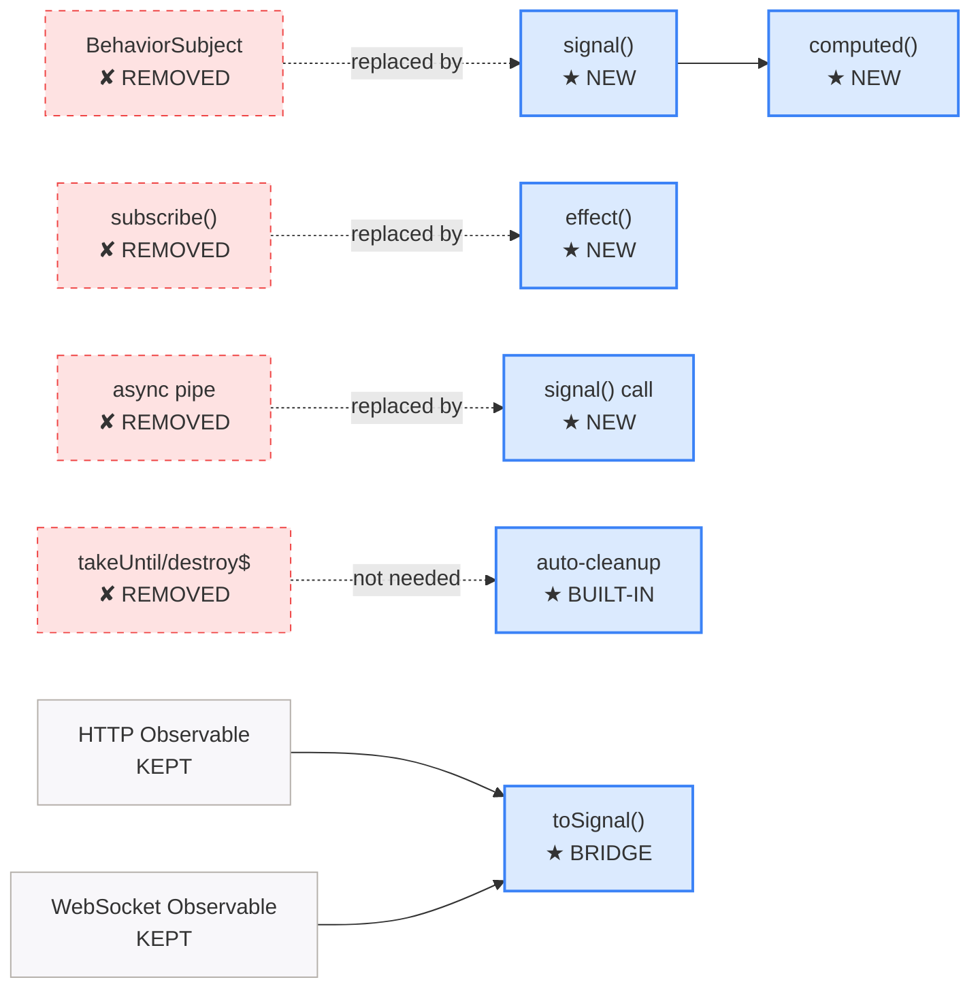

## Context

Migrates Angular applications from RxJS-heavy and decorator-based patterns to the signals API introduced in Angular 16+ and stabilized in v19. Converts `BehaviorSubject` to `signal()`, `Observable` subscriptions to `computed()` and `effect()`, `@Input()` to `input()` / `input.required()`, and `@Output()` to `output()`. Uses ts-morph for type-aware transforms where possible; the agent handles semantic conversions that require context understanding.

## Inputs

- **Scope** — Entire project, a specific feature, or individual files.
- **Depth** (optional) — `inputs-only` (just @Input/@Output), `state-only` (just component state), or `full` (default, everything).
- **Mode** (optional) — `--branch-only` (default) or `--worktree`.

### Helper Script

Run the detection script before executing steps manually:
```bash
node scripts/detect-signal-candidates.js [project-root]
```
The script outputs JSON to stdout with counts of @Input/@Output decorators, BehaviorSubjects, and subscribe() calls categorized by conversion complexity. Use this data to inform the steps below.

## Steps

1. **Pre-flight checks.**
   - Verify clean git state. Stop if dirty.
   - Create migration branch: `migrate/signals-{date}`.

2. **Analyze current state.**
   - Count `@Input()` decorators, `@Output()` decorators, `BehaviorSubject` instances, `subscribe()` calls in components.
   - Categorize by conversion complexity:
     - **Mechanical** (high confidence): `@Input()` to `input()`, `@Output()` to `output()`, simple `BehaviorSubject` to `signal()`.
     - **Semantic** (needs context): complex Observable chains, `combineLatest`, `switchMap` patterns.

3. **Load reference.** Read [references/angular/v19/signals-guide.md](references/angular/v19/signals-guide.md) and [references/angular/v19/state-management-guide.md](references/angular/v19/state-management-guide.md) for migration patterns and edge cases.

4. **Phase 1: Migrate @Input/@Output** (mechanical, ts-morph).
   - Run: `npx ts-node scripts/semantic/adapters/typescript/transform.ts signals --scope {path} --phase inputs`
   - Converts `@Input() name: string` to `name = input<string>()`.
   - Converts `@Input({ required: true })` to `input.required<string>()`.
   - Converts `@Output() clicked = new EventEmitter<void>()` to `clicked = output<void>()`.
   - Updates all template references to use signal call syntax (`name()` instead of `name`).
   - Build + test verification.
   - Commit checkpoint.

5. **Phase 2: Migrate component state** (mechanical, ts-morph).
   - Convert `BehaviorSubject<T>` to `signal<T>(initialValue)`.
   - Convert `.getValue()` / `.value` to direct signal read `()`.
   - Convert `.next(val)` to `.set(val)` or `.update(fn)`.
   - Convert `Observable` derived from BehaviorSubject to `computed()`.
   - Build + test verification.
   - Commit checkpoint.

6. **Phase 3: Migrate subscriptions** (semantic, agent-assisted).
   - Convert `ngOnInit` + `subscribe()` to `effect()` or `computed()`.
   - Convert `combineLatest` patterns to multiple `computed()` signals.
   - Remove manual `unsubscribe()` / `takeUntil` patterns (signals auto-clean up).
   - Identify Observables that must stay as Observables (HTTP calls, WebSocket streams).
   - Build + test verification.
   - Commit checkpoint.

7. **Phase 4: Clean up.**
   - Remove unused RxJS imports.
   - Remove `OnDestroy` implementations that only handled unsubscribe.
   - Remove `destroy$` subjects.
   - Build + test verification.
   - Commit checkpoint.

8. **Final verification.**
   - Full build and test suite.
   - Report signal adoption metrics.

## Output

```markdown
## Signals Migration Complete

| Phase | Conversion | Count | Tool |
|-------|-----------|-------|------|
| 1 | @Input → input() | {n} | ts-morph |
| 1 | @Output → output() | {n} | ts-morph |
| 2 | BehaviorSubject → signal() | {n} | ts-morph |
| 3 | subscribe() → effect()/computed() | {n} | agent |
| 4 | Cleanup (removed imports/destroy$) | {n} | agent |

Observables retained (intentionally): {n} (HTTP, WebSocket, etc.)
Build: {pass|fail}
Tests: {pass}/{total} passing

### State Management Change (Mermaid — single diagram showing transformation)
Produce ONE diagram showing removed, changed, and retained in the same view:

Legend: Red dashed = removed. Blue solid = new. Gray = retained (HTTP/WebSocket stay as Observables).
```

## Validation

- `ng build` passes after every phase and at completion.
- All `ng test` specs pass.
- No `@Input()` or `@Output()` decorators remain (unless third-party).
- `BehaviorSubject` count reduced to zero in component state (services may retain).
- Template references use signal call syntax (`property()` not `property`).
- No orphaned RxJS imports.
- No orphaned `takeUntil` / `destroy$` patterns.
- HTTP Observables remain as Observables (not incorrectly converted).
- Each phase has a git checkpoint.
