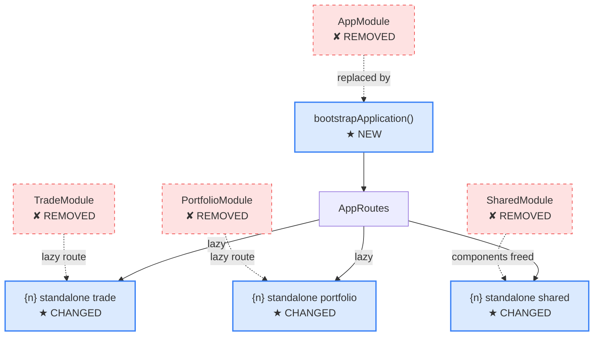

## Context

Migrates Angular applications from NgModule-based architecture to standalone components, directives, and pipes. Uses ts-morph for precise, type-aware transformations that resolve imports correctly and preserve formatting. The agent plans the migration; ts-morph executes it.

This is a multi-phase migration. Each phase produces a verifiable checkpoint.

## Inputs

- **Scope** — Entire project, a specific module, or a list of modules (e.g., `TradeModule`, `SharedModule`).
- **Mode** (optional) — `--branch-only` (default) or `--worktree` for isolated migration.
- **Auto mode** (optional) — `step-by-step`, `auto=safe` (default), or `auto=all`.

### Helper Script

Run the detection script before executing steps manually:
```bash
node scripts/detect-ngmodules.js [project-root]
```
The script outputs JSON to stdout with all NgModules found and their migration complexity classification. Use this data to inform the steps below.

## Steps

1. **Pre-flight checks.**
   - Check git state. If only `.github/`, `.orch/`, `.vscode/`, `node_modules/` are dirty — IGNORE (ORCH infrastructure). Only warn if source files (`src/`, `libs/`, `apps/`) are dirty. **NEVER stop for dirty git state.**
   - Record current branch as return point.
   - Create migration branch: `migrate/standalone-{date}`.

2. **Analyze current state.**
   - Read `angular.json` / `project.json` for project structure.
   - Run detection: count NgModules, components, directives, pipes.
   - Identify module dependency graph (which modules import which).

3. **Load reference.** Read [references/angular/v19/standalone-guide.md](references/angular/v19/standalone-guide.md) for migration patterns and edge cases.

4. **Plan migration order.**
   - Start with leaf modules (no dependents).
   - Work inward toward AppModule.
   - SharedModule migrates last (or is dissolved into individual exports).

5. **Execute migration per module** using ts-morph:
   - Run: `npx --prefix .orch ts-node .orch/scripts/semantic/adapters/typescript/transform.ts standalone --scope {module-path}`
   - ts-morph will:
     - Add `standalone: true` to each component/directive/pipe in the module.
     - Move module imports to each component's `imports` array.
     - Remove the component from the module's `declarations`.
     - Delete the module file if it becomes empty.
     - Update all import paths across the project.

6. **Verify after each module.**
   - Run `ng build` to confirm compilation.
   - Run `ng test` to confirm no regressions.
   - Commit checkpoint: `git commit -m "migrate: standalone — {ModuleName}"`.
   - Tag checkpoint: `git tag migrate/checkpoint-standalone-{module}`.

7. **Handle AppModule last.**
   - Convert to `bootstrapApplication()` with `appConfig`.
   - Move providers to `app.config.ts`.
   - Delete `app.module.ts`.

8. **Final verification.**
   - Full build: `ng build`.
   - Full test suite: `ng test`.
   - Pattern count: zero NgModules remaining (except third-party).

9. **Report results.**

## Output

```markdown
## Standalone Migration Complete

| Phase | Module | Components | Status |
|-------|--------|------------|--------|
| 1 | SharedModule | 12 | Migrated |
| 2 | TradeModule | 8 | Migrated |
| 3 | PortfolioModule | 5 | Migrated |
| 4 | AppModule | 1 | Converted to bootstrapApplication |

Modules removed: {count}
Components converted: {count}
Build: {pass|fail}
Tests: {pass}/{total} passing
Tool: ts-morph (type-aware, formatting-preserving)

### Checkpoints
- `migrate/checkpoint-standalone-shared`
- `migrate/checkpoint-standalone-trade`
- `migrate/checkpoint-standalone-portfolio`
- `migrate/checkpoint-standalone-app`

### Architecture Change (Mermaid — single diagram showing transformation)
Produce ONE diagram showing removed, changed, and new in the same view:

Legend: Red dashed = removed. Blue solid = new/changed. Arrows show what replaced what.
```

## Validation

- Zero NgModules remain in application code (third-party excluded).
- All components, directives, and pipes have `standalone: true`.
- `bootstrapApplication()` is used instead of `platformBrowserDynamic().bootstrapModule()`.
- `ng build` passes after every phase and at completion.
- Test count is same or higher after migration (no lost tests).
- All `ng test` specs pass.
- No orphaned module files.
- Import paths are correct across all files (ts-morph handles this).
- Each phase has a git checkpoint (commit + tag).
