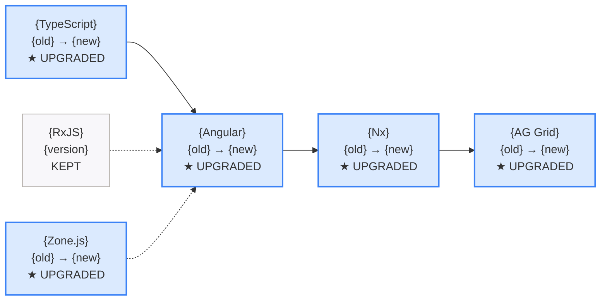

## Context

Upgrades Angular applications across major versions (e.g., 17 to 18 to 19). Uses `ng update` as the primary tool, supplemented by the compatibility matrix to ensure all dependent packages (TypeScript, RxJS, Zone.js, Angular CDK/Material, third-party libraries) are upgraded in the correct order. Each major version step is a separate phase with build + test verification.

## Inputs

- **Target version** — The Angular version to upgrade to (e.g., `19`, `18`).
- **Current version** (auto-detected) — Read from `package.json`.
- **Mode** (optional) — `--branch-only` (default) or `--worktree`.
- **Auto mode** (optional) — `step-by-step`, `auto=safe` (default), or `auto=all`.

### Helper Script

Run the detection script before executing steps manually:
```bash
node scripts/check-upgrade-path.js [project-root]
```
The script outputs JSON to stdout with the current Angular version, detected packages, and a recommended upgrade path. Use this data to inform the steps below.

## Steps

1. **Pre-flight checks.**
   - Verify clean git state. Stop if dirty.
   - Create migration branch: `migrate/angular-{target}-{date}`.
   - Read `package.json` to determine current Angular version and all Angular-related packages.

2. **Load references.**
   - Read [references/angular/v19/migration-guide.md](references/angular/v19/migration-guide.md) for version-specific guidance.
   - Read [references/angular/v19/compatibility-matrix.md](references/angular/v19/compatibility-matrix.md) for package version requirements.

3. **Plan upgrade path.**
   - Determine all steps needed (e.g., 17 to 18 to 19 — cannot skip major versions).
   - For each step, identify:
     - TypeScript version required.
     - RxJS version required.
     - Zone.js version required.
     - Node.js version required.
     - Angular CDK/Material version.
     - Third-party library compatibility (PrimeNG, AG Grid, NgRx, etc.).
   - Present the plan to the user.

4. **Execute each major version step** (one at a time):

   **a. Pre-step dependency updates.**
   - Update TypeScript to the version required by the target Angular version.
   - Update RxJS if required.
   - Update Zone.js if required.
   - Update Node.js type definitions.
   - Build + test to verify pre-step changes.
   - Commit checkpoint: `migrate: pre-step — TypeScript {version}, RxJS {version}`.

   **b. Run ng update for Angular core.**
   - Execute: `ng update @angular/core@{version} @angular/cli@{version}`.
   - Review and apply any automatic migrations (schematics).
   - Build + test to verify.
   - Commit checkpoint: `migrate: Angular {version} core update`.

   **c. Update Angular companion packages.**
   - `ng update @angular/cdk@{version}` and `@angular/material@{version}` if present.
   - Update `@angular/animations`, `@angular/forms`, `@angular/router` if not already updated.
   - Build + test to verify.
   - Commit checkpoint.

   **d. Update third-party packages.**
   - Update each third-party package to its compatible version per the matrix.
   - Build + test after each package.
   - Commit checkpoint.

   **e. Address breaking changes.**
   - Review Angular update guide for the target version.
   - Apply manual fixes for deprecated APIs, removed features, changed behavior.
   - Build + test to verify.
   - Commit checkpoint.

5. **Repeat step 4** for each major version jump until target is reached.

6. **Final verification.**
   - Full build: `ng build --configuration=production`.
   - Full test suite: `ng test`.
   - Full e2e if available.
   - Verify all Angular packages are on the same major version.

7. **Report results.**

## Output

```markdown
## Angular Version Upgrade Complete

| Step | From | To | Packages Updated | Status |
|------|------|----|-----------------|--------|
| 1 | 17.3 | 18.0 | @angular/core, cli, cdk, material | Pass |
| 2 | 18.0 | 19.0 | @angular/core, cli, cdk, material | Pass |

### Dependency Changes
| Package | Before | After |
|---------|--------|-------|
| @angular/core | 17.3.0 | 19.0.0 |
| TypeScript | 5.2 | 5.6 |
| RxJS | 7.8 | 7.8 |
| Zone.js | 0.14 | 0.15 |

Build: {pass|fail}
Tests: {pass}/{total} passing
Breaking changes addressed: {n}
Deprecation warnings: {n}

### Dependency Change Diagram (Mermaid — single diagram showing upgrades)
Produce ONE diagram showing all package changes in the upgrade:

Legend: Blue = upgraded (with old→new version). Gray = kept at current version. Arrows show dependency order.
```

## Validation

- All `@angular/*` packages are on the target major version.
- TypeScript version matches the compatibility matrix for the target Angular version.
- RxJS and Zone.js versions are compatible.
- `ng build --configuration=production` passes.
- All `ng test` specs pass.
- No deprecated API warnings that have removals in the target version.
- Third-party packages are on compatible versions.
- `ng version` shows the expected version.
- Each major version step has a git checkpoint.
- Test count after upgrade >= test count before upgrade.
