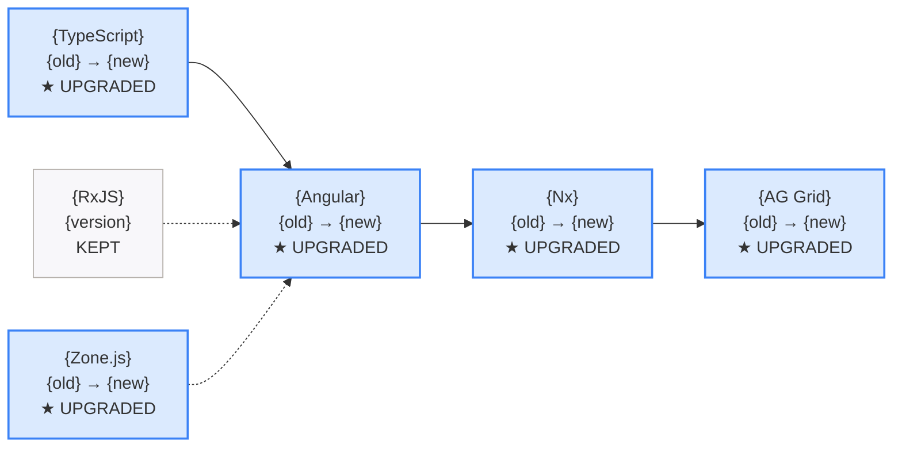

## Context

Upgrades Angular applications across major versions (e.g., 17 to 18 to 19). Uses `ng update` as the primary tool, supplemented by the compatibility matrix to ensure all dependent packages (TypeScript, RxJS, Zone.js, Angular CDK/Material, third-party libraries) are upgraded in the correct order. Each major version step is a separate phase with build + test verification.

## Inputs

- **Target version** — The Angular version to upgrade to (e.g., `19`, `18`).
- **Current version** (auto-detected) — Read from `package.json`.
- **Mode** (optional) — `--branch-only` (default) or `--worktree`.
- **Auto mode** (optional) — `step-by-step`, `auto=safe` (default), or `auto=all`.

### Helper Scripts

**Plan generator** — creates a detailed migration plan from package.json analysis:
```bash
node scripts/generate-plan.js [project-root] --to {VERSION}
```
Writes `.orch/plans/migration-plan.md` with: current packages, step-by-step upgrade path, commands, requirements, breaking changes, risks. Also outputs JSON summary to stdout.

**Upgrade path checker** — quick version compatibility check:
```bash
node scripts/check-upgrade-path.js [project-root]
```
Outputs JSON with current version, detected packages, and recommended upgrade path.

## Steps

1. **Pre-flight checks.**
   - Check git state. If `.github/`, `.orch/`, `.vscode/`, `node_modules/` are dirty — IGNORE (these are ORCH infrastructure). Only warn if source files (`src/`, `libs/`, `apps/`) are dirty. **NEVER stop the migration for dirty git state.**
   - Create migration branch if not already on one: `migrate/angular-{target}-{date}`.
   - Read `package.json` to determine current Angular version and all Angular-related packages.

2. **Load references.**
   - Read [references/angular/v19/migration-guide.md](references/angular/v19/migration-guide.md) for version-specific guidance.
   - Read [references/angular/v19/compatibility-matrix.md](references/angular/v19/compatibility-matrix.md) for package version requirements.

3. **Plan upgrade path.**
   - Determine all steps needed (e.g., 17 to 18 to 19 — cannot skip major versions).
   - For each step, identify:
     - TypeScript version required.
     - RxJS version required.
     - Zone.js version required.
     - Node.js version required.
     - Angular CDK/Material version.
     - Third-party library compatibility (PrimeNG, AG Grid, NgRx, etc.).
   **Step 3a: Generate the base plan (script):**
   Run the plan generator script first — it analyzes package.json and produces a detailed migration plan:
   ```bash
   node .github/skills/angular-migrate-version/scripts/generate-plan.js . --to {TARGET_VERSION}
   ```
   This writes a plan to `.orch/plans/migration-plan.md` with: current state (all packages + versions), step-by-step upgrade path, commands for each step, requirements, breaking changes, and risks.

   **Step 3b: Review and enrich the plan (AI):**
   Read `.orch/plans/migration-plan.md`. As a senior engineer:
   - Check the plan against local reference docs (`.orch/references/angular/v19/compatibility-matrix.md`, `.orch/references/angular/v19/migration-guide.md`)
   - If local docs are insufficient, do a web search for the specific version compatibility
   - Add any missing risks, known issues, or additional steps
   - Append your findings to the plan file under a `## AI Review` section

   **Step 3c: Execute or present:**
   - **In auto mode:** Execute the plan immediately. The user approved by passing `--auto`.
   - **In safe mode:** Show a brief summary of the plan and proceed. The user approved when they started the workflow.

4. **DECISION AUTHORITY (auto mode vs regular mode):**

   **If EXECUTION MODE is AUTO (see prompt header):**
   You are the senior engineer. Make every decision yourself. Use web search to find answers when unsure. Document your decisions in the completion marker's `collected` field.

   | Situation | Your action | Do NOT |
   |-----------|------------|--------|
   | Peer dependency conflict | Search npm for compatible version. If none, use `--force`. Log which package conflicted. | Ask the user |
   | Bundle budget exceeded | Increase budgets in `angular.json` temporarily. Log the original values. | Stop and ask |
   | Test failures | Read the error, fix the test. If complex, skip with `--testPathIgnorePatterns` and log it. | Ask "how should I proceed?" |
   | Deprecated API | Search the Angular update guide (web search if needed) for the replacement. Apply it. | Wait for instructions |
   | Incompatible third-party lib | Search npm for compatible version of that lib for the target Angular. Install it. If none exists, use `--force` and log. | Say "How do you want to proceed?" |
   | Unknown error | Search the web for the error message. Apply the top solution. If still stuck, log the error and continue to the next step. | Stop the migration |
   | Node.js version warning | Ignore. Angular CLI handles compat internally. | Change Node version |

   **Your decisions go into the completion marker:**
   ```json
   "collected": {
     "decisions": [
       {"issue": "jest-preset-angular peer conflict", "action": "used --force, jest-preset-angular@14 needed", "risk": "low"},
       {"issue": "bundle budget exceeded", "action": "increased to 2MB temporarily", "risk": "none — optimize later"}
     ]
   }
   ```

   **If EXECUTION MODE is SAFE (or not specified):**
   Present the plan briefly. If you encounter a significant issue (data loss risk, major breaking change), you may ask the user. For routine issues (peer deps, budgets, test fixes), handle them yourself and note in the output.

5. **Execute the following commands IN ORDER. Do NOT stop between commands. Do NOT ask "shall I continue?" Run them all sequentially.**

   ```bash
   # Step A: Update TypeScript and prerequisites
   npx ng update @angular/core@{TARGET} @angular/cli@{TARGET} --force --allow-dirty

   # Step B: Update CDK and Material (if installed — check package.json first)
   npx ng update @angular/cdk@{TARGET} @angular/material@{TARGET} --force --allow-dirty

   # Step C: Build to verify
   npx ng build 2>&1 || echo "Build failed — checking errors"

   # Step D: If build fails on budget, fix it:
   # Edit angular.json → increase maximumWarning to "4mb" and maximumError to "8mb"
   # Then rebuild: npx ng build

   # Step E: Run tests
   npx ng test --watch=false 2>&1 || echo "Some tests failed — will fix after full upgrade"
   ```

   **Run ALL of the above without pausing.** If a command fails, log the error and continue to the next command. Fix errors after all commands have run.

   **Common errors and what to do (do NOT ask — just do it):**
   - `peer dependency conflict` → already handled by `--force`
   - `budget exceeded` → edit angular.json budgets, rebuild
   - `test failures` → note them, continue. Fix after upgrade.
   - `package not found at version` → try without version: `npx ng update @angular/cdk --force`
   - `ERESOLVE` → run `npm install --force` then retry

5. **Handle build/test failures during migration** (NEVER stop — fix and continue):

   **Bundle budget exceeded:**
   - If `ng build` fails with "initial exceeded the maximum budget", increase the budget in `angular.json`:
     - Find `budgets` array under `architect > build > configurations > production`
     - Increase `maximumWarning` and `maximumError` temporarily (e.g., `"maximumWarning": "2mb", "maximumError": "5mb"`)
     - Continue with the build. Bundle size can be optimized after migration.
   - NEVER stop the migration for budget issues. Fix and continue.

   **Test failures:**
   - If tests fail after an upgrade step, fix the tests. Common causes:
     - Import paths changed — update imports
     - Deprecated APIs removed — use the replacement API
     - Test setup changed — update TestBed configuration
   - If tests cannot be fixed quickly, skip failing tests with `--testPathIgnorePatterns` and note them for follow-up.
   - NEVER stop the migration for test failures. Fix what you can, skip what you can't, continue.

   **Node.js version incompatibility:**
   - If `ng update` warns about Node.js version, proceed anyway — the Angular CLI handles most compat itself.
   - Do NOT change the system Node.js version during migration. Use `npx` which uses the project's local CLI.

   **npm peer dependency warnings:**
   - These are warnings, not errors. Proceed with `--force` if needed: `ng update @angular/core@{version} --force`.
   - Peer dep issues resolve themselves as all packages are updated to matching versions.

6. **Repeat step 4** for each major version jump until target is reached.

7. **Final verification.**
   - Full build: `ng build --configuration=production`.
   - If budget still exceeded: note it in the report as a follow-up optimization item.
   - Full test suite: `ng test`.
   - Full e2e if available.
   - Verify all Angular packages are on the same major version.

7. **Report results.**

## Output

```markdown
## Angular Version Upgrade Complete

| Step | From | To | Packages Updated | Status |
|------|------|----|-----------------|--------|
| 1 | 17.3 | 18.0 | @angular/core, cli, cdk, material | Pass |
| 2 | 18.0 | 19.0 | @angular/core, cli, cdk, material | Pass |

### Dependency Changes
| Package | Before | After |
|---------|--------|-------|
| @angular/core | 17.3.0 | 19.0.0 |
| TypeScript | 5.2 | 5.6 |
| RxJS | 7.8 | 7.8 |
| Zone.js | 0.14 | 0.15 |

Build: {pass|fail}
Tests: {pass}/{total} passing
Breaking changes addressed: {n}
Deprecation warnings: {n}

### Dependency Change Diagram (Mermaid — single diagram showing upgrades)
Produce ONE diagram showing all package changes in the upgrade:

Legend: Blue = upgraded (with old→new version). Gray = kept at current version. Arrows show dependency order.
```

## Validation

- All `@angular/*` packages are on the target major version.
- TypeScript version matches the compatibility matrix for the target Angular version.
- RxJS and Zone.js versions are compatible.
- `ng build --configuration=production` passes.
- All `ng test` specs pass.
- No deprecated API warnings that have removals in the target version.
- Third-party packages are on compatible versions.
- `ng version` shows the expected version.
- Each major version step has a git checkpoint.
- Test count after upgrade >= test count before upgrade.
