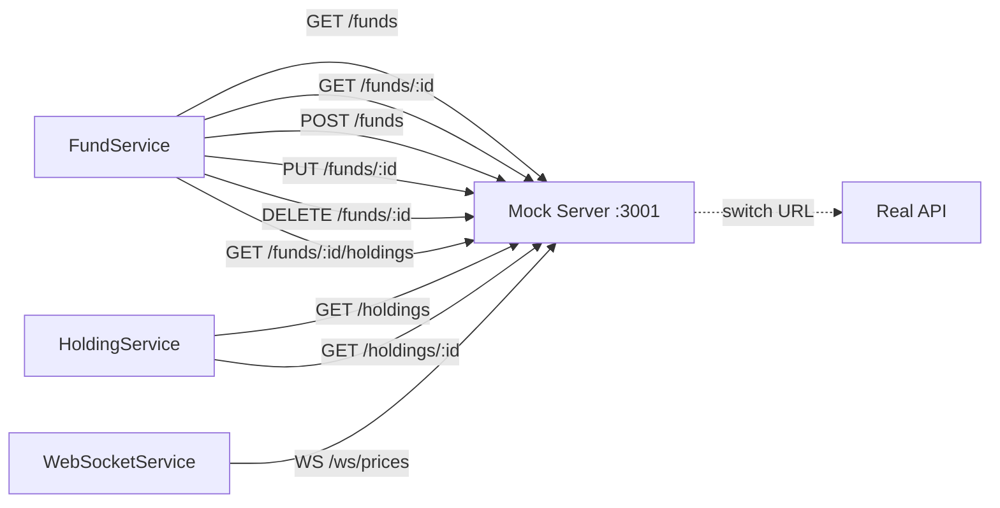

## Context

Wire an Angular app to consume the mock server. Generates everything needed so that when the real API is ready, you flip one URL and the contract is already proven. Produces TypeScript interfaces matching the mock schema, Angular services with full CRUD operations using inject()-based dependency injection, environment configuration for URL switching, and contract tests that validate the real API matches the mock contract.

## Inputs

- `@angular /angular-mock-wire` — generate from `.orch/mocks/schema.json`
- `--from api-spec.yaml` — generate from an OpenAPI spec directly
- `--services-path src/app/services/` — directory for generated Angular services (default: `src/app/services/`)
- `--models-path src/app/models/` — directory for generated TypeScript interfaces (default: `src/app/models/`)

## Steps

0. **Pre-check:** Verify `.orch/mocks/schema.json` exists. If missing, check for `--from` flag (OpenAPI spec). If neither: stop and tell user: 'No mock schema found. Run `/local-mock-capture` or `/local-mock-generate` first, or provide an OpenAPI spec with `--from api-spec.yaml`.' Do not proceed without a data source.

1. **Read mock schema and configuration**:
   - Read `.orch/mocks/schema.json` (or parse the OpenAPI spec if `--from` points to a YAML file) for endpoint definitions, entity schemas, and field types
   - Read `.orch/mocks/routes.json` for endpoint paths, HTTP methods, and protocols (REST vs WebSocket)
   - Read `.orch/mocks/relationships.json` for entity relationships, foreign keys, and cascade rules

2. **Generate TypeScript interfaces** — one interface file per entity:
   - Map schema field types to TypeScript types:
     - `string` → `string`
     - `number` → `number`
     - `boolean` → `boolean`
     - `date` → `Date`
     - Enum values → union type (e.g., `'active' | 'inactive' | 'pending'`)
     - Arrays → `Type[]`
     - Nested objects → separate interface with reference
   - Mark optional fields with `?` based on nullable/optional schema markers
   - Add TSDoc comment on each interface explaining the entity and its relationships
   - Export all interfaces from a barrel file (`index.ts`) in the models directory
   - Name files as `{entity}.model.ts` (e.g., `fund.model.ts`, `holding.model.ts`)

3. **Generate Angular services** — one service file per resource:
   - Use `@Injectable({ providedIn: 'root' })` decorator
   - Use `inject(HttpClient)` for REST HTTP calls (not constructor injection)
   - Use `inject(ConfigService)` for base URL resolution — reads `apiBaseUrl` from environment config
   - Use `inject(LoggingService)` for centralized error logging
   - For WebSocket endpoints: use a custom `WebSocketService` (also generated) that wraps the native WebSocket API with RxJS Observable
   - **CRUD methods** per resource:
     - `getAll(params?: QueryParams): Observable<Entity[]>` — GET list with optional query params (filtering, pagination, sorting)
     - `getById(id: number): Observable<Entity>` — GET single by ID
     - `create(entity: CreateEntityDto): Observable<Entity>` — POST new record
     - `update(id: number, entity: UpdateEntityDto): Observable<Entity>` — PUT update
     - `delete(id: number): Observable<void>` — DELETE by ID
   - **Nested resource methods** where relationships exist:
     - `getFundHoldings(fundId: number): Observable<Holding[]>` — GET nested collection
     - `createFundHolding(fundId: number, holding: CreateHoldingDto): Observable<Holding>` — POST to nested route
   - **WebSocket methods** where WS endpoints exist:
     - `connectToPrices(): Observable<PriceUpdate>` — returns Observable that emits messages from the WS channel
     - `disconnectFromPrices(): void` — close the WebSocket connection
   - **Error handling**: Every HTTP call piped through `catchError` that logs via `LoggingService` and re-throws
   - **TSDoc** on every public method explaining parameters, return type, and endpoint called
   - Name files as `{entity}.service.ts` (e.g., `fund.service.ts`, `holding.service.ts`)

4. **Generate environment configuration**:
   - Read the configured port from `.orch/mocks/routes.json` (if available) or default to 3001.
   - `environment.ts` (development/mock):
     ```typescript
     export const environment = {
       production: false,
       apiBaseUrl: 'http://localhost:3001/api',
       wsBaseUrl: 'ws://localhost:3001/ws',
     };
     ```
   - `environment.prod.ts` (production/real API):
     ```typescript
     export const environment = {
       production: true,
       apiBaseUrl: 'https://api.yourorg.com',
       wsBaseUrl: 'wss://api.yourorg.com/ws',
     };
     ```
   - Generate or update `ConfigService` that reads from environment and exposes `apiBaseUrl` and `wsBaseUrl` as injectable values

5. **Generate WebSocketService** (if WS endpoints exist):
   - Injectable service that wraps native `WebSocket`
   - `connect(url: string): Observable<MessageEvent>` — opens connection, returns Observable of messages
   - `disconnect(): void` — closes connection
   - Automatic reconnection with exponential backoff
   - Connection status Observable (`connected$`)
   - Uses `ConfigService` for base WebSocket URL

6. **Generate contract tests** — one test file per endpoint:
   - Test file per service: `{entity}.service.contract.spec.ts`
   - Each test hits the REAL API URL (from `environment.prod.ts`) — these tests validate that the real API conforms to the same contract as the mock
   - **Response shape tests**: Validate that the response contains all expected fields with correct types (field names exist, types match the TypeScript interface)
   - **Status code tests**: GET returns 200, POST returns 201, PUT returns 200, DELETE returns 204 (or 200)
   - **Relationship integrity tests**: Fund detail response contains valid holding references, nested resource endpoints return children that reference the parent
   - **Dual-target design**: Tests can run against mock server (always passes — validates test correctness) or real API (proves the contract holds)
   - Use Angular `HttpClientTestingModule` for mock-target tests, real `HttpClient` for production-target tests
   - Include test configuration for switching between mock and real API targets

7. **Generate LoggingService** (if not already present):
   - Injectable service with methods: `error(message, context)`, `warn(message, context)`, `info(message, context)`
   - Logs to console in development, can be extended to send to external service in production
   - Used by all generated services for consistent error reporting

8. **Verify compilation** — run `ng build` to confirm all generated code compiles without errors. Fix any type mismatches or import issues.

9. **Run contract tests against mock** — execute the generated contract tests against the mock server to verify they pass. This proves the tests are correctly written before running them against the real API.

## Output

```markdown
## Angular Mock Wire Report

### Architecture Decisions
| Decision | Rationale |
|----------|-----------|
| `inject()` over constructor DI | Modern Angular pattern (v14+), tree-shakable, works with standalone components |
| `ConfigService` for URLs | Single place to switch mock ↔ real API, no hardcoded URLs in services |
| Contract tests | Prove real API matches mock before integration, catch breaking changes early |
| `LoggingService` for errors | Consistent error handling, easy to extend to external logging services |
| Observable-based WebSocket | Fits Angular's reactive patterns, composable with other RxJS streams |

### Files Created
| File | Type | Description |
|------|------|-------------|
| `src/app/models/fund.model.ts` | Interface | Fund entity with fields and TSDoc |
| `src/app/models/holding.model.ts` | Interface | Holding entity with fundId foreign key |
| `src/app/models/index.ts` | Barrel | Re-exports all model interfaces |
| `src/app/services/fund.service.ts` | Service | Full CRUD + nested holdings methods |
| `src/app/services/holding.service.ts` | Service | Full CRUD for holdings |
| `src/app/services/config.service.ts` | Service | Environment-based URL provider |
| `src/app/services/logging.service.ts` | Service | Centralized error/warn/info logging |
| `src/app/services/websocket.service.ts` | Service | RxJS Observable WebSocket wrapper |
| `src/environments/environment.ts` | Config | Mock server URLs (localhost:3001) |
| `src/environments/environment.prod.ts` | Config | Production API URLs |
| `src/app/services/fund.service.contract.spec.ts` | Test | Contract tests for fund endpoints |
| `src/app/services/holding.service.contract.spec.ts` | Test | Contract tests for holding endpoints |

### Endpoint-to-Service Mapping


### Contract Test Summary
| Service | Tests | Against Mock | Against Real API |
|---------|-------|-------------|-----------------|
| FundService | 8 | PASS | pending |
| HoldingService | 6 | PASS | pending |
| WebSocketService | 3 | PASS | pending |
```

## Validation

- All generated TypeScript code compiles without errors (`ng build` succeeds)
- Services are correctly typed — method signatures match the interfaces
- All imports resolve (no missing modules or circular dependencies)
- Contract tests pass when run against the mock server
- Environment switching works — change `apiBaseUrl` in environment config, rebuild, and all services point to the new URL
- Foreign key relationships are reflected in service methods (nested resource endpoints exist)
- WebSocket service correctly wraps native WebSocket with RxJS Observable
- Error handling is present on all HTTP calls (catchError with LoggingService)
- TSDoc is present on all public interfaces, methods, and services
- Barrel file exports all models correctly
- No hardcoded URLs in any service file — all URLs come from ConfigService
