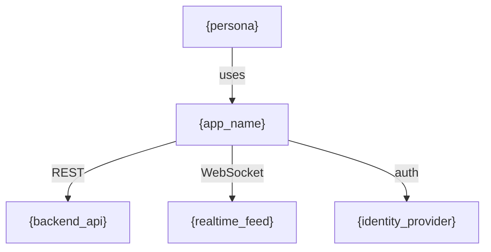
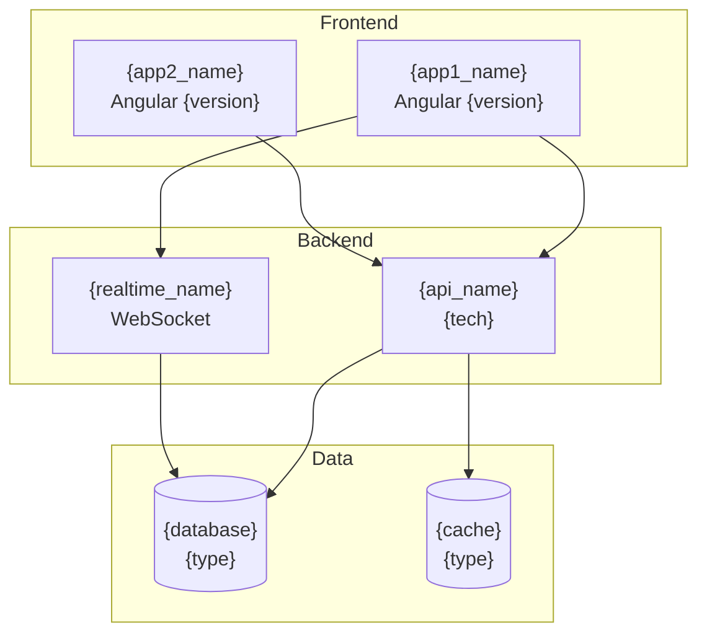

## Context

Reads the codebase directly to map the full Angular architecture — modules, components, routes, services, and their relationships. Detects standalone vs NgModule patterns, lazy-loaded routes, and service injection graphs. If the project is an Nx workspace, reads the Nx project graph for cross-project dependencies. This is a read-only planner skill — it never modifies files.

## Inputs

- "Scan architecture" — full architecture map of the project
- "Show me the component tree" — component hierarchy with parent-child relationships
- "Map the routes" — complete route configuration with lazy loading analysis
- "Show service dependencies" — injection graph for all services

## Steps

1. Read `angular.json` or `nx.json` to identify projects, apps, and libraries.
2. Scan `src/` (or app paths) for all `.component.ts`, `.module.ts`, `.service.ts`, `.directive.ts`, `.pipe.ts` files.
3. Parse component metadata: standalone flag, imports, providers, selector, changeDetection strategy.
4. Parse route configurations from `*routing*.ts`, `*.routes.ts`, and `app.config.ts` files.
5. Build the component tree: which components render which child components (from template selectors).
6. Build the service injection graph: which services inject which other services.
7. Identify module boundaries: which components belong to which modules (or are standalone).
8. If `nx.json` exists, read `nx graph --file=output.json` output or parse `project.json` files to map cross-project dependencies. Note: This command generates a temporary file. It is a read-only analysis step — the output file can be deleted after reading.
9. Generate Mermaid diagrams for module graph, component tree, and route map.
10. Produce the output report.

## Output

```markdown
## Architecture Scan — {project_name}

### Summary
- Components: {n} ({standalone_count} standalone, {module_count} in NgModules)
- Services: {n}
- Modules: {n}
- Routes: {n} ({lazy_count} lazy-loaded)
- Nx projects: {n} (if applicable)

### System Context (C4 Level 1)
Who uses this system and what external systems does it interact with?


### Container Diagram (C4 Level 2)
What are the major containers (apps, services, databases, message queues)?

Note: Infer containers from package.json scripts, proxy configs, environment files, docker-compose, and API call patterns in services.

### Module/Library Graph (Mermaid)
### Component Tree (Mermaid)
### Route Map
| Route | Component | Lazy? | Guards | Resolvers |

### Service Injection Graph
| Service | Injected In | Dependencies |

### Nx Project Graph (if applicable)
| Project | Type | Depends On |
```

## Validation

- All scanned files exist on disk
- Component counts match filesystem file counts
- Route map matches actual route configuration files
- Mermaid diagrams are syntactically valid
- No files are modified during the scan
