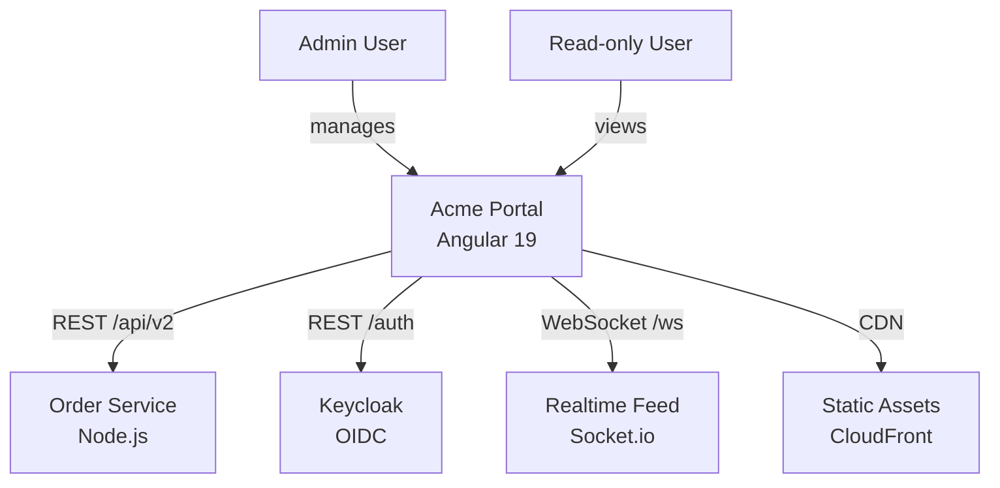
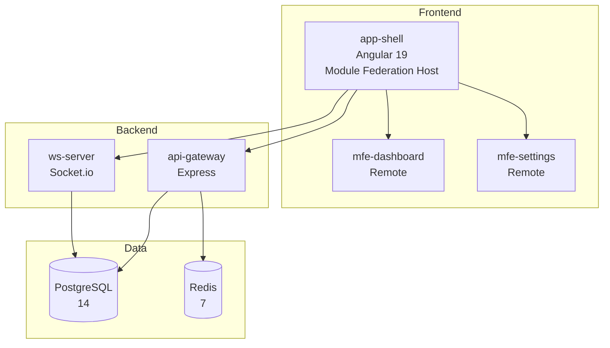
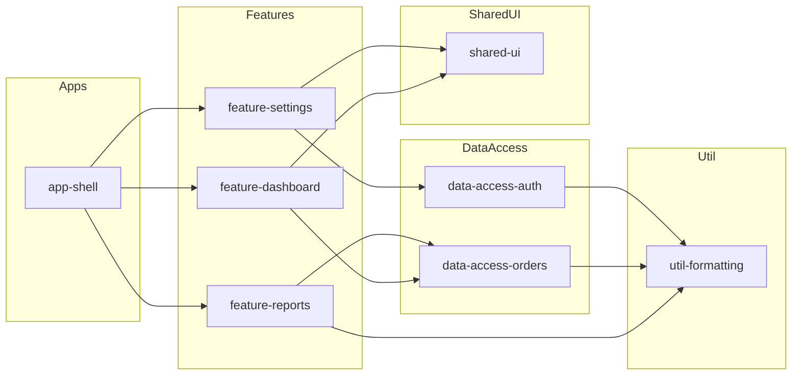
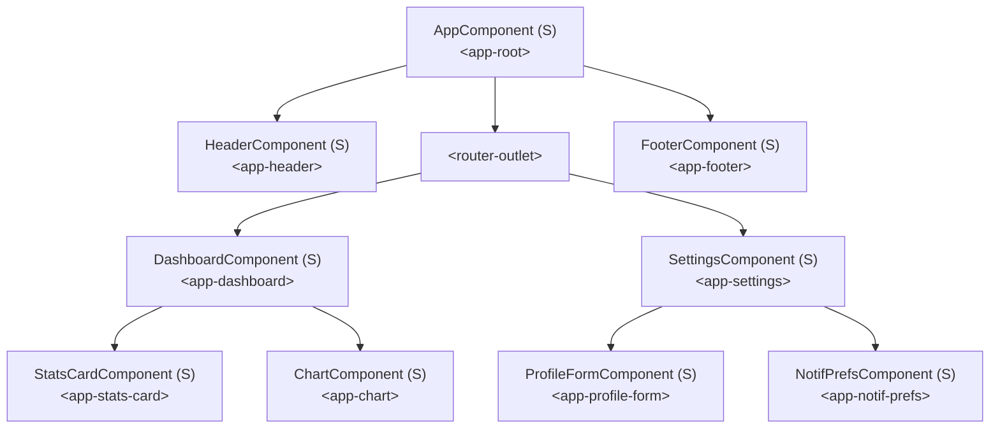

## Context

Reads the codebase directly to map the full Angular architecture — modules, components, routes, services, and their relationships. Detects standalone vs NgModule patterns, lazy-loaded routes, and service injection graphs. If the project is an Nx workspace, reads the Nx project graph for cross-project dependencies. This is a read-only planner skill — it never modifies files.

## Inputs

- "Scan architecture" — full architecture map of the project
- "Show me the component tree" — component hierarchy with parent-child relationships
- "Map the routes" — complete route configuration with lazy loading analysis
- "Show service dependencies" — injection graph for all services

## Steps

1. **Read workspace config** — open `angular.json` or `nx.json` to identify projects, apps, and libraries.
   - For Nx: parse `nx.json` `targetDefaults`, then glob `libs/*/project.json` and `apps/*/project.json` for each project's `sourceRoot`.
   - For standalone Angular CLI: read `angular.json` → `projects` → each project's `root` and `sourceRoot`.
   - Record Angular version from `package.json` → `@angular/core`.

2. **Scan all Angular artifacts** — search the source roots for:
   - Components: `**/*.component.ts`
   - Modules: `**/*.module.ts`
   - Services: `**/*.service.ts`
   - Directives: `**/*.directive.ts`
   - Pipes: `**/*.pipe.ts`
   - Standalone route files: `**/*.routes.ts`, `**/app.config.ts`

3. **Parse component metadata** — for each `.component.ts`, extract:
   - `standalone: true` — check the `@Component` decorator for the `standalone` flag.
   - `imports: [...]` — list direct dependency components/modules.
   - `changeDetection: ChangeDetectionStrategy.OnPush` — flag OnPush usage.
   - `selector: 'app-foo'` — record the selector for template cross-referencing.
   - Example pattern to detect:
     ```typescript
     @Component({
       standalone: true,
       selector: 'app-dashboard',
       imports: [CommonModule, MatTableModule, ChartComponent],
       changeDetection: ChangeDetectionStrategy.OnPush,
     })
     ```

4. **Parse route configurations** — scan `*routing*.ts`, `*.routes.ts`, and `app.config.ts`:
   - Detect eager routes: `{ path: 'home', component: HomeComponent }`
   - Detect lazy routes: `{ path: 'admin', loadComponent: () => import('./admin/admin.component') }`
   - Detect lazy child routes: `{ path: 'reports', loadChildren: () => import('./reports/report.routes') }`
   - Record guards (`canActivate`, `canDeactivate`, `canMatch`) and resolvers.

5. **Build the component tree** — for each component, open its `.component.html` template and scan for selectors of other known components. Construct a parent-child tree:
   - `AppComponent` renders `<app-header>`, `<router-outlet>`, `<app-footer>`
   - `DashboardComponent` renders `<app-stats-card>`, `<app-chart>`
   - Identify shared/leaf components (used in 2+ parents vs. used in exactly 1).

6. **Build the service injection graph** — for each `.service.ts`:
   - Parse constructor parameters: `constructor(private http: HttpClient, private auth: AuthService)`
   - Also detect the `inject()` function pattern: `private auth = inject(AuthService);`
   - Record `providedIn: 'root'` vs. module-scoped vs. component-scoped providers.

7. **Identify module boundaries** — for each `NgModule`, list its `declarations`, `imports`, `exports`, and `providers`. Map which components are declared in which module. Flag standalone components that belong to no module.

8. **Nx workspace graph (if applicable)** — if `nx.json` exists:
   - Run `npx nx graph --file=output.json` to generate the full dependency graph.
   - Parse `output.json` → `graph.dependencies` to map:
     - `app-shell` depends on `shared-ui`, `data-access-auth`, `feature-dashboard`
     - `feature-dashboard` depends on `shared-ui`, `data-access-reports`
   - Classify each project by tag: `type:app`, `type:feature`, `type:data-access`, `type:ui`, `type:util`.
   - Delete `output.json` after reading (cleanup).

9. **Generate Mermaid diagrams** — produce three diagrams:
   - **Module/Library Graph**: nodes are modules or Nx libs, edges are imports/dependencies.
   - **Component Tree**: root component at top, child components branching down.
   - **Route Map**: flowchart showing route paths with lazy-load boundaries marked.

10. **Produce the output report** with all tables, diagrams, and metrics.

## Output

```markdown
## Architecture Scan — {project_name}

### Summary
- Components: {n} ({standalone_count} standalone, {module_count} in NgModules)
- Services: {n}
- Modules: {n}
- Routes: {n} ({lazy_count} lazy-loaded)
- Nx projects: {n} (if applicable)

### System Context (C4 Level 1)
Who uses this system and what external systems does it interact with?

Infer personas from route guards (e.g., `RoleGuard` checking `admin`, `viewer`), login flows, and environment configs. Infer external systems from `HttpClient` base URLs, proxy configs (`proxy.conf.json`), and WebSocket connections.



### Container Diagram (C4 Level 2)
What are the major containers (apps, services, databases, message queues)?

Detect containers from: `proxy.conf.json` targets, `docker-compose.yml` services, environment file API URLs, Nx app projects, and `package.json` scripts that start backend processes.


Note: Infer containers from package.json scripts, proxy configs, environment files, docker-compose, and API call patterns in services.

### Module/Library Graph (Mermaid)
Show every NgModule or Nx library as a node. Edges represent imports (NgModule) or `tsconfig.paths` references (Nx libraries). Color-code by type: feature (blue), data-access (green), UI (orange), util (gray).



### Component Tree (Mermaid)
Show the component hierarchy from `AppComponent` downward. Mark `(S)` for standalone, `(M)` for module-declared. Show the selector name used in templates.



### Route Map
| Route | Component | Lazy? | Guards | Resolvers |
|-------|-----------|-------|--------|-----------|
| `/` | `redirect → /dashboard` | — | — | — |
| `/dashboard` | `DashboardComponent` | Yes (`loadComponent`) | `AuthGuard` | `DashboardResolver` |
| `/dashboard/reports` | `ReportsComponent` | Yes (`loadChildren`) | `AuthGuard` | — |
| `/settings` | `SettingsComponent` | Yes (`loadComponent`) | `AuthGuard`, `RoleGuard('admin')` | — |
| `/login` | `LoginComponent` | No | — | — |
| `**` | `NotFoundComponent` | No | — | — |

### Service Injection Graph
| Service | Provided In | Dependencies (injected) |
|---------|-------------|------------------------|
| `AuthService` | `root` | `HttpClient`, `Router`, `TokenStorageService` |
| `OrderService` | `root` | `HttpClient`, `AuthService`, `CacheService` |
| `CacheService` | `root` | — |
| `TokenStorageService` | `root` | — |
| `DashboardResolver` | `root` | `OrderService` |
| `WebSocketService` | `root` | `AuthService` |
| `NotificationService` | `SettingsModule` | `HttpClient`, `AuthService` |

### Nx Project Graph (if applicable)
| Project | Type | Tags | Depends On |
|---------|------|------|------------|
| `app-shell` | application | `type:app`, `scope:shell` | `feature-dashboard`, `feature-settings`, `shared-ui`, `data-access-auth` |
| `feature-dashboard` | library | `type:feature`, `scope:dashboard` | `data-access-orders`, `shared-ui`, `util-formatting` |
| `feature-settings` | library | `type:feature`, `scope:settings` | `data-access-auth`, `shared-ui` |
| `data-access-auth` | library | `type:data-access` | `util-formatting` |
| `data-access-orders` | library | `type:data-access` | `util-formatting` |
| `shared-ui` | library | `type:ui` | — |
| `util-formatting` | library | `type:util` | — |

### Pattern Adoption
| Pattern | Count | % of Components | Notes |
|---------|-------|-----------------|-------|
| Standalone components | 34 | 85% | 6 legacy NgModule-declared |
| `inject()` function | 28 | 70% | vs. constructor injection |
| `OnPush` change detection | 30 | 75% | 10 use Default |
| Signals (`signal()`, `computed()`) | 12 | 30% | Adopted in newer components |
| Lazy-loaded routes | 8 of 12 | 67% | 4 eagerly loaded |
```

## Validation

- **File existence**: every file path referenced in the report must exist on disk — verify with a glob check.
- **Component count accuracy**: the total component count must equal the number of `*.component.ts` files found by the filesystem scan. If they differ, re-scan and reconcile.
- **Route completeness**: every `path:` entry in every `*.routes.ts` and `*routing*.ts` file must appear in the Route Map table. Spot-check by counting `path:` literals in route files vs. table rows.
- **Mermaid syntax**: every Mermaid block must parse without error. Validate by checking: no unclosed subgraphs, no duplicate node IDs, all arrows use valid syntax (`-->`, `-->|label|`, `-.->`, `==>`) .
- **Service graph completeness**: every `*.service.ts` file must appear in the Service Injection Graph table. Cross-check the count.
- **Nx graph fidelity** (if applicable): the project list must match the set of `project.json` files. Dependency edges must match `nx graph` output — no invented edges.
- **No modifications**: confirm that no files were created, modified, or deleted during the scan (aside from the temporary `output.json` for Nx graph, which must be cleaned up).
