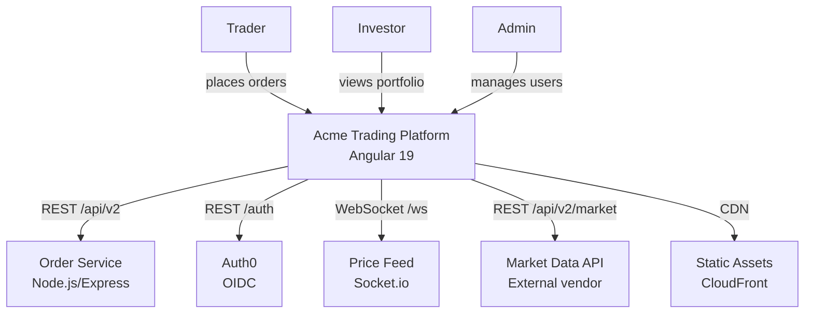
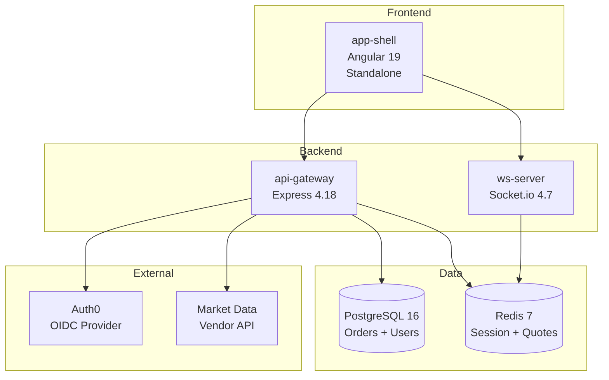
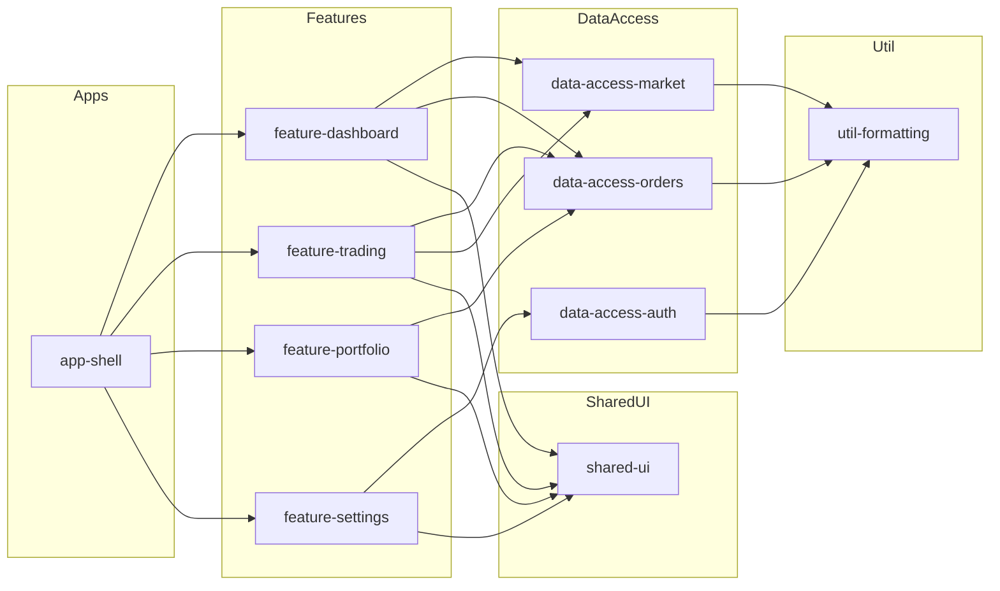
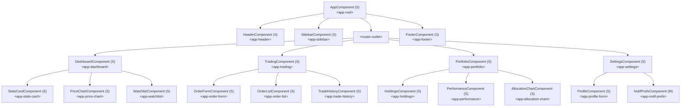

<!-- Example output from /angular-scan-arch — see SKILL.md for usage -->
## Architecture Scan — Acme Trading Platform

### Summary
- Components: 40 (34 standalone, 6 in NgModules)
- Services: 16
- Modules: 3 (legacy)
- Routes: 14 (10 lazy-loaded)
- Nx projects: 8

### System Context (C4 Level 1)

### Container Diagram (C4 Level 2)

### Module/Library Graph

### Component Tree

### Route Map
| Route | Component | Lazy? | Guards | Resolvers |
|-------|-----------|-------|--------|-----------|
| `/` | redirect to `/dashboard` | -- | -- | -- |
| `/dashboard` | `DashboardComponent` | Yes (`loadComponent`) | `AuthGuard` | `DashboardResolver` |
| `/dashboard/analytics` | `AnalyticsComponent` | Yes | `AuthGuard` | -- |
| `/dashboard/watchlist` | `WatchlistComponent` | Yes | `AuthGuard` | -- |
| `/trading` | `TradingComponent` | Yes (`loadChildren`) | `AuthGuard` | -- |
| `/trading/orders` | `OrderListComponent` | Yes | `AuthGuard` | -- |
| `/trading/orders/new` | `OrderFormComponent` | Yes | `AuthGuard`, `RoleGuard('trader')` | -- |
| `/trading/history` | `TradeHistoryComponent` | Yes | `AuthGuard` | -- |
| `/portfolio` | `PortfolioComponent` | Yes (`loadChildren`) | `AuthGuard` | `PortfolioResolver` |
| `/portfolio/holdings` | `HoldingsComponent` | Yes | `AuthGuard` | -- |
| `/portfolio/performance` | `PerformanceComponent` | Yes | `AuthGuard` | -- |
| `/settings` | `SettingsComponent` | No | `AuthGuard` | -- |
| `/settings/profile` | `ProfileComponent` | No | `AuthGuard` | -- |
| `/login` | `LoginComponent` | No | -- | -- |
| `**` | `NotFoundComponent` | No | -- | -- |

### Service Injection Graph
| Service | Provided In | Dependencies (injected) |
|---------|-------------|------------------------|
| `AuthService` | `root` | `HttpClient`, `Router`, `TokenStorageService` |
| `OrderService` | `root` | `HttpClient`, `AuthService`, `CacheService` |
| `MarketDataService` | `root` | `HttpClient`, `WebSocketService` |
| `WatchlistService` | `root` | `HttpClient`, `AuthService` |
| `PortfolioService` | `root` | `HttpClient`, `AuthService` |
| `AllocationService` | `root` | `HttpClient`, `AuthService` |
| `TradeExecutionService` | `root` | `OrderService`, `MarketDataService`, `NotificationService` |
| `TradeHistoryService` | `root` | `HttpClient`, `AuthService` |
| `ProfileService` | `root` | `HttpClient`, `AuthService` |
| `PreferenceService` | `root` | `HttpClient` |
| `CacheService` | `root` | -- |
| `TokenStorageService` | `root` | -- |
| `WebSocketService` | `root` | `AuthService` |
| `NotificationService` | `root` | -- |
| `DashboardResolver` | `root` | `OrderService`, `MarketDataService` |
| `PortfolioResolver` | `root` | `PortfolioService` |

### Nx Project Graph
| Project | Type | Tags | Depends On |
|---------|------|------|------------|
| `app-shell` | application | `type:app`, `scope:shell` | `feature-dashboard`, `feature-trading`, `feature-portfolio`, `feature-settings`, `shared-ui`, `data-access-auth` |
| `feature-dashboard` | library | `type:feature`, `scope:dashboard` | `data-access-orders`, `data-access-market`, `shared-ui`, `util-formatting` |
| `feature-trading` | library | `type:feature`, `scope:trading` | `data-access-orders`, `data-access-market`, `shared-ui` |
| `feature-portfolio` | library | `type:feature`, `scope:portfolio` | `data-access-orders`, `shared-ui` |
| `feature-settings` | library | `type:feature`, `scope:settings` | `data-access-auth`, `shared-ui` |
| `data-access-auth` | library | `type:data-access` | `util-formatting` |
| `data-access-orders` | library | `type:data-access` | `util-formatting` |
| `data-access-market` | library | `type:data-access` | `util-formatting` |
| `shared-ui` | library | `type:ui` | -- |
| `util-formatting` | library | `type:util` | -- |

### Pattern Adoption
| Pattern | Count | % of Components | Notes |
|---------|-------|-----------------|-------|
| Standalone components | 34 | 85% | 6 legacy NgModule-declared in settings |
| `inject()` function | 30 | 75% | vs. constructor injection |
| `OnPush` change detection | 32 | 80% | 8 use Default |
| Signals (`signal()`, `computed()`) | 14 | 35% | Adopted in newer trading components |
| Lazy-loaded routes | 10 of 14 | 71% | 4 eagerly loaded (login, settings, 404) |
| Control flow (`@if`, `@for`) | 22 | 55% | Newer components; older use `*ngIf`/`*ngFor` |
