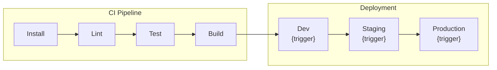
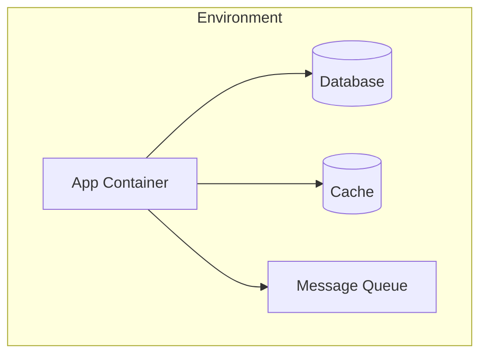

## Context

Reads CI/CD configuration files, deployment configs, and environment setup to produce a complete deployment infrastructure map. Covers pipelines, environments, build targets, and release strategy. This is a read-only planner skill — it never modifies files.

## Inputs

- "Scan deployment setup" — full CI/CD and deployment analysis
- "Show me the pipeline" — CI/CD pipeline structure and stages
- "What environments exist?" — environment configuration inventory
- "How is this project released?" — release strategy and versioning

## Steps

1. Scan for CI/CD configuration files:
   - GitHub Actions: `.github/workflows/*.yml`
   - Azure DevOps: `azure-pipelines.yml`, `.azure-pipelines/`
   - Jenkins: `Jenkinsfile`
   - GitLab: `.gitlab-ci.yml`
   - CircleCI: `.circleci/config.yml`
2. Parse pipeline stages: build, test, lint, deploy — with triggers (push, PR, schedule, manual).
3. Scan for environment configuration:
   - Angular environments: `src/environments/environment*.ts`
   - `.env` files (note presence, do NOT read secrets)
   - Docker: `Dockerfile`, `docker-compose.yml`
   - Kubernetes: `k8s/`, `helm/`, `kustomize/`
4. Identify deployment targets:
   - Static hosting: Netlify, Vercel, Firebase Hosting, S3/CloudFront
   - Container registries and orchestration
   - CDN configuration
5. Detect release strategy:
   - Versioning: `package.json` version, semantic-release, changesets
   - Branching: GitFlow, trunk-based, release branches
   - Tagging: Git tags, release automation
6. Check for build optimization:
   - Production build flags in CI
   - Caching strategies (node_modules, Nx cache, build cache)
   - Parallel execution configuration
7. Produce the output report.

## Output

```markdown
## Deployment Scan — {project_name}

### Summary
| Aspect | Value |
|--------|-------|
| CI/CD Platform | {platform} |
| Environments | {count} |
| Deployment Target | {target} |
| Release Strategy | {strategy} |

### Pipeline Stages
| Stage | Trigger | Steps | Duration (est.) |

### Environment Inventory
| Environment | Config File | API Base URL | Notes |

### Deployment Configuration
| Target | Method | Config File |

### Release Strategy
| Aspect | Current Setup |
|--------|--------------|
| Versioning | {semver/manual/auto} |
| Branching | {gitflow/trunk-based} |
| Automation | {semantic-release/manual} |

### Build Optimization
| Optimization | Enabled? | Config |

### CI/CD Pipeline Flow (Mermaid diagram)
Produce a pipeline flow diagram showing stages and environment promotion:

Adapt to actual pipeline: add caching nodes if present, parallel steps if configured, approval gates where applicable.

### Environment Topology (Mermaid diagram if docker-compose or k8s found)
If containerized deployment is detected, produce a container topology diagram:

```

## Validation

- All CI/CD config files referenced actually exist on disk
- Environment files are listed but secret values are never exposed
- Pipeline stages match actual configuration file contents
- No files are modified during the scan
