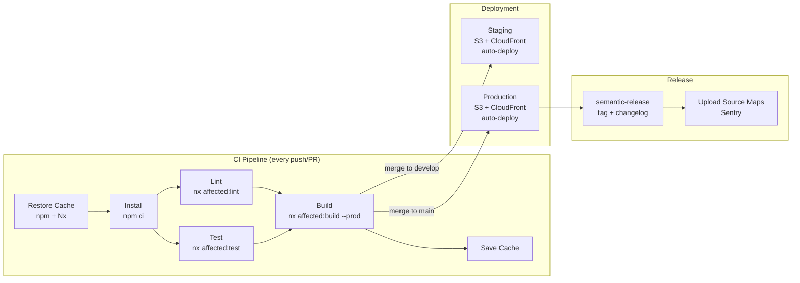
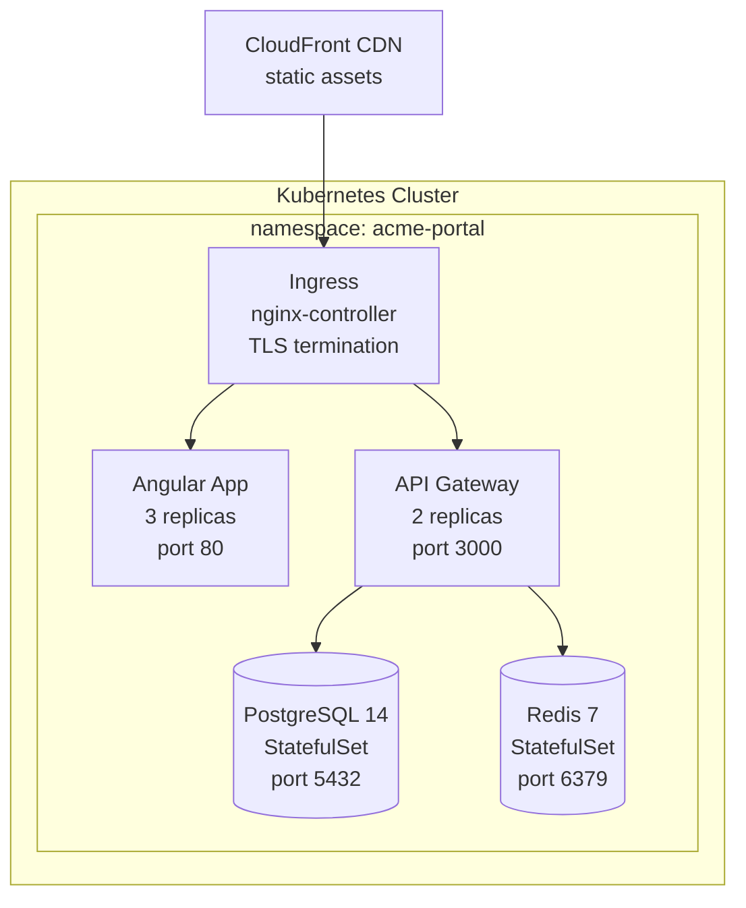

## Context

Reads CI/CD configuration files, deployment configs, and environment setup to produce a complete deployment infrastructure map. Covers pipelines, environments, build targets, and release strategy. This is a read-only planner skill — it never modifies files.

## Inputs

- "Scan deployment setup" — full CI/CD and deployment analysis
- "Show me the pipeline" — CI/CD pipeline structure and stages
- "What environments exist?" — environment configuration inventory
- "How is this project released?" — release strategy and versioning

## Steps

1. **Scan for CI/CD configuration files** — check each platform's known paths and file patterns:
   - **GitHub Actions**: glob `.github/workflows/*.yml` — look for jobs with `runs-on`, `steps`, and `uses` keys. Detect Angular-specific actions like `actions/setup-node`, `nrwl/nx-set-shas`, and custom `ng build` steps.
     ```yaml
     # Detection pattern in GitHub Actions:
     - uses: actions/setup-node@v4
       with:
         node-version: 20
         cache: 'npm'
     - run: npm ci
     - run: npx ng build --configuration production
     ```
   - **Azure DevOps**: check for `azure-pipelines.yml` or `*.azure-pipelines/*.yml`. Look for `stages:`, `jobs:`, `pool:` keys and `AzureStaticWebApp@0` or `AzureWebApp@1` tasks.
   - **Jenkins**: check for `Jenkinsfile` at root. Look for `pipeline { stages { stage('Build') { ... } } }` structure.
   - **GitLab CI**: check for `.gitlab-ci.yml`. Look for `stages:`, `image:`, `script:` keys and `pages` job for GitLab Pages deployment.
   - **CircleCI**: check for `.circleci/config.yml`. Look for `jobs:`, `workflows:`, `orbs:` keys.
   - If none found, note "No CI/CD configuration detected" and check `package.json` scripts for manual deployment commands (e.g., `"deploy": "firebase deploy"`, `"deploy": "aws s3 sync"`).

2. **Parse pipeline stages** — for each detected CI/CD file, extract:
   - **Triggers**: `on: push`, `on: pull_request`, `schedule`, `workflow_dispatch` (GitHub Actions); `trigger: branches: include:` (Azure); `only: - main` (GitLab).
   - **Stage names and ordering**: install → lint → test → build → deploy.
   - **Environment promotion**: detect if deploys target different environments based on branch (e.g., `main` → production, `develop` → staging).
   - **Parallel steps**: detect `strategy: matrix` (GitHub) or `parallel: true` (GitLab) or parallel stage blocks.
   - **Approval gates**: detect `environment:` with protection rules (GitHub) or `when: manual` (GitLab) or `input` steps (Jenkins).

3. **Scan for environment configuration**:
   - **Angular environments**: glob `src/environments/environment*.ts`. Extract the exported object keys (e.g., `apiUrl`, `production`, `featureFlags`) — report key names only, never values.
     ```typescript
     // Typical environment file keys to detect:
     export const environment = {
       production: true,
       apiUrl: '...',          // maps to API base
       wsUrl: '...',           // maps to WebSocket endpoint
       sentryDsn: '...',       // maps to error tracking
       featureFlags: { ... },  // maps to feature toggle system
     };
     ```
   - **`.env` files**: glob `.env*` — report filenames (`.env`, `.env.local`, `.env.staging`, `.env.production`) but **never read or expose secret values**. Note which environments have corresponding `.env` files.
   - **Runtime config**: check for `assets/config.json` or `assets/app-config.json` patterns that load config at runtime via `APP_INITIALIZER`.

4. **Scan Docker/Kubernetes configs**:
   - **Dockerfile**: check root and `docker/` directory. Detect multi-stage builds (common for Angular: `FROM node AS build` → `FROM nginx AS runtime`). Record base images and exposed ports.
     ```dockerfile
     # Common Angular Dockerfile pattern:
     FROM node:20-alpine AS build
     WORKDIR /app
     COPY package*.json ./
     RUN npm ci
     COPY . .
     RUN npx ng build --configuration production

     FROM nginx:1.25-alpine
     COPY --from=build /app/dist/my-app/browser /usr/share/nginx/html
     COPY nginx.conf /etc/nginx/conf.d/default.conf
     EXPOSE 80
     ```
   - **docker-compose.yml**: parse `services` to identify the topology — app container, reverse proxy, database, cache, message queue.
   - **Kubernetes**: glob `k8s/**/*.yml`, `k8s/**/*.yaml`, `helm/**/Chart.yaml`, `kustomize/**/kustomization.yaml`. Record Deployments, Services, Ingresses, ConfigMaps. Note replica counts and resource limits.
   - **Nginx config**: check for `nginx.conf` or `docker/nginx.conf` — detect SPA routing fallback (`try_files $uri $uri/ /index.html`).

5. **Identify deployment targets** — detect from CI/CD config, `package.json` scripts, and config files:
   - **Firebase Hosting**: `firebase.json`, `.firebaserc`, `"deploy": "firebase deploy"` in scripts.
   - **Vercel**: `vercel.json`, `.vercel/`, `@vercel/static-build` in package.json.
   - **Netlify**: `netlify.toml`, `_redirects` file.
   - **AWS S3/CloudFront**: `s3 sync` commands in CI, `aws-exports.js`, CDK/CloudFormation templates.
   - **Azure Static Web Apps**: `staticwebapp.config.json`, `AzureStaticWebApp@0` in pipelines.
   - **Container registry**: `docker push` commands, ECR/GCR/ACR references in CI.

6. **Detect release strategy**:
   - **Versioning**: read `package.json` `version` field. Check for `semantic-release` in devDependencies or `.releaserc` config. Check for `@changesets/cli` and `.changeset/` directory.
   - **Branching model**: inspect branch names from `git branch -a`. Detect GitFlow (`develop`, `release/*`, `hotfix/*`), trunk-based (`main` only), or GitHub Flow (`main` + feature branches).
   - **Tag automation**: check for tag patterns in CI (e.g., `on: push: tags: 'v*'`) and `standard-version` or `release-please` configs.

7. **Check for build optimization**:
   - **Production flags**: look for `--configuration production` or `--prod` in CI scripts.
   - **Caching**: detect `actions/cache` with `node_modules` or `.nx` paths (GitHub); `cache: npm` in setup-node; Nx remote cache (`nx-cloud` or `@nrwl/nx-cloud` in `package.json`).
   - **Parallel execution**: detect Nx `--parallel` flag, `affected` commands (`nx affected:build`), GitHub Actions matrix strategies.
   - **Build budgets**: check `angular.json` for `budgets` configuration under build options.

8. **Map environment variables** — for each CI/CD platform, list environment variables referenced (variable names only, never values):
   - GitHub Actions: `${{ secrets.* }}`, `${{ vars.* }}`, `env:` blocks.
   - Azure DevOps: `$(variableName)` references, variable groups.
   - Record which variables are used at build time vs. deploy time.

9. **Produce the output report** with all findings, tables, and diagrams.

## Output

```markdown
## Deployment Scan — {project_name}

### Summary
| Aspect | Value |
|--------|-------|
| CI/CD Platform | GitHub Actions |
| Workflow Files | 3 (`ci.yml`, `deploy-staging.yml`, `deploy-prod.yml`) |
| Environments | 3 (dev, staging, production) |
| Deployment Target | AWS S3 + CloudFront |
| Release Strategy | Semantic Release (trunk-based) |
| Containerized? | Yes (Docker multi-stage) |

### Pipeline Stages
| Stage | Trigger | Steps | Caching | Duration (est.) |
|-------|---------|-------|---------|-----------------|
| Install | push, PR | `npm ci` | `actions/cache` node_modules | ~1m |
| Lint | push, PR | `nx affected:lint` | Nx computation cache | ~30s |
| Test | push, PR | `nx affected:test --code-coverage` | Nx computation cache | ~2m |
| Build | push, PR | `nx affected:build --configuration production` | Nx computation cache | ~3m |
| Deploy Staging | merge to `develop` | `aws s3 sync dist/ s3://staging-bucket` | — | ~1m |
| Deploy Prod | merge to `main` | `aws s3 sync dist/ s3://prod-bucket`, CloudFront invalidation | — | ~2m |

### Environment Inventory
| Environment | Config File | Environment Keys | `.env` File | Notes |
|-------------|------------|-----------------|-------------|-------|
| Development | `environment.ts` | `apiUrl`, `wsUrl`, `production=false` | `.env.local` | Default `ng serve` config |
| Staging | `environment.staging.ts` | `apiUrl`, `wsUrl`, `sentryDsn`, `production=true` | `.env.staging` | Deployed on merge to `develop` |
| Production | `environment.production.ts` | `apiUrl`, `wsUrl`, `sentryDsn`, `production=true` | `.env.production` | Deployed on merge to `main` |

### Environment Variable Map (CI/CD)
| Variable Name | Used In | Build/Deploy | Purpose |
|---------------|---------|-------------|---------|
| `AWS_ACCESS_KEY_ID` | `deploy-*.yml` | Deploy | AWS authentication |
| `AWS_SECRET_ACCESS_KEY` | `deploy-*.yml` | Deploy | AWS authentication |
| `CLOUDFRONT_DISTRIBUTION_ID` | `deploy-prod.yml` | Deploy | CDN cache invalidation |
| `SENTRY_AUTH_TOKEN` | `ci.yml` | Build | Source map upload |
| `NX_CLOUD_ACCESS_TOKEN` | `ci.yml` | Build | Nx remote cache |
| `CODECOV_TOKEN` | `ci.yml` | Build | Coverage upload |

### Deployment Configuration
| Target | Method | Config File | Notes |
|--------|--------|-------------|-------|
| AWS S3 | `aws s3 sync` | `deploy-prod.yml` | Static assets bucket |
| CloudFront | `aws cloudfront create-invalidation` | `deploy-prod.yml` | CDN with `/*` invalidation |
| Docker Registry | `docker build && docker push` | `Dockerfile` | ECR `123456.dkr.ecr.us-east-1.amazonaws.com/app` |

### Release Strategy
| Aspect | Current Setup | Config File |
|--------|--------------|-------------|
| Versioning | Semantic Release (auto from commits) | `.releaserc.json` |
| Branching | Trunk-based (`main` + short-lived feature branches) | — |
| Commit Convention | Conventional Commits (`feat:`, `fix:`, `chore:`) | `commitlint.config.js` |
| Changelog | Auto-generated by semantic-release | `CHANGELOG.md` |
| Tag Pattern | `v{major}.{minor}.{patch}` (e.g., `v2.4.1`) | — |

### Build Optimization
| Optimization | Enabled? | Config | Details |
|-------------|----------|--------|---------|
| Nx affected commands | Yes | `ci.yml` | Only builds/tests changed projects |
| Nx remote cache | Yes | `nx.json` → `nx-cloud` | Shared cache across CI runs |
| Node modules caching | Yes | `actions/cache` | Keyed on `package-lock.json` hash |
| Production build budgets | Yes | `angular.json` | `initial` warn: 500kB, error: 1MB |
| Parallel execution | Yes | `nx affected --parallel=3` | 3 parallel tasks in CI |

### CI/CD Pipeline Flow (Mermaid diagram)
Produce a pipeline flow diagram showing stages and environment promotion:

Adapt to actual pipeline: add caching nodes if present, parallel steps if configured, approval gates where applicable.

### Environment Topology (Mermaid diagram if docker-compose or k8s found)
If containerized deployment is detected, produce a container topology diagram:


### Dockerfile Analysis (if present)
| Aspect | Value |
|--------|-------|
| Build stage base | `node:20-alpine` |
| Runtime stage base | `nginx:1.25-alpine` |
| Multi-stage | Yes (2 stages) |
| Exposed port | `80` |
| SPA routing | `try_files $uri $uri/ /index.html` in `nginx.conf` |
| Image size (est.) | ~25 MB (nginx alpine + Angular dist) |
```

## Validation

- **Config file existence**: every CI/CD config file, Dockerfile, and Kubernetes manifest referenced in the report must exist on disk at the stated path. Verify with a glob check.
- **Secret safety**: confirm that no secret values (API keys, tokens, passwords, connection strings) appear anywhere in the output. Only variable names are reported, never their values. `.env` file contents must never be read.
- **Pipeline stage accuracy**: every stage listed in the Pipeline Stages table must correspond to an actual job/stage in the CI/CD config file. Cross-check by reading the YAML and confirming each `jobs:` or `stages:` entry.
- **Environment completeness**: every `environment*.ts` file found by glob must appear in the Environment Inventory table. Count files vs. table rows.
- **Deployment target verification**: deployment targets must be confirmed by actual config — e.g., `firebase.json` exists if Firebase is claimed, `aws s3 sync` appears in a workflow if S3 is claimed. Do not infer targets without evidence.
- **Environment variable accuracy**: every variable listed in the Environment Variable Map must appear literally in at least one CI/CD config file (e.g., `${{ secrets.AWS_ACCESS_KEY_ID }}` in a workflow YAML).
- **No modifications**: confirm that no files were created, modified, or deleted during the scan.
