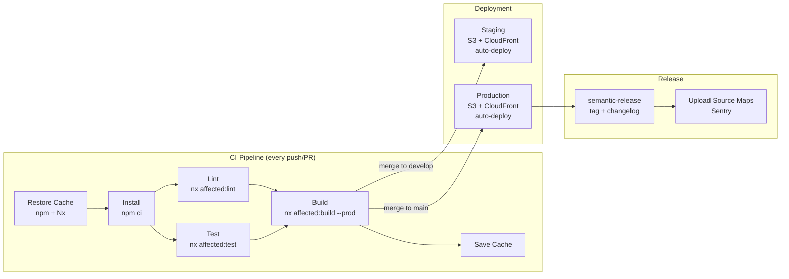

<!-- Example output from /angular-scan-deploy — see SKILL.md for usage -->
## Deployment Scan — Acme Trading Platform

### Summary
| Aspect | Value |
|--------|-------|
| CI/CD Platform | GitHub Actions |
| Workflow Files | 3 (`ci.yml`, `deploy-staging.yml`, `deploy-prod.yml`) |
| Environments | 3 (dev, staging, production) |
| Deployment Target | AWS S3 + CloudFront |
| Release Strategy | Semantic Release (trunk-based) |
| Containerized? | Yes (Docker multi-stage) |

### Pipeline Stages
| Stage | Trigger | Steps | Caching | Duration (est.) |
|-------|---------|-------|---------|-----------------|
| Install | push, PR | `npm ci` | `actions/cache` node_modules | ~1m |
| Lint | push, PR | `nx affected:lint` | Nx computation cache | ~30s |
| Test | push, PR | `nx affected:test --code-coverage` | Nx computation cache | ~2m |
| Build | push, PR | `nx affected:build --configuration production` | Nx computation cache | ~3m |
| Deploy Staging | merge to `develop` | `aws s3 sync dist/ s3://acme-staging-bucket` | -- | ~1m |
| Deploy Prod | merge to `main` | `aws s3 sync dist/ s3://acme-prod-bucket`, CloudFront invalidation | -- | ~2m |

### Environment Inventory
| Environment | Config File | Environment Keys | `.env` File | Notes |
|-------------|------------|-----------------|-------------|-------|
| Development | `environment.ts` | `apiUrl`, `wsUrl`, `production=false` | `.env.local` | Default `ng serve` config |
| Staging | `environment.staging.ts` | `apiUrl`, `wsUrl`, `sentryDsn`, `production=true` | `.env.staging` | Deployed on merge to `develop` |
| Production | `environment.production.ts` | `apiUrl`, `wsUrl`, `sentryDsn`, `production=true` | `.env.production` | Deployed on merge to `main` |

### Environment Variable Map (CI/CD)
| Variable Name | Used In | Build/Deploy | Purpose |
|---------------|---------|-------------|---------|
| `AWS_ACCESS_KEY_ID` | `deploy-*.yml` | Deploy | AWS authentication |
| `AWS_SECRET_ACCESS_KEY` | `deploy-*.yml` | Deploy | AWS authentication |
| `CLOUDFRONT_DISTRIBUTION_ID` | `deploy-prod.yml` | Deploy | CDN cache invalidation |
| `SENTRY_AUTH_TOKEN` | `ci.yml` | Build | Source map upload |
| `NX_CLOUD_ACCESS_TOKEN` | `ci.yml` | Build | Nx remote cache |
| `CODECOV_TOKEN` | `ci.yml` | Build | Coverage upload |
| `WS_ENDPOINT_URL` | `deploy-*.yml` | Deploy | WebSocket server for price feeds |

### Deployment Configuration
| Target | Method | Config File | Notes |
|--------|--------|-------------|-------|
| AWS S3 | `aws s3 sync` | `deploy-prod.yml` | Static assets bucket with versioned prefixes |
| CloudFront | `aws cloudfront create-invalidation` | `deploy-prod.yml` | CDN with `/*` invalidation on deploy |
| Docker Registry | `docker build && docker push` | `Dockerfile` | ECR `987654321.dkr.ecr.us-east-1.amazonaws.com/acme-trading` |

### Build Optimization
| Optimization | Enabled? | Config | Details |
|-------------|----------|--------|---------|
| Nx affected commands | Yes | `ci.yml` | Only builds/tests changed projects |
| Nx remote cache | Yes | `nx.json` via `nx-cloud` | Shared cache across CI runs |
| Node modules caching | Yes | `actions/cache` | Keyed on `package-lock.json` hash |
| Production build budgets | Yes | `angular.json` | `initial` warn: 500kB, error: 1MB |
| Parallel execution | Yes | `nx affected --parallel=3` | 3 parallel tasks in CI |

### CI/CD Pipeline Flow

### Dockerfile Analysis
| Aspect | Value |
|--------|-------|
| Build stage base | `node:20-alpine` |
| Runtime stage base | `nginx:1.25-alpine` |
| Multi-stage | Yes (2 stages) |
| Exposed port | `80` |
| SPA routing | `try_files $uri $uri/ /index.html` in `nginx.conf` |
| Image size (est.) | ~28 MB (nginx alpine + Angular dist) |
