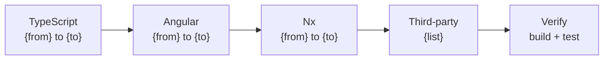

## Context

Reads `package.json` (and `package-lock.json` / `yarn.lock` / `pnpm-lock.yaml` if present) to build a full dependency inventory. Cross-references versions against the compatibility matrix to flag outdated, incompatible, or end-of-life packages. This is a read-only planner skill — it never modifies files.

## Inputs

- "Scan dependencies" — full dependency inventory with version analysis
- "What can I upgrade?" — highlight packages with available upgrades and their benefits
- "Check compatibility for Angular 19" — verify all deps against a target Angular version

## Steps

1. **Read `package.json`** to extract all `dependencies` and `devDependencies` with current versions. Parse version ranges: `^` (compatible), `~` (patch-only), exact, `>=` (minimum), `*` (any).

2. **Read lock file** (if present) to capture resolved versions and detect duplicates. Support `package-lock.json` (npm), `yarn.lock` (yarn), and `pnpm-lock.yaml` (pnpm).

3. **Read `references/angular/v19/compatibility-matrix.md`** for known compatible version ranges.

4. **Classify each dependency** into a category using these rules:
   - **Angular Core** — packages matching `@angular/*` (e.g., `@angular/core`, `@angular/router`, `@angular/forms`)
   - **Angular CDK/Material** — `@angular/cdk`, `@angular/material`
   - **Nx Build System** — packages matching `@nx/*` or `@nrwl/*`
   - **UI Libraries** — `ag-grid-angular`, `ag-grid-community`, `ag-grid-enterprise`, `primeng`, `@angular/material`, `plotly.js`, `@swimlane/ngx-charts`
   - **State Management** — `@ngrx/*`, `@ngxs/*`, `@rx-angular/*`
   - **RxJS** — `rxjs`
   - **TypeScript** — `typescript`
   - **Test Tooling** — `jest`, `@jest/*`, `ts-jest`, `@playwright/test`, `karma`, `jasmine-core`, `ng-mocks`, `@testing-library/angular`
   - **Build Tooling** — `webpack`, `esbuild`, `vite`, `@angular-devkit/*`, `@angular-builders/*`
   - **Utilities** — `lodash`, `date-fns`, `moment`, `uuid`, any other general-purpose library
   - **Internal/Custom** — packages matching `@yourorg/*` or `@company/*` scope

5. **Detect version mismatches** using this algorithm:
   - All `@angular/*` packages must share the same major.minor version. Flag if `@angular/core` is 19.2.0 but `@angular/router` is 18.1.0.
   - Cross-reference peer dependency requirements from lock file: if `@angular/material@19.x` requires `@angular/core@^19.0.0` but core is `18.x`, flag as incompatible.
   - Check for duplicate resolved versions of the same package (e.g., two versions of `rxjs` in the dependency tree).

6. **Detect outdated or deprecated patterns** with specific package checks:
   - `@nrwl/*` packages -> recommend migration to `@nx/*` (Nrwl was renamed to Nx)
   - `tslint` -> deprecated, recommend `eslint` with `@angular-eslint/*`
   - `karma` + `jasmine-core` -> recommend migration to `jest` or `vitest`
   - `protractor` -> deprecated, recommend `playwright` or `cypress`
   - `moment` -> maintenance-only, recommend `date-fns` or `@js-temporal/polyfill`
   - `codelyzer` -> deprecated, merged into `@angular-eslint`
   - `@angular/http` -> removed in Angular 15+, use `@angular/common/http`
   - `rxjs-compat` -> compatibility layer, remove if on RxJS 7+

7. **Compile upgrade benefit summary**: performance gains, new APIs, security fixes.

8. **Produce the output report.**

### Example Output

```markdown
## Dependency Scan — trade-platform

### Summary
- Total dependencies: 47
- Up to date: 38
- Upgradable: 6
- Incompatible with target: 1
- Deprecated/EOL: 2

### Dependency Inventory
| Package              | Current | Latest Compatible | Category       | Status      |
|----------------------|---------|-------------------|----------------|-------------|
| @angular/core        | 19.2.0  | 19.2.0            | Angular Core   | Current     |
| @angular/router      | 19.2.0  | 19.2.0            | Angular Core   | Current     |
| @angular/material    | 19.1.0  | 19.2.0            | Angular CDK    | Upgradable  |
| rxjs                 | 7.8.1   | 7.8.1             | RxJS           | Current     |
| ag-grid-angular      | 32.3.0  | 33.0.0            | UI Libraries   | Upgradable  |
| typescript           | 5.7.2   | 5.7.2             | TypeScript     | Current     |
| @nrwl/workspace      | 19.8.0  | —                 | Nx Build       | Deprecated  |
| karma                | 6.4.4   | —                 | Test Tooling   | Deprecated  |
| moment               | 2.30.1  | —                 | Utilities      | Maintenance |

### Deprecated Packages — Action Required
| Package           | Replacement                    | Migration effort |
|-------------------|--------------------------------|-----------------|
| @nrwl/workspace   | @nx/workspace                  | Low — rename imports |
| karma + jasmine   | jest + @angular/testing         | Medium — rewrite config |
| moment            | date-fns                       | Medium — replace API calls |

### Version Conflicts
| Package          | Required By          | Version A | Version B |
|------------------|----------------------|-----------|-----------|
| tslib            | @angular/core        | ^2.7.0    | ^2.3.0 (resolved 2.3.1) |

### Upgrade Benefits
| Package            | From   | To     | Key Benefits                              |
|--------------------|--------|--------|-------------------------------------------|
| @angular/material  | 19.1.0 | 19.2.0 | New M3 tokens, improved a11y              |
| ag-grid-angular    | 32.3.0 | 33.0.0 | Integrated Charts v2, 30% faster render   |
```

## Output

```markdown
## Dependency Scan — {project_name}

### Summary
- Total dependencies: {n}
- Up to date: {n}
- Upgradable: {n}
- Incompatible with target: {n}
- Deprecated/EOL: {n}

### Dependency Inventory
| Package | Current | Latest Compatible | Category | Status |
|---------|---------|-------------------|----------|--------|

### Version Conflicts
| Package | Required By | Version A | Version B |

### Upgrade Benefits
| Package | From | To | Key Benefits |

### Compatibility Matrix Check
| Package | Current | Target Angular | Compatible? | Notes |

### Upgrade Path (Mermaid diagram)
If upgrades are available, produce a sequential upgrade path diagram showing the recommended order:

Only include packages that need upgrading. Show dependencies (e.g., Angular requires TypeScript first).
```

## Validation

- All entries in `package.json` are accounted for in the report
- Version ranges are parsed correctly (^, ~, exact)
- Compatibility data comes from the referenced matrix, not hallucinated
- No files are modified during the scan
