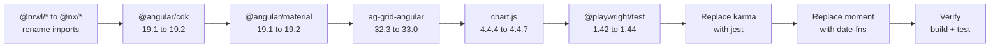

<!-- Example output from /angular-scan-deps — see SKILL.md for usage -->
## Dependency Scan — Acme Trading Platform

### Summary
- Total dependencies: 54
- Up to date: 42
- Upgradable: 7
- Incompatible with target: 1
- Deprecated/EOL: 4

### Dependency Inventory
| Package | Current | Latest Compatible | Category | Status |
|---------|---------|-------------------|----------|--------|
| @angular/core | 19.2.0 | 19.2.0 | Angular Core | Current |
| @angular/common | 19.2.0 | 19.2.0 | Angular Core | Current |
| @angular/router | 19.2.0 | 19.2.0 | Angular Core | Current |
| @angular/forms | 19.2.0 | 19.2.0 | Angular Core | Current |
| @angular/animations | 19.2.0 | 19.2.0 | Angular Core | Current |
| @angular/cdk | 19.1.0 | 19.2.0 | Angular CDK/Material | Upgradable |
| @angular/material | 19.1.0 | 19.2.0 | Angular CDK/Material | Upgradable |
| rxjs | 7.8.1 | 7.8.1 | RxJS | Current |
| zone.js | 0.15.0 | 0.15.0 | Zone | Current |
| typescript | 5.7.2 | 5.7.2 | TypeScript | Current |
| @ngrx/store | 19.0.0 | 19.0.0 | State Management | Current |
| @ngrx/effects | 19.0.0 | 19.0.0 | State Management | Current |
| @ngrx/entity | 19.0.0 | 19.0.0 | State Management | Current |
| ag-grid-angular | 32.3.2 | 33.0.1 | UI Libraries | Upgradable |
| ag-grid-community | 32.3.2 | 33.0.1 | UI Libraries | Upgradable |
| chart.js | 4.4.4 | 4.4.7 | UI Libraries | Upgradable |
| ng2-charts | 6.0.1 | 6.0.1 | UI Libraries | Current |
| @nrwl/workspace | 19.8.0 | -- | Nx Build | Deprecated |
| @nrwl/angular | 19.8.0 | -- | Nx Build | Deprecated |
| karma | 6.4.4 | -- | Test Tooling | Deprecated |
| karma-jasmine | 5.1.0 | -- | Test Tooling | Deprecated |
| moment | 2.30.1 | -- | Utilities | Maintenance |
| lodash-es | 4.17.21 | 4.17.21 | Utilities | Current |
| date-fns | 3.6.0 | 3.6.0 | Utilities | Current |
| @playwright/test | 1.42.0 | 1.44.0 | Test Tooling | Upgradable |
| jest | 29.7.0 | 29.7.0 | Test Tooling | Current |

### Deprecated Packages -- Action Required
| Package | Replacement | Migration Effort |
|---------|-------------|-----------------|
| @nrwl/workspace | @nx/workspace | Low -- rename imports across workspace config |
| @nrwl/angular | @nx/angular | Low -- rename imports across workspace config |
| karma + karma-jasmine | jest + @angular-builders/jest | Medium -- rewrite karma.conf.js to jest.config.ts, update test scripts |
| moment | date-fns (already installed) | Medium -- replace `moment()` calls with `date-fns` functions (14 call sites) |

### Version Mismatches
| Group | Package | Version | Expected |
|-------|---------|---------|----------|
| @angular/* | @angular/cdk | 19.1.0 | 19.2.0 (match @angular/core) |
| @angular/* | @angular/material | 19.1.0 | 19.2.0 (match @angular/core) |
| @nrwl/* | @nrwl/workspace | 19.8.0 | Migrate to @nx/workspace |
| @nrwl/* | @nrwl/angular | 19.8.0 | Migrate to @nx/angular |

### Outdated Patterns
| Package | Issue | Severity |
|---------|-------|----------|
| zone.js | zone.js in dependencies -- consider zoneless mode (Angular 19+) or ensure it is loaded as a polyfill only | info |
| karma | Karma is deprecated -- consider migrating to Jest with jest-preset-angular | info |
| @nrwl/workspace | @nrwl/* packages have been renamed to @nx/* -- migrate to @nx/workspace | warning |
| @nrwl/angular | @nrwl/* packages have been renamed to @nx/* -- migrate to @nx/angular | warning |
| moment | moment is in maintenance mode -- migrate to date-fns (already in dependencies) | info |

### Upgrade Benefits
| Package | From | To | Key Benefits |
|---------|------|------|-------------|
| @angular/cdk | 19.1.0 | 19.2.0 | Improved listbox a11y, new CDK overlay position strategies |
| @angular/material | 19.1.0 | 19.2.0 | New M3 tokens, improved color picker, form field a11y |
| ag-grid-angular | 32.3.2 | 33.0.1 | Integrated Charts v2, 30% faster render, new pivot mode |
| chart.js | 4.4.4 | 4.4.7 | Bug fixes, improved TypeScript types, treemap plugin compat |
| @playwright/test | 1.42.0 | 1.44.0 | New locator strategies, improved trace viewer, clock API |

### Upgrade Path

