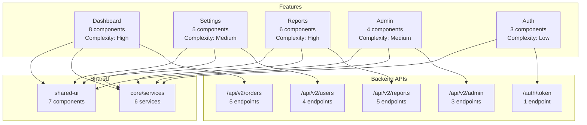
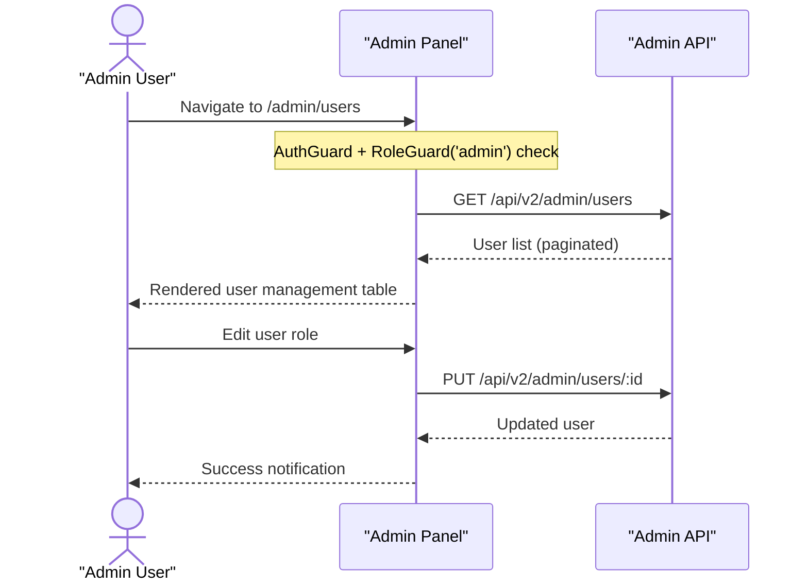
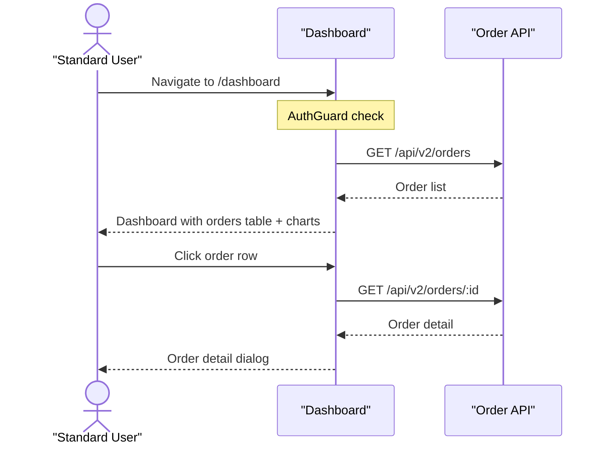

## Context

Produces a functional map of the application — what features exist, how they are accessed (routes), which components implement them, and what external APIs they consume. This is a business-level view of the codebase, complementing the technical architecture scan. This is a read-only planner skill — it never modifies files.

## Inputs

- "Scan features" — full functional inventory
- "Map routes to components" — route-to-component mapping with feature grouping
- "What APIs does this app call?" — external API surface inventory
- "List all features" — feature map grouped by domain

### Helper Script

Run the scanning script before executing steps manually:
```bash
node scripts/scan-features.js [project-root]
```
The script outputs JSON to stdout with features array containing routes, components, apiCalls, and complexity scores. Use this data to inform the steps below.

## Steps

1. **Scan route configuration files** — glob `**/*.routes.ts`, `**/*routing*.ts`, `**/app.config.ts`, and any file containing `RouterModule.forRoot` or `provideRouter`:
   - For each route object, extract:
     - `path` — the URL segment
     - `component` or `loadComponent` — the mapped component
     - `loadChildren` — lazy-loaded child route file
     - `canActivate`, `canDeactivate`, `canMatch` — guards
     - `resolve` — resolvers
     - `redirectTo` — redirect targets
   - Example route patterns to detect:
     ```typescript
     // Eager route
     { path: 'login', component: LoginComponent }
     // Lazy component
     { path: 'dashboard', loadComponent: () => import('./dashboard/dashboard.component').then(m => m.DashboardComponent), canActivate: [AuthGuard] }
     // Lazy children
     { path: 'admin', loadChildren: () => import('./admin/admin.routes').then(m => m.ADMIN_ROUTES), canActivate: [AuthGuard, RoleGuard] }
     ```

2. **Group routes into feature areas** using three heuristics (in priority order):
   - **Heuristic 1 — Route-based**: group by the first URL segment. All routes under `/dashboard`, `/dashboard/:id`, `/dashboard/reports` belong to the "Dashboard" feature.
   - **Heuristic 2 — Module/lazy-load boundary**: each `loadChildren` target defines a feature boundary. The file path of the lazy-loaded route file (e.g., `./features/admin/admin.routes.ts`) identifies the feature.
   - **Heuristic 3 — Directory-based**: scan for conventional feature directories:
     - `src/app/features/*/` — each subdirectory is a feature
     - `src/app/pages/*/` — each subdirectory is a feature
     - `src/app/modules/*/` — each subdirectory is a feature
     - `libs/feature-*/` (Nx) — each library is a feature
   - Merge results from all three heuristics. If a directory contains routes, use the route-based name. Otherwise, use the directory name.

3. **Scan for external API calls** — search all `.service.ts` and `.component.ts` files for `HttpClient` method calls:
   - Detect patterns:
     ```typescript
     this.http.get<Order[]>(`${this.apiUrl}/orders`)
     this.http.post(`/api/v2/users`, payload)
     this.http.put(`${environment.apiUrl}/settings/${id}`, body)
     this.http.delete(`/api/reports/${reportId}`)
     ```
   - Extract the HTTP method and URL template. Normalize URLs by stripping interpolated IDs (e.g., `/api/orders/${id}` → `/api/orders/:id`).
   - Map each API call to the service that makes it, and the feature area that service belongs to.
   - Also detect `HttpInterceptor` classes — note which interceptors add headers, auth tokens, or handle errors.

4. **Identify UI feature inventory** — scan templates (`*.component.html`) and component TypeScript files for UI patterns:
   - **Forms**: search for `FormGroup`, `FormBuilder`, `formControlName`, `[(ngModel)]`, `formGroupName`. Classify as reactive vs. template-driven.
     ```html
     <!-- Reactive form detection -->
     <form [formGroup]="orderForm">
       <input formControlName="customerName" />
     </form>
     ```
   - **Data grids**: search for `<ag-grid-angular>`, `<p-table>`, `<mat-table>`, `<table mat-table>`, `<cdk-table>`.
   - **Charts**: search for `<canvas baseChart>` (Chart.js/ng2-charts), `<plotly-plot>`, `<ngx-charts-*>`, D3 selections in TypeScript.
   - **Dialogs/Modals**: search for `MatDialog.open()`, `<p-dialog>`, `NzModalService`, `NgbModal`.
   - **File uploads**: search for `<input type="file">`, `FormData`, `HttpClient.post` with `reportProgress: true`.

5. **Map feature-to-component relationships** — for each feature area:
   - List all components in the feature directory.
   - Identify **shared components** by scanning `imports` arrays across features — a component used by 2+ features is shared.
   - Count components per feature to estimate relative complexity.

6. **Compute feature complexity scores** — for each feature, calculate:
   ```
   Complexity Score = (component_count * 2) + (service_count * 3) + (route_count * 1) + (api_endpoint_count * 2) + (form_count * 2) + (guard_count * 1)
   ```
   Classify: Low (< 10), Medium (10-25), High (> 25).

7. **Build feature dependency graph** — detect which features depend on which other features:
   - A feature depends on another if its components import services or components from the other feature.
   - Shared libraries (e.g., `shared-ui`, `core`) are dependencies of every feature that imports them.
   - Flag circular dependencies between features.

8. **Detect feature flags or conditional features**:
   - Search for `environment.featureFlags`, `FeatureFlagService`, `*ngIf="featureEnabled"`, `@if (featureFlag)`.
   - Check for LaunchDarkly, Unleash, or custom feature toggle services.

9. **Produce the output report** with all tables, diagrams, and metrics.

## Output

```markdown
## Feature Scan — {project_name}

### Summary
- Feature areas: 5 (Dashboard, Settings, Reports, Admin, Auth)
- Routes: 14 (9 lazy-loaded, 5 eager)
- API endpoints consumed: 18
- Shared components: 7
- Feature flags detected: 3

### Feature Map
| Feature Area | Routes | Components | Services | API Endpoints | Complexity |
|-------------|--------|------------|----------|---------------|-----------|
| Dashboard | 3 | 8 | 3 | 5 | High (28) |
| Settings | 2 | 5 | 2 | 4 | Medium (18) |
| Reports | 4 | 6 | 2 | 5 | High (26) |
| Admin | 3 | 4 | 2 | 3 | Medium (16) |
| Auth | 2 | 3 | 1 | 1 | Low (8) |

### Route-to-Component Map
| Route | Component | Lazy? | Guards | Feature Area |
|-------|-----------|-------|--------|-------------|
| `/` | redirect → `/dashboard` | — | — | — |
| `/dashboard` | `DashboardComponent` | Yes (`loadComponent`) | `AuthGuard` | Dashboard |
| `/dashboard/:id` | `DashboardDetailComponent` | Yes | `AuthGuard` | Dashboard |
| `/dashboard/reports` | `DashboardReportsComponent` | Yes | `AuthGuard` | Dashboard |
| `/settings` | `SettingsComponent` | Yes (`loadComponent`) | `AuthGuard` | Settings |
| `/settings/profile` | `ProfileFormComponent` | Yes | `AuthGuard` | Settings |
| `/reports` | `ReportsListComponent` | Yes (`loadChildren`) | `AuthGuard` | Reports |
| `/reports/:id` | `ReportDetailComponent` | Yes | `AuthGuard` | Reports |
| `/reports/new` | `ReportBuilderComponent` | Yes | `AuthGuard`, `RoleGuard('editor')` | Reports |
| `/reports/:id/export` | `ReportExportComponent` | Yes | `AuthGuard` | Reports |
| `/admin` | `AdminComponent` | Yes (`loadChildren`) | `AuthGuard`, `RoleGuard('admin')` | Admin |
| `/admin/users` | `UserManagementComponent` | Yes | `AuthGuard`, `RoleGuard('admin')` | Admin |
| `/login` | `LoginComponent` | No | — | Auth |
| `**` | `NotFoundComponent` | No | — | — |

### External API Surface
| Endpoint | Method | Called By (Service) | Feature Area |
|----------|--------|-------------------|-------------|
| `/api/v2/orders` | GET | `OrderService` | Dashboard |
| `/api/v2/orders/:id` | GET | `OrderService` | Dashboard |
| `/api/v2/orders` | POST | `OrderService` | Dashboard |
| `/api/v2/orders/:id` | PUT | `OrderService` | Dashboard |
| `/api/v2/orders/:id` | DELETE | `OrderService` | Dashboard |
| `/api/v2/reports` | GET | `ReportService` | Reports |
| `/api/v2/reports` | POST | `ReportService` | Reports |
| `/api/v2/reports/:id` | GET | `ReportService` | Reports |
| `/api/v2/reports/:id/export` | POST | `ReportService` | Reports |
| `/api/v2/reports/:id` | DELETE | `ReportService` | Reports |
| `/api/v2/users/me` | GET | `ProfileService` | Settings |
| `/api/v2/users/me` | PUT | `ProfileService` | Settings |
| `/api/v2/users/me/preferences` | GET | `ProfileService` | Settings |
| `/api/v2/users/me/preferences` | PUT | `ProfileService` | Settings |
| `/api/v2/admin/users` | GET | `AdminService` | Admin |
| `/api/v2/admin/users/:id` | PUT | `AdminService` | Admin |
| `/api/v2/admin/users/:id` | DELETE | `AdminService` | Admin |
| `/auth/token` | POST | `AuthService` | Auth |

### HTTP Interceptors
| Interceptor | Purpose | Applied To |
|-------------|---------|-----------|
| `AuthInterceptor` | Adds `Authorization: Bearer` header | All `/api/*` requests |
| `ErrorInterceptor` | Catches 401/403, redirects to login | All requests |
| `LoadingInterceptor` | Shows/hides global spinner | All requests |

### UI Feature Inventory
| Type | Count | Locations |
|------|-------|-----------|
| Reactive forms | 4 | `ProfileFormComponent`, `ReportBuilderComponent`, `LoginComponent`, `UserManagementComponent` |
| Template-driven forms | 1 | `NotifPrefsComponent` |
| Data grids (`<mat-table>`) | 3 | `DashboardComponent`, `ReportsListComponent`, `UserManagementComponent` |
| Charts (`<canvas baseChart>`) | 2 | `DashboardComponent`, `ReportDetailComponent` |
| Dialogs (`MatDialog`) | 3 | `DashboardDetailComponent`, `UserManagementComponent`, `ReportExportComponent` |
| File uploads | 1 | `ReportBuilderComponent` |

### Shared Components
| Component | Selector | Used By Features | Usage Count |
|-----------|----------|-----------------|-------------|
| `DataTableComponent` | `<app-data-table>` | Dashboard, Reports, Admin | 5 |
| `ChartComponent` | `<app-chart>` | Dashboard, Reports | 3 |
| `ConfirmDialogComponent` | `<app-confirm-dialog>` | Dashboard, Admin | 2 |
| `LoadingSpinnerComponent` | `<app-loading>` | All features | 8 |
| `EmptyStateComponent` | `<app-empty-state>` | Dashboard, Reports, Admin | 4 |
| `BreadcrumbComponent` | `<app-breadcrumb>` | Reports, Admin, Settings | 3 |
| `StatusBadgeComponent` | `<app-status-badge>` | Dashboard, Reports | 4 |

### Feature Dependency Graph (Mermaid)
Shows which features depend on other features and shared libraries. Arrows point from consumer to dependency.


### User Journey (Mermaid sequence diagram per persona)
For each distinct user persona detected (from route guards, role checks), produce a sequence diagram showing their primary flow:

**Admin User Journey:**


**Standard User Journey:**


### Feature Flags
| Flag | Source | Controls | Features Affected |
|------|--------|----------|------------------|
| `enableAdvancedReports` | `environment.featureFlags` | Advanced report builder UI | Reports |
| `enableDarkMode` | `FeatureFlagService` | Dark theme toggle in settings | Settings |
| `enableBetaDashboard` | `environment.featureFlags` | New dashboard layout | Dashboard |
```

## Validation

- **Route completeness**: every `path:` in every route configuration file must appear in the Route-to-Component Map. Count `path:` occurrences in route files and compare against table rows.
- **API endpoint accuracy**: every endpoint in the External API Surface table must be traceable to an actual `HttpClient` method call in the codebase. Verify by searching for the URL string in the reported service file.
- **Feature grouping correctness**: each feature area must correspond to either (a) a distinct top-level route segment, (b) a `loadChildren` boundary, or (c) a conventional feature directory. Do not invent feature areas that have no structural basis.
- **Component count accuracy**: for each feature, the component count must equal the number of `*.component.ts` files in that feature's directory. Spot-check at least 2 features.
- **Shared component verification**: a component is only listed as "shared" if it is imported by components in 2 or more distinct feature directories. Verify by checking `imports` arrays.
- **Complexity score reproducibility**: re-calculate the complexity score for at least 1 feature using the formula and verify it matches the reported value.
- **No fabricated endpoints**: never infer API endpoints from route paths or component names. Only report endpoints that appear as literal URL strings in `HttpClient` calls.
- **No modifications**: confirm that no files were created, modified, or deleted during the scan.
