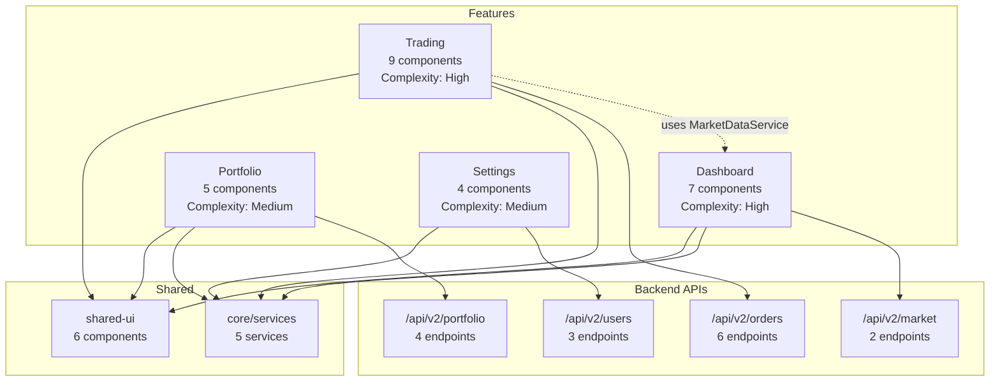
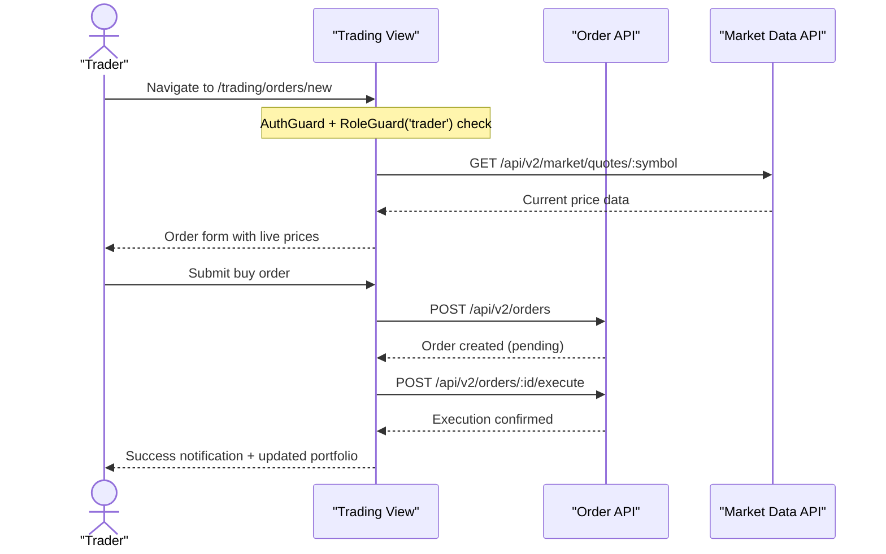
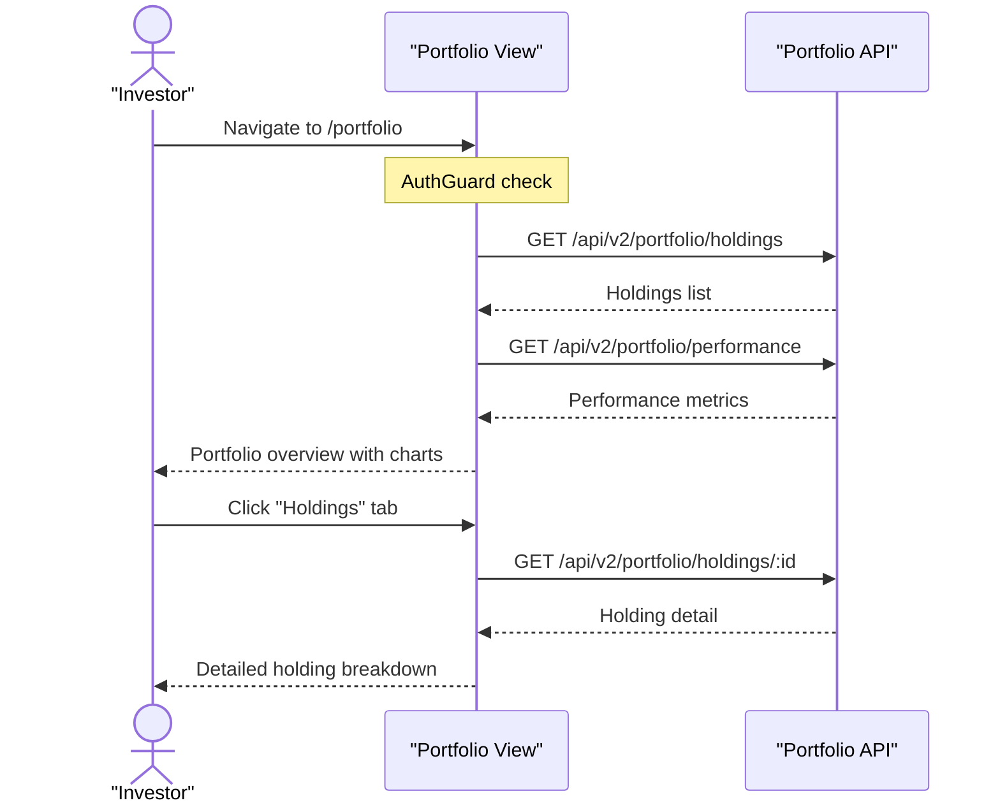

<!-- Example output from /angular-scan-features — see SKILL.md for usage -->
## Feature Scan — Acme Trading Platform

### Summary
- Feature areas: 4 (Dashboard, Trading, Portfolio, Settings)
- Routes: 12 (8 lazy-loaded, 4 eager)
- API endpoints consumed: 22
- Shared components: 6
- Feature flags detected: 2

### Feature Map
| Feature Area | Routes | Components | Services | API Endpoints | Complexity |
|-------------|--------|------------|----------|---------------|-----------|
| Dashboard | 3 | 7 | 3 | 6 | High (29) |
| Trading | 4 | 9 | 4 | 8 | High (38) |
| Portfolio | 3 | 5 | 2 | 5 | Medium (22) |
| Settings | 2 | 4 | 2 | 3 | Medium (15) |

### Route-to-Component Map
| Route | Component | Lazy? | Guards | Feature Area |
|-------|-----------|-------|--------|-------------|
| `/` | redirect to `/dashboard` | -- | -- | -- |
| `/dashboard` | `DashboardComponent` | Yes (`loadComponent`) | `AuthGuard` | Dashboard |
| `/dashboard/analytics` | `AnalyticsComponent` | Yes | `AuthGuard` | Dashboard |
| `/dashboard/watchlist` | `WatchlistComponent` | Yes | `AuthGuard` | Dashboard |
| `/trading` | `TradingComponent` | Yes (`loadChildren`) | `AuthGuard` | Trading |
| `/trading/orders` | `OrderListComponent` | Yes | `AuthGuard` | Trading |
| `/trading/orders/new` | `OrderFormComponent` | Yes | `AuthGuard`, `RoleGuard('trader')` | Trading |
| `/trading/history` | `TradeHistoryComponent` | Yes | `AuthGuard` | Trading |
| `/portfolio` | `PortfolioComponent` | Yes (`loadChildren`) | `AuthGuard` | Portfolio |
| `/portfolio/holdings` | `HoldingsComponent` | Yes | `AuthGuard` | Portfolio |
| `/portfolio/performance` | `PerformanceComponent` | Yes | `AuthGuard` | Portfolio |
| `/settings` | `SettingsComponent` | No | `AuthGuard` | Settings |
| `/settings/profile` | `ProfileComponent` | No | `AuthGuard` | Settings |
| `/login` | `LoginComponent` | No | -- | Auth |
| `**` | `NotFoundComponent` | No | -- | -- |

### External API Surface
| Endpoint | Method | Called By (Service) | Feature Area |
|----------|--------|-------------------|-------------|
| `/api/v2/market/quotes` | GET | `MarketDataService` | Dashboard |
| `/api/v2/market/quotes/:symbol` | GET | `MarketDataService` | Dashboard |
| `/api/v2/watchlist` | GET | `WatchlistService` | Dashboard |
| `/api/v2/watchlist` | POST | `WatchlistService` | Dashboard |
| `/api/v2/watchlist/:id` | DELETE | `WatchlistService` | Dashboard |
| `/api/v2/analytics/summary` | GET | `AnalyticsService` | Dashboard |
| `/api/v2/orders` | GET | `OrderService` | Trading |
| `/api/v2/orders` | POST | `OrderService` | Trading |
| `/api/v2/orders/:id` | GET | `OrderService` | Trading |
| `/api/v2/orders/:id` | PUT | `OrderService` | Trading |
| `/api/v2/orders/:id` | DELETE | `OrderService` | Trading |
| `/api/v2/orders/:id/execute` | POST | `OrderService` | Trading |
| `/api/v2/trades/history` | GET | `TradeHistoryService` | Trading |
| `/api/v2/trades/export` | POST | `TradeHistoryService` | Trading |
| `/api/v2/portfolio/holdings` | GET | `PortfolioService` | Portfolio |
| `/api/v2/portfolio/holdings/:id` | GET | `PortfolioService` | Portfolio |
| `/api/v2/portfolio/performance` | GET | `PortfolioService` | Portfolio |
| `/api/v2/portfolio/allocations` | GET | `AllocationService` | Portfolio |
| `/api/v2/portfolio/allocations` | PUT | `AllocationService` | Portfolio |
| `/api/v2/users/me` | GET | `ProfileService` | Settings |
| `/api/v2/users/me` | PUT | `ProfileService` | Settings |
| `/api/v2/users/me/preferences` | PUT | `PreferenceService` | Settings |

### Feature Dependency Graph

### User Journey — Trader Flow

### User Journey — Portfolio Review

