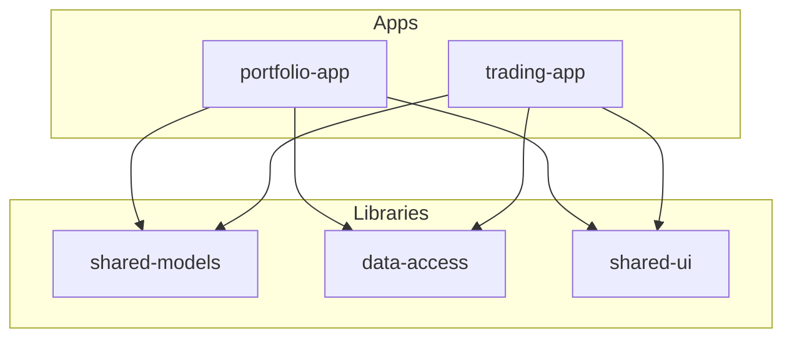
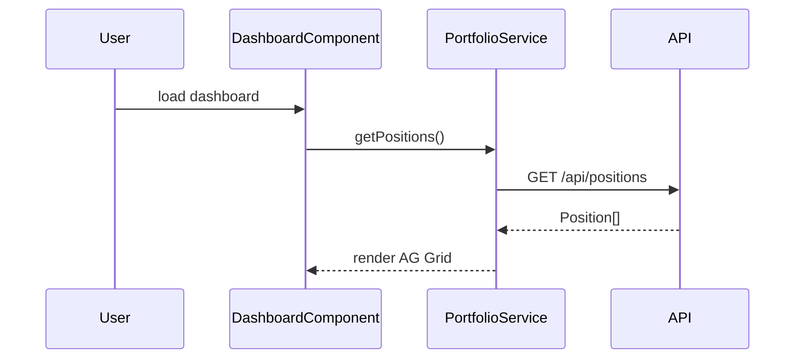

## Context

A new developer needs to understand a project fast. `/explain` produces a comprehensive, always-current project walkthrough at C4 architecture depth. It reads project files, invokes `/proof` for deeper analysis when needed, and checks recent git history to understand how the project is evolving.

## Capabilities

| Mode | Trigger | Output |
|------|---------|--------|
| **Interactive** | `@angular explain this repo` | Conversational — adapts to the question |
| **Generate** | `/explain --generate` | Produces `PROJECT.md` — committable, C4-structured |

## Data sources

### Always read (lightweight)
- `README.md` → project purpose
- `package.json` / `pom.xml` / `pyproject.toml` → tech stack, scripts, dependencies
- `angular.json` / `nx.json` → workspace structure, projects, targets
- `tsconfig.json` → TypeScript config, path aliases
- `.github/agents/*.agent.md` → ORCH agents installed
- `.github/skills/*/SKILL.md` → ORCH skills available
- `.github/instructions/*.instructions.md` → coding standards
- `.orch/audit/config/` → boundaries, adherence rules
- `docs-registry.yaml` → doc sources + freshness

### Invoke when needed (deep analysis)
- **Run `/proof`** if no existing scan output found, or if user asks for detailed architecture
- **Run `/proof --semantic`** if ts-morph adapter is available and user wants code-level detail
- **Read existing scan output** from `.github/references/scans/` if a recent scan exists

### Always check (git context)
- **Last 5 commits**: `git log -5 --oneline --stat` → what changed recently, who's active
- **Branch info**: `git branch -a` → active branches, feature work in progress
- **Contributors**: `git shortlog -sn --since="3 months"` → recent active contributors

## Output structure — C4 Architecture Model

### Level 1: System Context
"What is this system and what does it interact with?"

```markdown
## System Context

{Project name} is a {type} application that {purpose}.

### External Systems
| System | Interaction | Protocol |
|--------|-----------|----------|
| {API name} | {what data} | REST/GraphQL/WebSocket |
| {Auth provider} | Authentication | OAuth2/SAML |
| {Message broker} | Events | Kafka/RabbitMQ |

```mermaid
graph TB
    User[Developer/Trader] --> App[{Project Name}]
    App --> API[Backend API]
    App --> Auth[Auth Service]
    App --> Market[Market Data Feed]
```
```

### Level 2: Containers
"What are the major deployable parts?"

```markdown
## Containers

### Applications
| App | Path | Purpose | Serve command |
|-----|------|---------|-------------|
| portfolio-app | apps/portfolio-app/ | Portfolio dashboard | nx serve portfolio-app |
| trading-app | apps/trading-app/ | Order management | nx serve trading-app |

### Libraries (for monorepos)
| Library | Path | Purpose | Consumers |
|---------|------|---------|-----------|
| @fintech/shared-models | libs/shared-models/ | TypeScript interfaces | Both apps |
| @fintech/data-access | libs/data-access/ | API services | Both apps |


```

### Level 3: Components
"What are the major components inside each container?"

```markdown
## Components — {app-name}

### Feature Modules / Routes
| Route | Component | Purpose |
|-------|-----------|---------|
| /dashboard | DashboardComponent | KPI cards + holdings grid |
| /holdings | HoldingsComponent | Full AG Grid with positions |
| /allocation | AllocationComponent | Sector/geography breakdown |

### Services
| Service | Injected via | Purpose | Dependencies |
|---------|-------------|---------|-------------|
| PortfolioService | inject() | Portfolio data access | HttpClient |
| TradingService | inject() | Order management | HttpClient, WebSocket |

### Key Data Flow

```

### Level 4: Code Patterns
"What patterns and conventions are used in the code?"

```markdown
## Design Principles & Patterns

### Architecture Patterns
| Pattern | Usage | Example |
|---------|-------|---------|
| Standalone components | 80% of components | DashboardComponent |
| NgModule (legacy) | 20% — order-entry module | OrderEntryModule |
| Lazy loading | All feature routes | loadComponent() in routes.ts |
| Smart/dumb separation | Dashboard (smart) renders DataCard (dumb) | — |

### State Management
| Approach | Where | Example |
|----------|-------|---------|
| Signals | New components (Angular 18+) | portfolio.service.ts |
| BehaviorSubject | Existing services | market-data.service.ts |
| NgRx | Not used | — |

### Dependency Injection
| Style | Count | Target |
|-------|-------|--------|
| inject() function | 12 services | All (modern) |
| Constructor injection | 3 services | Migrate to inject() |

### Testing
| Type | Framework | Coverage | Command |
|------|-----------|----------|---------|
| Unit | Jest + ng-mocks | 67% | nx test |
| E2E | Playwright | 12 specs | nx e2e |
| Component | TestBed | 23 specs | — |

### Tech Stack — How Each Library Is Used
| Library | Version | How it's used | Where |
|---------|---------|-------------|-------|
| Angular | 18.2 | Core framework, standalone components, signals | Everywhere |
| AG Grid | 32.3 | Data grids for holdings, blotter, market data | 3 components |
| Bootstrap | 5.3 | Layout grid, cards, tables, dark theme | All templates |
| RxJS | 7.8 | Async data streams, HTTP, WebSocket | Services |
| @yourorg/elevate | 2.1 | Auth, logging, config, preferences | App bootstrap |
| @yourorg/hds | 3.0 | Design tokens, themed AG Grid | Styles, grid themes |

### Internal Conventions
{Read from .github/instructions/*.instructions.md}
- OnPush change detection required
- No `any` types
- Async pipe over manual subscribe
- TSDoc for all public APIs
- data-testid for e2e selectors
```

## Additional sections

### Recent Changes (from git)
```markdown
## Recent Activity

### Last 5 commits
| Date | Author | Message | Files |
|------|--------|---------|-------|
{from git log -5 --format="%ai|%an|%s" --stat}

### Active contributors (last 3 months)
| Contributor | Commits |
|------------|---------|
{from git shortlog -sn --since="3 months"}

### Active branches
| Branch | Last commit | Author |
|--------|------------|--------|
{from git branch -a --sort=-committerdate | head -10}
```

### Code Health
```markdown
## Code Health

| Metric | Value | Status |
|--------|-------|--------|
| Doc coverage |  | {what's left} |
| Test coverage | {%} | {ok/warn} |
| Stale reference docs | {count} | {list} |
```

### ORCH Setup
```markdown
## ORCH Setup

### Agents
| Agent | Type | Purpose |
{from .github/agents/}

### Skills
| Skill | Purpose |
{from .github/skills/*/SKILL.md descriptions}

### Active Plans
{from .orch/plans/}

### Getting Started with ORCH
1. `@angular /explain` — you're reading this
2. `@angular /generate` — scaffold new components
3. `@angular /review` — get code reviewed
4. `@angular /migrate` — upgrade Angular version
5. `@audit /report` — see usage and compliance data
```

## Steps

1. **Read project files** — package.json, angular.json/nx.json, tsconfig, README
2. **Check for existing /proof scan** — if recent (<7 days), use it. If not, run `/proof`.
3. **Read git history** — last 5 commits, recent contributors, active branches
4. **Detect tech stack** — versions AND how each library is used (which components, what for)
5. **Analyze patterns** — read instructions files + scan for patterns in code
6. **Read ORCH setup** — agents, skills, instructions, audit config
7. **Compose output** — C4 levels (context → containers → components → code patterns)
8. **If --generate** — write to PROJECT.md

## Validation

- All 4 C4 levels are present in output
- Tech stack shows HOW each lib is used, not just version numbers
- Mermaid diagrams are syntactically valid
- Git data is from actual repo (not hallucinated)
- Run commands are accurate (verified against package.json/nx.json)
- Recent changes reflect actual last 5 commits
