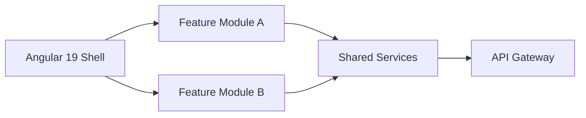

## Context

Takes structured markdown and produces a polished, branded slide deck. Each `##` heading becomes a slide. Code blocks get syntax highlighting, tables become styled HTML, and mermaid blocks render as inline SVG. The output is a self-contained file — no external CDN dependencies, works offline, and can be shared as an email attachment or deployed to an internal site.

## Inputs

- **source**: Markdown file path, or "from clipboard" to use current content
- Optional: `--format {html|pptx}` — output format (default: html)
- Optional: `--theme {dark|light|custom}` — theme selection (default: from `.orch/config.yaml` or dark)
- Optional: `--logo {path}` — override logo image (default: from `.orch/config.yaml`)
- Optional: `--cover {title}` — override cover slide title
- Optional: `--output {path}` — output file path

## Markdown-to-Slide Mapping Rules

The parser splits markdown into slides using heading hierarchy:

| Markdown Element          | Slide Behavior                                              |
|---------------------------|-------------------------------------------------------------|
| `# Title`                 | Cover slide — centered title, logo, date, subtitle          |
| `## Heading`              | New horizontal slide — heading becomes slide title           |
| `### Sub-heading`         | Content section within current slide (no new slide)          |
| `---` (horizontal rule)   | Forces a new slide without a heading (blank divider)         |
| `<!-- .slide: class -->` | Applies a custom CSS class to the current slide              |

### Vertical Sub-Slide Generation

Content under a `##` heading that exceeds the slide viewport is automatically split into vertical sub-slides. The rules:

1. If bullet list has more than 6 items, split into groups of 6 across vertical slides.
2. If a code block exceeds 15 lines, it gets its own vertical sub-slide.
3. Tables with more than 8 rows split into paginated vertical sub-slides.
4. Vertical navigation is indicated by a down-arrow indicator on the slide.

In reveal.js, vertical slides are nested `<section>` elements:
```html
<section>  <!-- horizontal slide group -->
  <section> <!-- first vertical slide -->
    <h2>Migration Results</h2>
    <ul><li>Item 1</li>...<li>Item 6</li></ul>
  </section>
  <section> <!-- second vertical slide (overflow) -->
    <ul><li>Item 7</li>...<li>Item 12</li></ul>
  </section>
</section>
```

## reveal.js Slide Structure

The generated HTML follows this structure:

```html
<!DOCTYPE html>
<html lang="en">
<head>
  <meta charset="utf-8">
  <meta name="viewport" content="width=device-width, initial-scale=1.0">
  <title>{deck title}</title>
  <style>
    /* reveal.js core CSS — bundled inline, ~28KB minified */
    .reveal { /* ... */ }
    .reveal .slides section { /* ... */ }
    /* HDS theme overrides from deck-tokens.css */
    :root {
      --hds-deck-bg: #0a0a0a;
      --hds-deck-text: #e8e8e8;
      --hds-deck-heading: #ffffff;
      --hds-deck-accent: #3b82f6;
      --hds-deck-code-bg: #1e1e2e;
      --hds-deck-font: 'Inter', sans-serif;
      --hds-deck-code-font: 'Fira Code', monospace;
    }
    .reveal { background: var(--hds-deck-bg); color: var(--hds-deck-text); font-family: var(--hds-deck-font); }
    .reveal h1, .reveal h2, .reveal h3 { color: var(--hds-deck-heading); }
    .reveal pre code { background: var(--hds-deck-code-bg); border-radius: 8px; padding: 1em; }
    .reveal table { border-collapse: collapse; width: 100%; }
    .reveal table th { background: var(--hds-deck-accent); color: #fff; padding: 0.5em 1em; }
    .reveal table td { border-bottom: 1px solid #333; padding: 0.5em 1em; }
  </style>
</head>
<body>
  <div class="reveal">
    <div class="slides">
      <!-- Cover slide -->
      <section>
        
        <h1>{title}</h1>
        <p class="subtitle">{subtitle}</p>
        <p class="date">{date}</p>
      </section>

      <!-- Content slides generated from ## headings -->
      <section>
        <h2>{heading}</h2>
        {content}
      </section>

      <!-- ... more slides ... -->
    </div>
  </div>
  <script>
    /* reveal.js core JS — bundled inline, ~65KB minified */
    // Reveal.initialize({ hash: true, transition: 'slide' });
  </script>
</body>
</html>
```

## Mermaid Diagram Embedding

Mermaid code blocks in the source markdown are pre-rendered to inline SVG at build time (not rendered client-side):

1. Extract the mermaid source from the fenced code block.
2. Render to SVG using the mermaid CLI (`mmdc`) or the mermaid JS API.
3. Apply HDS theme to the SVG: background transparent, text color `var(--hds-deck-text)`, edge color `var(--hds-deck-accent)`.
4. Embed the SVG directly in the slide `<section>`:

```html
<section>
  <h2>Architecture Overview</h2>
  <svg xmlns="http://www.w3.org/2000/svg" viewBox="0 0 800 400" style="max-width:100%">
    <!-- pre-rendered mermaid diagram -->
    <g class="node"><rect rx="5" ry="5" .../><text>API Gateway</text></g>
    <g class="node"><rect rx="5" ry="5" .../><text>Auth Service</text></g>
    <g class="edgePath"><path d="M..."/></g>
  </svg>
</section>
```

## Code Syntax Highlighting

Code blocks are syntax-highlighted at build time using a Prism-compatible tokenizer:

- Language detection from the fenced code block tag (e.g., ` ```typescript `).
- Tokens are wrapped in `<span>` elements with semantic class names.
- HDS code theme colors applied via CSS:

```css
.reveal pre code .keyword { color: #c678dd; }
.reveal pre code .string  { color: #98c379; }
.reveal pre code .number  { color: #d19a66; }
.reveal pre code .comment { color: #5c6370; font-style: italic; }
.reveal pre code .function { color: #61afef; }
.reveal pre code .type    { color: #e5c07b; }
```

## Full Example: 3-Slide Deck

**Source markdown:**
```markdown
# Migration Status Report
Q1 2026 Update

## Current Progress
- Phase 1 (TypeScript upgrade): **Complete**
- Phase 2 (Angular 18 to 19): **In Progress** — 67% done
- Phase 3 (PrimeNG migration): **Not Started**
- Total components migrated: 142 / 210

## Architecture


## Summary
| Phase         | Status      | Components | Target Date |
|---------------|-------------|------------|-------------|
| TypeScript    | Complete    | 210 / 210  | 2026-01-15  |
| Angular 19    | In Progress | 142 / 210  | 2026-04-01  |
| PrimeNG 18    | Not Started | 0 / 85     | 2026-06-15  |
```

**Generated slide outline:**

| #  | Type     | Title                    | Content                                       |
|----|----------|--------------------------|-----------------------------------------------|
| 1  | Cover    | Migration Status Report  | Logo, "Q1 2026 Update", date                  |
| 2  | Content  | Current Progress         | 4 styled bullet points with bold highlights    |
| 3  | Diagram  | Architecture             | Inline SVG of the mermaid graph LR diagram     |
| 4  | Table    | Summary                  | Styled 3-row HTML table with HDS colors        |

## Steps

1. Read the source markdown content.
2. Read theming configuration:
   a. Load `deck-tokens.css` for HDS color tokens, typography, and spacing.
   b. Read `.orch/config.yaml` for org overrides: logo path, default theme, cover template.
   c. Apply `--theme`, `--logo`, `--cover` overrides if specified.
3. Parse markdown into slide structure using the mapping rules above.
4. Process special content:
   a. Mermaid code blocks — pre-render to inline SVG with HDS theming.
   b. Code blocks — syntax-highlight at build time with Prism-compatible tokenizer.
   c. Tables — convert to styled HTML with HDS borders and colors.
   d. Long content — split into vertical sub-slides per overflow rules.
5. Generate output:
   a. **HTML**: self-contained reveal.js file. Library bundled inline (~93KB total). Theme CSS inlined. SVG diagrams embedded. Logo base64-encoded.
   b. **PPTX**: PowerPoint via pptxgenjs. Mermaid diagrams as embedded PNG. HDS colors applied to slide master.
6. Write the output file.

## Output

```markdown
## Deck Generated — Migration Status Report

### Details
| Field        | Value                                    |
|--------------|------------------------------------------|
| Source       | .orch/reports/migration-q1.md            |
| Format       | html                                     |
| Slides       | 4                                        |
| Theme        | dark                                     |
| Logo         | included (base64)                        |
| Output       | .orch/reports/migration-q1-deck.html      |
| Size         | 128 KB                                   |

### Slide Outline
| #  | Type     | Title                    |
|----|----------|--------------------------|
| 1  | Cover    | Migration Status Report  |
| 2  | Content  | Current Progress         |
| 3  | Diagram  | Architecture (mermaid)   |
| 4  | Table    | Summary                  |
```

## Validation

- Output opens in browser (HTML) or PowerPoint (PPTX) without errors
- reveal.js is bundled inline — no external CDN requests (verify with network tab, zero `<script src>` or `<link href>` to external URLs)
- HDS theme applied: all colors reference `var(--hds-deck-*)` tokens from deck-tokens.css
- Mermaid diagrams render as inline SVG (not raw mermaid text, not client-side rendered)
- Code blocks have syntax highlighting with colored `<span>` tokens (not plain `<pre>`)
- Every `##` heading from source has a corresponding slide (count slides = count `##` headings + 1 cover)
- Vertical sub-slides generated when content exceeds viewport (6+ bullets, 15+ code lines, 8+ table rows)
- Logo appears on cover slide as base64-encoded `` (if configured)
- File is fully self-contained — works offline with no network requests
