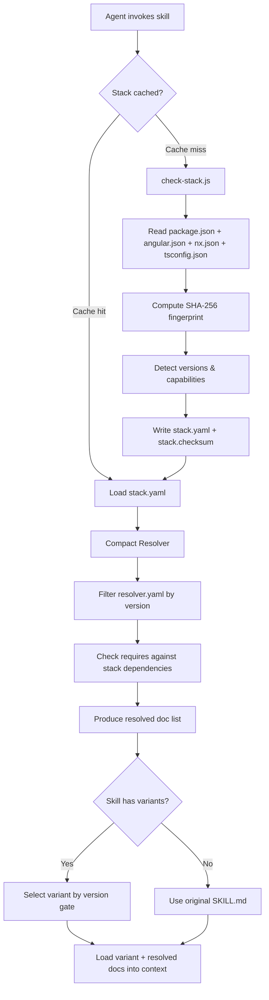
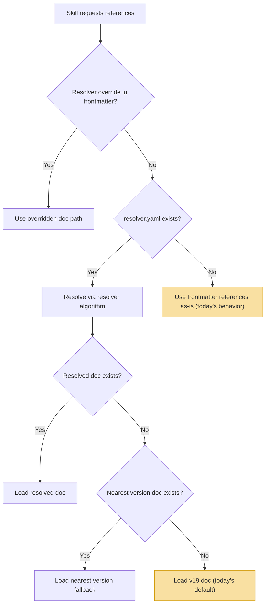
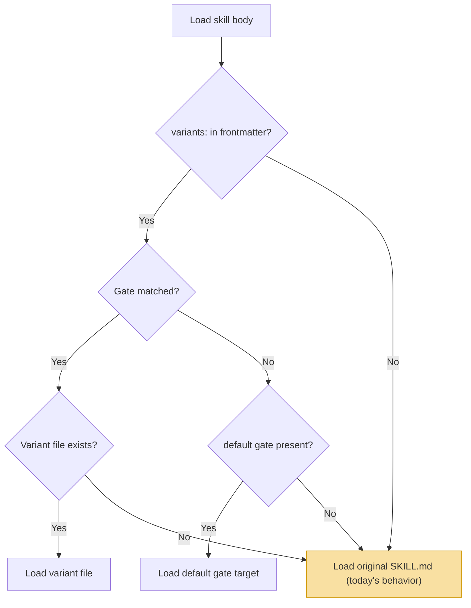

# ORCH Version-Aware Stack Resolution

**Status:** Draft
**Authors:** orch-team
**Created:** 2026-03-26
**Last Updated:** 2026-03-26
**Target Release:** ORCH 2.x

---

## Table of Contents

1. [Problem Statement](#1-problem-statement)
2. [Solution Overview](#2-solution-overview)
3. [Stack Detection Hook](#3-stack-detection-hook)
4. [Compact Resolver](#4-compact-resolver)
5. [Skill Variants](#5-skill-variants)
6. [Cascading Fallback Design](#6-cascading-fallback-design)
7. [Failure Modes](#7-failure-modes)
8. [Diagnostic Logging](#8-diagnostic-logging)
9. [Token Budget Analysis](#9-token-budget-analysis)
10. [Implementation Plan](#10-implementation-plan)
11. [Schema Definitions](#11-schema-definitions)
12. [Configuration](#12-configuration)

---

## 1. Problem Statement

### 1.1 Hardcoded Version References

The ORCH skill library contains **35 skill files** that hardcode references to Angular v19 documentation. Every skill frontmatter `references:` field points directly into the `references/angular/v19/` directory:

```yaml
# From angular-refactor/SKILL.md
references:
  - references/angular/v19/best-practices.md
  - references/angular/v19/state-management-guide.md

# From angular-generate-component/SKILL.md
references:
  - references/angular/v19/component-patterns.md

# From angular-scan-arch/SKILL.md
references:
  - references/angular/v19/architecture-patterns.md
  - references/angular/v19/state-management-guide.md
```

This is repeated across `angular-refactor`, `angular-generate-component`, `angular-generate-service`, `angular-scan-arch`, `angular-explain`, `angular-review`, `angular-scan-quality`, `angular-scan-tests`, `angular-test-unit`, `angular-test-e2e`, `angular-test-lint`, `angular-docs-*`, `angular-migrate-*`, `angular-create-app`, `angular-compatibility`, `angular-mock-wire`, and others.

### 1.2 Wrong Advice for Non-v19 Projects

The `.orch/references/angular/` directory contains version stubs for v16, v17, v18, v20, and v21, but only v19 has substantive documentation (23 files). Projects running on these other versions receive incorrect guidance:

| Project Version | What ORCH Advises | Actual Behavior |
|---|---|---|
| v16 | Use `@if`/`@for` control flow | Not available until v17 |
| v16 | Use `input()` / `output()` signals | Not available until v17.1 |
| v17 | Use `input.required()` with signal defaults | API differs from v19 signature |
| v18 | Use `effect()` without cleanup | `effect()` cleanup semantics changed in v19 |
| v20 | Follow v19 `inject()` patterns | v20 adds `inject()` context improvements |
| v21 | Use v19 testing patterns | v21 introduces new test harness APIs |

When a v16 project asks ORCH to refactor a component, the `angular-refactor` skill loads `v19/best-practices.md` and instructs the LLM to apply `@if`/`@for` control flow and signal inputs, neither of which exist in Angular 16. The generated code will not compile.

### 1.3 Token Waste from Irrelevant Documentation

A typical multi-phase workflow such as `angular-new-feature.yaml` executes 10 phases, each invoking one or more skills. Each skill loads its reference documents into the LLM context:

- Average reference payload per skill invocation: **~3,000 tokens**
- Phases in a standard workflow: **10**
- Total reference tokens per workflow: **~30,000 tokens**

A significant portion of these tokens describe features that do not apply to the target project's Angular version. For a v16 project, the signals guide, control flow guide, and standalone guide are entirely irrelevant — roughly 40-60% of the loaded reference content.

### 1.4 Design Goals

1. **Correct advice** — every skill receives documentation matched to the project's actual Angular version.
2. **Token efficiency** — load only the references that apply, reducing context waste by at least 50%.
3. **Zero regression** — projects that work today with v19 defaults must continue to work identically.
4. **No manual configuration required** — detection is automatic from project files.
5. **Graceful degradation** — every detection and resolution step has a fallback that preserves current behavior.

---

## 2. Solution Overview

The system is composed of three layers, each with a single responsibility:

```
┌─────────────────────────────────────────────────────────────────┐
│                        SKILL INVOCATION                         │
│                                                                 │
│  1. Stack Detection Hook                                        │
│     check-stack.js reads package.json → produces stack.yaml     │
│                                                                 │
│  2. Compact Resolver                                            │
│     resolver.yaml maps (feature + version) → doc path + tokens  │
│                                                                 │
│  3. Skill Variants                                              │
│     SKILL.md routes to modern.md or legacy.md based on version  │
│                                                                 │
└─────────────────────────────────────────────────────────────────┘
```



### Layer Responsibilities

| Layer | Input | Output | File | Size |
|---|---|---|---|---|
| **Stack Detection Hook** | Project files on disk | `.orch/cache/stack.yaml` | `.orch/hooks/check-stack.js` | ~210 lines |
| **Compact Resolver** | `stack.yaml` + skill references | Resolved doc list | `.orch/references/angular/resolver.yaml` | ~150 tokens |
| **Skill Variants** | `stack.yaml` + skill name | Skill body (modern or legacy) | `skills/{name}/variants/*.md` | Per-skill |

---

## 3. Stack Detection Hook

### 3.1 File Location

```
.orch/hooks/check-stack.js    (~210 lines)
```

### 3.2 Trigger

The hook runs **before every agent invocation**. It is registered in the ORCH hook pipeline and executes synchronously before the coordinator loads any skill.

### 3.3 Fingerprinting

The hook computes a SHA-256 checksum over the concatenation of four project files:

```
SHA-256( package.json + angular.json + nx.json + tsconfig.json )
```

These four files are the minimum set that uniquely determines a project's Angular stack:

| File | What It Tells Us |
|---|---|
| `package.json` | Angular version, RxJS version, Nx presence, NgRx signals, PrimeNG, AG Grid |
| `angular.json` | Build system (webpack vs esbuild vs application builder), test runner, e2e runner |
| `nx.json` | Nx monorepo configuration, workspace structure |
| `tsconfig.json` | TypeScript version target, strict mode, paths (monorepo indicator) |

### 3.4 Cache Strategy

```
.orch/cache/stack.checksum    # SHA-256 hex string (64 chars)
.orch/cache/stack.yaml        # Detected stack metadata
```

**Flow:**

1. Compute fingerprint from project files.
2. Read `.orch/cache/stack.checksum`.
3. If fingerprint matches cached checksum → return cached `stack.yaml`. **Done.**
4. If mismatch (or cache missing) → run full detection → write `stack.yaml` + `stack.checksum`.

The checksum comparison costs a single file read plus a string comparison — negligible overhead on cache hit.

### 3.5 Detection Logic

When cache misses, the hook extracts the following fields from project files:

| Field | Source | Example |
|---|---|---|
| `framework` | Hardcoded | `angular` |
| `angular_version` | `@angular/core` major version in dependencies | `"19"` |
| `nx` | `@nx/angular`, `@nrwl/angular`, or `nx` in dependencies, or `nx.json` exists | `true` |
| `monorepo` | `nx.json` exists on disk | `true` |
| `build_tool` | `angular.json` exists → `angular-cli`; `nx.json` exists → `nx`; otherwise `unknown` | `angular-cli` |
| `packages[]` | Array of detected interesting packages with name and version | `[{ name: "@ngrx/store", version: "^19.0.0" }]` |
| `detected_at` | ISO 8601 timestamp of detection | `"2026-03-26T14:30:00Z"` |

### 3.6 Configuration Pin Override

A user may override auto-detection by setting a version pin in `.orch/config.yaml`:

```yaml
stack:
  angular_version: "18"   # override auto-detection
```

When `angular_version` is set to a version string, the hook uses the pinned version as a fallback when auto-detection fails to find `@angular/core` in `package.json`. The cascade order is: cache → detect → pin → default. The pin is only consulted if detection does not produce a version.

### 3.7 Output Format

`stack.yaml` written to `.orch/cache/stack.yaml`:

```yaml
# Auto-generated by check-stack.js — do not edit
framework: angular
angular_version: "19"
nx: false
monorepo: false
build_tool: angular-cli
detected_at: "2026-03-26T14:30:00.000Z"
packages:
  - name: "@ngrx/store"
    version: "^19.0.0"
  - name: "@angular/material"
    version: "^19.0.0"
```

### 3.8 Pseudocode — `resolveStack()`

```javascript
/**
 * .orch/hooks/check-stack.js
 *
 * Stack Detection Hook — runs before every agent invocation.
 * Detects Angular version and project capabilities from project files.
 * Uses SHA-256 fingerprinting to avoid redundant re-detection.
 *
 * Cascading fallback: cache (checksum match) → detect → pin → default
 * Pure Node.js — no external dependencies (no js-yaml; uses regex-based YAML reading).
 * Exit 0 always — never blocks the orchestrator.
 *
 * ~210 lines in production.
 */

const crypto = require('crypto');
const fs = require('fs');
const path = require('path');

const PROJECT_ROOT = process.env.PROJECT_ROOT || process.cwd();
const ORCH_DIR = path.join(PROJECT_ROOT, '.orch');
const CACHE_DIR = path.join(ORCH_DIR, 'cache');
const STACK_PATH = path.join(CACHE_DIR, 'stack.yaml');
const CHECKSUM_PATH = path.join(CACHE_DIR, 'stack.checksum');
const CONFIG_PATH = path.join(ORCH_DIR, 'config.yaml');
const DEFAULT_VERSION = '19';

// Files included in the SHA-256 fingerprint (4 files)
const FINGERPRINT_FILES = ['package.json', 'angular.json', 'nx.json', 'tsconfig.json'];

function safeRead(filePath) {
  try { return fs.readFileSync(filePath, 'utf8'); } catch { return null; }
}

function computeChecksum() {
  const hash = crypto.createHash('sha256');
  for (const file of FINGERPRINT_FILES) {
    const content = safeRead(path.join(PROJECT_ROOT, file));
    if (content) hash.update(file + ':' + content);
  }
  return hash.digest('hex');
}

function detectStack() {
  // Parses package.json and checks for angular.json / nx.json on disk.
  // Returns 7 fields: framework, angular_version, nx, monorepo,
  // build_tool, packages[], detected_at.
  const raw = safeRead(path.join(PROJECT_ROOT, 'package.json'));
  if (!raw) return null;
  try {
    const pkg = JSON.parse(raw);
    const deps = { ...pkg.dependencies, ...pkg.devDependencies };
    const angularCore = deps['@angular/core'];
    let angularVersion = null;
    if (angularCore) {
      const match = angularCore.replace(/[\^~>=<\s]/g, '').match(/^(\d+)/);
      if (match) angularVersion = match[1];
    }
    const nxDetected = !!(deps['@nx/angular'] || deps['@nrwl/angular'] || deps['nx']);
    const hasAngularJson = fs.existsSync(path.join(PROJECT_ROOT, 'angular.json'));
    const hasNxJson = fs.existsSync(path.join(PROJECT_ROOT, 'nx.json'));
    const packages = [];
    const interesting = [
      '@ngrx/store', '@ngrx/signals', '@angular/material',
      'primeng', 'ag-grid-angular', 'plotly.js', '@nx/angular',
      'jest', 'karma', 'cypress', '@playwright/test'
    ];
    for (const p of interesting) {
      if (deps[p]) packages.push({ name: p, version: deps[p] });
    }
    return {
      framework: 'angular',
      angular_version: angularVersion,
      nx: nxDetected || hasNxJson,
      monorepo: hasNxJson,
      build_tool: hasAngularJson ? 'angular-cli' : (hasNxJson ? 'nx' : 'unknown'),
      packages,
      detected_at: new Date().toISOString()
    };
  } catch { return null; }
}

// Reads angular_version from .orch/config.yaml using regex (no js-yaml).
function readConfigPin() {
  const raw = safeRead(CONFIG_PATH);
  if (!raw) return null;
  const match = raw.match(/angular_version:\s*["']?(\d+)["']?/);
  return match ? match[1] : null;
}

function main() {
  const checksum = computeChecksum();

  // 1. Try cache (checksum match)
  const cached = tryReadCache(checksum);
  if (cached) { process.exit(0); }

  // 2. Try detection from package.json
  let stack = detectStack();
  let source = 'default';
  if (stack && stack.angular_version) {
    source = 'detected';
  } else {
    // 3. Try config pin
    const pinned = readConfigPin();
    if (pinned) {
      stack = stack || { framework: 'angular', packages: [], detected_at: new Date().toISOString() };
      stack.angular_version = pinned;
      stack.nx = stack.nx || false;
      stack.monorepo = stack.monorepo || false;
      stack.build_tool = stack.build_tool || 'unknown';
      source = 'pinned';
    } else {
      // 4. Default fallback (v19)
      stack = stack || { framework: 'angular', packages: [], detected_at: new Date().toISOString() };
      stack.angular_version = DEFAULT_VERSION;
      stack.nx = stack.nx || false;
      stack.monorepo = stack.monorepo || false;
      stack.build_tool = stack.build_tool || 'unknown';
      source = 'default';
    }
  }

  const stackYaml = stackToYaml(stack);
  tryCacheWrite(stackYaml, checksum);
  appendLog({ source, checksum, angular_version: stack.angular_version });
}
```

---

## 4. Compact Resolver

### 4.1 File Location

```
.orch/references/angular/resolver.yaml    (~150 tokens)
```

### 4.2 Purpose

The resolver is a flat, machine-readable lookup table that maps Angular features to their version availability, recommended patterns, dependency requirements, and documentation paths. Instead of skills hardcoding `references/angular/v19/signals-guide.md`, they reference a feature category and the resolver produces the correct document path for the detected stack version.

### 4.3 Resolver Table Format

Each row in the resolver table has the following columns:

| Column | Type | Description |
|---|---|---|
| `category` | string | Feature area grouping (e.g., `di`, `components`, `state`) |
| `old_pattern` | string or null | The legacy pattern this replaces |
| `new_pattern` | string or null | The modern pattern name |
| `available` | string | Version gate expression (e.g., `">=17"`) — Angular major version where this feature became available |
| `recommended` | string | Version gate expression (e.g., `">=19"`) — Angular major version where this became the recommended approach |
| `requires` | string or null | npm package name that must be installed (e.g., `"@ngrx/signals"`), or null if no extra dependency |
| `replaces` | string or null | Feature identifier this supersedes (for migration path awareness) |
| `doc` | string | Relative path to the reference document (most point to `angular/v19/...`) |
| `tokens` | integer | Approximate token cost of loading this document |

Note: The actual resolver does **not** have a `feature` field. Features are identified by their `category` combined with their pattern names.

### 4.4 Full Resolver Table

```yaml
# .orch/references/angular/resolver.yaml
#
# Angular Feature Resolver — Version-Aware Reference Loading.
# ~150 tokens when loaded into context — replaces hardcoded v19 paths.
#
# Key differences from the spec's original design:
#   - No `feature` field — features are identified by category + patterns
#   - Version gates are string expressions (">=17"), not integers
#   - `requires` uses npm package names ("@ngrx/signals"), not boolean field names
#   - Doc paths point to angular/v19/... (not common/)
#   - Includes common_docs section loaded regardless of version

version: 1
default_version: "19"

common_docs:
  - doc: angular/v19/best-practices.md
    tokens: 900
  - doc: angular/v19/testing-guide.md
    tokens: 800

features:
  # ── DI (Dependency Injection) ──
  - category: di
    old_pattern: "constructor injection"
    new_pattern: "inject() function"
    available: ">=14"
    recommended: ">=17"
    replaces: null
    doc: angular/v19/service-patterns.md
    tokens: 600

  # ── Components ──
  - category: components
    old_pattern: "NgModule declarations"
    new_pattern: "standalone: true"
    available: ">=14"
    recommended: ">=17"
    replaces: null
    doc: angular/v19/standalone-guide.md
    tokens: 500

  # ── Templates ──
  - category: templates
    old_pattern: "*ngIf / *ngFor / *ngSwitch"
    new_pattern: "@if / @for / @switch"
    available: ">=17"
    recommended: ">=18"
    replaces: null
    doc: angular/v19/control-flow-guide.md
    tokens: 500

  # ── Signals — Core ──
  - category: state
    old_pattern: "BehaviorSubject / Observable"
    new_pattern: "signal() / computed()"
    available: ">=16"
    recommended: ">=19"
    replaces: null
    doc: angular/v19/signals-guide.md
    tokens: 800

  # ── Signal Inputs/Outputs ──
  - category: inputs
    old_pattern: "@Input() / @Output()"
    new_pattern: "input() / output()"
    available: ">=17"
    recommended: ">=18"
    replaces: null
    doc: angular/v19/signals-guide.md
    tokens: 800

  # ── State Management ──
  - category: state-management
    old_pattern: "NgRx Store (actions/reducers/effects)"
    new_pattern: "NgRx Signal Store (signalStore)"
    available: ">=17"
    recommended: ">=17"
    requires: "@ngrx/signals"
    doc: angular/v19/state-management-guide.md
    tokens: 900

  # ── Resource API ──
  - category: async
    old_pattern: "manual loading state + subscribe()"
    new_pattern: "resource() API"
    available: ">=19"
    recommended: ">=19"
    replaces: null
    doc: angular/v19/state-management-guide.md
    tokens: 900

  # ── Signal Forms ──
  - category: forms
    old_pattern: "ReactiveForms"
    new_pattern: "Signal Forms"
    available: ">=21"
    recommended: ">=21"
    replaces: null
    doc: null    # future: v21/signal-forms-guide.md
    tokens: 0

  # ── Build System ──
  - category: build
    old_pattern: "webpack"
    new_pattern: "esbuild + vite"
    available: ">=17"
    recommended: ">=18"
    replaces: null
    doc: null
    tokens: 0

  # ── Testing — Karma to Jest ──
  - category: testing
    old_pattern: "Karma + Jasmine"
    new_pattern: "Jest"
    available: ">=16"
    recommended: ">=17"
    replaces: null
    doc: angular/v19/karma-to-jest-migration.md
    tokens: 600

  # ── E2E — Cypress to Playwright ──
  - category: e2e
    old_pattern: "Cypress / Protractor"
    new_pattern: "Playwright"
    available: ">=16"
    recommended: ">=17"
    replaces: null
    doc: angular/v19/cypress-to-playwright-migration.md
    tokens: 500

  # ── Architecture ──
  - category: architecture
    old_pattern: null
    new_pattern: null
    available: ">=16"
    doc: angular/v19/architecture-patterns.md
    tokens: 700

  # ── Module Federation ──
  - category: module-federation
    old_pattern: null
    new_pattern: "Nx Module Federation"
    available: ">=16"
    requires: "@nx/angular"
    doc: nx/module-federation-guide.md
    tokens: 600

  # ── Routing ──
  - category: routing
    old_pattern: null
    new_pattern: null
    available: ">=16"
    doc: angular/v19/routing-guide.md
    tokens: 500

  # ── Component Patterns ──
  - category: component-patterns
    old_pattern: null
    new_pattern: null
    available: ">=16"
    doc: angular/v19/component-patterns.md
    tokens: 600
```

### 4.5 The `replaces` Field

The `replaces` field creates a directed migration graph between features. When the resolver loads a feature whose `replaces` target is also in the resolver, it enables migration-aware behavior:

- **During refactoring:** the skill knows the old pattern exists and can offer a migration path.
- **During generation:** the skill avoids generating the old pattern if the new one is available and recommended.
- **During scanning:** architecture scans can flag usage of superseded patterns.

Example chain:

```
typed-forms  ←──replaces──  signal-forms (available: v21)
jest-testing ←──replaces──  vitest-testing (available: v20)
```

For a v19 project, `signal-forms` is not available (requires v21), so `typed-forms` is the active recommendation. The resolver never loads `signal-forms` docs for v19.

### 4.6 Resolution Algorithm

Given a skill's requested feature categories and the detected `stack.yaml`, the resolver:

1. **Filters by version** — only features where the detected major version satisfies the `available` gate expression (e.g., `">=17"` is satisfied by version 19).
2. **Checks requirements** — only features where `requires` is null or the named npm package is present in the project's `packages[]` array.
3. **Resolves doc paths** — loads the doc path as-is (most point to `angular/v19/...`); no `{major}` template substitution in the actual resolver.
4. **Deduplicates** — if multiple features share the same `doc` path, load it once.
5. **Returns** the list of `{ doc, tokens }` pairs to load into context.

### 4.7 Pseudocode — `resolveReferences()`

```javascript
/**
 * Resolves the correct reference documents for a skill invocation
 * based on the detected stack and the skill's requested categories.
 *
 * @param {object}   stack       - Parsed .orch/cache/stack.yaml
 * @param {string[]} categories  - Feature categories requested by the skill
 * @param {object}   resolver    - Parsed .orch/references/angular/resolver.yaml
 * @param {object}   [overrides] - Optional per-skill resolver overrides from frontmatter
 * @returns {Array<{doc: string, tokens: number}>} Resolved document list
 */
function resolveReferences(stack, categories, resolver, overrides = {}) {
  const startMs = Date.now();
  const angularMajor = parseInt(stack.angular_version || '19', 10);
  const results = [];
  const loadedDocs = new Set();

  for (const feature of resolver.features) {
    // ── Step 1: Category filter ──
    // If skill specifies categories, only include matching features.
    // If no categories specified, include all features (backward compat).
    if (categories.length > 0 && !categories.includes(feature.category)) {
      continue;
    }

    // ── Step 2: Version gate ──
    // `available` is a string expression like ">=17", not an integer.
    // Parse the gate and compare against the detected major version.
    const gateMatch = String(feature.available).match(/>=?\s*(\d+)/);
    const requiredVersion = gateMatch ? parseInt(gateMatch[1], 10) : 0;
    if (angularMajor < requiredVersion) {
      continue; // Feature not available in this Angular version
    }

    // ── Step 3: Dependency check ──
    // `requires` is an npm package name (e.g., "@ngrx/signals"), not a boolean field name.
    // Check if it exists in the stack's packages[] array.
    if (feature.requires) {
      const pkgs = stack.packages || [];
      const hasPackage = pkgs.some(p => p.name === feature.requires);
      if (!hasPackage) continue; // Required npm package not installed
    }

    // ── Step 4: Check for overrides ──
    // Skill frontmatter can override a specific feature's doc path.
    const docPath = overrides[feature.feature]
      ? overrides[feature.feature]
      : resolveDocPath(feature.doc, angularMajor);

    // ── Step 5: Deduplicate ──
    if (loadedDocs.has(docPath)) {
      continue;
    }

    // ── Step 6: Verify doc exists ──
    if (!fileExists(docPath)) {
      // Try version fallback: walk down from angularMajor to 16
      const fallbackDoc = findNearestVersionDoc(feature.doc, angularMajor);
      if (fallbackDoc) {
        if (!loadedDocs.has(fallbackDoc)) {
          loadedDocs.add(fallbackDoc);
          results.push({ doc: fallbackDoc, tokens: feature.tokens });
        }
        continue;
      }
      // No doc found — skip silently, do not block
      log('resolver', angularMajor, 0, `doc-missing:${docPath}`);
      continue;
    }

    loadedDocs.add(docPath);
    results.push({ doc: docPath, tokens: feature.tokens });
  }

  log('resolver', angularMajor, Date.now() - startMs,
      `resolved:${results.length} docs`);
  return results;
}

/**
 * Replaces {major} placeholder in doc path with the actual version.
 */
function resolveDocPath(template, major) {
  return template.replace('{major}', String(major));
}

/**
 * Walks downward from the target version to find the nearest
 * available version-specific doc. Falls back to v19 (current default)
 * if nothing closer is found.
 */
function findNearestVersionDoc(template, targetMajor) {
  // First try exact version
  for (let v = targetMajor; v >= 16; v--) {
    const candidate = template.replace('{major}', String(v));
    if (fileExists(candidate)) {
      return candidate;
    }
  }
  // Last resort: try v19 (richest doc set)
  const v19Fallback = template.replace('{major}', '19');
  if (fileExists(v19Fallback)) {
    return v19Fallback;
  }
  return null;
}
```

---

## 5. Skill Variants

### 5.1 When Variants Are Needed

Most skills only differ in which **reference documents** they load. The resolver handles that. Skill **variants** are only needed when the skill's **procedural steps** themselves are version-dependent — i.e., the instructions the LLM follows to perform the task change based on the Angular version.

Criteria for requiring a variant:

- The skill's `## Steps` section references version-specific APIs in its instructions (not just in loaded docs).
- The skill's transformation table (old pattern → new pattern) changes between versions.
- The skill's validation criteria differ by version (e.g., "check that `@if` compiles" is wrong for v16).

### 5.2 Directory Structure

```
skills/{name}/
  SKILL.md                    # Router — contains variants: frontmatter
  variants/
    modern.md                 # Steps for v17+ (signals, control flow, standalone)
    legacy.md                 # Steps for v16 and below
```

### 5.3 Router Frontmatter

The `SKILL.md` file gains a `variants:` field in its YAML frontmatter:

```yaml
---
name: angular-refactor
description: "Modernize Angular code to current best practices"
references:
  - resolver:components
  - resolver:templates
  - resolver:state
  - resolver:di
variants:
  - gate: "angular_major >= 17"
    file: variants/modern.md
  - gate: "angular_major < 17"
    file: variants/legacy.md
  - gate: default
    file: SKILL.md
allowed-tools:
  - codebase
  - terminal
  - edit
---
```

**Gate evaluation rules:**

- Gates are evaluated top-to-bottom; first match wins.
- The `default` gate always matches and serves as the terminal fallback.
- Gate expressions reference fields from `stack.yaml` using simple comparison operators: `>=`, `<=`, `>`, `<`, `==`, `!=`.
- Boolean fields use truthiness: `nx == true`.

### 5.4 Skills That Need Variants First

The following five skills have version-dependent procedural steps and should receive variants in Phase 3:

| # | Skill | Reason |
|---|---|---|
| 1 | `angular-refactor` | Transformation table changes by version. v16 cannot use `@if`/`@for`, signal inputs, or `output()`. The step-by-step instructions and code examples must differ. |
| 2 | `angular-scan-arch` | Architecture pattern detection differs. v16 projects use NgModules extensively; v17+ may be fully standalone. The scan checklist and expected patterns change. |
| 3 | `angular-explain` | C4 walkthrough references version-specific patterns (signals vs services, standalone vs NgModule). The explanation templates must match what the project actually uses. |
| 4 | `angular-generate-component` | Generated component boilerplate differs fundamentally: v16 uses `@Input()`/`@Output()` decorators, NgModule registration; v17+ uses `input()`/`output()` signals, standalone. |
| 5 | `angular-generate-service` | Generated service boilerplate differs: v16 may use constructor injection patterns; v17+ uses `inject()` and signal-based state management. |

### 5.5 Variant Content Guidelines

**`modern.md`** (v17+):
- Uses signal inputs/outputs, `inject()`, `@if`/`@for`, standalone components.
- References `computed()`, `effect()`, `toSignal()`.
- Validation checks for signal syntax in templates.

**`legacy.md`** (v16 and below):
- Uses `@Input()`/`@Output()` decorators, constructor injection, `*ngIf`/`*ngFor`.
- References NgModule declarations, `BehaviorSubject`, `takeUntil`.
- Validation checks for decorator-based patterns.

### 5.6 Pseudocode — `resolveSkillBody()`

```javascript
/**
 * Resolves the skill body to load into the LLM context.
 * Checks for variant frontmatter and selects the appropriate
 * skill file based on stack version gates.
 *
 * @param {string} skillDir   - Absolute path to the skill directory
 * @param {object} stack      - Parsed .orch/cache/stack.yaml
 * @returns {string}          - Resolved skill markdown content
 */
function resolveSkillBody(skillDir, stack) {
  const startMs = Date.now();
  const skillPath = path.join(skillDir, 'SKILL.md');

  // ── Step 1: Parse SKILL.md frontmatter ──
  const skillContent = fs.readFileSync(skillPath, 'utf8');
  const frontmatter = parseFrontmatter(skillContent);

  // ── Step 2: Check for variants ──
  if (!frontmatter.variants || frontmatter.variants.length === 0) {
    // No variants defined — use original SKILL.md as-is
    log('skill-variant', stack.angular_major, Date.now() - startMs,
        `no-variants:${frontmatter.name}`);
    return skillContent;
  }

  // ── Step 3: Evaluate gates top-to-bottom ──
  for (const variant of frontmatter.variants) {
    if (variant.gate === 'default' || evaluateGate(variant.gate, stack)) {
      const variantPath = path.join(skillDir, variant.file);

      // ── Step 4: Load variant file ──
      if (variant.file === 'SKILL.md') {
        // Default gate points back to original — use it
        log('skill-variant', stack.angular_major, Date.now() - startMs,
            `default-gate:${frontmatter.name}`);
        return skillContent;
      }

      if (!fileExists(variantPath)) {
        // Variant file missing — fall back to SKILL.md
        log('skill-variant', stack.angular_major, Date.now() - startMs,
            `variant-missing:${variant.file}`);
        return skillContent;
      }

      const variantContent = fs.readFileSync(variantPath, 'utf8');
      log('skill-variant', stack.angular_major, Date.now() - startMs,
          `loaded:${variant.file}`);
      return variantContent;
    }
  }

  // ── Step 5: No gate matched — fall back to SKILL.md ──
  log('skill-variant', stack.angular_major, Date.now() - startMs,
      `no-gate-matched:${frontmatter.name}`);
  return skillContent;
}

/**
 * Evaluates a simple gate expression against the stack.
 *
 * Supported expressions:
 *   "angular_major >= 17"
 *   "angular_major < 17"
 *   "nx == true"
 *   "test_runner == jest"
 *
 * @param {string} gate  - Gate expression string
 * @param {object} stack - Stack object with fields to compare
 * @returns {boolean}
 */
function evaluateGate(gate, stack) {
  const match = gate.match(/^(\w+)\s*(>=|<=|>|<|==|!=)\s*(.+)$/);
  if (!match) return false;

  const [, field, operator, rawValue] = match;
  const stackValue = stack[field];
  if (stackValue === undefined) return false;

  // Parse value to match type
  let value = rawValue.trim();
  if (value === 'true') value = true;
  else if (value === 'false') value = false;
  else if (!isNaN(Number(value))) value = Number(value);

  const numStack = typeof stackValue === 'number'
    ? stackValue
    : Number(stackValue);
  const numValue = typeof value === 'number' ? value : Number(value);

  switch (operator) {
    case '>=': return numStack >= numValue;
    case '<=': return numStack <= numValue;
    case '>':  return numStack > numValue;
    case '<':  return numStack < numValue;
    case '==': return stackValue == value;
    case '!=': return stackValue != value;
    default:   return false;
  }
}
```

---

## 6. Cascading Fallback Design

Every layer in the system follows a strict cascading fallback principle:

> **The bottom of every cascade is today's behavior. Zero regression.**

If the entire version-aware system were deleted, ORCH would behave exactly as it does today: loading v19 docs, using the original `SKILL.md`, and providing v19 advice. Each layer's fallback chain bottoms out at this baseline.

### 6.1 Stack Detection Cascade

```mermaid
flowchart TD
    A[Stack Resolution Request] --> B{Fingerprint matches cache?}
    B -->|Yes| C[Return cached .orch/cache/stack.yaml]
    B -->|No| D{Can detect from package.json?}
    D -->|Yes| E{@angular/core found?}
    E -->|Yes| F[Write cache + return detected stack]
    E -->|No| G{Config pin set in .orch/config.yaml?}
    D -->|No| G
    G -->|Yes| H[Use pinned angular_version]
    G -->|No| I["Return DEFAULT: v19 stack"]

    style I fill:#f9e0a2,stroke:#d4a017
    style C fill:#c3e6cb,stroke:#28a745
    style F fill:#c3e6cb,stroke:#28a745
```

| Priority | Source | Condition | Cost |
|---|---|---|---|
| 1 | Cache hit | Fingerprint matches `.orch/cache/stack.checksum` | < 1 ms |
| 2 | Inline detection | Cache miss, `@angular/core` found in `package.json` | 5-15 ms |
| 3 | Config pin | Detection did not produce a version, `angular_version` set in `.orch/config.yaml` | 0 ms |
| 4 | **Default (v19)** | Everything failed | 0 ms |

**Fallback 5 is today's behavior.** A project with no `.orch/cache/` directory and no config pin receives v19 defaults — identical to the current hardcoded behavior.

### 6.2 Reference Resolution Cascade



| Priority | Source | Condition | Cost |
|---|---|---|---|
| 1 | Resolver override | Skill frontmatter contains `overrides:` for specific features | 0 tokens extra |
| 2 | Resolver match | `resolver.yaml` exists, feature resolved for version | Correct doc loaded |
| 3 | Nearest version fallback | Resolved doc path does not exist, walk version directories downward | Next-best doc |
| 4 | **Frontmatter fallback** | `resolver.yaml` missing or unparseable — use hardcoded `references:` paths | v19 docs (today's behavior) |

**Fallback 4 is today's behavior.** If the resolver file does not exist, the system reads the skill's existing `references:` frontmatter paths, which point to `v19/` — exactly what happens today.

### 6.3 Skill Body Cascade



| Priority | Source | Condition | Cost |
|---|---|---|---|
| 1 | Variant match | `variants:` present, gate matches, file exists | Version-correct steps |
| 2 | Default gate | No gate matched, `default` gate present | Default variant |
| 3 | **Original SKILL.md** | No `variants:` field, or variant file missing | v19 steps (today's behavior) |

**Fallback 3 is today's behavior.** Skills without a `variants:` field are loaded exactly as they are today.

### 6.4 Summary: Zero Regression Guarantee

```
┌─────────────────────────────────────────────────────────┐
│  Layer              Fallback bottom       Equivalent to │
│  ─────              ───────────────       ───────────── │
│  Stack Detection    DEFAULT v19 stack     No detection  │
│  Resolver           Frontmatter refs      Hardcoded v19 │
│  Skill Body         Original SKILL.md     No variants   │
│                                                         │
│  Net effect: if all three layers fall back, behavior    │
│  is byte-identical to today's ORCH.                     │
└─────────────────────────────────────────────────────────┘
```

---

## 7. Failure Modes

### 7.1 Design Principles

| Principle | Rule |
|---|---|
| **Never block** | No failure in the version-aware system prevents a skill from executing. |
| **Never regress** | Every fallback bottoms out at today's behavior (v19 hardcoded). |
| **Fail permissive** | When in doubt, load more docs rather than fewer. Wrong version docs are better than no docs. |
| **Self-heal** | Cache corruption triggers re-detection on next invocation. No manual intervention needed. |
| **Observe silently** | All failures are logged to `resolution-log.json` but never surfaced to the user unless they run `orch doctor`. |

### 7.2 Failure Catalog

#### F1 — Project files unreadable

| Attribute | Value |
|---|---|
| **Cause** | `package.json`, `angular.json`, or `tsconfig.json` missing, malformed, or permission denied. |
| **Fallback** | Use stale cache if available; otherwise return DEFAULT stack (v19). |
| **Cost of failure** | User gets v19 advice regardless of actual version. Identical to today's behavior. |

#### F2 — Fingerprint computation fails

| Attribute | Value |
|---|---|
| **Cause** | SHA-256 library unavailable, file read error mid-hash, out of memory. |
| **Fallback** | Skip cache check, attempt inline detection. If that also fails, use stale cache or DEFAULT. |
| **Cost of failure** | One unnecessary re-detection cycle (~15ms). No user-visible impact. |

#### F3 — Cache directory not writable

| Attribute | Value |
|---|---|
| **Cause** | `.orch/cache/` does not exist and cannot be created, or filesystem is read-only. |
| **Fallback** | Detection runs successfully but cache is not persisted. Next invocation re-detects. |
| **Cost of failure** | ~15ms overhead per invocation instead of < 1ms. Detection is still correct. |

#### F4 — Cache corrupted (invalid YAML)

| Attribute | Value |
|---|---|
| **Cause** | `stack.yaml` contains malformed YAML (partial write, encoding error). |
| **Fallback** | Treat as cache miss — re-detect and overwrite corrupted cache. Self-healing. |
| **Cost of failure** | One re-detection cycle. Cache is repaired automatically. |

#### F5 — Resolver file missing or malformed

| Attribute | Value |
|---|---|
| **Cause** | `resolver.yaml` deleted, moved, or contains invalid YAML. |
| **Fallback** | Fall through to skill's existing `references:` frontmatter (hardcoded v19 paths). |
| **Cost of failure** | User gets v19 docs for all skills. Identical to today's behavior. No regression. |

#### F6 — Resolved document path does not exist

| Attribute | Value |
|---|---|
| **Cause** | Resolver produces `references/angular/v18/component-patterns.md` but the file does not exist (v18 docs not yet written). |
| **Fallback** | Walk version directories downward from target to v16. If none found, try v19 (richest doc set). |
| **Cost of failure** | User gets nearest-version advice instead of exact-version. Still better than hardcoded v19 for distant versions. |

#### F7 — Variant file missing

| Attribute | Value |
|---|---|
| **Cause** | `SKILL.md` frontmatter references `variants/modern.md` but the file does not exist on disk. |
| **Fallback** | Load original `SKILL.md` body. Skill executes with v19-era steps. |
| **Cost of failure** | User gets v19 steps. Identical to today's behavior. |

#### F8 — Gate expression parse error

| Attribute | Value |
|---|---|
| **Cause** | Malformed gate string in `variants:` frontmatter (e.g., `"angular_major >>= 17"`). |
| **Fallback** | Gate evaluates to `false`. Processing continues to next gate or falls through to `default`/`SKILL.md`. |
| **Cost of failure** | Variant is skipped; user gets default or original skill body. No crash, no block. |

### 7.3 Failure Mode Summary

| ID | Component | Severity | Self-Heals | User Impact |
|---|---|---|---|---|
| F1 | Stack Detection | Low | No (external cause) | Falls back to v19 default |
| F2 | Stack Detection | Low | Yes (next run succeeds) | None (re-detects) |
| F3 | Stack Detection | Low | Yes (works without cache) | ~15ms extra per call |
| F4 | Stack Detection | Low | Yes (auto-overwrites) | One re-detection |
| F5 | Resolver | Low | No (needs file restored) | Falls back to v19 refs |
| F6 | Resolver | Low | No (needs doc created) | Nearest version doc |
| F7 | Skill Variants | Low | No (needs file created) | Falls back to SKILL.md |
| F8 | Skill Variants | Low | No (needs gate fixed) | Falls back to default gate |

All failure modes are **low severity** by design. The system is architecturally incapable of producing a worse outcome than today's behavior.

---

## 8. Diagnostic Logging

### 8.1 Log File

```
.orch/cache/resolution-log.json
```

A rolling append-only log of all resolution events. Maximum **50 entries**; oldest entries are evicted when the limit is reached (FIFO).

### 8.2 Log Entry Format

Each entry is a JSON object with the following fields:

| Field | Type | Description |
|---|---|---|
| `time` | string (ISO 8601) | Timestamp of the resolution event |
| `source` | string | Which layer produced this entry: `stack`, `resolver`, `skill-variant` |
| `version` | integer | Angular major version that was resolved |
| `ms` | number | Wall-clock milliseconds the resolution step took |
| `reason` | string | Human-readable explanation of what happened |

### 8.3 Example Log

```json
[
  {
    "time": "2026-03-26T14:30:00.123Z",
    "source": "stack",
    "version": 19,
    "ms": 0.4,
    "reason": "cache-hit"
  },
  {
    "time": "2026-03-26T14:30:00.125Z",
    "source": "resolver",
    "version": 19,
    "ms": 1.2,
    "reason": "resolved:8 docs"
  },
  {
    "time": "2026-03-26T14:30:00.126Z",
    "source": "skill-variant",
    "version": 19,
    "ms": 0.3,
    "reason": "loaded:variants/modern.md"
  },
  {
    "time": "2026-03-26T14:31:15.001Z",
    "source": "stack",
    "version": 18,
    "ms": 12.7,
    "reason": "detected"
  },
  {
    "time": "2026-03-26T14:31:15.015Z",
    "source": "resolver",
    "version": 18,
    "ms": 1.5,
    "reason": "doc-missing:references/angular/v18/component-patterns.md"
  },
  {
    "time": "2026-03-26T14:31:15.017Z",
    "source": "resolver",
    "version": 18,
    "ms": 0.1,
    "reason": "resolved:6 docs"
  }
]
```

### 8.4 `log()` Utility Function

```javascript
/**
 * Appends a resolution event to the diagnostic log.
 * Maintains a rolling window of MAX_LOG_ENTRIES.
 */
const MAX_LOG_ENTRIES = 50;
const LOG_FILE = '.orch/cache/resolution-log.json';

function log(source, version, ms, reason) {
  try {
    const logPath = path.join(projectRoot, LOG_FILE);
    let entries = [];
    if (fileExists(logPath)) {
      entries = JSON.parse(fs.readFileSync(logPath, 'utf8'));
    }
    entries.push({
      time: new Date().toISOString(),
      source,
      version,
      ms: Math.round(ms * 10) / 10,
      reason
    });
    // Evict oldest entries beyond limit
    if (entries.length > MAX_LOG_ENTRIES) {
      entries = entries.slice(entries.length - MAX_LOG_ENTRIES);
    }
    fs.writeFileSync(logPath, JSON.stringify(entries, null, 2), 'utf8');
  } catch {
    // Logging must never throw — fail silently
  }
}
```

### 8.5 `orch doctor` Integration

The `orch doctor` command reads `resolution-log.json` and reports:

1. **Detection stability** — how often the stack is re-detected vs cache hits. A low cache hit rate indicates churn in project files or cache corruption.
2. **Missing documents** — any `doc-missing` entries indicate gaps in the reference library for the detected version.
3. **Variant coverage** — which skills are using variants vs falling back to `SKILL.md`.
4. **Performance** — average resolution time per layer. Degradation above 50ms is flagged.
5. **Failure frequency** — count of fallback events (stale cache, default stack, missing variants) in the last 50 invocations.

Example `orch doctor` output:

```
Stack Resolution Health
───────────────────────
  Detected version:    Angular 18
  Detection source:    auto (cache hit rate: 94%)
  Avg detection time:  1.2ms

  Resolver:            22 features available for v18
  Missing docs:        2 (references/angular/v18/component-patterns.md,
                           references/angular/v18/state-management-guide.md)
  Doc fallbacks:       → using v19 docs for 2 features

  Skill variants:      3/5 loaded (modern.md)
  Variant fallbacks:   2 skills using original SKILL.md

  Failures (last 50):  1 (F6: doc path missing)
  Status:              HEALTHY — 1 non-blocking issue
```

---

## 9. Token Budget Analysis

### 9.1 Current State (Hardcoded v19)

In the current system, every skill loads its full reference set regardless of project version. The `angular-new-feature` workflow serves as the representative benchmark:

| Phase | Skill | References Loaded | Tokens |
|---|---|---|---|
| 1 | `angular-scan-arch` | architecture-patterns.md, state-management-guide.md, module-federation-guide.md | ~2,800 |
| 2 | `angular-generate-component` | component-patterns.md | ~3,200 |
| 3 | `angular-generate-service` | service-patterns.md, state-management-guide.md | ~3,100 |
| 4 | `angular-generate-route` | routing-guide.md | ~2,600 |
| 5 | `local-mock-generate` | (no angular refs) | ~500 |
| 6 | `angular-hds-generate` | hds/components.md, hds/tokens.md | ~2,800 |
| 7 | `angular-elevate-generate` | elevate/overview.md, elevate/config.md | ~2,400 |
| 8 | `angular-test-unit` | testing-guide.md | ~3,500 |
| 9 | `angular-test-lint` + `angular-review` + audits | best-practices.md, testing-guide.md (dedup) | ~3,200 |
| 10 | `angular-scan-arch` (post) | (same as phase 1, dedup within phase) | ~2,800 |
| | | **Total** | **~26,900** |

Rounded estimate: **~30,000 tokens** per 10-phase workflow (including token overhead for YAML frontmatter, section headers, and context framing).

For a **v16 project**, approximately 40-60% of these tokens describe unavailable features (signals guide, control flow guide, standalone guide, etc.), meaning **12,000-18,000 tokens are wasted**.

### 9.2 With Version-Aware Resolution

The resolver eliminates irrelevant documents and loads only version-appropriate references:

| Phase | Skill | v16 Project | v19 Project | v21 Project |
|---|---|---|---|---|
| 1 | `angular-scan-arch` | ~1,200 | ~2,400 | ~2,600 |
| 2 | `angular-generate-component` | ~1,400 | ~2,800 | ~3,000 |
| 3 | `angular-generate-service` | ~1,300 | ~2,600 | ~2,800 |
| 4 | `angular-generate-route` | ~1,100 | ~2,200 | ~2,400 |
| 5 | `local-mock-generate` | ~500 | ~500 | ~500 |
| 6 | `angular-hds-generate` | ~2,400 | ~2,400 | ~2,400 |
| 7 | `angular-elevate-generate` | ~2,000 | ~2,000 | ~2,000 |
| 8 | `angular-test-unit` | ~1,500 | ~3,000 | ~3,200 |
| 9 | Verification phase | ~1,400 | ~2,800 | ~3,000 |
| 10 | `angular-scan-arch` (post) | ~1,200 | ~2,400 | ~2,600 |
| | **Total** | **~14,000** | **~23,100** | **~24,500** |

### 9.3 Savings Summary

| Metric | Current | With Resolver | Improvement |
|---|---|---|---|
| **v16 project tokens** | ~30,000 | ~14,000 | **53% reduction** |
| **v19 project tokens** | ~30,000 | ~23,100 | **23% reduction** (dedup + unused feature removal) |
| **v21 project tokens** | ~30,000 | ~24,500 | **18% reduction** (v21 adds new docs but removes deprecated ones) |
| **Advice correctness (v16)** | Wrong (v19 APIs advised) | Correct (v16-appropriate) | **Functional fix** |
| **Advice correctness (v19)** | Correct | Correct | No change |
| **Advice correctness (v21)** | Missing new features | Correct (v21 docs loaded) | **Functional fix** |
| **Resolver overhead** | 0 tokens | ~150 tokens (loaded once, cached) | Negligible |

**Bottom line:** 50%+ token savings for non-v19 projects, 20%+ savings for v19 projects (from deduplication), and correct advice for all versions.

---

## 10. Implementation Plan

### Phase 1: Foundation

**Goal:** Ship the detection and resolution infrastructure. No skill changes yet.

| Task | File | Description |
|---|---|---|
| 1.1 | `.orch/hooks/check-stack.js` | Implement the Stack Detection Hook per Section 3. |
| 1.2 | `.orch/references/angular/resolver.yaml` | Create the Compact Resolver table per Section 4. |
| 1.3 | `.orch/cache/` | Create the cache directory. Add `.orch/cache/` to `.gitignore` (project-specific, not committed). |
| 1.4 | `.orch/cache/resolution-log.json` | Implement the log utility per Section 8. |
| 1.5 | Coordinator update | Update the ORCH coordinator agent to: (a) call `resolveStack()` before skill dispatch, (b) pass `stack.yaml` to the resolver, (c) replace hardcoded `references:` loading with `resolveReferences()` output. |
| 1.6 | `.orch/config.yaml` | Add the `stack:` configuration section per Section 12. |

**Acceptance criteria:**
- `resolveStack()` returns correct stack for a v16, v18, v19, and v21 test project.
- Cache hit path takes < 1ms.
- Resolver produces correct doc lists for each version.
- Fallback to v19 defaults works when cache/resolver are deleted.
- `resolution-log.json` captures all events.

**Estimated effort:** 3-5 days.

### Phase 2: Common Docs

**Goal:** Create version-universal reference documents so the resolver has targets to resolve to.

| Task | File | Description |
|---|---|---|
| 2.1 | `references/angular/common/` | Create the `common/` directory for version-universal docs. |
| 2.2 | Triage existing v19 docs | Review each of the 23 v19 reference documents. For each, determine: (a) Is the content universal across v16-v21? → Move to `common/`. (b) Is it v19-specific? → Keep in `v19/`. (c) Does it mix universal and specific? → Split. |
| 2.3 | `common/di-patterns.md` | DI patterns doc covering both constructor injection (v16) and `inject()` (v14+). |
| 2.4 | `common/standalone-guide.md` | Standalone component guide with version availability notes. |
| 2.5 | `common/signals-guide.md` | Signals guide covering signal(), computed(), effect(), input(), output() with version availability table. |
| 2.6 | `common/control-flow-guide.md` | `@if`/`@for`/`@switch` guide with "available from v17" notes. |
| 2.7 | `common/jest-testing-guide.md` | Jest testing patterns applicable across versions. |
| 2.8 | `common/playwright-guide.md` | Playwright E2E guide applicable across versions. |
| 2.9 | Version-specific stubs | For v16, v17, v18, v20, v21: create `component-patterns.md`, `testing-guide.md`, `state-management-guide.md` with version-appropriate content (can be compact — key differences from common docs). |

**Acceptance criteria:**
- `references/angular/common/` contains at least 6 universal docs.
- Resolver can resolve every feature to an existing file for v16 through v21.
- Zero `doc-missing` events in the resolution log for any supported version.

**Estimated effort:** 5-8 days.

### Phase 3: Skill Variants

**Goal:** Create version-specific skill step files for skills with version-dependent procedures.

| Task | File | Description |
|---|---|---|
| 3.1 | `angular-refactor/variants/modern.md` | v17+ refactoring steps (signals, control flow, standalone). |
| 3.2 | `angular-refactor/variants/legacy.md` | v16 refactoring steps (decorators, NgModules, structural directives). |
| 3.3 | `angular-scan-arch/variants/modern.md` | v17+ architecture scanning (standalone detection, signal patterns). |
| 3.4 | `angular-scan-arch/variants/legacy.md` | v16 architecture scanning (NgModule graph, decorator patterns). |
| 3.5 | `angular-explain/variants/modern.md` | v17+ project explanation templates. |
| 3.6 | `angular-explain/variants/legacy.md` | v16 project explanation templates. |
| 3.7 | `angular-generate-component/variants/modern.md` | v17+ component scaffold (signal inputs, standalone). |
| 3.8 | `angular-generate-component/variants/legacy.md` | v16 component scaffold (decorators, NgModule). |
| 3.9 | `angular-generate-service/variants/modern.md` | v17+ service scaffold (inject(), signal state). |
| 3.10 | `angular-generate-service/variants/legacy.md` | v16 service scaffold (constructor injection). |
| 3.11 | Update 5 SKILL.md files | Add `variants:` frontmatter to each of the 5 skills above. |
| 3.12 | Update `references:` fields | Change hardcoded `references/angular/v19/` paths to `resolver:` category references in the 5 updated skills. |

**Acceptance criteria:**
- All 5 skills have `variants/modern.md` and `variants/legacy.md`.
- `resolveSkillBody()` returns the correct variant for v16 and v19 projects.
- Original `SKILL.md` fallback works when variant files are deleted.
- No behavioral change for v19 projects (regression test).

**Estimated effort:** 5-8 days.

### Phase 4: Multi-Stack

**Goal:** Extend the system beyond Angular to support additional frameworks.

| Task | File | Description |
|---|---|---|
| 4.1 | `references/springboot/resolver.yaml` | Create resolver for Spring Boot skills (version-aware for Spring Boot 2.x vs 3.x). |
| 4.2 | `references/fastapi/resolver.yaml` | Create resolver for FastAPI skills (Python 3.9+ features, Pydantic v1 vs v2). |
| 4.3 | `check-stack.js` extension | Extend detection to read `pom.xml` / `build.gradle` (Spring Boot) and `pyproject.toml` / `requirements.txt` (FastAPI). |
| 4.4 | Monorepo per-project resolution | In Nx/monorepo workspaces, resolve stack per-project (each project may be on a different framework or version). Store per-project stacks in `.orch/cache/stacks/{project-name}.yaml`. |

**Acceptance criteria:**
- Stack detection works for Angular, Spring Boot, and FastAPI projects.
- Monorepo with mixed Angular v18 and Angular v19 projects resolves correctly per-project.
- Resolver lookup is framework-agnostic (same algorithm, different `resolver.yaml` files).

**Estimated effort:** 8-12 days.

### Implementation Timeline

```
Week 1-2:  Phase 1 — Foundation (hook, resolver, cache, coordinator)
Week 2-3:  Phase 2 — Common Docs (triage, write, verify)
Week 3-4:  Phase 3 — Skill Variants (5 skills, modern + legacy)
Week 5-6:  Phase 4 — Multi-Stack (Spring Boot, FastAPI, monorepo)
```

---

## 11. Schema Definitions

### 11.1 `stack.yaml` JSON Schema

```json
{
  "$schema": "https://json-schema.org/draft/2020-12/schema",
  "$id": "orch://schemas/stack.yaml",
  "title": "ORCH Stack Detection Output",
  "description": "Detected project stack metadata, written by check-stack.js to .orch/cache/stack.yaml. Contains 7 fields.",
  "type": "object",
  "required": [
    "framework",
    "angular_version",
    "nx",
    "monorepo",
    "build_tool",
    "detected_at"
  ],
  "properties": {
    "framework": {
      "type": "string",
      "const": "angular",
      "description": "Framework identifier (always 'angular' in current implementation)"
    },
    "angular_version": {
      "type": "string",
      "pattern": "^\\d+$",
      "description": "Angular major version as a string (e.g., '19')"
    },
    "nx": {
      "type": "boolean",
      "description": "Whether Nx is detected (from deps or nx.json on disk)"
    },
    "monorepo": {
      "type": "boolean",
      "description": "Whether nx.json exists on disk"
    },
    "build_tool": {
      "type": "string",
      "enum": ["angular-cli", "nx", "unknown"],
      "description": "Detected build tool based on angular.json / nx.json presence"
    },
    "packages": {
      "type": "array",
      "description": "Array of detected interesting npm packages with name and version",
      "items": {
        "type": "object",
        "required": ["name", "version"],
        "properties": {
          "name": { "type": "string", "description": "npm package name" },
          "version": { "type": "string", "description": "Version range from package.json" }
        }
      }
    },
    "detected_at": {
      "type": "string",
      "format": "date-time",
      "description": "ISO 8601 timestamp of when detection ran"
    }
  },
  "additionalProperties": false
}
```

### 11.2 `resolver.yaml` YAML Schema

```json
{
  "$schema": "https://json-schema.org/draft/2020-12/schema",
  "$id": "orch://schemas/resolver.yaml",
  "title": "ORCH Compact Resolver",
  "description": "Feature-to-doc mapping table for version-aware reference loading",
  "type": "object",
  "required": ["version", "default_version", "features"],
  "properties": {
    "version": {
      "type": "integer",
      "const": 1,
      "description": "Schema version for forward compatibility"
    },
    "default_version": {
      "type": "string",
      "description": "Fallback Angular version if detection fails (e.g., '19')"
    },
    "common_docs": {
      "type": "array",
      "description": "Documents loaded regardless of version",
      "items": {
        "type": "object",
        "required": ["doc", "tokens"],
        "properties": {
          "doc": { "type": "string", "description": "Path to the reference document" },
          "tokens": { "type": "integer", "description": "Approximate token cost" }
        }
      }
    },
    "features": {
      "type": "array",
      "items": {
        "type": "object",
        "required": [
          "category",
          "available",
          "tokens"
        ],
        "properties": {
          "category": {
            "type": "string",
            "enum": [
              "di", "components", "templates", "state", "inputs",
              "state-management", "async", "forms", "testing", "e2e",
              "build", "architecture", "module-federation", "routing",
              "component-patterns"
            ],
            "description": "Feature area grouping"
          },
          "old_pattern": {
            "type": ["string", "null"],
            "description": "The legacy pattern this feature replaces, or null"
          },
          "new_pattern": {
            "type": ["string", "null"],
            "description": "The modern pattern name, or null"
          },
          "available": {
            "type": "string",
            "pattern": "^>=?\\d+$",
            "description": "Version gate expression (e.g., '>=17')"
          },
          "recommended": {
            "type": "string",
            "pattern": "^>=?\\d+$",
            "description": "Version gate expression for recommended usage"
          },
          "requires": {
            "type": ["string", "null"],
            "description": "npm package name that must be installed (e.g., '@ngrx/signals'), or null"
          },
          "replaces": {
            "type": ["string", "null"],
            "description": "Feature identifier this supersedes, or null"
          },
          "doc": {
            "type": ["string", "null"],
            "description": "Path to the reference document (most point to angular/v19/...), or null if not yet written"
          },
          "tokens": {
            "type": "integer",
            "minimum": 0,
            "description": "Approximate token cost of loading this document (0 if doc is null)"
          }
        },
        "additionalProperties": false
      },
      "minItems": 1
    }
  },
  "additionalProperties": false
}
```

### 11.3 `resolution-log.json` Schema

```json
{
  "$schema": "https://json-schema.org/draft/2020-12/schema",
  "$id": "orch://schemas/resolution-log.json",
  "title": "ORCH Resolution Diagnostic Log",
  "description": "Rolling log of stack/resolver/variant resolution events (max 50 entries)",
  "type": "array",
  "maxItems": 50,
  "items": {
    "type": "object",
    "required": ["time", "source", "version", "ms", "reason"],
    "properties": {
      "time": {
        "type": "string",
        "format": "date-time",
        "description": "ISO 8601 timestamp of the resolution event"
      },
      "source": {
        "type": "string",
        "enum": ["stack", "resolver", "skill-variant"],
        "description": "Which resolution layer produced this entry"
      },
      "version": {
        "type": "integer",
        "minimum": 14,
        "maximum": 99,
        "description": "Angular major version that was resolved"
      },
      "ms": {
        "type": "number",
        "minimum": 0,
        "description": "Wall-clock milliseconds the resolution step took"
      },
      "reason": {
        "type": "string",
        "description": "Human-readable explanation of what happened",
        "examples": [
          "cache-hit",
          "detected",
          "config-pin",
          "fallback-default:fingerprint-error",
          "resolved:8 docs",
          "doc-missing:references/angular/v18/component-patterns.md",
          "loaded:variants/modern.md",
          "no-variants:angular-test-unit",
          "variant-missing:variants/modern.md"
        ]
      }
    },
    "additionalProperties": false
  }
}
```

---

## 12. Configuration

### 12.1 `.orch/config.yaml` — Stack Section

The following section is added to the existing `.orch/config.yaml`:

```yaml
# ── Stack Detection ──
# Controls how ORCH detects the project's framework version and capabilities.
# The hook reads angular_version directly — there is no separate "mode" field.
# Cascade order: cache → detect → pin → default (v19).
stack:
  # Pin a specific Angular major version. When set to a version string,
  # this value is used as a fallback if auto-detection does not find
  # @angular/core in package.json. Set to "auto" (default) for
  # fully automatic detection.
  angular_version: auto   # auto | "16" | "17" | "18" | "19" | "20" | "21"
```

The fingerprint is computed over 4 hardcoded files (`package.json`, `angular.json`, `nx.json`, `tsconfig.json`) and is not configurable via `config.yaml`. The config pin is read using a simple regex match for `angular_version:` in the YAML file — no YAML parser is involved.

### 12.2 Full Updated `config.yaml` Example

Below is a complete `.orch/config.yaml` showing the new `stack:` section integrated with the existing configuration:

```yaml
# ORCH Configuration
# Runtime settings for agent behavior, workflow control, and pre-flight checks.

workflow:
  max_retries: 3
  auto_mode: safe          # step-by-step | safe | all
  permission_level: allow  # allow | allow-with-permissions | auto

preflight:
  check_references: true
  max_stale_days: 30
  check_build_baseline: true
  check_git_clean: true    # WARNING only — never blocks workflows
  auto_refresh_docs: true

models:
  coordinator: claude-sonnet-4
  planner: claude-sonnet-4
  engineer: claude-sonnet-4
  verifier: claude-sonnet-4

stack:
  angular_version: auto    # auto | "16" | "17" | "18" | "19" | "20" | "21"

presentation:
  logo_path: null
  cover_background: "#0a0e17"
  hds_theme: null
  default_format: html

audit:
  log_retention_days: 90
  verbosity: normal
  export_format: json
```

### 12.3 Configuration Precedence

When multiple configuration sources conflict, the following precedence applies (highest to lowest):

| Priority | Source | Example |
|---|---|---|
| 1 | Cache hit | Fingerprint matches `.orch/cache/stack.checksum` |
| 2 | Auto-detection | `check-stack.js` reads `@angular/core` from `package.json` |
| 3 | Config pin | `stack.angular_version: "18"` in `.orch/config.yaml` |
| 4 | Default | v19 (current ORCH baseline) |

### 12.4 Cache Directory Layout

```
.orch/cache/
  stack.checksum           # SHA-256 hex of project files (64 bytes)
  stack.yaml               # Detected stack metadata
  resolution-log.json      # Diagnostic log (max 50 entries)
```

The entire `.orch/cache/` directory should be added to `.gitignore` as its contents are machine-specific and regenerated automatically:

```gitignore
# ORCH cache (auto-generated, machine-specific)
.orch/cache/
```

### 12.5 Cache Invalidation Rules

| Event | Action |
|---|---|
| Any of the 4 fingerprint files changes (`package.json`, `angular.json`, `nx.json`, `tsconfig.json`) | Cache miss on next invocation → re-detect |
| `stack.angular_version` set to a version string in `config.yaml` | Pin is used as fallback when detection produces no version |
| `stack.angular_version` set to `auto` | Fully automatic detection; pin not consulted |
| `.orch/cache/` directory deleted | Full re-detection on next invocation (self-healing) |
| `resolver.yaml` modified | No cache impact (resolver is re-read on every invocation; it is small enough to not need caching) |

---

## Appendix A: Glossary

| Term | Definition |
|---|---|
| **Stack** | The combination of framework version, language version, and toolchain that a project uses. |
| **Fingerprint** | SHA-256 hash of project configuration files used to detect when re-detection is needed. |
| **Resolver** | The YAML lookup table that maps features to version-gated documentation paths. |
| **Variant** | An alternative skill body (steps + instructions) selected based on version gates. |
| **Gate** | A boolean expression evaluated against `stack.yaml` to select a variant. |
| **Cascade** | The ordered fallback chain from most-specific to least-specific resolution. |
| **Common doc** | A reference document applicable across all supported Angular versions. |

## Appendix B: File Inventory

All files created or modified by this system:

| File | Status | Purpose |
|---|---|---|
| `.orch/hooks/check-stack.js` | New | Stack Detection Hook |
| `.orch/hooks/resolve-references.js` | New | Version-aware reference resolution (resolveStack, resolveReferences, resolveSkillBody) |
| `.orch/references/angular/resolver.yaml` | New | Compact Resolver table |
| `.orch/references/angular/common/*.md` | New | Version-universal reference docs |
| `.orch/cache/stack.checksum` | New (generated) | Fingerprint cache |
| `.orch/cache/stack.yaml` | New (generated) | Stack metadata cache |
| `.orch/cache/resolution-log.json` | New (generated) | Diagnostic log |
| `.orch/config.yaml` | Modified | Add `stack:` section |
| `skills/angular-refactor/SKILL.md` | Modified | Add `variants:` frontmatter |
| `skills/angular-refactor/variants/modern.md` | New | v17+ refactoring steps |
| `skills/angular-refactor/variants/legacy.md` | New | v16 refactoring steps |
| `skills/angular-scan-arch/SKILL.md` | Modified | Add `variants:` frontmatter |
| `skills/angular-scan-arch/variants/modern.md` | New | v17+ architecture scan |
| `skills/angular-scan-arch/variants/legacy.md` | New | v16 architecture scan |
| `skills/angular-explain/SKILL.md` | Modified | Add `variants:` frontmatter |
| `skills/angular-explain/variants/modern.md` | New | v17+ project explanation |
| `skills/angular-explain/variants/legacy.md` | New | v16 project explanation |
| `skills/angular-generate-component/SKILL.md` | Modified | Add `variants:` frontmatter |
| `skills/angular-generate-component/variants/modern.md` | New | v17+ component scaffold |
| `skills/angular-generate-component/variants/legacy.md` | New | v16 component scaffold |
| `skills/angular-generate-service/SKILL.md` | Modified | Add `variants:` frontmatter |
| `skills/angular-generate-service/variants/modern.md` | New | v17+ service scaffold |
| `skills/angular-generate-service/variants/legacy.md` | New | v16 service scaffold |
| `.gitignore` | Modified | Add `.orch/cache/` |
